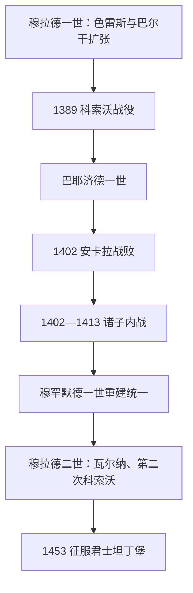

# 奥斯曼帝国兴起与巴尔干扩张

## 时间

1362年—1453年

## 概括

穆拉德一世至穆拉德二世时期，奥斯曼从跨海贝伊国转变为控制色雷斯、保加利亚、马其顿和塞尔维亚大部的巴尔干—安纳托利亚国家。王朝以埃迪尔内为欧洲都城，发展蒂玛尔骑兵、耶尼切里和德夫希尔梅征募体系，并让部分基督教领主以纳贡附庸身份继续统治。1402年安卡拉战败造成十余年内战，但巴尔干税源、王朝组织和穆罕默德一世的胜利使国家得以重建。

## 主要统治者

| 统治者 | 在位 | 主要作用 |
|---|---|---|
| **穆拉德一世** | 1362—1389 | 扩张至巴尔干腹地，确立埃迪尔内中心；1389年科索沃战役后身亡。 |
| **巴耶济德一世** | 1389—1402 | 快速兼并安纳托利亚贝伊国，1396年尼科波利斯获胜；1402年被帖木儿击败。 |
| 诸王子争位 | 1402—1413 | 苏莱曼、伊萨、穆萨、穆罕默德等分据各地，史称奥斯曼空位期。 |
| **穆罕默德一世** | 1413—1421 | 战胜兄弟、恢复统一，重建与地方精英的联盟。 |
| 穆拉德二世 | 1421—1444、1446—1451 | 击败王位竞争者和十字军，瓦尔纳、第二次科索沃战役巩固巴尔干霸权。 |
| 穆罕默德二世 | 1444—1446、1451—1481 | 本阶段末期重新即位，筹备并完成1453年征服君士坦丁堡。 |

完整继承见[奥斯曼苏丹世系表](/%E4%BA%BA%E6%96%87%E7%A7%91%E5%AD%A6/%E5%8E%86%E5%8F%B2/%E8%A5%BF%E4%BA%9A/%E5%9C%9F%E8%80%B3%E5%85%B6/%E5%A5%A5%E6%96%AF%E6%9B%BC%E5%B8%9D%E5%9B%BD/%E5%A5%A5%E6%96%AF%E6%9B%BC%E8%8B%8F%E4%B8%B9%E4%B8%96%E7%B3%BB%E8%A1%A8.md)。

## 扩张与治理方式

奥斯曼通过直接征服、附庸纳贡、王族婚姻和扶植地方竞争者并用。蒂玛尔把税收收益授予骑兵以换取军役，并不等同于可自由继承的西欧封地；德夫希尔梅逐渐从基督徒臣民中征募少年，培养为宫廷官员或耶尼切里，使苏丹拥有相对独立于突厥贵族的奴仆集团。东正教教会、地方贵族和城市商人只要服从与纳税，往往能保留部分财产和制度。

## 重要事件

- 1360年代夺取埃迪尔内并以之为都城，切断君士坦丁堡与巴尔干内陆联系。
- 1371年马里查战役击败塞尔维亚诸侯联盟，马其顿多地成为附庸或被吞并。
- 1389年科索沃战役双方损失严重，穆拉德一世被杀；塞尔维亚此后逐步受奥斯曼控制。
- 1396年尼科波利斯战役击败匈牙利与西欧十字军，显示奥斯曼已成为巴尔干主要强权。
- 1402年安卡拉战役中帖木儿击败并俘虏巴耶济德一世，安纳托利亚贝伊国恢复，奥斯曼陷入王子内战。
- 1413年穆罕默德一世获胜，王朝重新统一；这表明巴尔干附庸、官僚和军队网络已有制度韧性。
- 1444年瓦尔纳战役、1448年第二次科索沃战役击败反奥斯曼联盟，解除君士坦丁堡外围主要军事威胁。
- 1453年穆罕默德二世攻陷君士坦丁堡，阶段转入[君士坦丁堡陷落与帝国化](/%E4%BA%BA%E6%96%87%E7%A7%91%E5%AD%A6/%E5%8E%86%E5%8F%B2/%E8%A5%BF%E4%BA%9A/%E5%9C%9F%E8%80%B3%E5%85%B6/%E5%A5%A5%E6%96%AF%E6%9B%BC%E5%B8%9D%E5%9B%BD/%E5%90%9B%E5%A3%AB%E5%9D%A6%E4%B8%81%E5%A0%A1%E9%99%B7%E8%90%BD%E4%B8%8E%E5%B8%9D%E5%9B%BD%E5%8C%96.md)。

## 崛起、危机与恢复原因

巴尔干政治分裂、拜占庭内战与奥斯曼跨海基地促成扩张；蒂玛尔、附庸制度和常备军让征服所得转化为持续军力。安卡拉失败暴露安纳托利亚兼并过快、部分贝伊国忠诚薄弱和继承无固定规则的问题。王朝未灭亡，则因帖木儿没有长期占领巴尔干，奥斯曼各王子都依赖同一王朝合法性，且巴尔干行省和军政机构继续运作。重建后穆拉德二世采取更稳健的附庸与战争策略，为1453年征服积累资源。

## 演进图

## 演变关系

- 前一阶段：[奥斯曼贝伊国](/%E4%BA%BA%E6%96%87%E7%A7%91%E5%AD%A6/%E5%8E%86%E5%8F%B2/%E8%A5%BF%E4%BA%9A/%E5%9C%9F%E8%80%B3%E5%85%B6/%E5%A5%A5%E6%96%AF%E6%9B%BC%E5%B8%9D%E5%9B%BD/%E5%A5%A5%E6%96%AF%E6%9B%BC%E8%B4%9D%E4%BC%8A%E5%9B%BD.md)。
- 后一阶段：[君士坦丁堡陷落与帝国化](/%E4%BA%BA%E6%96%87%E7%A7%91%E5%AD%A6/%E5%8E%86%E5%8F%B2/%E8%A5%BF%E4%BA%9A/%E5%9C%9F%E8%80%B3%E5%85%B6/%E5%A5%A5%E6%96%AF%E6%9B%BC%E5%B8%9D%E5%9B%BD/%E5%90%9B%E5%A3%AB%E5%9D%A6%E4%B8%81%E5%A0%A1%E9%99%B7%E8%90%BD%E4%B8%8E%E5%B8%9D%E5%9B%BD%E5%8C%96.md)。
- 拜占庭侧：[东罗马帝国与拜占庭帝国](/%E4%BA%BA%E6%96%87%E7%A7%91%E5%AD%A6/%E5%8E%86%E5%8F%B2/%E6%AC%A7%E6%B4%B2/_%E9%80%9A%E5%8F%B2/%E5%8F%A4%E7%BD%97%E9%A9%AC/%E4%B8%9C%E7%BD%97%E9%A9%AC%E5%B8%9D%E5%9B%BD%E4%B8%8E%E6%8B%9C%E5%8D%A0%E5%BA%AD%E5%B8%9D%E5%9B%BD.md)。
- 上级：[奥斯曼帝国](/%E4%BA%BA%E6%96%87%E7%A7%91%E5%AD%A6/%E5%8E%86%E5%8F%B2/%E8%A5%BF%E4%BA%9A/%E5%9C%9F%E8%80%B3%E5%85%B6/%E5%A5%A5%E6%96%AF%E6%9B%BC%E5%B8%9D%E5%9B%BD/README.md)；[土耳其](/%E4%BA%BA%E6%96%87%E7%A7%91%E5%AD%A6/%E5%8E%86%E5%8F%B2/%E8%A5%BF%E4%BA%9A/%E5%9C%9F%E8%80%B3%E5%85%B6/README.md)。
