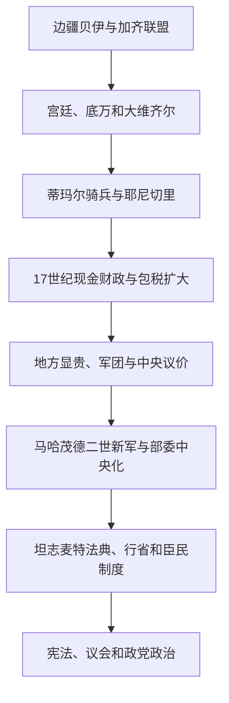

# 奥斯曼帝国的统治结构

## 时间

约1299年—1922年

## 概括

奥斯曼统治结构并非七百年不变。早期由边境领主、加齐战士和地方盟友构成；15—16世纪形成以苏丹宫廷、帝国会议、奴仆—官僚、耶尼切里和蒂玛尔骑兵为核心的中央帝国；17—18世纪税收承包、地方名门与常备火器军扩大；19世纪则转向部委、省制、法典、普遍征兵和议会实验。其稳定性来自中央与地方、宗教法与苏丹法、直接统治与附庸自治之间的组合。

## 中央权力

| 层级 / 机构 | 职能 | 主要变化 |
|---|---|---|
| 苏丹 / 帕迪沙 | 王朝首领、最高任命者、军队与法律秩序象征 | 早期亲征频繁；17世纪后日常行政更多交给大维齐尔；19世纪再度中央集权。 |
| 帝国会议与大维齐尔 | 处理军政、财政、外交和重大司法事务 | 15世纪制度化；17世纪起大维齐尔府成为行政中心；19世纪转化为内阁式部委。 |
| 宫廷与内廷学校 | 培养苏丹直属官员、侍从和高级行政军事人才 | 德夫希尔梅出身者在古典时期突出；后期任官来源更复杂。 |
| 财政机构 | 管理土地税、关税、军饷、宫廷和行省收支 | 从蒂玛尔和年度承包转向现金税、终身税收承包与19世纪预算制度。 |
| 司法—宗教机构 | 卡迪审判、穆夫提释法、谢赫伊斯兰提供最高宗教意见 | 与苏丹法并行；19世纪出现世俗法典和新式法院。 |

## 军事体系

- **耶尼切里**：原为德夫希尔梅征募的苏丹直属步兵和火器军，后逐渐允许更广泛招募并参与城市经济与政治；1826年被马哈茂德二世消灭。
- **蒂玛尔骑兵**：获得特定地区税收收益以履行军役，土地最终所有权原则上属于国家；随火器战争和现金财政发展而衰退。
- **宫廷骑兵与炮兵**：直属中央，承担护卫、野战和攻城任务。
- **行省军与附庸**：克里米亚汗国、瓦拉几亚、摩尔达维亚等提供兵力和战略缓冲；地方总督也维持自身军队。
- **近代新军**：塞利姆三世“新秩序”、马哈茂德二世新军和坦志麦特征兵，逐步建立欧洲式训练、参谋与军校体系。

## 行省与土地财政

帝国划分贝勒贝伊辖区、行省和桑贾克，边界随时期变化。总督负责治安、征税和军队，卡迪形成相对独立的司法—文书网络。16世纪后现金需求推动税收承包；18世纪终身承包使地方名门长期控制税源。19世纪省制改革设省长、行政委员会和专业部门，试图削弱世袭地方权力。埃及、的黎波里、突尼斯、瓦拉几亚等地在不同阶段具有高度自治，不能把名义宗主权等同于日常直接统治。

## 宗教共同体与法律

所谓“米利特制度”不是自1453年起就完整固定的统一法典，而是帝国长期形成的多种安排。东正教、亚美尼亚教会和犹太共同体的宗教领袖可管理婚姻、慈善、教育和部分内部争端，同时向国家负责。穆斯林臣民也受到地方身份、职业团体和法学传统影响。19世纪臣民平等改革试图以国籍和统一法律淡化宗教身份，却未完全取代共同体制度。

## 王位继承

早期没有长子继承规则，王子出任行省长官并以战争决胜；穆罕默德二世法典认可为避免内战而杀害兄弟。17世纪后王子多居宫廷“笼房”，继承逐渐转向王朝中年长男性。这样减少分裂战争，却可能使继位者缺乏行政经验。完整顺序与复位见[奥斯曼苏丹世系表](/%E4%BA%BA%E6%96%87%E7%A7%91%E5%AD%A6/%E5%8E%86%E5%8F%B2/%E8%A5%BF%E4%BA%9A/%E5%9C%9F%E8%80%B3%E5%85%B6/%E5%A5%A5%E6%96%AF%E6%9B%BC%E5%B8%9D%E5%9B%BD/%E5%A5%A5%E6%96%AF%E6%9B%BC%E8%8B%8F%E4%B8%B9%E4%B8%96%E7%B3%BB%E8%A1%A8.md)。

## 重要制度转折

- 14—15世纪蒂玛尔、耶尼切里、德夫希尔梅和帝国会议逐渐成形。
- 1453年后伊斯坦布尔成为宫廷、宗教和贸易中心，跨宗教治理规模扩大。
- 16世纪苏莱曼一世时期整理苏丹法，官僚、司法和行省体系成熟。
- 17世纪常备军、税收承包和地方名门增强，中央改以协商和财政契约维系统治。
- 1826年废除耶尼切里，中央得以重建新军和部委。
- 1839—1876年坦志麦特扩大法典、省制、学校和臣民平等。
- 1876年宪法与议会首次建立，1908年恢复；1913年后联合进步委员会使政党—军官集团掌握实权。
- 1922年苏丹制被废，王朝统治结构终结；1924年哈里发职位也被土耳其共和国废除。

## 结构优势与长期矛盾

帝国能维持多区域统治，因其允许地方制度、宗教共同体和附庸承担部分治理成本，同时以苏丹任命、军队和税收保持上层统一。长期矛盾则是军队需要现金、行省税源容易地方化、王位继承不稳，以及列强能利用债务和共同体保护介入。奥斯曼制度的历史应理解为不断调整，而不是从固定“黄金时代”线性退化。

## 制度演变图

## 相关笔记

- 历史分期：[奥斯曼帝国](/%E4%BA%BA%E6%96%87%E7%A7%91%E5%AD%A6/%E5%8E%86%E5%8F%B2/%E8%A5%BF%E4%BA%9A/%E5%9C%9F%E8%80%B3%E5%85%B6/%E5%A5%A5%E6%96%AF%E6%9B%BC%E5%B8%9D%E5%9B%BD/README.md)。
- 近代改革：[坦志麦特改革与近代化](/%E4%BA%BA%E6%96%87%E7%A7%91%E5%AD%A6/%E5%8E%86%E5%8F%B2/%E8%A5%BF%E4%BA%9A/%E5%9C%9F%E8%80%B3%E5%85%B6/%E5%A5%A5%E6%96%AF%E6%9B%BC%E5%B8%9D%E5%9B%BD/%E5%9D%A6%E5%BF%97%E9%BA%A6%E7%89%B9%E6%94%B9%E9%9D%A9%E4%B8%8E%E8%BF%91%E4%BB%A3%E5%8C%96.md)。
- 上级：[土耳其](/%E4%BA%BA%E6%96%87%E7%A7%91%E5%AD%A6/%E5%8E%86%E5%8F%B2/%E8%A5%BF%E4%BA%9A/%E5%9C%9F%E8%80%B3%E5%85%B6/README.md)。
