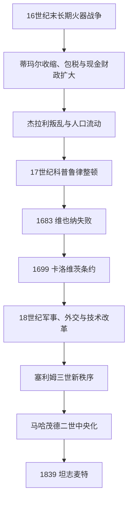

# 奥斯曼帝国转型与停滞时期

## 时间

1566年—1839年

## 概括

苏莱曼一世以后，奥斯曼仍能扩张、征税和改革，并非连续三百年的“停滞”。更准确的理解是：火器战争、价格上涨、人口流动和全球贸易变化迫使帝国从蒂玛尔骑兵—征服财政模式，转向常备步兵、税收承包和地方名门合作。中央与地方权力重组带来韧性，也造成军人干政、财政依赖和行省自主化。1683年以后领土持续收缩，18—19世纪的改革最终通向坦志麦特。

## 阶段与主要苏丹

| 阶段 | 时间 | 代表苏丹 | 主要特征 |
|---|---|---|---|
| 地中海竞争与内乱 | 1566—1656 | 塞利姆二世、穆拉德三世、穆罕默德三世、艾哈迈德一世、穆拉德四世等 | 塞浦路斯征服、勒班陀海战、杰拉利叛乱和萨迈式宫廷派系；兄终弟及逐渐取代王子出镇。 |
| 科普鲁律整顿与战争 | 1656—1703 | 穆罕默德四世、苏莱曼二世、艾哈迈德二世、穆斯塔法二世 | 大维齐尔家族整顿财政军队；1683年维也纳失败后对神圣同盟失地。 |
| 18世纪外交与局部改革 | 1703—1789 | 艾哈迈德三世、马哈茂德一世、穆斯塔法三世、阿卜杜勒·哈米德一世 | 郁金香时代、印刷和军事顾问；与俄国、奥地利战争暴露技术与财政差距。 |
| 新秩序与中央重建 | 1789—1839 | 塞利姆三世、穆斯塔法四世、马哈茂德二世 | “新秩序”军队、废耶尼切里、削弱地方势力、建立现代部委和征兵基础。 |

完整统治者顺序见[奥斯曼苏丹世系表](/%E4%BA%BA%E6%96%87%E7%A7%91%E5%AD%A6/%E5%8E%86%E5%8F%B2/%E8%A5%BF%E4%BA%9A/%E5%9C%9F%E8%80%B3%E5%85%B6/%E5%A5%A5%E6%96%AF%E6%9B%BC%E5%B8%9D%E5%9B%BD/%E5%A5%A5%E6%96%AF%E6%9B%BC%E8%8B%8F%E4%B8%B9%E4%B8%96%E7%B3%BB%E8%A1%A8.md)。

## 结构性转型

- **财政**：战争成本和现金需求增长，终身税收承包逐渐扩大；地方承包人和名门因此获得持久权力。
- **军事**：持火器步兵、耶尼切里及临时雇兵增加，传统蒂玛尔骑兵相对下降；军队规模扩大但俸饷压力加重。
- **继承**：17世纪起王子多被限制在宫廷，兄终弟及和家族年长者继承减少王子内战，却使缺乏治理经验的苏丹增多。
- **地方治理**：中央通过承认行省名门、巴尔干贵族、埃及马穆鲁克和北非摄政者换取税款与名义效忠。
- **外交**：从强调单方面胜利转向常驻使节、条约谈判和欧洲力量均势。

## 重要事件

- 1571年勒班陀海战中舰队重创，但次年即重建；奥斯曼仍保住塞浦路斯，说明单场失败不等于海权立即终结。
- 1593—1606年“长期土耳其战争”和安纳托利亚杰拉利叛乱同时发生，农村社会与财政受损。
- 1622年奥斯曼二世被耶尼切里杀害，显示常备军已能直接干预王位。
- 1638年穆拉德四世夺回巴格达；1639年《席林堡条约》大体稳定奥斯曼—萨法维边界。
- 1656年后科普鲁律大维齐尔整顿行政并恢复部分军力，帝国短暂再扩张。
- 1683年第二次围攻维也纳失败，神圣同盟反攻；1699年《卡洛维茨条约》使奥斯曼首次大规模割让欧洲领土。
- 1718—1730年“郁金香时代”出现宫廷消费、印刷和外交学习，后被帕特罗纳·哈利勒起义终结。
- 1774年《库楚克开纳吉条约》结束对俄战争，克里米亚名义独立并最终被俄国吞并，俄国扩大黑海影响。
- 1793年起塞利姆三世组建“新秩序”军队，因既得利益反对在1807年被废。
- 1826年马哈茂德二世以“吉祥事件”消灭耶尼切里，建立新军并加速中央官僚改革。
- 1821—1829年希腊独立战争及列强介入造成希腊脱离；1831—1833、1839年埃及穆罕默德·阿里战争暴露中央军事危机。

## 衰退与延续原因

失地来自俄国、哈布斯堡等对手军政财政能力增强，帝国内部税源被战争、地方化和贸易变化重新分配，以及多线边疆难以同时防守。但奥斯曼能延续，因地方合作比全面直接统治成本低，伊斯坦布尔仍控制海峡和重要税区，改革者也持续吸收新军事技术。1839年马哈茂德二世去世和《花厅御诏》颁布，标志改革从王朝军政整顿进入全帝国法律—行政重建，见[坦志麦特改革与近代化](/%E4%BA%BA%E6%96%87%E7%A7%91%E5%AD%A6/%E5%8E%86%E5%8F%B2/%E8%A5%BF%E4%BA%9A/%E5%9C%9F%E8%80%B3%E5%85%B6/%E5%A5%A5%E6%96%AF%E6%9B%BC%E5%B8%9D%E5%9B%BD/%E5%9D%A6%E5%BF%97%E9%BA%A6%E7%89%B9%E6%94%B9%E9%9D%A9%E4%B8%8E%E8%BF%91%E4%BB%A3%E5%8C%96.md)。

## 演进图

## 演变关系

- 前一阶段：[奥斯曼帝国鼎盛时期](/%E4%BA%BA%E6%96%87%E7%A7%91%E5%AD%A6/%E5%8E%86%E5%8F%B2/%E8%A5%BF%E4%BA%9A/%E5%9C%9F%E8%80%B3%E5%85%B6/%E5%A5%A5%E6%96%AF%E6%9B%BC%E5%B8%9D%E5%9B%BD/%E5%A5%A5%E6%96%AF%E6%9B%BC%E5%B8%9D%E5%9B%BD%E9%BC%8E%E7%9B%9B%E6%97%B6%E6%9C%9F.md)。
- 后一阶段：[坦志麦特改革与近代化](/%E4%BA%BA%E6%96%87%E7%A7%91%E5%AD%A6/%E5%8E%86%E5%8F%B2/%E8%A5%BF%E4%BA%9A/%E5%9C%9F%E8%80%B3%E5%85%B6/%E5%A5%A5%E6%96%AF%E6%9B%BC%E5%B8%9D%E5%9B%BD/%E5%9D%A6%E5%BF%97%E9%BA%A6%E7%89%B9%E6%94%B9%E9%9D%A9%E4%B8%8E%E8%BF%91%E4%BB%A3%E5%8C%96.md)。
- 欧洲对读：[波兰-立陶宛联邦](/%E4%BA%BA%E6%96%87%E7%A7%91%E5%AD%A6/%E5%8E%86%E5%8F%B2/%E6%AC%A7%E6%B4%B2/%E6%96%AF%E6%8B%89%E5%A4%AB/%E8%A5%BF%E6%96%AF%E6%8B%89%E5%A4%AB/%E6%B3%A2%E5%85%B0-%E7%AB%8B%E9%99%B6%E5%AE%9B%E8%81%94%E9%82%A6.md)。
- 上级：[奥斯曼帝国](/%E4%BA%BA%E6%96%87%E7%A7%91%E5%AD%A6/%E5%8E%86%E5%8F%B2/%E8%A5%BF%E4%BA%9A/%E5%9C%9F%E8%80%B3%E5%85%B6/%E5%A5%A5%E6%96%AF%E6%9B%BC%E5%B8%9D%E5%9B%BD/README.md)；[土耳其](/%E4%BA%BA%E6%96%87%E7%A7%91%E5%AD%A6/%E5%8E%86%E5%8F%B2/%E8%A5%BF%E4%BA%9A/%E5%9C%9F%E8%80%B3%E5%85%B6/README.md)。
