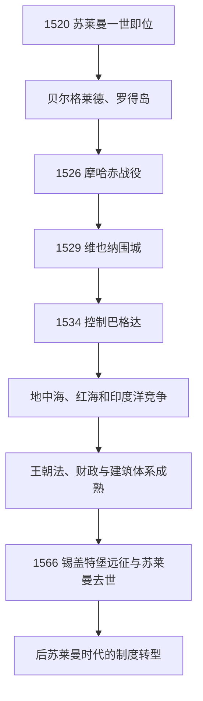

# 奥斯曼帝国鼎盛时期

## 时间

1520年—1566年

## 概括

苏莱曼一世统治的46年是奥斯曼疆域、军事实力和宫廷文化的高峰。帝国向中欧、伊拉克、红海和北非扩张，与哈布斯堡、萨法维和葡萄牙形成多线竞争；同时通过法典整理、行省治理、建筑赞助和地中海舰队把征服成果制度化。“鼎盛”不意味着没有失败或矛盾，维也纳围城、马耳他围攻等受挫，财政与继承问题也已显现。

## 统治者与权力结构

| 统治者 | 在位 | 说明 |
|---|---|---|
| **苏莱曼一世** | 1520—1566 | 塞利姆一世之子；在欧洲称“壮丽者”，奥斯曼传统称“立法者”。完成法律整理并亲征多地。 |

完整世系见[奥斯曼苏丹世系表](/%E4%BA%BA%E6%96%87%E7%A7%91%E5%AD%A6/%E5%8E%86%E5%8F%B2/%E8%A5%BF%E4%BA%9A/%E5%9C%9F%E8%80%B3%E5%85%B6/%E5%A5%A5%E6%96%AF%E6%9B%BC%E5%B8%9D%E5%9B%BD/%E5%A5%A5%E6%96%AF%E6%9B%BC%E8%8B%8F%E4%B8%B9%E4%B8%96%E7%B3%BB%E8%A1%A8.md)。苏丹通过帝国会议和大维齐尔处理政务，宫廷奴仆—官僚、耶尼切里、蒂玛尔骑兵和行省军构成军事行政支柱。苏莱曼后期大维齐尔、宫廷女性与王子集团参与政治加深，但不能简单视为王权“被夺走”。

## 重要事件

- **1521年攻占贝尔格莱德**：打开多瑙河中游门户。
- **1522年征服罗得岛**：医院骑士团撤离，东地中海航路安全增强。
- **1526年摩哈赤战役**：匈牙利王国主力败亡，国王拉约什二世死亡；此后奥斯曼与哈布斯堡争夺匈牙利。
- **1529年第一次围攻维也纳**：因距离、天气、补给与城防未能攻克，显示帝国陆上投送的边界。
- **1534年夺取巴格达**：在与萨法维的战争中控制伊拉克和两河交通。
- **1538年普雷韦扎海战**：巴巴罗萨率舰队击败神圣同盟，巩固东地中海制海优势。
- **1541年直接控制布达**：匈牙利中部成为奥斯曼行省，特兰西瓦尼亚成为附庸。
- **1555年阿马西亚和约**：与[萨法维王朝](/%E4%BA%BA%E6%96%87%E7%A7%91%E5%AD%A6/%E5%8E%86%E5%8F%B2/%E8%A5%BF%E4%BA%9A/%E4%BC%8A%E6%9C%97/%E8%90%A8%E6%B3%95%E7%BB%B4%E7%8E%8B%E6%9C%9D.md)首次正式划定势力范围，奥斯曼保有伊拉克。
- **1565年马耳他大围攻失败**：岛屿守军和西班牙援军阻止奥斯曼建立西地中海前进基地。
- **1566年锡盖特堡战役**：苏莱曼在围城期间去世，塞利姆二世继位。

## 法律、经济与文化

苏莱曼并非制定单一完整“奥斯曼法典”，而是整理历代苏丹法令，使世俗行政法与伊斯兰法共同运作。首席穆夫提艾布苏乌德把部分土地和税收实践纳入宗教法解释。伊斯坦布尔通过埃及税粮、黑海粮食、巴尔干牧产和国际贸易维持人口。米马尔·希南主持苏莱曼清真寺等建筑，宫廷作坊发展书法、瓷砖、织物与手抄本艺术。法国—奥斯曼合作则以共同制衡哈布斯堡为基础。

## 强盛原因

- 前代征服留下埃及、叙利亚和巴尔干的税源与战略纵深。
- 苏丹直属官僚和军队降低世袭地方贵族对中央的制约。
- 火器、攻城技术、舰队基地和道路—驿传支持多方向战争。
- 对附庸、宗教共同体和地方精英采取分层治理，减少全面直接统治成本。
- 哈布斯堡、萨法维、威尼斯等对手彼此分散，奥斯曼能在不同战线轮换资源。

## 隐含压力与阶段转型

长期战争抬高军费，白银流入导致价格变化，蒂玛尔骑兵与火器步兵的相对地位开始转变。王子穆斯塔法被处死、巴耶济德叛乱等事件说明继承竞争仍具破坏性。苏莱曼去世后帝国没有突然“衰落”，而是进入财政、军事与地方权力不断适应的新阶段，见[奥斯曼帝国转型与停滞时期](/%E4%BA%BA%E6%96%87%E7%A7%91%E5%AD%A6/%E5%8E%86%E5%8F%B2/%E8%A5%BF%E4%BA%9A/%E5%9C%9F%E8%80%B3%E5%85%B6/%E5%A5%A5%E6%96%AF%E6%9B%BC%E5%B8%9D%E5%9B%BD/%E5%A5%A5%E6%96%AF%E6%9B%BC%E5%B8%9D%E5%9B%BD%E8%BD%AC%E5%9E%8B%E4%B8%8E%E5%81%9C%E6%BB%9E%E6%97%B6%E6%9C%9F.md)。

## 演进图

## 演变关系

- 前一阶段：[君士坦丁堡陷落与帝国化](/%E4%BA%BA%E6%96%87%E7%A7%91%E5%AD%A6/%E5%8E%86%E5%8F%B2/%E8%A5%BF%E4%BA%9A/%E5%9C%9F%E8%80%B3%E5%85%B6/%E5%A5%A5%E6%96%AF%E6%9B%BC%E5%B8%9D%E5%9B%BD/%E5%90%9B%E5%A3%AB%E5%9D%A6%E4%B8%81%E5%A0%A1%E9%99%B7%E8%90%BD%E4%B8%8E%E5%B8%9D%E5%9B%BD%E5%8C%96.md)。
- 后一阶段：[奥斯曼帝国转型与停滞时期](/%E4%BA%BA%E6%96%87%E7%A7%91%E5%AD%A6/%E5%8E%86%E5%8F%B2/%E8%A5%BF%E4%BA%9A/%E5%9C%9F%E8%80%B3%E5%85%B6/%E5%A5%A5%E6%96%AF%E6%9B%BC%E5%B8%9D%E5%9B%BD/%E5%A5%A5%E6%96%AF%E6%9B%BC%E5%B8%9D%E5%9B%BD%E8%BD%AC%E5%9E%8B%E4%B8%8E%E5%81%9C%E6%BB%9E%E6%97%B6%E6%9C%9F.md)。
- 欧洲对读：[欧洲历史](/%E4%BA%BA%E6%96%87%E7%A7%91%E5%AD%A6/%E5%8E%86%E5%8F%B2/%E6%AC%A7%E6%B4%B2/README.md)、[波兰-立陶宛联邦](/%E4%BA%BA%E6%96%87%E7%A7%91%E5%AD%A6/%E5%8E%86%E5%8F%B2/%E6%AC%A7%E6%B4%B2/%E6%96%AF%E6%8B%89%E5%A4%AB/%E8%A5%BF%E6%96%AF%E6%8B%89%E5%A4%AB/%E6%B3%A2%E5%85%B0-%E7%AB%8B%E9%99%B6%E5%AE%9B%E8%81%94%E9%82%A6.md)。
- 上级：[奥斯曼帝国](/%E4%BA%BA%E6%96%87%E7%A7%91%E5%AD%A6/%E5%8E%86%E5%8F%B2/%E8%A5%BF%E4%BA%9A/%E5%9C%9F%E8%80%B3%E5%85%B6/%E5%A5%A5%E6%96%AF%E6%9B%BC%E5%B8%9D%E5%9B%BD/README.md)；[土耳其](/%E4%BA%BA%E6%96%87%E7%A7%91%E5%AD%A6/%E5%8E%86%E5%8F%B2/%E8%A5%BF%E4%BA%9A/%E5%9C%9F%E8%80%B3%E5%85%B6/README.md)。
