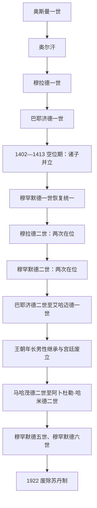

# 奥斯曼苏丹世系表

## 范围

本表列出奥斯曼王朝从奥斯曼一世到穆罕默德六世的36位公认苏丹。1402—1413年空位期有多位王子同时称苏丹，本表将其作为继承危机单列；穆拉德二世、穆罕默德二世和穆斯塔法一世的复位合并在各自一行。早期确切即位年份在同期史料中存在差异，故使用“约”或并列年份。

## 世系图

## 完整世系

| 顺序 | 苏丹 | 在位时间 | 与前任关系 | 关键事件 / 备注 |
|---:|---|---|---|---|
| 1 | **奥斯曼一世** | 约1299—1324/1326 | 奠基者 | 在比提尼亚边境扩张；建国年份与卒年存在争议。 |
| 2 | **奥尔汗** | 约1324/1326—1362 | 奥斯曼之子 | 夺取布尔萨、尼西亚、尼科米底亚，进入加里波利。 |
| 3 | **穆拉德一世** | 1362—1389 | 奥尔汗之子 | 扩张巴尔干，以埃迪尔内为中心；科索沃战役后遇刺。 |
| 4 | 巴耶济德一世 | 1389—1402 | 穆拉德一世之子 | 尼科波利斯获胜；安卡拉战役败于帖木儿并被俘。 |
| — | 奥斯曼空位期 | 1402—1413 | 巴耶济德诸子苏莱曼、伊萨、穆萨、穆罕默德等争位 | 多位王子分据巴尔干和安纳托利亚，未形成单一公认苏丹。 |
| 5 | **穆罕默德一世** | 1413—1421 | 巴耶济德一世之子 | 赢得内战，重建统一。 |
| 6 | 穆拉德二世 | 1421—1444；1446—1451 | 穆罕默德一世之子 | 一度让位给儿子；瓦尔纳和第二次科索沃战役获胜。 |
| 7 | **穆罕默德二世** | 1444—1446；1451—1481 | 穆拉德二世之子 | 1453年征服君士坦丁堡，建立帝国首都与中央法制。 |
| 8 | 巴耶济德二世 | 1481—1512 | 穆罕默德二世之子 | 与弟杰姆争位；稳定帝国，后被儿子迫退。 |
| 9 | **塞利姆一世** | 1512—1520 | 巴耶济德二世之子 | 查尔迪兰击败萨法维，灭马穆鲁克并取得埃及、叙利亚。 |
| 10 | **苏莱曼一世** | 1520—1566 | 塞利姆一世之子 | 摩哈赤、巴格达、地中海扩张；法律和宫廷文化高峰。 |
| 11 | 塞利姆二世 | 1566—1574 | 苏莱曼一世之子 | 征服塞浦路斯；勒班陀海战舰队重创后重建。 |
| 12 | 穆拉德三世 | 1574—1595 | 塞利姆二世之子 | 与萨法维、哈布斯堡长期战争，宫廷派系和财政压力增加。 |
| 13 | 穆罕默德三世 | 1595—1603 | 穆拉德三世之子 | 处死19名兄弟；克雷斯泰什战役，杰拉利叛乱扩大。 |
| 14 | 艾哈迈德一世 | 1603—1617 | 穆罕默德三世之子 | 建蓝色清真寺；未杀弟穆斯塔法，为年长者继承铺路。 |
| 15 | 穆斯塔法一世 | 1617—1618；1622—1623 | 艾哈迈德一世之弟 | 两次被拥立和废黜，宫廷与军队影响显著。 |
| 16 | 奥斯曼二世 | 1618—1622 | 艾哈迈德一世之子 | 试图改革军队，被耶尼切里杀害。 |
| 17 | 穆拉德四世 | 1623—1640 | 艾哈迈德一世之子 | 重建强势苏丹统治，1638年夺回巴格达。 |
| 18 | 易卜拉欣 | 1640—1648 | 穆拉德四世之弟 | 宫廷和财政危机中被废并被杀。 |
| 19 | 穆罕默德四世 | 1648—1687 | 易卜拉欣之子 | 科普鲁律大维齐尔整顿；1683年维也纳失败后被废。 |
| 20 | 苏莱曼二世 | 1687—1691 | 易卜拉欣之子、穆罕默德四世之叔 | 神圣同盟战争中即位，整顿军政。 |
| 21 | 艾哈迈德二世 | 1691—1695 | 苏莱曼二世之弟 | 对奥地利战争持续，财政困难。 |
| 22 | 穆斯塔法二世 | 1695—1703 | 穆罕默德四世之子 | 1699年《卡洛维茨条约》；埃迪尔内事件后退位。 |
| 23 | 艾哈迈德三世 | 1703—1730 | 穆斯塔法二世之弟 | 郁金香时代、印刷和外交学习；帕特罗纳起义后退位。 |
| 24 | 马哈茂德一世 | 1730—1754 | 穆斯塔法二世之子 | 镇压起义，与俄奥战争后恢复部分领土。 |
| 25 | 奥斯曼三世 | 1754—1757 | 穆斯塔法二世之子、马哈茂德一世之弟 | 在位短暂，宫廷任官频繁更迭。 |
| 26 | 穆斯塔法三世 | 1757—1774 | 艾哈迈德三世之子 | 推动军事改革；对俄战争失利期间去世。 |
| 27 | 阿卜杜勒·哈米德一世 | 1774—1789 | 艾哈迈德三世之子、穆斯塔法三世之弟 | 接受《库楚克开纳吉条约》，应对克里米亚丧失。 |
| 28 | 塞利姆三世 | 1789—1807 | 穆斯塔法三世之子 | 建“新秩序”军队和常驻使馆，被保守军人政变废黜。 |
| 29 | 穆斯塔法四世 | 1807—1808 | 阿卜杜勒·哈米德一世之子、塞利姆三世堂弟 | 反改革派拥立；政变危机中下令杀害竞争者，后被废。 |
| 30 | **马哈茂德二世** | 1808—1839 | 阿卜杜勒·哈米德一世之子、穆斯塔法四世之弟 | 1826年废耶尼切里，中央官僚与新军改革；希腊独立。 |
| 31 | 阿卜杜勒·迈吉德一世 | 1839—1861 | 马哈茂德二世之子 | 颁布花厅御诏和改革诏书，推行坦志麦特。 |
| 32 | 阿卜杜勒·阿齐兹 | 1861—1876 | 马哈茂德二世之子、前任之弟 | 扩海军和铁路；财政危机中被废，数日后死亡。 |
| 33 | 穆拉德五世 | 1876 | 阿卜杜勒·迈吉德一世之子 | 在位93天，因健康问题被废。 |
| 34 | **阿卜杜勒·哈米德二世** | 1876—1909 | 穆拉德五世之弟 | 颁宪后暂停议会；中央集权、泛伊斯兰与基础设施并行；1909年被废。 |
| 35 | 穆罕默德五世 | 1909—1918 | 阿卜杜勒·迈吉德一世之子、前任之弟 | 第二次宪政和联合进步委员会时期的礼仪君主；一战期间在位。 |
| 36 | **穆罕默德六世** | 1918—1922 | 阿卜杜勒·迈吉德一世之子、前任之弟 | 战败与协约国占领下依赖伊斯坦布尔政府；1922年苏丹制被废。 |

## 空位期争位者与后续王位声索

1402年安卡拉战役后没有一位获得全境承认的苏丹，因此四名主要王子不计入36位公认苏丹。其活动时间彼此重叠，不能排成普通的一人一任序列。

| 争位者 | 主要活动时间 | 控制中心 | 结局与名号说明 |
|---|---|---|---|
| 苏莱曼·切莱比 | 1402—1411年 | 埃迪尔内、色雷斯、马其顿和保加利亚旧地 | 先控制欧洲领地，后进入安纳托利亚；钱币多称“埃米尔”，1411年败于穆萨后被杀。 |
| 伊萨·切莱比 | 1402—约1403／1404年，之后仍活动至约1406年 | 布尔萨及西北安纳托利亚 | 被穆罕默德击败后多次借地方贝伊反攻，最终被杀；未见可确认钱币。 |
| 穆罕默德·切莱比 | 1402—1413年 | 阿马西亚及安纳托利亚中北部 | 先后击败伊萨、苏莱曼阵营和穆萨；1413年统一后以穆罕默德一世列为第5位苏丹。 |
| 穆萨·切莱比 | 约1410—1413年 | 瓦拉几亚支持下进入巴尔干，后占埃迪尔内 | 1411年取代苏莱曼，围攻君士坦丁堡；1413年查穆尔卢战败被杀。 |
| 穆斯塔法·切莱比（“杜兹梅／伪穆斯塔法”） | 1415—1416年、1421—1422年两次声索 | 巴尔干、加里波利及西安纳托利亚部分地区 | 自称巴耶济德一世之子，身份称呼带有胜者宣传色彩；败于穆拉德二世后被处死，不计入正式苏丹。 |

部分编年还记载苏莱曼之子奥尔汗等短暂声索者，但他们未形成可与四大主要政权并列的稳定统治。空位期的日期因战事、地方倒戈和钱币纪年而有数月到数年的差异。

## 复位、废立与统治实权核对

- **穆拉德二世**于1444年让位给穆罕默德二世，1446年在军政危机中复位，1451年去世；不是两位同名君主。
- **穆罕默德二世**在1444—1446年首次在位，1451年再次即位后统治至1481年。
- **穆斯塔法一世**在1617—1618年、1622—1623年两次被宫廷集团拥立，又两次被废。
- 巴耶济德二世、塞利姆三世、穆斯塔法四世、易卜拉欣、穆罕默德四世、穆斯塔法二世、艾哈迈德三世、阿卜杜勒·阿齐兹、穆拉德五世和阿卜杜勒·哈米德二世均非自然死亡时正常传位，其退位或废黜已在主表备注。
- 1908年恢复宪政后，穆罕默德五世、穆罕默德六世仍是法定苏丹，但内阁、议会、联合进步委员会及占领当局在不同时段掌握实际权力。

## 末代哈里发辨析

阿卜杜勒·迈吉德二世在1922—1924年仅任哈里发，没有苏丹头衔和领土统治权，因此不列入36位苏丹。土耳其大国民议会于1924年废除哈里发职位，奥斯曼王族被逐出境。

## 继承制度变化

- 14—16世纪王子通常出镇积累行政军事经验，苏丹去世后由首先控制首都和军队者获胜；兄弟相残被视为避免内战的手段。
- 17世纪起，王子多被限制在宫廷“笼房”，继承逐渐采用王朝中年长男性优先。穆斯塔法一世的即位是重要转折。
- 多次废立反映耶尼切里、宫廷女性、大维齐尔、乌里玛和近代军官集团都可能影响王位。
- 苏丹在位时间与实际权力必须区分：17世纪部分时期大维齐尔掌日常政务，1908年后议会与联合进步委员会逐步取得实权。

## 返回主笔记

- [奥斯曼帝国](/%E4%BA%BA%E6%96%87%E7%A7%91%E5%AD%A6/%E5%8E%86%E5%8F%B2/%E8%A5%BF%E4%BA%9A/%E5%9C%9F%E8%80%B3%E5%85%B6/%E5%A5%A5%E6%96%AF%E6%9B%BC%E5%B8%9D%E5%9B%BD/README.md)
- [奥斯曼帝国的统治结构](/%E4%BA%BA%E6%96%87%E7%A7%91%E5%AD%A6/%E5%8E%86%E5%8F%B2/%E8%A5%BF%E4%BA%9A/%E5%9C%9F%E8%80%B3%E5%85%B6/%E5%A5%A5%E6%96%AF%E6%9B%BC%E5%B8%9D%E5%9B%BD/%E5%A5%A5%E6%96%AF%E6%9B%BC%E5%B8%9D%E5%9B%BD%E7%9A%84%E7%BB%9F%E6%B2%BB%E7%BB%93%E6%9E%84.md)
- [土耳其](/%E4%BA%BA%E6%96%87%E7%A7%91%E5%AD%A6/%E5%8E%86%E5%8F%B2/%E8%A5%BF%E4%BA%9A/%E5%9C%9F%E8%80%B3%E5%85%B6/README.md)
