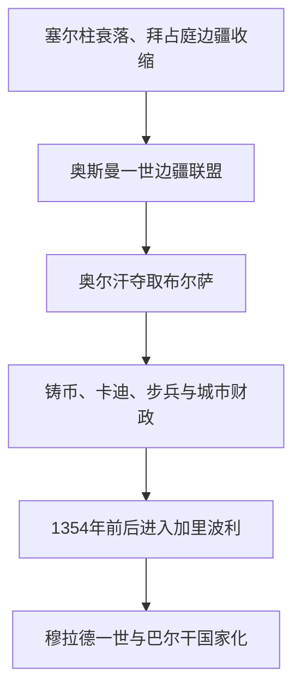

# 奥斯曼贝伊国

## 时间

约1299年—1362年

## 概括

奥斯曼政权起源于安纳托利亚西北比提尼亚边境的一个突厥贝伊国。罗姆苏丹国瓦解、蒙古伊儿汗宗主权松动和拜占庭边防衰弱，为边境领主提供扩张空间。奥斯曼及其子奥尔汗通过战争、婚姻、吸纳拜占庭降将与伊斯兰边疆战士，逐步控制布尔萨、尼西亚和尼科米底亚，并跨越达达尼尔海峡进入欧洲。

## 建立背景与崛起机制

- **政治真空**：1243年克塞山战役后罗姆苏丹国受蒙古控制，13世纪末安纳托利亚分裂为多个贝伊国。
- **边境位置**：奥斯曼领地紧邻拜占庭比提尼亚，面对的是守备薄弱但城市与农产丰富的边疆，而非其他强大突厥政权。
- **开放联盟**：早期集团包含奥古斯突厥部众、加齐战士、宗教人士、工匠团体和归附的基督徒地方精英，不能只理解为单一部落。
- **弹性治理**：新征服地区常保留原有村社、税源和部分地方人物，以换取纳税与服从；伊斯兰化和突厥化是长期过程。

## 统治者

| 顺序 | 统治者 | 在位时间 | 与前任关系 | 关键事件 |
|---:|---|---|---|---|
| 1 | **奥斯曼一世** | 约1299—1324/1326 | 奠基者 | 在瑟于特一带扩张；1302年巴菲乌斯战役后威望上升。确切建国年和早年谱系存在史料争议。 |
| 2 | **奥尔汗** | 约1324/1326—1362 | 奥斯曼之子 | 1326年夺取布尔萨；攻占尼西亚、尼科米底亚；建立铸币、军队和行政职官；1350年代进入色雷斯。 |

完整王朝顺序见[奥斯曼苏丹世系表](/%E4%BA%BA%E6%96%87%E7%A7%91%E5%AD%A6/%E5%8E%86%E5%8F%B2/%E8%A5%BF%E4%BA%9A/%E5%9C%9F%E8%80%B3%E5%85%B6/%E5%A5%A5%E6%96%AF%E6%9B%BC%E5%B8%9D%E5%9B%BD/%E5%A5%A5%E6%96%AF%E6%9B%BC%E8%8B%8F%E4%B8%B9%E4%B8%96%E7%B3%BB%E8%A1%A8.md)。

## 国家形成

早期“贝伊”兼具家族首领和军事领袖身份。随着城市增加，奥尔汗任命法官和行政人员、发行银币，并形成步兵和骑兵组织。蒂玛尔军役土地安排在后续扩张中逐渐制度化。1352年奥斯曼军帮助拜占庭皇位争夺者约翰六世，获得楚姆佩要塞；1354年加里波利地震破坏城防后，奥斯曼移民和军队迅速占据半岛，形成欧洲桥头堡。

## 重要事件

- 约1299年常被视为独立建国年份，但同期文献有限，奥斯曼是否当年正式摆脱宗主权存在争议。
- 1302年巴菲乌斯战役击败拜占庭军，使比提尼亚乡村与交通线进一步落入奥斯曼控制。
- 1326年布尔萨投降并成为早期都城和贸易中心；奥斯曼一世可能在陷落前后去世。
- 1331年尼西亚、1337年尼科米底亚被占领，拜占庭在安纳托利亚西北的核心据点丧失。
- 1345年前后兼并卡拉西贝伊国，获得舰船、海峡沿岸和熟悉巴尔干作战的将领。
- 1352—1354年控制楚姆佩与加里波利，开始持续向巴尔干移民和扩张。
- 1362年奥尔汗去世，穆拉德一世继位，政权由边境贝伊国进入跨海扩张阶段。

## 兴起条件与阶段终点

奥斯曼崛起不是预定结果。其优势是面向拜占庭边境、能吸纳不同出身的人才、较少卷入安纳托利亚中部贝伊国竞争，并及时取得海峡桥头堡。拜占庭内战和巴尔干政权分裂提供机会。到1362年，奥斯曼已拥有城市税源、常设职官和跨海领土，贝伊国阶段因此结束，进入[奥斯曼帝国兴起与巴尔干扩张](/%E4%BA%BA%E6%96%87%E7%A7%91%E5%AD%A6/%E5%8E%86%E5%8F%B2/%E8%A5%BF%E4%BA%9A/%E5%9C%9F%E8%80%B3%E5%85%B6/%E5%A5%A5%E6%96%AF%E6%9B%BC%E5%B8%9D%E5%9B%BD/%E5%A5%A5%E6%96%AF%E6%9B%BC%E5%B8%9D%E5%9B%BD%E5%85%B4%E8%B5%B7%E4%B8%8E%E5%B7%B4%E5%B0%94%E5%B9%B2%E6%89%A9%E5%BC%A0.md)。

## 演进图

## 演变关系

- 前史：[安纳托利亚突厥化与罗姆苏丹国](/%E4%BA%BA%E6%96%87%E7%A7%91%E5%AD%A6/%E5%8E%86%E5%8F%B2/%E8%A5%BF%E4%BA%9A/%E5%9C%9F%E8%80%B3%E5%85%B6/%E5%AE%89%E7%BA%B3%E6%89%98%E5%88%A9%E4%BA%9A%E7%AA%81%E5%8E%A5%E5%8C%96%E4%B8%8E%E7%BD%97%E5%A7%86%E8%8B%8F%E4%B8%B9%E5%9B%BD.md)。
- 后续：[奥斯曼帝国兴起与巴尔干扩张](/%E4%BA%BA%E6%96%87%E7%A7%91%E5%AD%A6/%E5%8E%86%E5%8F%B2/%E8%A5%BF%E4%BA%9A/%E5%9C%9F%E8%80%B3%E5%85%B6/%E5%A5%A5%E6%96%AF%E6%9B%BC%E5%B8%9D%E5%9B%BD/%E5%A5%A5%E6%96%AF%E6%9B%BC%E5%B8%9D%E5%9B%BD%E5%85%B4%E8%B5%B7%E4%B8%8E%E5%B7%B4%E5%B0%94%E5%B9%B2%E6%89%A9%E5%BC%A0.md)。
- 上级：[奥斯曼帝国](/%E4%BA%BA%E6%96%87%E7%A7%91%E5%AD%A6/%E5%8E%86%E5%8F%B2/%E8%A5%BF%E4%BA%9A/%E5%9C%9F%E8%80%B3%E5%85%B6/%E5%A5%A5%E6%96%AF%E6%9B%BC%E5%B8%9D%E5%9B%BD/README.md)；[土耳其](/%E4%BA%BA%E6%96%87%E7%A7%91%E5%AD%A6/%E5%8E%86%E5%8F%B2/%E8%A5%BF%E4%BA%9A/%E5%9C%9F%E8%80%B3%E5%85%B6/README.md)。
