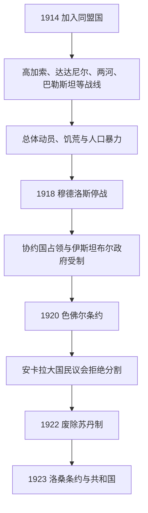

# 第一次世界大战与奥斯曼帝国解体

## 时间

1914年—1922年

## 概括

奥斯曼在外交孤立、俄国威胁和收复失地愿望推动下加入同盟国。帝国在达达尼尔、西亚、高加索和阿拉伯行省多线作战，既取得加里波利等胜利，也因封锁、动员、疾病与行政暴力承受巨大人口灾难。1918年停战后协约国占领战略地区并拟按《色佛尔条约》分割帝国；伊斯坦布尔苏丹政府与安卡拉民族运动形成两个权力中心。1922年安卡拉大国民议会废除苏丹制，奥斯曼政权终结。

## 战时权力结构

| 角色 | 人物 / 机构 | 实际作用 |
|---|---|---|
| 苏丹—哈里发 | 穆罕默德五世（至1918）、穆罕默德六世（1918—1922） | 名义国家元首；穆罕默德五世时期主要礼仪化，穆罕默德六世在战败后试图依靠协约国保留王朝。 |
| 联合进步委员会 | 塔拉特帕夏、恩维尔帕夏、杰马尔帕夏 | 战时决策核心，控制内政、军队与叙利亚方面。 |
| 军队 | 奥斯曼总参谋部、各方面军及德国顾问 | 多战区作战；后期穆斯塔法·凯末尔等军官成为民族运动骨干。 |
| 协约国占领当局 | 英、法、意、希腊等 | 1918年后控制海峡、伊斯坦布尔及部分安纳托利亚地区。 |
| 安卡拉大国民议会 | 穆斯塔法·凯末尔及民族运动 | 1920年起拒绝苏丹政府条约，建立替代政府和军队。 |

完整王朝末代顺序见[奥斯曼苏丹世系表](/%E4%BA%BA%E6%96%87%E7%A7%91%E5%AD%A6/%E5%8E%86%E5%8F%B2/%E8%A5%BF%E4%BA%9A/%E5%9C%9F%E8%80%B3%E5%85%B6/%E5%A5%A5%E6%96%AF%E6%9B%BC%E5%B8%9D%E5%9B%BD/%E5%A5%A5%E6%96%AF%E6%9B%BC%E8%8B%8F%E4%B8%B9%E4%B8%96%E7%B3%BB%E8%A1%A8.md)。

## 重要事件与战争过程

- 1914年8月与德国秘密结盟；奥斯曼舰队袭击俄国黑海港口后正式参战。
- 1914—1915年萨勒卡默什战役中第三军惨败，严寒、补给和指挥失误造成巨大伤亡。
- 1915—1916年加里波利战役阻止英法打通海峡，提升穆斯塔法·凯末尔声望。
- 1915年起，联合进步委员会以安全和叛乱指控为由驱逐亚美尼亚人口；押送、屠杀、饥饿和疾病造成大规模死亡，史学界广泛认定为亚美尼亚种族灭绝。亚述人和部分希腊人也遭受屠杀与强制迁移。
- 1916年库特围城中奥斯曼迫使一支英印军投降；但英军1917年占巴格达、1917—1918年推进巴勒斯坦与叙利亚。
- 1916年侯赛因—麦克马洪通信、阿拉伯起义和英法《赛克斯—皮科协定》显示阿拉伯独立承诺与列强分区计划并存。
- 1918年《穆德洛斯停战协定》允许协约国占领战略地点，奥斯曼军队解散或撤退。

## 战后分割与政权终结

- 1919年希腊军登陆士麦那，意大利和法国也占领安纳托利亚部分地区；穆斯塔法·凯末尔在萨姆松启动组织抵抗。
- 1920年协约国占领伊斯坦布尔，奥斯曼议会被解散；安卡拉大国民议会成立。
- 1920年苏丹政府签署《色佛尔条约》，接受领土分割、海峡国际化及亚美尼亚等安排，但民族运动拒绝执行。
- 安卡拉军队先后与亚美尼亚、法国及希腊作战；过程详见[土耳其独立战争](/%E4%BA%BA%E6%96%87%E7%A7%91%E5%AD%A6/%E5%8E%86%E5%8F%B2/%E8%A5%BF%E4%BA%9A/%E5%9C%9F%E8%80%B3%E5%85%B6/%E5%9C%9F%E8%80%B3%E5%85%B6%E7%8B%AC%E7%AB%8B%E6%88%98%E4%BA%89.md)。
- 1922年11月1日大国民议会废除苏丹制；穆罕默德六世离开伊斯坦布尔。阿卜杜勒·迈吉德二世仅以哈里发身份保留至1924年。

## 灭亡原因

帝国长期失地和外债削弱资源基础；巴尔干战争造成军队与人口巨变；联合进步委员会在安全困境下选择对德结盟，把生存押注于全面战争。封锁、多线战场和交通不足导致粮食与财政崩溃，中央对少数群体实施暴力又破坏社会结构。直接终结王朝的并非1918年战败本身，而是协约国分割计划使苏丹政府失去合法性，安卡拉民族运动凭军事胜利、议会组织和新的民族国家主张取代旧中央。

## 演进图

## 演变关系

- 前一阶段：[青年土耳其党与帝国末期](/%E4%BA%BA%E6%96%87%E7%A7%91%E5%AD%A6/%E5%8E%86%E5%8F%B2/%E8%A5%BF%E4%BA%9A/%E5%9C%9F%E8%80%B3%E5%85%B6/%E5%A5%A5%E6%96%AF%E6%9B%BC%E5%B8%9D%E5%9B%BD/%E9%9D%92%E5%B9%B4%E5%9C%9F%E8%80%B3%E5%85%B6%E5%85%9A%E4%B8%8E%E5%B8%9D%E5%9B%BD%E6%9C%AB%E6%9C%9F.md)。
- 土耳其方向：[土耳其独立战争](/%E4%BA%BA%E6%96%87%E7%A7%91%E5%AD%A6/%E5%8E%86%E5%8F%B2/%E8%A5%BF%E4%BA%9A/%E5%9C%9F%E8%80%B3%E5%85%B6/%E5%9C%9F%E8%80%B3%E5%85%B6%E7%8B%AC%E7%AB%8B%E6%88%98%E4%BA%89.md)。
- 阿拉伯行省、北非和巴尔干分别进入本地区的殖民、托管或民族国家主线；帝国背景可与[阿拉伯帝国](/%E4%BA%BA%E6%96%87%E7%A7%91%E5%AD%A6/%E5%8E%86%E5%8F%B2/%E8%A5%BF%E4%BA%9A/_%E9%80%9A%E5%8F%B2/%E9%98%BF%E6%8B%89%E4%BC%AF%E5%B8%9D%E5%9B%BD/README.md)对照。
- 上级：[奥斯曼帝国](/%E4%BA%BA%E6%96%87%E7%A7%91%E5%AD%A6/%E5%8E%86%E5%8F%B2/%E8%A5%BF%E4%BA%9A/%E5%9C%9F%E8%80%B3%E5%85%B6/%E5%A5%A5%E6%96%AF%E6%9B%BC%E5%B8%9D%E5%9B%BD/README.md)；[土耳其](/%E4%BA%BA%E6%96%87%E7%A7%91%E5%AD%A6/%E5%8E%86%E5%8F%B2/%E8%A5%BF%E4%BA%9A/%E5%9C%9F%E8%80%B3%E5%85%B6/README.md)。
