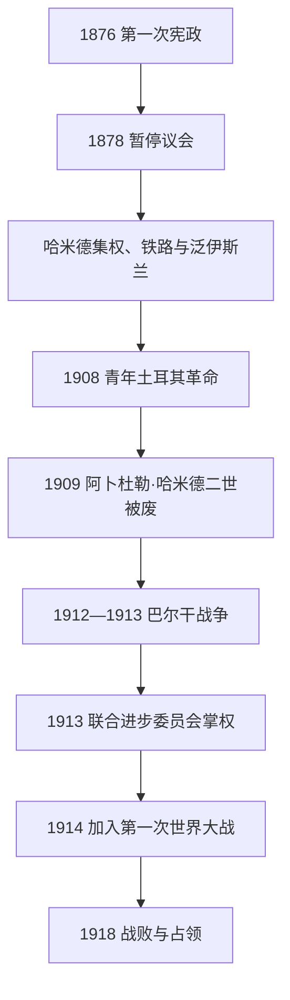

# 青年土耳其党与帝国末期

## 时间

1876年—1918年

## 概括

奥斯曼末期经历第一次宪政、阿卜杜勒·哈米德二世的个人集权、1908年青年土耳其革命和联合进步委员会统治。帝国试图以奥斯曼主义、泛伊斯兰主义和土耳其民族主义等不同方案维持统一，却在俄奥扩张、巴尔干民族国家、债务控制与连续战争中迅速失地。1908年恢复宪法并未稳定政局；1913年后联合进步委员会领导层掌握实权，把帝国带入第一次世界大战。

## 统治结构

| 阶段 | 名义君主 | 实际权力结构 | 说明 |
|---|---|---|---|
| 第一次宪政 | 阿卜杜勒·哈米德二世 | 苏丹、议会与官僚并存 | 1876年宪法和议会建立，1878年俄土战争中被苏丹暂停。 |
| 哈米德集权 | 阿卜杜勒·哈米德二世 | 苏丹宫廷、情报和中央官僚 | 强调哈里发与泛伊斯兰合法性，同时扩展学校、铁路和电报。 |
| 第二次宪政 | 阿卜杜勒·哈米德二世、穆罕默德五世 | 议会、政党、军官集团竞争 | 1908年革命恢复宪法；1909年反革命事件后苏丹被废。 |
| 联合进步委员会统治 | 穆罕默德五世 | 塔拉特、恩维尔、杰马尔等委员会领导人 | 1913年政变后形成党国化战时政权；苏丹主要承担礼仪角色。 |
| 战败收束 | 穆罕默德六世 | 宫廷与协约国占领当局受制，民族运动另起 | 1918年继位，帝国战败后权力中心分裂。 |

完整世系见[奥斯曼苏丹世系表](/%E4%BA%BA%E6%96%87%E7%A7%91%E5%AD%A6/%E5%8E%86%E5%8F%B2/%E8%A5%BF%E4%BA%9A/%E5%9C%9F%E8%80%B3%E5%85%B6/%E5%A5%A5%E6%96%AF%E6%9B%BC%E5%B8%9D%E5%9B%BD/%E5%A5%A5%E6%96%AF%E6%9B%BC%E8%8B%8F%E4%B8%B9%E4%B8%96%E7%B3%BB%E8%A1%A8.md)。

## 重要事件

- 1876年颁布《奥斯曼基本法》，召开两院议会；1877—1878年俄土战争失败后，阿卜杜勒·哈米德二世暂停议会。
- 1878年《柏林条约》承认塞尔维亚、罗马尼亚和黑山独立，保加利亚获自治；奥匈占领波斯尼亚，英国控制塞浦路斯。
- 1881年奥斯曼公共债务管理局成立，以特定税收偿债，显示财政主权受外国债权人限制。
- 1894—1896年安纳托利亚多地发生针对亚美尼亚人的大规模屠杀，中央与地方武装均涉入。
- 1908年马其顿军官发动青年土耳其革命，迫使苏丹恢复宪法；奥匈随即吞并波斯尼亚，保加利亚宣布独立。
- 1909年伊斯坦布尔反革命事件被“行动军”镇压，阿卜杜勒·哈米德二世被废，穆罕默德五世即位。
- 1911—1912年意土战争使奥斯曼失去的黎波里塔尼亚和昔兰尼加；多德卡尼斯群岛被意大利占领。
- 1912—1913年两次巴尔干战争几乎清除奥斯曼在欧洲的领土，难民大量进入安纳托利亚和色雷斯。
- 1913年“高门政变”后联合进步委员会掌权，军队、党组织和内政系统进一步集中。
- 1914年与德国结盟并参加第一次世界大战；后续见[第一次世界大战与奥斯曼帝国解体](/%E4%BA%BA%E6%96%87%E7%A7%91%E5%AD%A6/%E5%8E%86%E5%8F%B2/%E8%A5%BF%E4%BA%9A/%E5%9C%9F%E8%80%B3%E5%85%B6/%E5%A5%A5%E6%96%AF%E6%9B%BC%E5%B8%9D%E5%9B%BD/%E7%AC%AC%E4%B8%80%E6%AC%A1%E4%B8%96%E7%95%8C%E5%A4%A7%E6%88%98%E4%B8%8E%E5%A5%A5%E6%96%AF%E6%9B%BC%E5%B8%9D%E5%9B%BD%E8%A7%A3%E4%BD%93.md)。

## 政治理念与社会变化

奥斯曼主义试图以共同公民身份跨越宗教民族差异；泛伊斯兰主义借哈里发身份团结穆斯林；土耳其民族主义则在失去基督徒多数行省和穆斯林难民涌入后增强。铁路、报刊、学校和议会扩大政治参与，也传播民族主义。不同理念并非依次完全替代，而是在同一时期竞争。中央安全政策、人口工程和战争恐惧则使少数群体面临日益严厉的镇压。

## 衰落原因

连续战争造成领土、人口和税源损失，欧洲列强又通过债务、特权和保护少数群体干预内政。军官和政党以政变争夺改革方向，宪法制度缺乏稳定运作环境。巴尔干民族国家的扩张、俄奥战略竞争和难民问题加剧民族化。1913年后权力集中提高战时动员，却压缩政治协商并把外交风险集中于少数领导人。1918年战败不是单一“民族主义”或“落后”造成，而是长期财政军事压力与参战选择叠加。

## 演进图

## 演变关系

- 前一阶段：[坦志麦特改革与近代化](/%E4%BA%BA%E6%96%87%E7%A7%91%E5%AD%A6/%E5%8E%86%E5%8F%B2/%E8%A5%BF%E4%BA%9A/%E5%9C%9F%E8%80%B3%E5%85%B6/%E5%A5%A5%E6%96%AF%E6%9B%BC%E5%B8%9D%E5%9B%BD/%E5%9D%A6%E5%BF%97%E9%BA%A6%E7%89%B9%E6%94%B9%E9%9D%A9%E4%B8%8E%E8%BF%91%E4%BB%A3%E5%8C%96.md)。
- 后一阶段：[第一次世界大战与奥斯曼帝国解体](/%E4%BA%BA%E6%96%87%E7%A7%91%E5%AD%A6/%E5%8E%86%E5%8F%B2/%E8%A5%BF%E4%BA%9A/%E5%9C%9F%E8%80%B3%E5%85%B6/%E5%A5%A5%E6%96%AF%E6%9B%BC%E5%B8%9D%E5%9B%BD/%E7%AC%AC%E4%B8%80%E6%AC%A1%E4%B8%96%E7%95%8C%E5%A4%A7%E6%88%98%E4%B8%8E%E5%A5%A5%E6%96%AF%E6%9B%BC%E5%B8%9D%E5%9B%BD%E8%A7%A3%E4%BD%93.md)。
- 上级：[奥斯曼帝国](/%E4%BA%BA%E6%96%87%E7%A7%91%E5%AD%A6/%E5%8E%86%E5%8F%B2/%E8%A5%BF%E4%BA%9A/%E5%9C%9F%E8%80%B3%E5%85%B6/%E5%A5%A5%E6%96%AF%E6%9B%BC%E5%B8%9D%E5%9B%BD/README.md)；[土耳其](/%E4%BA%BA%E6%96%87%E7%A7%91%E5%AD%A6/%E5%8E%86%E5%8F%B2/%E8%A5%BF%E4%BA%9A/%E5%9C%9F%E8%80%B3%E5%85%B6/README.md)。
