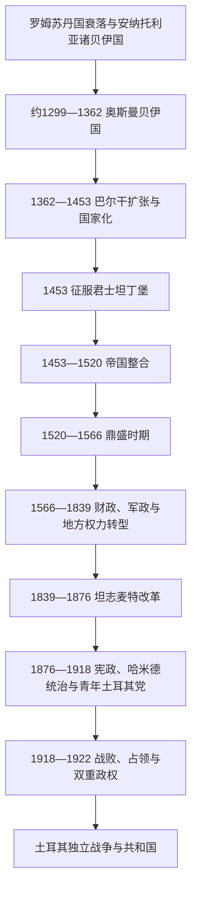

# 奥斯曼帝国时期

## 时间

约1299年—1922年

## 概括

奥斯曼国家由安纳托利亚西北比提尼亚边境的一个贝伊国发展为横跨东南欧、安纳托利亚、西亚和北非的帝国。其扩张不是单靠宗教“圣战”，而是加齐武士、突厥部族、拜占庭边疆军人、婚姻与附庸关系共同作用的结果。1453年征服君士坦丁堡后，奥斯曼王朝以伊斯坦布尔为首都，整合罗马—拜占庭城市传统、伊斯兰法、王朝法、巴尔干和安纳托利亚地方制度。16世纪帝国进入领土与财政高峰；17—18世纪并非停止变化，而是在火器战争、包税、地方精英和欧洲竞争中重组。19世纪改革未能同时解决财政依赖、民族主义和列强干预，第一次世界大战失败后王朝国家被占领与民族运动的双重政权取代，1922年苏丹制废除。

## 演进图

## 建立背景与崛起机制

13世纪后期，蒙古控制削弱罗姆苏丹国，安纳托利亚出现多个贝伊国；拜占庭在西北边境的财政和军事控制也持续收缩。奥斯曼家族以瑟于特、比莱吉克一带为基地，吸收边疆武士和当地基督徒精英，通过攻城、通婚、分封和承认地方特权扩大联盟。奥尔汗夺取布尔萨并建立常备步兵、铸币和宗教—司法职位，随后利用拜占庭内战进入加里波利。巴尔干提供新的税源、兵员和纵深，也使奥斯曼能在安纳托利亚遭受竞争时保留欧洲基地。

1402年巴耶济德一世在安卡拉败于帖木儿后，诸子内战几乎使国家瓦解；穆罕默德一世重新统一，穆拉德二世又击退十字军联盟。帝国得以恢复，说明其地方军政网络和巴尔干附庸并未随一次败战全部消失。穆罕默德二世征服君士坦丁堡后，重建城市人口与商业，强化王室土地、宫廷官僚和火器军队，奥斯曼由边疆联盟转为中央化帝国。

## 分阶段发展

| 阶段 | 时间 | 核心过程 | 详细笔记 |
|---|---|---|---|
| 贝伊国形成 | 约1299—1362年 | 夺取布尔萨、尼西亚和尼科米底亚，跨入欧洲，形成早期军政与司法机构。 | [奥斯曼贝伊国](/%E4%BA%BA%E6%96%87%E7%A7%91%E5%AD%A6/%E5%8E%86%E5%8F%B2/%E8%A5%BF%E4%BA%9A/%E5%9C%9F%E8%80%B3%E5%85%B6/%E5%A5%A5%E6%96%AF%E6%9B%BC%E5%B8%9D%E5%9B%BD/%E5%A5%A5%E6%96%AF%E6%9B%BC%E8%B4%9D%E4%BC%8A%E5%9B%BD.md) |
| 巴尔干扩张 | 1362—1453年 | 以埃迪尔内为中心扩张，经历安卡拉败战、空位期和复兴。 | [奥斯曼帝国兴起与巴尔干扩张](/%E4%BA%BA%E6%96%87%E7%A7%91%E5%AD%A6/%E5%8E%86%E5%8F%B2/%E8%A5%BF%E4%BA%9A/%E5%9C%9F%E8%80%B3%E5%85%B6/%E5%A5%A5%E6%96%AF%E6%9B%BC%E5%B8%9D%E5%9B%BD/%E5%A5%A5%E6%96%AF%E6%9B%BC%E5%B8%9D%E5%9B%BD%E5%85%B4%E8%B5%B7%E4%B8%8E%E5%B7%B4%E5%B0%94%E5%B9%B2%E6%89%A9%E5%BC%A0.md) |
| 帝国化 | 1453—1520年 | 征服君士坦丁堡，整合安纳托利亚，击败马穆鲁克并取得叙利亚、埃及和两圣地。 | [君士坦丁堡陷落与帝国化](/%E4%BA%BA%E6%96%87%E7%A7%91%E5%AD%A6/%E5%8E%86%E5%8F%B2/%E8%A5%BF%E4%BA%9A/%E5%9C%9F%E8%80%B3%E5%85%B6/%E5%A5%A5%E6%96%AF%E6%9B%BC%E5%B8%9D%E5%9B%BD/%E5%90%9B%E5%A3%AB%E5%9D%A6%E4%B8%81%E5%A0%A1%E9%99%B7%E8%90%BD%E4%B8%8E%E5%B8%9D%E5%9B%BD%E5%8C%96.md) |
| 鼎盛 | 1520—1566年 | 苏莱曼一世时期扩至匈牙利、伊拉克和北非，法律、财政与建筑体系成熟。 | [奥斯曼帝国鼎盛时期](/%E4%BA%BA%E6%96%87%E7%A7%91%E5%AD%A6/%E5%8E%86%E5%8F%B2/%E8%A5%BF%E4%BA%9A/%E5%9C%9F%E8%80%B3%E5%85%B6/%E5%A5%A5%E6%96%AF%E6%9B%BC%E5%B8%9D%E5%9B%BD/%E5%A5%A5%E6%96%AF%E6%9B%BC%E5%B8%9D%E5%9B%BD%E9%BC%8E%E7%9B%9B%E6%97%B6%E6%9C%9F.md) |
| 转型 | 1566—1839年 | 蒂玛尔缩小、包税与地方显贵扩大，军队和财政适应长期火器战争。 | [奥斯曼帝国转型与停滞时期](/%E4%BA%BA%E6%96%87%E7%A7%91%E5%AD%A6/%E5%8E%86%E5%8F%B2/%E8%A5%BF%E4%BA%9A/%E5%9C%9F%E8%80%B3%E5%85%B6/%E5%A5%A5%E6%96%AF%E6%9B%BC%E5%B8%9D%E5%9B%BD/%E5%A5%A5%E6%96%AF%E6%9B%BC%E5%B8%9D%E5%9B%BD%E8%BD%AC%E5%9E%8B%E4%B8%8E%E5%81%9C%E6%BB%9E%E6%97%B6%E6%9C%9F.md) |
| 近代改革 | 1839—1876年 | 以中央官僚、统一法律、征兵和臣民平等重建国家能力。 | [坦志麦特改革与近代化](/%E4%BA%BA%E6%96%87%E7%A7%91%E5%AD%A6/%E5%8E%86%E5%8F%B2/%E8%A5%BF%E4%BA%9A/%E5%9C%9F%E8%80%B3%E5%85%B6/%E5%A5%A5%E6%96%AF%E6%9B%BC%E5%B8%9D%E5%9B%BD/%E5%9D%A6%E5%BF%97%E9%BA%A6%E7%89%B9%E6%94%B9%E9%9D%A9%E4%B8%8E%E8%BF%91%E4%BB%A3%E5%8C%96.md) |
| 帝国末期 | 1876—1918年 | 宪法、哈米德集权、青年土耳其革命、巴尔干战争和一战相继重塑权力。 | [青年土耳其党与帝国末期](/%E4%BA%BA%E6%96%87%E7%A7%91%E5%AD%A6/%E5%8E%86%E5%8F%B2/%E8%A5%BF%E4%BA%9A/%E5%9C%9F%E8%80%B3%E5%85%B6/%E5%A5%A5%E6%96%AF%E6%9B%BC%E5%B8%9D%E5%9B%BD/%E9%9D%92%E5%B9%B4%E5%9C%9F%E8%80%B3%E5%85%B6%E5%85%9A%E4%B8%8E%E5%B8%9D%E5%9B%BD%E6%9C%AB%E6%9C%9F.md) |
| 战败与解体 | 1914—1922年 | 总体战、人口暴力、阿拉伯省份丧失、协约国占领和安卡拉民族政府兴起。 | [第一次世界大战与奥斯曼帝国解体](/%E4%BA%BA%E6%96%87%E7%A7%91%E5%AD%A6/%E5%8E%86%E5%8F%B2/%E8%A5%BF%E4%BA%9A/%E5%9C%9F%E8%80%B3%E5%85%B6/%E5%A5%A5%E6%96%AF%E6%9B%BC%E5%B8%9D%E5%9B%BD/%E7%AC%AC%E4%B8%80%E6%AC%A1%E4%B8%96%E7%95%8C%E5%A4%A7%E6%88%98%E4%B8%8E%E5%A5%A5%E6%96%AF%E6%9B%BC%E5%B8%9D%E5%9B%BD%E8%A7%A3%E4%BD%93.md) |

## 王朝世系与统治结构

36位公认苏丹、1402—1413年空位期诸王子、复位和废立见[奥斯曼苏丹世系表](/%E4%BA%BA%E6%96%87%E7%A7%91%E5%AD%A6/%E5%8E%86%E5%8F%B2/%E8%A5%BF%E4%BA%9A/%E5%9C%9F%E8%80%B3%E5%85%B6/%E5%A5%A5%E6%96%AF%E6%9B%BC%E5%B8%9D%E5%9B%BD/%E5%A5%A5%E6%96%AF%E6%9B%BC%E8%8B%8F%E4%B8%B9%E4%B8%96%E7%B3%BB%E8%A1%A8.md)。中央宫廷、耶尼切里、蒂玛尔、包税、行省、教法与王朝法、宗教共同体和地方显贵见[奥斯曼帝国的统治结构](/%E4%BA%BA%E6%96%87%E7%A7%91%E5%AD%A6/%E5%8E%86%E5%8F%B2/%E8%A5%BF%E4%BA%9A/%E5%9C%9F%E8%80%B3%E5%85%B6/%E5%A5%A5%E6%96%AF%E6%9B%BC%E5%B8%9D%E5%9B%BD/%E5%A5%A5%E6%96%AF%E6%9B%BC%E5%B8%9D%E5%9B%BD%E7%9A%84%E7%BB%9F%E6%B2%BB%E7%BB%93%E6%9E%84.md)。

苏丹名义上拥有最高军政和司法权，但实际运作随时期改变：16世纪依靠大维齐尔、底万和宫廷奴仆体系；17—18世纪大维齐尔、宫廷、军团、包税人和地方显贵共同议价；1908年后苏丹多为宪政框架内的国家元首，联合进步委员会掌握实际党政军权。

## 重要事件

- 1326年夺取布尔萨，奥斯曼获得首个重要城市首都和稳定财政。
- 1354年前后占据加里波利，建立巴尔干永久桥头堡。
- 1389年科索沃战役后继续扩张塞尔维亚等地；1396年尼科波利斯击败十字军。
- 1402年安卡拉战役败于帖木儿，1402—1413年诸王子内战，穆罕默德一世最终重建统一。
- 1453年穆罕默德二世攻陷君士坦丁堡，拜占庭帝国终结，伊斯坦布尔成为帝国首都。
- 1514年查尔迪兰战役遏制萨法维西进；1516—1517年击败马穆鲁克，取得叙利亚、埃及与汉志宗主权。
- 1526年摩哈赤战役摧毁匈牙利王国主力；1529年第一次围攻维也纳未克。
- 1571年勒班陀海战舰队重创，但帝国迅速重建海军，塞浦路斯仍由奥斯曼控制。
- 1683年第二次维也纳围城失败，1699年《卡洛维茨条约》标志欧洲大规模领土净损失。
- 1826年马哈茂德二世消灭耶尼切里，为中央化新军与官僚改革清路。
- 1839年《花厅御诏》开启坦志麦特；1876年首次宪法颁布，随后议会被暂停。
- 1908年青年土耳其革命恢复宪政；1912—1913年巴尔干战争使帝国失去大部分欧洲领土。
- 1914年加入同盟国参战；战争期间发生亚美尼亚人驱逐与大规模死亡等国家暴力，也伴随阿拉伯省份战事和严重饥荒。
- 1918年《穆德洛斯停战协定》后协约国占领；1920年《色佛尔条约》提出分割，但安卡拉政府拒绝承认。
- 1922年11月1日大国民议会废除苏丹制，穆罕默德六世离境，奥斯曼王朝国家正式终结。

## 鼎盛条件

帝国的强盛建立在巴尔干和安纳托利亚双核心、火器与常备军、可把不同地区纳入的分层税制，以及容许地方宗教和法律实践在帝国框架内运行的务实治理。伊斯坦布尔控制黑海—地中海与陆上商路，大规模人口迁入、市场和宗教基金又支撑首都。强势苏丹、专业大维齐尔和相对连续的财政记录让扩张收益能够转化为行政能力。

## 衰落因素与直接灭亡

- **结构因素**：长期战争提高现金需求，蒂玛尔骑兵体系收缩，包税和外债扩大；地方显贵、军团和官僚之间的议价增加中央改革成本。
- **外部压力**：哈布斯堡、俄罗斯和海上欧洲强国取得军事、财政与工业优势；列强利用通商特权、债务和民族问题干预帝国内政。
- **社会政治压力**：巴尔干民族国家形成、穆斯林难民流入和人口工程使帝国认同由多宗教王朝秩序逐步转向竞争性的奥斯曼主义、伊斯兰主义和土耳其民族主义。
- **改革悖论**：新军、铁路、学校和统一法律增强中央能力，也提高征税、征兵和文化同质化压力，引发新的地方抵抗。
- **直接触发**：青年土耳其党核心在1914年选择参战；多线战争、封锁、饥荒和人口暴力耗尽帝国。1918年战败后伊斯坦布尔政府受占领约束，安卡拉民族政府取得军政合法性。1922年废苏丹制是制度上的直接终点，而不是“帝国自然衰老”自动发生。

## 演变关系

- 前一阶段：[安纳托利亚突厥化与罗姆苏丹国](/%E4%BA%BA%E6%96%87%E7%A7%91%E5%AD%A6/%E5%8E%86%E5%8F%B2/%E8%A5%BF%E4%BA%9A/%E5%9C%9F%E8%80%B3%E5%85%B6/%E5%AE%89%E7%BA%B3%E6%89%98%E5%88%A9%E4%BA%9A%E7%AA%81%E5%8E%A5%E5%8C%96%E4%B8%8E%E7%BD%97%E5%A7%86%E8%8B%8F%E4%B8%B9%E5%9B%BD.md)。
- 完整目录：[奥斯曼帝国](/%E4%BA%BA%E6%96%87%E7%A7%91%E5%AD%A6/%E5%8E%86%E5%8F%B2/%E8%A5%BF%E4%BA%9A/%E5%9C%9F%E8%80%B3%E5%85%B6/%E5%A5%A5%E6%96%AF%E6%9B%BC%E5%B8%9D%E5%9B%BD/README.md)。
- 后续：[土耳其独立战争](/%E4%BA%BA%E6%96%87%E7%A7%91%E5%AD%A6/%E5%8E%86%E5%8F%B2/%E8%A5%BF%E4%BA%9A/%E5%9C%9F%E8%80%B3%E5%85%B6/%E5%9C%9F%E8%80%B3%E5%85%B6%E7%8B%AC%E7%AB%8B%E6%88%98%E4%BA%89.md)。
