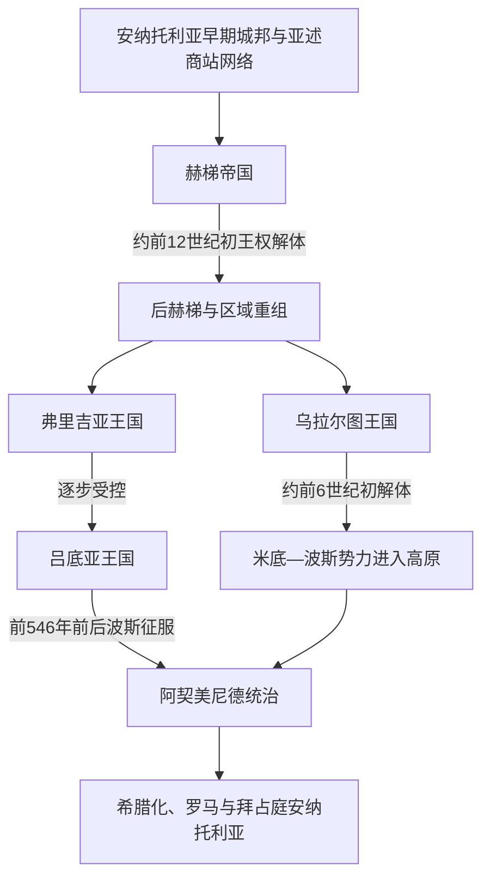

# 安纳托利亚古代文明

## 概括

安纳托利亚不是由一个文明连续统治的封闭单元，而是连接爱琴海、黑海、两河流域、叙利亚和伊朗高原的地理枢纽。本目录以主要王国为锚点：青铜时代的赫梯以哈图沙组织跨区域帝国；赫梯解体后，中西部出现弗里吉亚、吕底亚等铁器时代王国，东部则形成乌拉尔图。它们在时间上部分重叠，族群、语言和王朝之间也不存在一条简单的直系继承链。

## 演变图

图中的箭头表示地区政治主线或征服关系，不表示赫梯人“演化成”弗里吉亚人、乌拉尔图人或吕底亚人。

## 主要文明与政权

| 顺序 | 政权 / 文明 | 大致时间 | 核心地区 | 简要概括 |
|---:|---|---|---|---|
| 1 | [赫梯帝国](/%E4%BA%BA%E6%96%87%E7%A7%91%E5%AD%A6/%E5%8E%86%E5%8F%B2/%E8%A5%BF%E4%BA%9A/%E5%9C%9F%E8%80%B3%E5%85%B6/%E5%AE%89%E7%BA%B3%E6%89%98%E5%88%A9%E4%BA%9A%E5%8F%A4%E4%BB%A3%E6%96%87%E6%98%8E/%E8%B5%AB%E6%A2%AF%E5%B8%9D%E5%9B%BD.md) | 约前17世纪—前12世纪初 | 中部安纳托利亚、北叙利亚 | 以哈图沙为都的复合帝国，通过王族副王、附庸条约和多语种文书治理。 |
| 2 | [弗里吉亚王国](/%E4%BA%BA%E6%96%87%E7%A7%91%E5%AD%A6/%E5%8E%86%E5%8F%B2/%E8%A5%BF%E4%BA%9A/%E5%9C%9F%E8%80%B3%E5%85%B6/%E5%AE%89%E7%BA%B3%E6%89%98%E5%88%A9%E4%BA%9A%E5%8F%A4%E4%BB%A3%E6%96%87%E6%98%8E/%E5%BC%97%E9%87%8C%E5%90%89%E4%BA%9A%E7%8E%8B%E5%9B%BD.md) | 约前10／9世纪—前7世纪 | 戈尔迪翁及中部高原 | 米达斯是唯一能由同时代文献稳固确认的国王；前7世纪后逐步失去独立。 |
| 3 | [乌拉尔图王国](/%E4%BA%BA%E6%96%87%E7%A7%91%E5%AD%A6/%E5%8E%86%E5%8F%B2/%E8%A5%BF%E4%BA%9A/%E5%9C%9F%E8%80%B3%E5%85%B6/%E5%AE%89%E7%BA%B3%E6%89%98%E5%88%A9%E4%BA%9A%E5%8F%A4%E4%BB%A3%E6%96%87%E6%98%8E/%E4%B9%8C%E6%8B%89%E5%B0%94%E5%9B%BE%E7%8E%8B%E5%9B%BD.md) | 约前860—前590／585年 | 凡湖、亚美尼亚高原、乌尔米耶湖周边 | 以堡垒、仓储和灌溉工程组织高地资源，是新亚述的主要北方对手。 |
| 4 | [吕底亚王国](/%E4%BA%BA%E6%96%87%E7%A7%91%E5%AD%A6/%E5%8E%86%E5%8F%B2/%E8%A5%BF%E4%BA%9A/%E5%9C%9F%E8%80%B3%E5%85%B6/%E5%AE%89%E7%BA%B3%E6%89%98%E5%88%A9%E4%BA%9A%E5%8F%A4%E4%BB%A3%E6%96%87%E6%98%8E/%E5%90%95%E5%BA%95%E4%BA%9A%E7%8E%8B%E5%9B%BD.md) | 约前7世纪—前546年 | 萨第斯、安纳托利亚西部 | 梅尔姆纳德五王扩张到爱琴海岸；铸币体系成熟，最终被居鲁士二世征服。 |

## 历史主线

青铜时代早期的亚述商站已把安纳托利亚纳入跨区域贸易和书写网络。赫梯王权利用这一基础统一中部高原，并在前14—13世纪控制北叙利亚。约前12世纪初的宫廷、贸易和人口危机使哈图沙帝国解体，但叙利亚北部的新赫梯诸国、安纳托利亚地方居民和技术传统仍延续。

铁器时代没有单一“接班帝国”。戈尔迪翁的弗里吉亚、凡湖的乌拉尔图、萨第斯的吕底亚在不同生态区建立王国，并分别面对亚述、辛梅里安、斯基泰、米底与希腊城邦。前6世纪中叶，阿契美尼德帝国征服吕底亚并统合安纳托利亚大部，地区主线由本目录转入波斯、希腊化与罗马阶段。

## 重要转折与时间节点

| 时间 | 转折 | 意义 |
|---|---|---|
| 约前1650年 | 哈图西里一世以哈图沙为都 | 赫梯古王国主线成形。 |
| 约前1595年 | 穆尔西里一世攻取巴比伦 | 赫梯显示跨越安纳托利亚—叙利亚的远征能力。 |
| 前14—13世纪 | 赫梯新王国扩张并与埃及、亚述竞争 | 安纳托利亚首次成为近东“大国体系”的核心之一。 |
| 约前1190—前1180年 | 哈图沙统一王权终止 | 地区进入多中心重组，不能简化为一次入侵。 |
| 前9—8世纪 | 弗里吉亚、乌拉尔图形成强国 | 高原中部与东部分别出现新的王权网络。 |
| 前714年 | 亚述洗劫穆萨西尔 | 乌拉尔图受重创但继续存在。 |
| 前7世纪 | 吕底亚梅尔姆纳德王朝扩张 | 西安纳托利亚和爱琴海城市进入更紧密的贡赋、货币网络。 |
| 前590／585年前后 | 乌拉尔图王权消失 | 东部高原转入米底、波斯与地方政权交错阶段。 |
| 前546年前后 | 波斯攻取萨第斯 | 吕底亚灭亡，安纳托利亚大部纳入阿契美尼德体系。 |

## 关键辨析

- 赫梯语、卢维语、弗里吉亚语和吕底亚语均属印欧语系不同分支；乌拉尔图语则与胡里语关系较近，不能据地理邻近视作同一民族。
- “铁器时代”不等于所有武器立即由铁制造；青铜仍长期使用，技术变化也不是赫梯灭亡的单一原因。
- 弗里吉亚米达斯、吕底亚克洛伊索斯的希腊传说包含历史人物，但文学情节需与同时代铭文、亚述记录和考古年代分开。
- 古代绝对年代常依赖跨国同步事件。各节点已用“约”“可能”“存在争议”标示不能精确确定的王年和世系。

## 演变关系

- 后续主线：[希腊化、罗马与拜占庭安纳托利亚](/%E4%BA%BA%E6%96%87%E7%A7%91%E5%AD%A6/%E5%8E%86%E5%8F%B2/%E8%A5%BF%E4%BA%9A/%E5%9C%9F%E8%80%B3%E5%85%B6/%E5%B8%8C%E8%85%8A%E5%8C%96%E3%80%81%E7%BD%97%E9%A9%AC%E4%B8%8E%E6%8B%9C%E5%8D%A0%E5%BA%AD%E5%AE%89%E7%BA%B3%E6%89%98%E5%88%A9%E4%BA%9A.md)。
- 波斯统治锚点：[阿契美尼德王朝](/%E4%BA%BA%E6%96%87%E7%A7%91%E5%AD%A6/%E5%8E%86%E5%8F%B2/%E8%A5%BF%E4%BA%9A/%E4%BC%8A%E6%9C%97/%E9%98%BF%E5%A5%91%E7%BE%8E%E5%B0%BC%E5%BE%B7%E7%8E%8B%E6%9C%9D.md)。
- 上级：[土耳其历史](/%E4%BA%BA%E6%96%87%E7%A7%91%E5%AD%A6/%E5%8E%86%E5%8F%B2/%E8%A5%BF%E4%BA%9A/%E5%9C%9F%E8%80%B3%E5%85%B6/README.md)。
