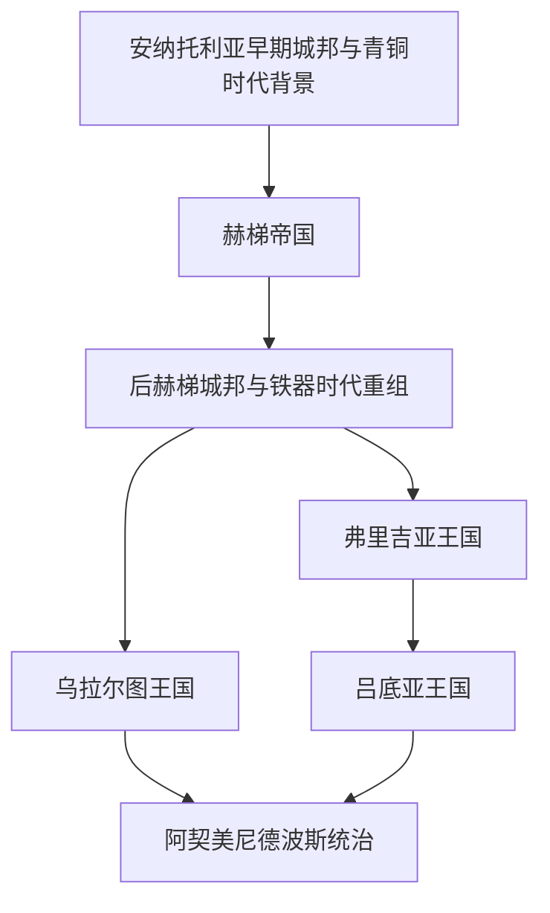

# 安纳托利亚古代文明

## 概括

安纳托利亚古代文明指突厥化和拜占庭—罗马后期主线以前，安纳托利亚高原及其周边形成的青铜时代、铁器时代文明与王国传统。这里连接爱琴海、两河流域、叙利亚、亚美尼亚高原、高加索和伊朗高原，是赫梯、弗里吉亚、吕底亚、乌拉尔图等政权活动的核心区域。

本目录作为土耳其历史主线中的古代入口，只整理安纳托利亚地方文明；波斯、希腊化、罗马和拜占庭统治时期另见同级后续阶段。

## 演变图

## 主要文明与政权

| 顺序 | 名称 | 大致时间 | 入口 | 简要概括 |
|---:|---|---|---|---|
| 1 | 赫梯帝国 | 约前17世纪-前12世纪 | [赫梯帝国](/%E4%BA%BA%E6%96%87%E7%A7%91%E5%AD%A6/%E5%8E%86%E5%8F%B2/%E8%A5%BF%E4%BA%9A/%E5%9C%9F%E8%80%B3%E5%85%B6/%E5%AE%89%E7%BA%B3%E6%89%98%E5%88%A9%E4%BA%9A%E5%8F%A4%E4%BB%A3%E6%96%87%E6%98%8E/%E8%B5%AB%E6%A2%AF%E5%B8%9D%E5%9B%BD.md) | 以哈图沙为中心的青铜时代强国，与埃及、米坦尼、亚述和叙利亚北部长期互动。 |
| 2 | 弗里吉亚王国 | 约前12世纪以后-前7世纪 | [弗里吉亚王国](/%E4%BA%BA%E6%96%87%E7%A7%91%E5%AD%A6/%E5%8E%86%E5%8F%B2/%E8%A5%BF%E4%BA%9A/%E5%9C%9F%E8%80%B3%E5%85%B6/%E5%AE%89%E7%BA%B3%E6%89%98%E5%88%A9%E4%BA%9A%E5%8F%A4%E4%BB%A3%E6%96%87%E6%98%8E/%E5%BC%97%E9%87%8C%E5%90%89%E4%BA%9A%E7%8E%8B%E5%9B%BD.md) | 后赫梯时代安纳托利亚中西部的重要王国传统，与戈尔迪翁、弥达斯传说相关。 |
| 3 | 吕底亚王国 | 约前7世纪-前546年 | [吕底亚王国](/%E4%BA%BA%E6%96%87%E7%A7%91%E5%AD%A6/%E5%8E%86%E5%8F%B2/%E8%A5%BF%E4%BA%9A/%E5%9C%9F%E8%80%B3%E5%85%B6/%E5%AE%89%E7%BA%B3%E6%89%98%E5%88%A9%E4%BA%9A%E5%8F%A4%E4%BB%A3%E6%96%87%E6%98%8E/%E5%90%95%E5%BA%95%E4%BA%9A%E7%8E%8B%E5%9B%BD.md) | 安纳托利亚西部王国，以萨第斯、财富、铸币和克洛伊索斯时期强盛著称。 |
| 4 | 乌拉尔图王国 | 约前9世纪-前6世纪 | [乌拉尔图王国](/%E4%BA%BA%E6%96%87%E7%A7%91%E5%AD%A6/%E5%8E%86%E5%8F%B2/%E8%A5%BF%E4%BA%9A/%E5%9C%9F%E8%80%B3%E5%85%B6/%E5%AE%89%E7%BA%B3%E6%89%98%E5%88%A9%E4%BA%9A%E5%8F%A4%E4%BB%A3%E6%96%87%E6%98%8E/%E4%B9%8C%E6%8B%89%E5%B0%94%E5%9B%BE%E7%8E%8B%E5%9B%BD.md) | 安纳托利亚东部和亚美尼亚高原强国，与新亚述帝国长期对峙。 |

## 关键辨析

- “安纳托利亚古代文明”不是一个统一王朝，而是一组在同一地理区域内先后或并存的文明传统。
- 赫梯属于青铜时代近东强国；弗里吉亚、吕底亚、乌拉尔图主要属于青铜时代崩溃后的铁器时代安纳托利亚格局。
- 吕底亚被阿契美尼德征服后，安纳托利亚西部进入波斯帝国体系；这部分后续可与[阿契美尼德王朝](/%E4%BA%BA%E6%96%87%E7%A7%91%E5%AD%A6/%E5%8E%86%E5%8F%B2/%E8%A5%BF%E4%BA%9A/%E4%BC%8A%E6%9C%97/%E9%98%BF%E5%A5%91%E7%BE%8E%E5%B0%BC%E5%BE%B7%E7%8E%8B%E6%9C%9D.md)对读。

## 演变关系

- 所属总览：[土耳其](/%E4%BA%BA%E6%96%87%E7%A7%91%E5%AD%A6/%E5%8E%86%E5%8F%B2/%E8%A5%BF%E4%BA%9A/%E5%9C%9F%E8%80%B3%E5%85%B6/README.md)。
- 后续阶段：[希腊化、罗马与拜占庭安纳托利亚](/%E4%BA%BA%E6%96%87%E7%A7%91%E5%AD%A6/%E5%8E%86%E5%8F%B2/%E8%A5%BF%E4%BA%9A/%E5%9C%9F%E8%80%B3%E5%85%B6/%E5%B8%8C%E8%85%8A%E5%8C%96%E3%80%81%E7%BD%97%E9%A9%AC%E4%B8%8E%E6%8B%9C%E5%8D%A0%E5%BA%AD%E5%AE%89%E7%BA%B3%E6%89%98%E5%88%A9%E4%BA%9A.md)。
- 区域交叉：[黎凡特](/%E4%BA%BA%E6%96%87%E7%A7%91%E5%AD%A6/%E5%8E%86%E5%8F%B2/%E8%A5%BF%E4%BA%9A/%E9%BB%8E%E5%87%A1%E7%89%B9/README.md)、[两河流域文明](/%E4%BA%BA%E6%96%87%E7%A7%91%E5%AD%A6/%E5%8E%86%E5%8F%B2/%E8%A5%BF%E4%BA%9A/%E4%B8%A4%E6%B2%B3%E6%B5%81%E5%9F%9F/README.md)、[伊朗](/%E4%BA%BA%E6%96%87%E7%A7%91%E5%AD%A6/%E5%8E%86%E5%8F%B2/%E8%A5%BF%E4%BA%9A/%E4%BC%8A%E6%9C%97/README.md)。
