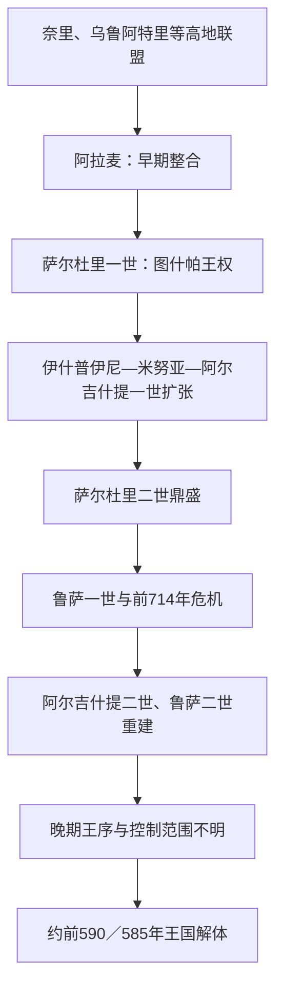

# 乌拉尔图王国

## 时间

约前860—前590／585年；前7世纪后半至灭亡阶段的王序和年代争议较大

## 概括

乌拉尔图由凡湖周围高地的诸政治共同体在亚述压力下整合而成，首都图什帕位于今土耳其凡城岩堡。王国以山地堡垒、灌溉工程、金属资源和省级仓储控制东安纳托利亚、亚美尼亚高原与乌尔米耶湖周边。伊什普伊尼、米努亚、阿尔吉什提一世和萨尔杜里二世连续扩张，使乌拉尔图在前8世纪成为新亚述最强的北方对手；萨尔贡二世前714年远征和此后的游牧压力没有立即灭国，但削弱了宗教中心与区域网络。王国在前7世纪末至前6世纪初解体，最后过程缺少同时代叙事，不能简单写成“米底一战灭乌拉尔图”。

## 演进图

## 建立背景与崛起机制

前9世纪，新亚述文献把凡湖及更北的山地称为奈里、乌鲁阿特里等，最初并非统一国家。亚述沙尔马那塞尔三世进攻阿拉麦后，高地统治者逐步集中防务。萨尔杜里一世在图什帕留下以亚述语书写的城建铭文；伊什普伊尼以后，王室使用乌拉尔图语楔形文字，以主神哈尔迪及统一祭祀塑造王权。高原降水季节性强，王室修建水渠、水库、梯田、堡垒和大仓库，把农业剩余、牲畜、金属与被迁移人口纳入军政体系。

## 公认可证王表与晚期争议

前9—8世纪王序可由乌拉尔图铭文和亚述纪年较好互证；鲁萨二世以后的材料显著减少。下表把可确认君主和可能君主一并列出，并在备注中说明争议，避免把“某王之父”自动视为正式国王。

| 顺序 | 国王 | 约在位时间 | 继承关系 | 关键事件 / 争议 |
|---:|---|---|---|---|
| 1 | 阿拉麦（Arame） | 约前860—前840年 | 早期整合者 | 亚述文献所见“乌拉尔图”国王，中心或在阿尔扎什库；与后续王朝关系不明。 |
| 2 | **萨尔杜里一世** | 约前840—前830年 | 卢蒂普里之子 | 在图什帕立都并修建堡垒；卢蒂普里只以父名出现，是否曾为王不详。 |
| 3 | 伊什普伊尼 | 约前830—前810年 | 萨尔杜里一世之子 | 与子米努亚可能共治；扩向穆萨西尔和乌尔米耶湖，哈尔迪崇拜居核心。 |
| 4 | **米努亚** | 约前810—前785年 | 伊什普伊尼之子 | 建水渠、道路和堡垒，向亚拉拉特平原及乌尔米耶地区扩张。 |
| 5 | **阿尔吉什提一世** | 约前785—前756年 | 米努亚之子 | 前782年建埃瑞布尼，后建阿尔吉什提希尼利；大规模迁民和拓殖北部平原。 |
| 6 | 萨尔杜里二世 | 约前756—前735年 | 阿尔吉什提一世之子 | 王国达到领土高峰；前743年左右败于亚述提格拉特帕拉沙尔三世。 |
| 7 | 鲁萨一世 | 约前735—前714年 | 萨尔杜里二世之子 | 重整东部联盟；前714年败于萨尔贡二世，穆萨西尔哈尔迪神庙遭劫。 |
| 8 | 阿尔吉什提二世 | 约前714—前685年 | 鲁萨一世之子 | 恢复王国，向东扩展至萨巴兰山附近，减少与亚述正面对抗。 |
| 9 | **鲁萨二世** | 约前685—前645年 | 阿尔吉什提二世之子 | 建鲁萨希尼利、泰舍拜尼等大型堡垒，重组人口和仓储；与亚述维持复杂和平。 |
| 10 | 萨尔杜里三世 | 约前645—前635年 | 鲁萨二世之子 | 向亚述称其国王为“父”，显示外交地位下降；具体疆域不明。 |
| — | 埃里梅纳 | 前7世纪后半，年代不详 | 鲁萨三世之父 | 有学者列为国王，也可能从未即位；目前不赋正式顺序。 |
| 11? | 鲁萨三世（埃里梅纳之子） | 常置于约前620—前609年 | 埃里梅纳之子 | 卡尔米尔布鲁尔等铭文可证；究竟承接萨尔杜里三世还是与另一支并立有争议。 |
| 12? | 萨尔杜里四世 | 常置于约前609—前595年 | 关系有争议 | 少量封泥和铭文可证；与鲁萨三世、鲁萨四世的先后并非完全确定。 |
| 13? | 鲁萨四世 | 常置于约前595—前590／585年 | 可能为萨尔杜里四世继承人 | 可能为最后一位国王；材料极少，是否控制整个王国不明。 |

阿拉麦与萨尔杜里一世之间是否为同一王朝、米努亚开始独立在位的年份、鲁萨二世以后的顺序都有不同重建。本表所称“完整”是对目前可证王名的完整列举，不表示晚期每一年都能确定由谁统治。

## 统治结构

| 层级 | 作用 |
|---|---|
| 国王 | 最高统帅、工程发起者和哈尔迪祭祀秩序中心；铭文把征服、迁民和水利归于王命。 |
| 王室与省级长官 | 管理堡垒、边疆和贡赋区；部分战略城由王族或高级官员驻守。 |
| 堡垒—仓储网络 | 集中谷物、酒、油、牲畜和武器，兼具行政、军营、祭祀与灾年储备功能。 |
| 灌溉农业 | 水渠、梯田与水库扩大高原耕地；“米努亚水渠”至今仍有部分沿用。 |
| 军队与迁民 | 步兵、骑兵和战车配合；征服后常迁移人口到新建城市，以开发土地并削弱敌对地区。 |
| 地方社会 | 胡里—乌拉尔图语人口与其他高地群体并存，中央统一并未消除地方差异。 |

## 重要事件

- 约前858—前856年，亚述沙尔马那塞尔三世远征阿拉麦控制区，刺激凡湖高地加强整合。
- 约前840年后，萨尔杜里一世在图什帕修筑临湖堡垒，形成稳定王都。
- 伊什普伊尼与米努亚控制穆萨西尔祭祀中心，把哈尔迪置于王国神谱之首，并向乌尔米耶湖地区推进。
- 米努亚修建通往图什帕的长距离水渠和沿线堡垒，使都城、军队与农业扩张获得基础设施支持。
- 前782年，阿尔吉什提一世建立埃瑞布尼；前776年前后又建阿尔吉什提希尼利，乌拉尔图控制亚拉拉特平原。
- 萨尔杜里二世在前8世纪中叶扩至幼发拉底上游与叙利亚北部，随后在前743年左右被亚述提格拉特帕拉沙尔三世击败，图什帕也受围。
- 前714年，亚述萨尔贡二世穿越扎格罗斯北部击败鲁萨一世盟友并洗劫穆萨西尔，夺走哈尔迪神庙财物；王国遭重创但未灭亡。
- 阿尔吉什提二世向东恢复控制，表明前714年不是王国终点。
- 前7世纪前半，鲁萨二世兴建鲁萨希尼利、阿亚尼斯和泰舍拜尼等中心，重新组织仓储、灌溉和边防。
- 前7世纪后半，斯基泰、辛梅里安及米底力量进入高原，亚述自身也在前612年灭亡，乌拉尔图所处外交体系瓦解。
- 泰舍拜尼等堡垒在前7世纪末至前6世纪初遭破坏或废弃；不同地点终止时间并不一致。
- 约前590／585年后不再出现可靠乌拉尔图王室铭文，区域随后进入米底、阿契美尼德及本地政权交错阶段。

## 鼎盛条件

乌拉尔图把陡峭地形转化为堡垒优势，以水利和迁民扩大可征税农业，再用金属、马匹与山地道路支撑军队。连续数代父子继承使前9—8世纪的工程和扩张保持方向；亚述南部压力也促使高地共同体接受更强中央协调。

## 衰落与直接灭亡

- **结构因素**：堡垒行政需要大量粮食、劳役和守军，边缘地区对中央的忠诚依赖王室持续调配；鲁萨二世以后王序不稳反映中央信息与控制下降。
- **外部压力**：亚述多次远征破坏西南与宗教网络；斯基泰、辛梅里安和米底等骑马集团改变高原军事格局。
- **区域系统崩解**：前7世纪末新亚述灭亡，既消除旧敌，也打断长期外交、贸易和权力平衡；各地堡垒相继孤立。
- **直接过程不明**：现无一份同时代文本记载“最后一战”。泰舍拜尼遭攻击、图什帕与其他中心被废弃可能跨越数十年。米底人可能参与终结，但“前590年米底一次征服”仍是推断，不应写成无争议事实。
- **人口与文化延续**：王国机构消失后，高地居民、农业工程和部分物质文化继续存在；不能把政权灭亡等同于某一族群突然消失。

## 演变关系

- 同期南方强国为新亚述帝国；西部与中部可对照[弗里吉亚王国](/%E4%BA%BA%E6%96%87%E7%A7%91%E5%AD%A6/%E5%8E%86%E5%8F%B2/%E8%A5%BF%E4%BA%9A/%E5%9C%9F%E8%80%B3%E5%85%B6/%E5%AE%89%E7%BA%B3%E6%89%98%E5%88%A9%E4%BA%9A%E5%8F%A4%E4%BB%A3%E6%96%87%E6%98%8E/%E5%BC%97%E9%87%8C%E5%90%89%E4%BA%9A%E7%8E%8B%E5%9B%BD.md)和[吕底亚王国](/%E4%BA%BA%E6%96%87%E7%A7%91%E5%AD%A6/%E5%8E%86%E5%8F%B2/%E8%A5%BF%E4%BA%9A/%E5%9C%9F%E8%80%B3%E5%85%B6/%E5%AE%89%E7%BA%B3%E6%89%98%E5%88%A9%E4%BA%9A%E5%8F%A4%E4%BB%A3%E6%96%87%E6%98%8E/%E5%90%95%E5%BA%95%E4%BA%9A%E7%8E%8B%E5%9B%BD.md)。
- 王国解体后，东安纳托利亚与亚美尼亚高原进入米底、[阿契美尼德王朝](/%E4%BA%BA%E6%96%87%E7%A7%91%E5%AD%A6/%E5%8E%86%E5%8F%B2/%E8%A5%BF%E4%BA%9A/%E4%BC%8A%E6%9C%97/%E9%98%BF%E5%A5%91%E7%BE%8E%E5%B0%BC%E5%BE%B7%E7%8E%8B%E6%9C%9D.md)与地方王权交错阶段。
- 地区入口：[安纳托利亚古代文明](/%E4%BA%BA%E6%96%87%E7%A7%91%E5%AD%A6/%E5%8E%86%E5%8F%B2/%E8%A5%BF%E4%BA%9A/%E5%9C%9F%E8%80%B3%E5%85%B6/%E5%AE%89%E7%BA%B3%E6%89%98%E5%88%A9%E4%BA%9A%E5%8F%A4%E4%BB%A3%E6%96%87%E6%98%8E/README.md)。
