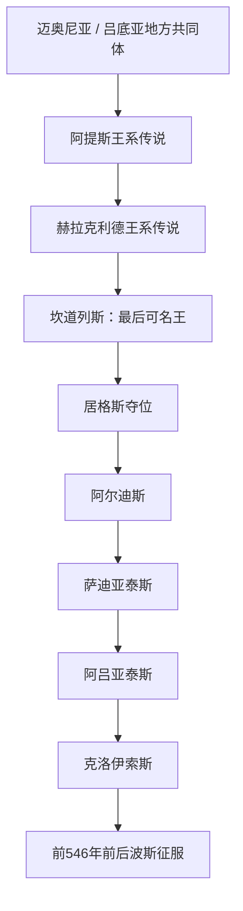

# 吕底亚王国

## 时间

约前7世纪—前546年；更早的王朝传统年代不详

## 概括

吕底亚以安纳托利亚西部的萨第斯为中心，凭帕克托洛斯河含金沉积、农业腹地和通往爱琴海的道路成长为区域强国。可靠政治史主要从前7世纪的梅尔姆纳德王朝开始：居格斯夺位后，其五位国王连续扩张，阿吕亚泰斯稳定西部安纳托利亚，克洛伊索斯控制多数爱奥尼亚和埃奥利亚希腊城市。吕底亚—爱奥尼亚地区出现世界最早一批标准化琥珀金属铸币，克洛伊索斯时期又建立较稳定的金、银币制。前546年前后，居鲁士二世攻取萨第斯，王国直接终结并纳入阿契美尼德帝国。

## 演进图

## 建立背景与崛起机制

萨第斯位于赫尔穆斯河谷与内陆高原、爱琴海岸之间，既能控制农业与牧业腹地，也能向士麦那、以弗所、米利都等港口施加影响。王室从帕克托洛斯河和矿产贸易获得贵金属，通过贡赋、雇佣军、王室赠礼与铸币扩大动员能力。吕底亚并非把沿海希腊城邦全部改造成直接行省；更常见的做法是迫使城市纳贡、接受政治约束，同时保留其市民制度和贸易网络。

## 王朝传统与公认可复原王表

希罗多德称吕底亚先后由阿提斯王系、赫拉克利德王系和梅尔姆纳德王朝统治，并说赫拉克利德有22代、统治约505年。但除传说中的始祖及末王外，中间王名无法可靠恢复。为避免制造虚假连续性，表中把传说王系和能够由希腊、亚述、巴比伦及考古材料互证的五位梅尔姆纳德国王分开。

| 层级 / 顺序 | 统治者 | 约在位时间 | 继承关系 | 关键事件 / 史料状态 |
|---|---|---|---|---|
| 传说王系 | 马涅斯、阿提斯、吕多斯等 | 不详 | 古典作者构造的祖先链 | 用来解释“吕底亚”名称与族源，不是可核年的王表。 |
| 赫拉克利德始祖 | 阿格戎 | 不详 | 传说为赫拉克勒斯后裔 | 据称开启22代王系；中间世系缺失。 |
| 赫拉克利德末王 | 坎道列斯（又称米尔西洛斯） | 约前8世纪末—前680年前后 | 前代关系不详 | 被近卫居格斯推翻；宫廷故事有浓厚文学加工。 |
| 1 | **居格斯** | 约前680—前644年 | 篡夺坎道列斯王位，开创梅尔姆纳德王朝 | 向亚述求援抗击辛梅里安，后调整联盟；进攻爱奥尼亚城市，最终战死于辛梅里安入侵。 |
| 2 | 阿尔迪斯 | 约前644—前625年 | 居格斯之子 | 继续进攻米利都；辛梅里安人一度进入萨第斯下城。 |
| 3 | 萨迪亚泰斯 | 约前625—前600年 | 阿尔迪斯之子 | 延续对米利都战争；具体起止年在不同推算中有差异。 |
| 4 | **阿吕亚泰斯** | 约前600—前560年 | 萨迪亚泰斯之子 | 击败或驱逐辛梅里安势力，与米利都议和；前585年与米底战争以日食和约收束。 |
| 5 | **克洛伊索斯** | 约前560—前546年 | 阿吕亚泰斯之子 | 控制哈吕斯河以西大部安纳托利亚和沿海希腊城；改革金银币，后败于居鲁士二世。 |

五位梅尔姆纳德国王构成现阶段可公认连续复原的完整历史王表。阿尔迪斯、萨迪亚泰斯及阿吕亚泰斯的精确年份因如何换算希罗多德给出的在位年数而不同，故均用“约”。

## 统治结构与经济

| 要素 | 机制 |
|---|---|
| 王权与贵族 | 国王依靠萨第斯宫廷、骑兵贵族和地方精英；居格斯夺位显示王位仍需军队、贵族与宗教认可。 |
| 沿海城市 | 希腊城邦多以纳贡、军事服从或联盟形式受控，内部议会和商业活动通常保留。 |
| 财政与铸币 | 王室掌握金银资源和贡赋；约前7世纪后期吕底亚—爱奥尼亚出现盖印琥珀金币，克洛伊索斯时期推广分开的纯金、纯银币。 |
| 军事 | 以骑兵、步兵和雇佣兵结合；萨第斯卫城与河谷构成防御核心。 |
| 宗教与文化 | 安纳托利亚神祇与希腊神祇相互对应，王室通过德尔斐等圣所的贵重献礼开展跨区域外交。 |

“吕底亚人发明货币”是常见概括，更准确的说法是：最早标准化铸币在前7世纪的吕底亚—爱奥尼亚经济圈出现，具体由王室还是城市首先发行仍有讨论。

## 重要事件

- 前7世纪初，居格斯推翻坎道列斯，梅尔姆纳德王朝开始；德尔斐神谕与献礼在后世叙事中为新王朝提供合法性。
- 居格斯进攻科洛丰、士麦那和米利都等希腊城市，并在亚述与埃及之间调整关系。
- 约前644年，辛梅里安入侵造成居格斯战死，萨第斯下城受劫，卫城仍守住。
- 阿尔迪斯、萨迪亚泰斯连续围攻米利都及其农田，显示王国向爱琴海岸扩张，但未轻易摧毁海上强城。
- 阿吕亚泰斯与米利都缔约，并在前7世纪末削弱辛梅里安威胁，吕底亚由生存危机转入扩张。
- 约前585年，吕底亚与米底在哈吕斯河交战，日食被后世记作停战契机；双方以王室婚姻和边界协议结束战争。
- 前7—6世纪，琥珀金属铸币逐渐标准化；克洛伊索斯时期的狮牛纹金、银币提高税收、军饷和远距离支付的可计量性。
- 克洛伊索斯征服或迫使多数爱奥尼亚、埃奥利亚城市纳贡，并以巨额祭献经营泛希腊外交。
- 约前547／546年，克洛伊索斯越过哈吕斯河进攻波斯势力，在普特里亚战局未决后退回萨第斯。
- 居鲁士二世迅速追击，在廷布拉附近击败吕底亚军并围取萨第斯；克洛伊索斯此后结局在古典传统中有不同版本。
- 波斯以萨第斯为行省中心，保留其交通与财政地位；吕底亚王国灭亡，但城市和语言文化并未立刻消失。

## 鼎盛条件

阿吕亚泰斯和克洛伊索斯时期的强盛建立在萨第斯交通位置、贵金属资源、骑兵动员、对沿海商业城市的贡赋控制，以及对辛梅里安威胁的缓解之上。标准化铸币不是单独的“致富原因”，而是王室资源、市场交换和军费体系成熟后的工具。

## 衰落与直接灭亡

- **结构因素**：国力高度集中于王室、萨第斯和西部交通网；沿海城市的服从需要持续军事威慑。
- **外部压力**：阿契美尼德波斯击败米底后，立即继承并扩大了吕底亚东部原有的战略竞争面。
- **决策与触发**：克洛伊索斯主动越过哈吕斯河，未能在冬季前摧毁波斯军，又在解散部分盟军后遭居鲁士快速追击。
- **直接过程**：廷布拉败战后，波斯围取萨第斯，俘获或控制克洛伊索斯，废除独立王权。灭亡并非长期“奢侈腐化”的必然结果，而是一个强盛王国在战略误判后遭遇更大军事—政治体系的迅速吞并。

## 演变关系

- 中部邻国：[弗里吉亚王国](/%E4%BA%BA%E6%96%87%E7%A7%91%E5%AD%A6/%E5%8E%86%E5%8F%B2/%E8%A5%BF%E4%BA%9A/%E5%9C%9F%E8%80%B3%E5%85%B6/%E5%AE%89%E7%BA%B3%E6%89%98%E5%88%A9%E4%BA%9A%E5%8F%A4%E4%BB%A3%E6%96%87%E6%98%8E/%E5%BC%97%E9%87%8C%E5%90%89%E4%BA%9A%E7%8E%8B%E5%9B%BD.md)后期受到吕底亚控制。
- 吕底亚被[阿契美尼德王朝](/%E4%BA%BA%E6%96%87%E7%A7%91%E5%AD%A6/%E5%8E%86%E5%8F%B2/%E8%A5%BF%E4%BA%9A/%E4%BC%8A%E6%9C%97/%E9%98%BF%E5%A5%91%E7%BE%8E%E5%B0%BC%E5%BE%B7%E7%8E%8B%E6%9C%9D.md)吞并后，区域主线接入[希腊化、罗马与拜占庭安纳托利亚](/%E4%BA%BA%E6%96%87%E7%A7%91%E5%AD%A6/%E5%8E%86%E5%8F%B2/%E8%A5%BF%E4%BA%9A/%E5%9C%9F%E8%80%B3%E5%85%B6/%E5%B8%8C%E8%85%8A%E5%8C%96%E3%80%81%E7%BD%97%E9%A9%AC%E4%B8%8E%E6%8B%9C%E5%8D%A0%E5%BA%AD%E5%AE%89%E7%BA%B3%E6%89%98%E5%88%A9%E4%BA%9A.md)。
- 地区入口：[安纳托利亚古代文明](/%E4%BA%BA%E6%96%87%E7%A7%91%E5%AD%A6/%E5%8E%86%E5%8F%B2/%E8%A5%BF%E4%BA%9A/%E5%9C%9F%E8%80%B3%E5%85%B6/%E5%AE%89%E7%BA%B3%E6%89%98%E5%88%A9%E4%BA%9A%E5%8F%A4%E4%BB%A3%E6%96%87%E6%98%8E/README.md)。
