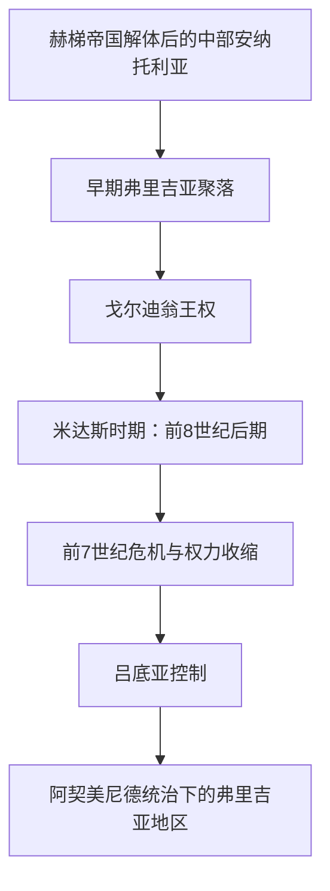

# 弗里吉亚王国

## 时间

约前12世纪出现于安纳托利亚；王国约前10／9世纪—前7世纪，独立政治中心最迟在前6世纪初被吕底亚吸收

## 概括

弗里吉亚人使用印欧语系语言，其物质文化在赫梯帝国崩溃后的中部安纳托利亚逐渐形成，首都戈尔迪翁位于连接爱琴海、黑海与安纳托利亚高原的道路上。前8世纪后期的米达斯是唯一能由同时代亚述文献明确确认并较完整重建活动的弗里吉亚国王。希腊传说保存了戈尔迪俄斯、点金术和戈尔迪之结等故事，但这些故事不能直接当作连续王表。王国在辛梅里安压力与区域权力重组中衰弱，后来归入吕底亚和阿契美尼德帝国；弗里吉亚语言与地方文化则延续得更久。

## 演进图

## 形成与崛起

赫梯帝国约前12世纪初解体后，戈尔迪翁出现带有东南欧联系的手制陶器，但人口迁徙的规模、时间和与当地居民的融合仍在讨论中。约前10—9世纪，戈尔迪翁修筑大型城门、宫殿式“梅加隆”建筑和仓储设施，显示统治者已能集中粮食、工匠和劳役。农牧产品、木材、纺织与金属工艺，加上横贯高原的贸易路线，为王权提供资源。希腊人称其为弗里吉亚，亚述文献则把米达斯称为“穆什基的米塔”；两种名称是否在所有时期指同一政治共同体，需要结合语境判断。

## 可证实统治者与争议王表

现存材料不足以恢复一份“全部君主按年连续排列”的弗里吉亚王表。下表把同时代可证人物、考古推断和后世传说分开，缺失处明确标示，不以“戈尔迪俄斯—米达斯交替”传说填补未知年代。

| 顺序 / 身份 | 名称 | 约年代 | 证据与继承关系 | 说明 |
|---|---|---|---|---|
| 传说中的奠基者 | 戈尔迪俄斯（Gordios） | 年代不详；常被置于米达斯之前 | 希腊、罗马时代传说称其为米达斯之父或王朝建立者 | 牛车预言与戈尔迪之结属于后世叙事，无法证明具体在位年。 |
| 考古推定的前任 | “MM号大冢墓主” | 木材约伐于前740年前后 | 豪华葬礼显示其为米达斯之前的高级统治者；常推测为戈尔迪俄斯 | 身份没有铭文确认，不能把推测写作定论。 |
| 1 | **米达斯／米塔** | 约前740年起，至少在前717—前709年间在位 | 希腊传统称戈尔迪俄斯之子；亚述萨尔贡二世档案同时代可证 | 联络安纳托利亚与叙利亚诸国，后向亚述求和；与希腊世界有外交和祭献联系。 |
| 争议同名者 | “前670年代的米塔” | 前7世纪上半叶 | 一份较晚亚述文本出现“穆什基的米塔” | 可能是另一位同名统治者、旧称沿用或文本年代问题，无法确定为米达斯的直接继承人。 |
| 王表缺口 | 姓名不详的弗里吉亚统治者 | 前7—前6世纪初 | 聚落、铭文与地方文化显示政治社会继续存在 | 继承顺序不可恢复；希腊文献所谓戈尔迪俄斯与米达斯反复出现，可能是王名、王朝记忆或文学模式。 |

因此，米达斯是“公认可证统治者表”中唯一年代相对稳固的国王；这不是王国只有一位君主，而是其他君主姓名和次序没有被可靠保存。

## 统治结构与社会

戈尔迪翁城堡区集中宫殿、粮仓、纺织和宴饮空间，周围大型墓冢反映王族与精英等级。王权可能通过土地、粮食再分配和控制长途交通维系贵族、武士及工匠。木器镶嵌、青铜器、纺织品和几何陶器显示高度专业化；弗里吉亚字母与希腊字母关系密切，但传播方向和具体形成过程仍有争议。女神玛塔尔／库柏勒崇拜、岩石纪念物和音乐传统后来深刻影响希腊、罗马世界。

## 重要事件

- 约前12—10世纪，戈尔迪翁出现新的手制陶器和聚落形态，弗里吉亚文化逐步形成，而不是在赫梯灭亡后立即建立统一王国。
- 约前10—9世纪，戈尔迪翁扩建为设防都城，宫殿、仓储和工匠区显示中央集聚能力。
- 戈尔迪翁早期城堡曾在约前800年前后遭大火毁坏。树轮和放射性测年把它前移到米达斯之前，不能再简单解释为前7世纪辛梅里安攻城。
- 约前740年前后，MM号大冢墓建成；其丰富木器、青铜器和宴饮器具反映王权财富，但墓主并非已获证实的米达斯。
- 前717—前709年，亚述档案多次提及“穆什基的米塔”。他先联络亚述西北附庸，遭军事压力后向萨尔贡二世送礼并改善关系。
- 希腊传统称米达斯向德尔斐献王座并与爱奥尼亚城市库迈联姻；这些记载显示后世记忆中的跨爱琴海联系，细节仍需谨慎。
- 前7世纪，辛梅里安人的活动冲击安纳托利亚诸国。传统把米达斯之死和戈尔迪翁毁灭直接相连，但新年代学不支持把已发掘大火层归于该事件。
- 前7世纪后期至前6世纪初，吕底亚向中部安纳托利亚扩张，弗里吉亚失去独立王国地位。
- 前546年前后，居鲁士二世征服吕底亚，弗里吉亚地区纳入阿契美尼德帝国；地方语言、墓葬和宗教传统仍延续。
- 前333年，亚历山大在戈尔迪翁处理“戈尔迪之结”的故事成为王权合法性传说，但不属于独立弗里吉亚王国史。

## 兴盛条件

弗里吉亚王权利用中部高原的谷物、畜牧、木材与道路网络，集聚工匠和贡赋。戈尔迪翁的防御、仓储与礼仪宴饮把物质资源转化为政治威望；与亚述、叙利亚和希腊世界的双向交往，也使米达斯能够在强国之间周旋。

## 衰落与终结

- **结构因素**：政权依赖戈尔迪翁及少数交通中心，现存证据看不出像亚述那样成熟的行省体系；王表断裂也反映文书保存有限。
- **外部压力**：辛梅里安迁徙和袭击扰乱高原，亚述、乌拉尔图、吕底亚等强权又不断重组区域联盟。
- **直接过程**：前7世纪弗里吉亚政治权力收缩，吕底亚最终控制中部安纳托利亚。没有可靠材料能给出“末代国王、末战和精确灭亡年”，故应写作逐步丧失独立，而不是由某一场已知战役突然灭亡。
- **文化延续**：吕底亚、波斯乃至希腊化时期仍存在弗里吉亚地区认同、语言与宗教传统，政治终结不等于人口消失。

## 演变关系

- 前一背景：[赫梯帝国](/%E4%BA%BA%E6%96%87%E7%A7%91%E5%AD%A6/%E5%8E%86%E5%8F%B2/%E8%A5%BF%E4%BA%9A/%E5%9C%9F%E8%80%B3%E5%85%B6/%E5%AE%89%E7%BA%B3%E6%89%98%E5%88%A9%E4%BA%9A%E5%8F%A4%E4%BB%A3%E6%96%87%E6%98%8E/%E8%B5%AB%E6%A2%AF%E5%B8%9D%E5%9B%BD.md)解体后的中部安纳托利亚。
- 后续宗主权：[吕底亚王国](/%E4%BA%BA%E6%96%87%E7%A7%91%E5%AD%A6/%E5%8E%86%E5%8F%B2/%E8%A5%BF%E4%BA%9A/%E5%9C%9F%E8%80%B3%E5%85%B6/%E5%AE%89%E7%BA%B3%E6%89%98%E5%88%A9%E4%BA%9A%E5%8F%A4%E4%BB%A3%E6%96%87%E6%98%8E/%E5%90%95%E5%BA%95%E4%BA%9A%E7%8E%8B%E5%9B%BD.md)，再进入[希腊化、罗马与拜占庭安纳托利亚](/%E4%BA%BA%E6%96%87%E7%A7%91%E5%AD%A6/%E5%8E%86%E5%8F%B2/%E8%A5%BF%E4%BA%9A/%E5%9C%9F%E8%80%B3%E5%85%B6/%E5%B8%8C%E8%85%8A%E5%8C%96%E3%80%81%E7%BD%97%E9%A9%AC%E4%B8%8E%E6%8B%9C%E5%8D%A0%E5%BA%AD%E5%AE%89%E7%BA%B3%E6%89%98%E5%88%A9%E4%BA%9A.md)所述的波斯与希腊化阶段。
- 地区入口：[安纳托利亚古代文明](/%E4%BA%BA%E6%96%87%E7%A7%91%E5%AD%A6/%E5%8E%86%E5%8F%B2/%E8%A5%BF%E4%BA%9A/%E5%9C%9F%E8%80%B3%E5%85%B6/%E5%AE%89%E7%BA%B3%E6%89%98%E5%88%A9%E4%BA%9A%E5%8F%A4%E4%BB%A3%E6%96%87%E6%98%8E/README.md)。
