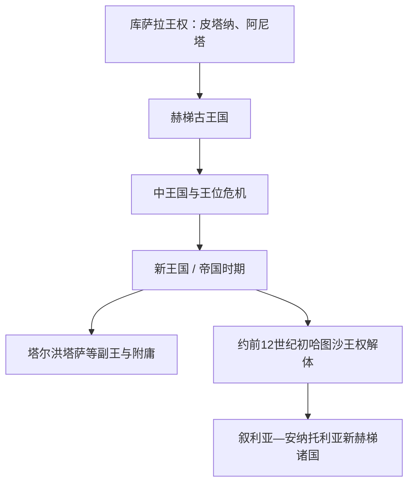

# 赫梯帝国

## 时间

约前17世纪—前12世纪初（约前1650—前1180年；绝对年代存在不同方案）

## 概括

赫梯国家以安纳托利亚中部的哈图沙为中心，由库萨拉一带的早期王权整合哈梯、卢维、帕莱、胡里等不同语言与文化群体而成。它先在古王国时期建立跨安纳托利亚的军事王权，后在前14—13世纪扩张为与埃及、米坦尼、亚述并立的近东强国。赫梯并非单一民族国家：宫廷行政使用赫梯语和阿卡德语，宗教大量吸收哈梯、胡里与叙利亚传统，地方则由王族、总督和附庸国分层治理。

## 演进图

库萨拉的皮塔纳、阿尼塔是赫梯王权的前驱，但通常不列入以哈图沙为中心的赫梯大王世系；新赫梯诸国继承部分王族、象形文字和政治文化，也不是哈图沙帝国的统一延续。

## 建立背景与崛起机制

前20—18世纪的亚述商站网络把安纳托利亚铜、银、纺织品与两河贸易连接起来，也留下大量楔形文字档案。库萨拉王阿尼塔曾攻占并诅咒哈图沙；后来哈图西里一世反而以该城为都，利用安纳托利亚高原道路向西、向东南扩张。赫梯崛起依靠战车和步兵动员、对交通节点的控制、王族分封与附庸条约，以及能够用多种书写语言处理外交和税役的宫廷文书系统。

## 哈图沙大王世系

下表按常见“中年表”附近的方案排列。赫梯年代主要依赖与巴比伦、埃及、亚述的同步事件；拉巴尔纳与哈图西里一世是否可能为同一人、塔胡尔瓦伊利的位置、图特哈里一世与二世的编号，以及中王国若干君主的先后均有争议，故日期均应理解为约数。

| 顺序 | 大王 | 约在位时间 | 与前任关系 | 关键事件 / 争议 |
|---:|---|---|---|---|
| 1 | 拉巴尔纳一世 | 约前1680—前1650年 | 王朝奠基者；关系不详 | 主要由后世文献追述；“拉巴尔纳”后来也成为王号，其是否与哈图西里一世为同一人存在争议。 |
| 2 | **哈图西里一世** | 约前1650—前1620年 | 可能为拉巴尔纳的继承人或同一人物 | 定都哈图沙，向北叙利亚远征；留下编年史和继承遗嘱。 |
| 3 | **穆尔西里一世** | 约前1620—前1590年 | 哈图西里一世之孙或养孙 | 攻取阿勒颇并远征巴比伦；归国后被政变杀害。 |
| 4 | 汉提里一世 | 约前1590—前1560年 | 穆尔西里一世姻亲、弑君集团成员 | 王位暴力继承延续，边疆控制收缩。 |
| 5 | 齐丹塔一世 | 约前1560—前1550年 | 汉提里一世女婿 | 参与前次政变，后被其子阿穆纳所杀。 |
| 6 | 阿穆纳 | 约前1550—前1530年 | 齐丹塔一世之子 | 多地叛离，中央权威继续削弱。 |
| 7 | 胡齐亚一世 | 约前1530—前1525年 | 关系有争议 | 企图清除姻亲，被泰利皮努废黜。 |
| 8 | **泰利皮努** | 约前1525—前1500年 | 胡齐亚一世姻亲 | 颁布《泰利皮努诏令》，追述王朝并试图规范继承、遏制宫廷杀戮。 |
| 9 | 阿卢瓦姆纳 | 约前1500—前1490年 | 泰利皮努女婿 | 史料稀少，可能曾被流放后即位。 |
| 10 | 塔胡尔瓦伊利 | 约前15世纪末 | 与王室有亲缘 | 印章和文献可证，但应置于阿卢瓦姆纳之前还是之后存在争议。 |
| 11 | 汉提里二世 | 约前1490—前1480年 | 关系不详 | 与基祖瓦特纳等邻国互动，具体年代不明。 |
| 12 | 齐丹塔二世 | 约前1480—前1470年 | 可能为汉提里二世继承人 | 与基祖瓦特纳订约。 |
| 13 | 胡齐亚二世 | 约前1470—前1460年 | 关系不详 | 在宫廷政变中被穆瓦塔里一世取代。 |
| 14 | 穆瓦塔里一世 | 约前1460—前1430年 | 可能为侍卫首领 | 被宫廷集团杀害，中王国末期再现继承危机。 |
| 15 | 图特哈里一世／二世 | 约前1430—前1400年 | 新王系奠基者 | 有的编年体系拆分为两位君主，有的视为一人；向西部和叙利亚恢复势力。 |
| 16 | 阿尔努万达一世 | 约前1400—前1380年 | 图特哈里一世／二世女婿或子 | 面对卡斯卡人和西部联盟压力，强化条约与边疆治理。 |
| 17 | 图特哈里三世 | 约前1380—前1350年 | 阿尔努万达一世之子 | 遭遇多线入侵，帝国一度退缩到核心区。 |
| — | “小图特哈里” | 约前1350年，极短 | 图特哈里三世之子 | 可能已即位，也可能仅为王储；被苏庇路里乌玛一世集团清除。 |
| 18 | **苏庇路里乌玛一世** | 约前1350—前1322年 | 图特哈里三世之子 | 击败米坦尼、控制叙利亚，设置卡尔基米什等王族副王国；死于战争带回的瘟疫。 |
| 19 | 阿尔努万达二世 | 约前1322—前1321年 | 苏庇路里乌玛一世之子 | 在瘟疫中早逝。 |
| 20 | **穆尔西里二世** | 约前1321—前1295年 | 阿尔努万达二世之弟 | 镇压安纳托利亚叛乱、重建西部和叙利亚附庸体系；留下十年编年史与瘟疫祈祷文。 |
| 21 | 穆瓦塔里二世 | 约前1295—前1272年 | 穆尔西里二世之子 | 迁王庭至塔尔洪塔萨；前1274年前后在卡迭石与拉美西斯二世交战。 |
| 22 | 穆尔西里三世（乌尔希—泰舒普） | 约前1272—前1267年 | 穆瓦塔里二世之子 | 与叔父哈图西里争权，被废并流亡。 |
| 23 | **哈图西里三世** | 约前1267—前1237年 | 穆尔西里三世之叔 | 通过《申辩书》为夺位辩护；与埃及缔结和平条约并联姻。 |
| 24 | 图特哈里四世 | 约前1237—前1209年 | 哈图西里三世之子 | 重整宗教与附庸体系；与亚述竞争，塔尔洪塔萨王库伦塔曾形成有争议的并立权力。 |
| 25 | 阿尔努万达三世 | 约前1209—前1207年 | 图特哈里四世之子 | 在位很短，资料稀少。 |
| 26 | **苏庇路里乌玛二世** | 约前1207—前1180年 | 阿尔努万达三世之弟 | 最后一位可确认的哈图沙大王；镇压阿拉西亚方向的海上敌对力量，帝国随后解体。 |

## 统治结构

| 层级 | 作用 |
|---|---|
| 大王（拉巴尔纳） | 最高军事、司法和祭祀权威，以“我的太阳”自称；亲自维系主要附庸关系。 |
| 大王后（塔瓦南纳） | 具有独立祭祀、地产和宫廷地位，前王遗孀在新王即位后仍可能保有头衔。 |
| 王族副王与总督 | 卡尔基米什、阿勒颇、塔尔洪塔萨等战略区由王族长期治理，兼顾边防与地方协调。 |
| 附庸王 | 以条约承担贡赋、军援和不得另结外交等义务；大王承诺保护其王位。 |
| 宫廷官僚与书吏 | 管理仓储、土地、劳役、司法和多语种外交档案；阿卡德语常用于国际通信。 |
| 城邦与乡村共同体 | 提供粮食、兵员和劳役；不同地区保留地方神祇、语言和精英。 |

早期文献中的潘库斯会议可能对王族案件有一定作用，但不能简单等同于现代议会。赫梯军队以王室亲兵、征集步兵、战车部队和附庸军组成；铁器并非其压倒性优势，青铜武器在帝国时期仍占主流。

## 重要事件

- 约前1650年后，哈图西里一世以哈图沙为都，连续向安纳托利亚和北叙利亚用兵。
- 约前1595年，穆尔西里一世攻取巴比伦，终结古巴比伦第一王朝；远征收益未转化为持续占领。
- 约前1525—前1500年，泰利皮努以诏令整理王位继承原则，反映此前连续弑君与政变。
- 前14世纪，苏庇路里乌玛一世瓦解米坦尼在叙利亚的势力，把卡尔基米什、阿勒颇交给王子治理。
- 苏庇路里乌玛晚年起的瘟疫延续多代，削弱人口、宫廷与军队；穆尔西里二世留下相关祈祷文。
- 约前1274年，穆瓦塔里二世与埃及拉美西斯二世在卡迭石交战，双方都宣称胜利，实际形成势力均衡。
- 约前1259年，哈图西里三世与拉美西斯二世缔结现存最著名的古代近东和平条约之一，随后通过王室婚姻巩固关系。
- 前13世纪后期，图特哈里四世与亚述争夺叙利亚和幼发拉底上游，尼赫里亚失败暴露东部压力。
- 约前12世纪初，哈图沙宫廷和档案系统终止，首都在被彻底废弃前已有部分设施撤空；卡尔基米什等王族政权继续存在。

## 鼎盛条件

赫梯强盛来自安纳托利亚交通枢纽位置、能够吸收多族群精英的复合王权、战车与附庸军的联合动员，以及以条约、婚姻和人质维系的国际体系。苏庇路里乌玛一世以后，卡尔基米什副王承担叙利亚日常治理，使哈图沙能在不直接占领每个城市的情况下获取贡赋与战略纵深。

## 衰落与直接解体

- **结构因素**：王位争夺和王族支系竞争削弱中央；远距离附庸体系依赖持续军事威慑，首都又需要从外地调粮。
- **社会与环境压力**：长期瘟疫、局部旱情和人口流动可能降低税粮与兵员，但不同地区受影响不一。
- **外部压力**：亚述在东南扩张，卡斯卡与西部势力持续袭扰，东地中海贸易和宫廷网络也在前12世纪初断裂。
- **直接过程**：苏庇路里乌玛二世之后不再见哈图沙大王档案，首都约在前1190—前1180年前后被放弃并发生破坏。现有证据不能把帝国灭亡完全归因于一次“海上民族入侵”；更可能是宫廷财政、粮食供应、内战与多方向冲突叠加，使统一王权先行瓦解。

## 演变关系

- 地区入口：[安纳托利亚古代文明](/%E4%BA%BA%E6%96%87%E7%A7%91%E5%AD%A6/%E5%8E%86%E5%8F%B2/%E8%A5%BF%E4%BA%9A/%E5%9C%9F%E8%80%B3%E5%85%B6/%E5%AE%89%E7%BA%B3%E6%89%98%E5%88%A9%E4%BA%9A%E5%8F%A4%E4%BB%A3%E6%96%87%E6%98%8E/README.md)。
- 哈图沙帝国解体后，中部安纳托利亚逐步出现[弗里吉亚王国](/%E4%BA%BA%E6%96%87%E7%A7%91%E5%AD%A6/%E5%8E%86%E5%8F%B2/%E8%A5%BF%E4%BA%9A/%E5%9C%9F%E8%80%B3%E5%85%B6/%E5%AE%89%E7%BA%B3%E6%89%98%E5%88%A9%E4%BA%9A%E5%8F%A4%E4%BB%A3%E6%96%87%E6%98%8E/%E5%BC%97%E9%87%8C%E5%90%89%E4%BA%9A%E7%8E%8B%E5%9B%BD.md)等新政治中心；东部后续见[乌拉尔图王国](/%E4%BA%BA%E6%96%87%E7%A7%91%E5%AD%A6/%E5%8E%86%E5%8F%B2/%E8%A5%BF%E4%BA%9A/%E5%9C%9F%E8%80%B3%E5%85%B6/%E5%AE%89%E7%BA%B3%E6%89%98%E5%88%A9%E4%BA%9A%E5%8F%A4%E4%BB%A3%E6%96%87%E6%98%8E/%E4%B9%8C%E6%8B%89%E5%B0%94%E5%9B%BE%E7%8E%8B%E5%9B%BD.md)。
