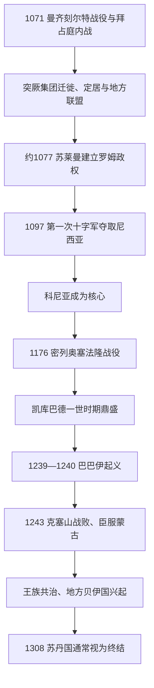

# 安纳托利亚突厥化与罗姆苏丹国

## 时间

11世纪中叶—14世纪初

## 概括

塞尔柱及其他突厥集团在11世纪进入安纳托利亚，1071年曼齐刻尔特战役和其后的拜占庭内战加快定居。罗姆苏丹国以尼西亚、后以科尼亚为中心，把波斯—伊斯兰官僚传统、突厥军事集团和安纳托利亚城市经济结合。13世纪初在凯库巴德一世时达到高峰；1243年败于蒙古后成为伊儿汗附庸，王族共治和地方军阀削弱中央，最终分裂为多个贝伊国。

## 形成与突厥化过程

突厥化不是一场战役造成的全境人口替换。游牧部族沿高原牧道迁徙，塞尔柱王族建立城市国家，地方希腊人、亚美尼亚人和叙利亚人继续耕作和经商。突厥语通过军队、牧民和地方政权扩散；伊斯兰化则受清真寺、苏菲团体、城市行会、通婚和政治身份影响。沿海和西部长期存在拜占庭或拉丁政权，安纳托利亚内部也有达尼什曼德、门居切克、萨尔图克等突厥王朝。

## 罗姆苏丹世系

下表列出通常承认的17位苏丹；同一人的复位合并在一行。1086—1092年和1107—1110年的中央权力中断、13世纪后期蒙古册立造成的并立与空位均单列说明。

| 顺序 | 苏丹 | 在位时间 | 与前任关系 | 关键事件 / 备注 |
|---:|---|---|---|---|
| 1 | **苏莱曼·本·库塔尔米什** | 约1077—1086年 | 塞尔柱宗室、奠基者 | 以尼西亚为中心建立罗姆政权，死于与叙利亚塞尔柱冲突。 |
| — | 阿布·卡西姆等摄政 / 争位 | 1086—1092年 | 苏莱曼部将及地方统治者 | 苏莱曼诸子受大塞尔柱控制；尼西亚维持地方政权，是否有正式苏丹有争议。 |
| 2 | **基利杰·阿尔斯兰一世** | 1092—1107年 | 苏莱曼之子 | 第一次十字军夺取尼西亚后转向科尼亚，进攻摩苏尔途中战死。 |
| — | 权力中断与王子受制 | 1107—1110年 | 基利杰·阿尔斯兰一世诸子 | 王子被大塞尔柱与地方势力控制，罗姆中央王权一度中断。 |
| 3 | 马立克沙 | 1110—1116年 | 基利杰·阿尔斯兰一世之子 | 与弟马苏德争位，被废并被杀。 |
| 4 | 马苏德一世 | 1116—1156年 | 马立克沙之弟 | 借达尼什曼德支持即位，后扩大自主权并巩固科尼亚。 |
| 5 | **基利杰·阿尔斯兰二世** | 1156—1192年 | 马苏德一世之子 | 1176年密列奥塞法隆取胜；晚年把领地分给诸子，导致内争。 |
| 6 | 凯霍斯鲁一世 | 1192—1196年；1205—1211年 | 基利杰·阿尔斯兰二世之子 | 两次在位；夺取安塔利亚，后与尼西亚帝国作战时阵亡。 |
| 7 | 苏莱曼沙二世 | 1196—1204年 | 凯霍斯鲁一世之兄 | 击败兄弟并恢复中央控制，向东扩张。 |
| 8 | 基利杰·阿尔斯兰三世 | 1204—1205年 | 苏莱曼沙二世之子 | 幼年即位，被叔父凯霍斯鲁一世废黜。 |
| 9 | 凯卡乌斯一世 | 1211—1220年 | 凯霍斯鲁一世之子 | 控制锡诺普，拓展黑海与地中海贸易。 |
| 10 | **凯库巴德一世** | 1220—1237年 | 凯卡乌斯一世之弟 | 苏丹国鼎盛；建商队驿站、城防，控制阿兰亚并扩张东部。 |
| 11 | 凯霍斯鲁二世 | 1237—1246年 | 凯库巴德一世之子 | 巴巴伊起义削弱统治；1243年克塞山败于蒙古。 |
| 12 | 凯卡乌斯二世 | 1246—1262年 | 凯霍斯鲁二世之子 | 与兄弟分区共治并争权，后流亡拜占庭。 |
| 13 | 基利杰·阿尔斯兰四世 | 1248—1265年 | 凯卡乌斯二世之弟 | 获蒙古支持参与共治，后被权臣处死。 |
| 14 | 凯库巴德二世 | 1249—1257年 | 凯卡乌斯二世、基利杰·阿尔斯兰四世之弟 | 名义共治，早逝；三兄弟具体共治年份存在差异。 |
| 15 | 凯霍斯鲁三世 | 1265—1284年 | 基利杰·阿尔斯兰四世之子 | 幼年傀儡，实权多在佩尔瓦内与蒙古统治者。 |
| 16 | 马苏德二世 | 1284—1296年；1302—1308年 | 凯卡乌斯二世之子 | 伊儿汗册立，权力仅及部分地区；两次在位。 |
| — | 王位空缺 / 地方竞争 | 1296—1298年 | — | 不同年代学对是否有短期册立者意见不一。 |
| 17 | 凯库巴德三世 | 1298—1302年 | 基利杰·阿尔斯兰四世支系 | 伊儿汗控制下的名义苏丹，被废。 |

1308年马苏德二世去世通常被视为罗姆苏丹国终结。末期是否另有短暂“马苏德三世”、若干册立的具体年份及三兄弟共治范围在不同史料中存在争议，故不把争议人物强行编号为公认苏丹。

## 统治结构与经济

苏丹依靠波斯语文书官僚、突厥军事领主和伊克塔税收分配治理。城市卡迪、商人和工匠维持市场秩序；驿站网络保护从伊朗高原、叙利亚通往黑海与地中海港口的商路。苏丹与拜占庭、亚美尼亚、格鲁吉亚和十字军政权既战争也通商。宫廷文化广泛使用波斯语，乡村和军队中突厥语扩散，希腊语、亚美尼亚语等继续存在。

## 重要事件

- 1071年曼齐刻尔特战役后拜占庭内战，突厥集团进入中西部。
- 1077—1081年前后苏莱曼在尼西亚建立政权，“罗姆”指其占据原罗马 / 拜占庭地域。
- 1097年第一次十字军攻取尼西亚，基利杰·阿尔斯兰一世转移政治中心。
- 1176年密列奥塞法隆战役后，拜占庭难以恢复中部高原控制。
- 1207年夺取安塔利亚、1214年夺取锡诺普，使苏丹国获得两海港口。
- 1220—1237年凯库巴德一世发展商路、城防和港口，兼并部分东部领地。
- 1239—1240年巴巴伊起义反映游牧群体、宗教领袖与中央税役冲突。
- 1243年克塞山战役败于蒙古，苏丹国成为伊儿汗附庸。
- 1277年马穆鲁克苏丹拜巴尔斯一度进入安纳托利亚，但未能长期解除蒙古控制。
- 13世纪末卡拉曼、格尔米扬、奥斯曼等贝伊国崛起；后续见[奥斯曼帝国](/%E4%BA%BA%E6%96%87%E7%A7%91%E5%AD%A6/%E5%8E%86%E5%8F%B2/%E8%A5%BF%E4%BA%9A/%E5%9C%9F%E8%80%B3%E5%85%B6/%E5%A5%A5%E6%96%AF%E6%9B%BC%E5%B8%9D%E5%9B%BD/README.md)。

## 兴盛与瓦解原因

苏丹国兴盛依靠安纳托利亚高原的交通位置、港口税收、对多族群城市的务实治理和强势苏丹的军事整合。衰落来自王子分封和继承争斗、巴巴伊起义造成的社会军事消耗，以及蒙古军事优势。1243年后伊儿汗征税和册立制度使苏丹成为附庸，地方贝伊掌握真实军力。蒙古控制松动时，统一苏丹国已无足够财政与军队恢复。

## 演进图

## 演变关系

- 前一阶段：[希腊化、罗马与拜占庭安纳托利亚](/%E4%BA%BA%E6%96%87%E7%A7%91%E5%AD%A6/%E5%8E%86%E5%8F%B2/%E8%A5%BF%E4%BA%9A/%E5%9C%9F%E8%80%B3%E5%85%B6/%E5%B8%8C%E8%85%8A%E5%8C%96%E3%80%81%E7%BD%97%E9%A9%AC%E4%B8%8E%E6%8B%9C%E5%8D%A0%E5%BA%AD%E5%AE%89%E7%BA%B3%E6%89%98%E5%88%A9%E4%BA%9A.md)。
- 伊朗背景：[塞尔柱与突厥化时期](/%E4%BA%BA%E6%96%87%E7%A7%91%E5%AD%A6/%E5%8E%86%E5%8F%B2/%E8%A5%BF%E4%BA%9A/%E4%BC%8A%E6%9C%97/%E5%A1%9E%E5%B0%94%E6%9F%B1%E4%B8%8E%E7%AA%81%E5%8E%A5%E5%8C%96%E6%97%B6%E6%9C%9F.md)。
- 后续：[奥斯曼帝国](/%E4%BA%BA%E6%96%87%E7%A7%91%E5%AD%A6/%E5%8E%86%E5%8F%B2/%E8%A5%BF%E4%BA%9A/%E5%9C%9F%E8%80%B3%E5%85%B6/%E5%A5%A5%E6%96%AF%E6%9B%BC%E5%B8%9D%E5%9B%BD/README.md)。
- 上级：[土耳其](/%E4%BA%BA%E6%96%87%E7%A7%91%E5%AD%A6/%E5%8E%86%E5%8F%B2/%E8%A5%BF%E4%BA%9A/%E5%9C%9F%E8%80%B3%E5%85%B6/README.md)。
