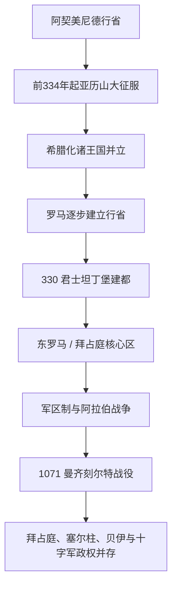

# 希腊化、罗马与拜占庭安纳托利亚

## 时间

前6世纪—11世纪

## 概括

本页以安纳托利亚为地域对象，说明波斯统治、希腊化王国、罗马行省和拜占庭核心腹地的连续变化，而非把这些跨区域帝国等同于现代土耳其。沿海希腊城市与内陆安纳托利亚语言文化长期并存；罗马道路、城市自治和基督教化重塑区域，君士坦丁堡建都又使安纳托利亚成为东罗马帝国人口、税粮与兵源核心。11世纪塞尔柱进入后，拜占庭控制并未瞬间消失，而是在战争、迁徙和地方权力转移中逐步收缩。

## 阶段发展

| 阶段 | 时间 | 政治格局 | 主要变化 |
|---|---|---|---|
| 阿契美尼德统治 | 前6世纪中叶—前334年 | 吕底亚等地被波斯征服，设行省并依靠地方王朝和希腊城市纳贡 | 王道连接内陆；爱琴海希腊城市成为波斯—希腊竞争前沿。 |
| 亚历山大与继业者 | 前334—前281年 | 亚历山大击败波斯，死后安提柯、利西马科斯、塞琉古等争夺 | 希腊—马其顿军事殖民和城市网络扩大。 |
| 希腊化诸王国 | 前281—前133/前63年 | 塞琉古、帕加马、本都、卡帕多西亚、比提尼亚等并立 | 王朝战争、城市自治和本地文化混合；罗马逐步介入。 |
| 罗马行省时期 | 前133年—4世纪 | 亚细亚、比提尼亚—本都、加拉太、卡帕多西亚等行省 | 道路、税收和城市精英纳入帝国；早期基督教共同体发展。 |
| 东罗马 / 拜占庭核心区 | 4世纪—1071年后 | 君士坦丁堡为帝国首都，安纳托利亚由行省后转军区治理 | 基督教化、希腊语优势增强；抵御萨珊、阿拉伯和草原势力。 |
| 控制收缩 | 1071—13世纪初 | 塞尔柱、突厥贝伊、十字军与拜占庭后继政权并存 | 中西部突厥化加速，西部沿海和特拉布宗等仍长期受希腊政权控制。 |

## 具体过程

亚历山大东征后，新建与改造的城市传播希腊语公共文化，但山区、乡村和地方神祇并未消失。帕加马国王阿塔罗斯三世把王国遗赠罗马后，罗马逐步建立行省；米特里达梯战争结束后，本都等区域也被纳入。城市议会和地方富人承担征税、公共建筑与祭祀，罗马统治依赖本地精英。

330年君士坦丁把拜占庭城重建为君士坦丁堡。安纳托利亚的道路、粮食和士兵成为帝国生存基础。7世纪阿拉伯征服叙利亚和埃及后，安纳托利亚更接近前线，军区制度让军队与区域行政结合。圣像破坏运动、修道院网络和教会会议都在此展开。10世纪拜占庭一度东扩，但11世纪土地集中、财政与军队调整，以及宫廷内争削弱边防反应。

## 重要事件

- 前546年前后居鲁士二世征服吕底亚，安纳托利亚西部纳入[阿契美尼德王朝](/%E4%BA%BA%E6%96%87%E7%A7%91%E5%AD%A6/%E5%8E%86%E5%8F%B2/%E8%A5%BF%E4%BA%9A/%E4%BC%8A%E6%9C%97/%E9%98%BF%E5%A5%91%E7%BE%8E%E5%B0%BC%E5%BE%B7%E7%8E%8B%E6%9C%9D.md)。
- 前334—333年亚历山大在格拉尼库斯河和伊苏斯取胜，打破波斯在安纳托利亚的统治。
- 前133年帕加马王国遗赠罗马，亚细亚行省形成；前三次米特里达梯战争后罗马控制扩大。
- 325年尼西亚会议、431年以弗所会议、451年迦克墩会议塑造基督教教义和教会秩序。
- 330年君士坦丁堡成为帝国新都；区域全史可与[东罗马帝国与拜占庭帝国](/%E4%BA%BA%E6%96%87%E7%A7%91%E5%AD%A6/%E5%8E%86%E5%8F%B2/%E6%AC%A7%E6%B4%B2/_%E9%80%9A%E5%8F%B2/%E5%8F%A4%E7%BD%97%E9%A9%AC/%E4%B8%9C%E7%BD%97%E9%A9%AC%E5%B8%9D%E5%9B%BD%E4%B8%8E%E6%8B%9C%E5%8D%A0%E5%BA%AD%E5%B8%9D%E5%9B%BD.md)对读。
- 602—628年拜占庭—萨珊战争使安纳托利亚一度受侵，随后阿拉伯舰队和陆军多次进攻。
- 1071年曼齐刻尔特战役后，拜占庭内战使突厥部队更容易深入中部；战役本身不是全境立即被征服的单一分界。
- 1097年第一次十字军夺回尼西亚交给拜占庭，但罗姆苏丹国转向科尼亚继续存在，见[第1次十字军东征](/%E4%BA%BA%E6%96%87%E7%A7%91%E5%AD%A6/%E5%8E%86%E5%8F%B2/%E6%AC%A7%E6%B4%B2/_%E9%80%9A%E5%8F%B2/%E5%8D%81%E5%AD%97%E5%86%9B%E4%B8%9C%E5%BE%81/%E7%AC%AC1%E6%AC%A1%E5%8D%81%E5%AD%97%E5%86%9B%E4%B8%9C%E5%BE%81.md)。

## 转型原因

拜占庭在安纳托利亚的收缩来自多重因素：曼齐刻尔特后的皇位内战、军队与土地制度变化、边疆人口迁移、突厥部族持续进入和十字军引发的力量重组。突厥化与伊斯兰化持续数世纪，希腊人、亚美尼亚人、叙利亚基督徒和其他群体长期共存。后续见[安纳托利亚突厥化与罗姆苏丹国](/%E4%BA%BA%E6%96%87%E7%A7%91%E5%AD%A6/%E5%8E%86%E5%8F%B2/%E8%A5%BF%E4%BA%9A/%E5%9C%9F%E8%80%B3%E5%85%B6/%E5%AE%89%E7%BA%B3%E6%89%98%E5%88%A9%E4%BA%9A%E7%AA%81%E5%8E%A5%E5%8C%96%E4%B8%8E%E7%BD%97%E5%A7%86%E8%8B%8F%E4%B8%B9%E5%9B%BD.md)。

## 演进图

## 演变关系

- 早期区域：[安纳托利亚古代文明](/%E4%BA%BA%E6%96%87%E7%A7%91%E5%AD%A6/%E5%8E%86%E5%8F%B2/%E8%A5%BF%E4%BA%9A/%E5%9C%9F%E8%80%B3%E5%85%B6/%E5%AE%89%E7%BA%B3%E6%89%98%E5%88%A9%E4%BA%9A%E5%8F%A4%E4%BB%A3%E6%96%87%E6%98%8E/README.md)。
- 后续：[安纳托利亚突厥化与罗姆苏丹国](/%E4%BA%BA%E6%96%87%E7%A7%91%E5%AD%A6/%E5%8E%86%E5%8F%B2/%E8%A5%BF%E4%BA%9A/%E5%9C%9F%E8%80%B3%E5%85%B6/%E5%AE%89%E7%BA%B3%E6%89%98%E5%88%A9%E4%BA%9A%E7%AA%81%E5%8E%A5%E5%8C%96%E4%B8%8E%E7%BD%97%E5%A7%86%E8%8B%8F%E4%B8%B9%E5%9B%BD.md)。
- 上级：[土耳其](/%E4%BA%BA%E6%96%87%E7%A7%91%E5%AD%A6/%E5%8E%86%E5%8F%B2/%E8%A5%BF%E4%BA%9A/%E5%9C%9F%E8%80%B3%E5%85%B6/README.md)。
