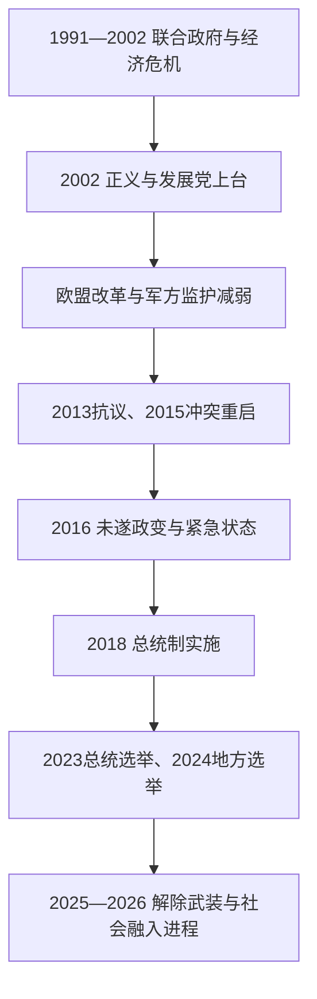

# 当代土耳其

## 时间

1991年—2026年7月

## 概括

冷战后土耳其在多党联合政府、欧盟候选进程、库尔德冲突、政治伊斯兰和市场经济危机中重组。正义与发展党自2002年起长期执政，早期以经济稳定和欧盟改革削弱军方监护，2010年代后则在大规模抗议、政党极化、叙利亚战争和2016年未遂政变中集中行政权。2017年修宪、2018年实施总统制后，总统兼任政府首脑。截至2026年7月，雷杰普·塔伊普·埃尔多安仍任总统，政治竞争持续，但司法、媒体和反对派活动空间成为核心争议。

## 国家元首

| 总统 | 任期 | 主要背景 |
|---|---|---|
| 图尔古特·厄扎尔 | 1989—1993 | 市场化改革者；海湾战争和库尔德问题中扩大总统角色。 |
| 苏莱曼·德米雷尔 | 1993—2000 | 长期中右翼政治家；联合政府与1997年军方干预期间在位。 |
| 艾哈迈德·内吉代特·塞泽尔 | 2000—2007 | 前宪法法院院长；与政府在世俗主义和任命问题上多有冲突。 |
| 阿卜杜拉·居尔 | 2007—2014 | 正义与发展党创始人之一；欧盟谈判与党政重组时期在位。 |
| **雷杰普·塔伊普·埃尔多安** | 2014年至今 | 2003—2014年任总理；2018年后以总统兼政府首脑身份掌握行政权，截至2026年7月仍在任。 |

## 政府首脑与制度变化

| 总理 / 体制 | 时间 | 说明 |
|---|---|---|
| 苏莱曼·德米雷尔、坦苏·奇莱尔、内吉梅丁·埃尔巴坎、梅苏特·耶尔马兹、比伦特·埃杰维特等联合政府 | 1991—2002 | 政党碎片化、经济危机和军方监护并存。 |
| 阿卜杜拉·居尔 | 2002—2003 | 正义与发展党首届政府的过渡总理。 |
| 雷杰普·塔伊普·埃尔多安 | 2003—2014 | 经济增长、欧盟改革与后期权力集中并行。 |
| 艾哈迈德·达武特奥卢 | 2014—2016 | 叙利亚战争、难民与安全冲突加重；因与总统分歧辞职。 |
| 比纳利·耶尔德勒姆 | 2016—2018 | 最后一任总理；主持总统制过渡。 |
| 总统制 | 2018年至今 | 总理职位取消，总统任命副总统和部长；议会保留立法和预算权但不能对内阁投不信任票。 |

## 重要事件

- 1991年海湾战争后伊拉克北部局势改变，土耳其库尔德冲突与跨境安全政策加深。
- 1995—1997年福利党进入联合政府；1997年国家安全委员会施压促使埃尔巴坎辞职，史称“后现代政变”。
- 1999年库尔德工人党领导人阿卜杜拉·奥贾兰被捕；同年土耳其获欧盟候选国地位。
- 2001年金融危机导致银行与货币体系重组，为2002年正义与发展党胜选创造条件。
- 2005年正式启动欧盟入盟谈判；民事改革一度扩大少数群体与司法规范，但谈判后来停滞。
- 2013年盖齐公园抗议从城市规划争议扩大为全国反政府运动，警民冲突加深政治极化。
- 2015年库尔德和平进程破裂，东南部城市战和跨境行动恢复。
- 2016年7月军事政变未遂造成大量伤亡；紧急状态下军队、司法、教育与媒体系统大规模清洗。
- 2017年公投通过总统制修宪，2018年新体制全面实行；议会制终结。
- 2018年以来货币贬值、高通胀和非传统利率政策冲击家庭生活，后期经济团队转回更紧缩政策。
- 2019年反对党赢得伊斯坦布尔、安卡拉等大城市，显示地方选举仍具竞争性。
- 2020年圣索菲亚由博物馆改为清真寺，成为宗教、民族象征与文化遗产争议焦点。
- 2023年土叙大地震造成重大伤亡和城市毁损；同年埃尔多安再次赢得总统选举。
- 2024年地方选举中共和人民党扩大大城市优势；2025—2026年伊斯坦布尔市长埃克雷姆·伊马莫卢被羁押并受审，反对派认为案件具有政治动机，政府则称司法独立。
- 2025年2月，阿卜杜拉·奥贾兰公开呼吁库尔德工人党（PKK）解散并停止武装斗争；该组织5月宣布解散组织结构、结束武装斗争。宣布本身不等于所有分支已同时缴械。
- 2025年7月，一批PKK成员在伊拉克库尔德地区举行焚毁武器仪式；8月，土耳其大国民议会“民族团结、兄弟情谊与民主委员会”开始跨党派听证，讨论解除武装后的法律和社会安排。
- 2026年2月18日，议会委员会以47票赞成、2票反对、1票弃权通过报告，把安全机构确认PKK所有组成部分完成缴械和组织清除列为进入后续法律框架的关键门槛。
- 截至2026年7月，针对解除武装人员法律地位、回归和社会融入的专门、临时立法仍在推进，尚不能写作已经完成；6月议长仍公开表示须在确认全面解除武装后履行立法责任。
- 截至2026年7月，土耳其仍是北约成员和欧盟候选国，并在黑海、叙利亚、南高加索与中东外交中寻求战略自主。

## 政治、经济与社会结构

正义与发展党把安纳托利亚保守商人、城市低收入群体和宗教选民组成长期联盟；共和人民党在大城市、世俗中产和部分青年中扩大支持；民族主义政党和库尔德政治力量常影响议会多数。军方直接干政能力在2000年代后下降，但安全机构、总统任命和司法治理集中。经济依赖制造业、建筑、旅游、外资与能源进口，因而容易受到汇率和外部融资冲击。数百万叙利亚难民的长期居留也改变劳动力市场和国内政治。

## 制度转型的成因与争议

总统制支持者认为它减少脆弱联合政府并提高决策效率；批评者认为权力集中削弱议会、司法和独立机构。制度转型由长期军政冲突、直接民选总统带来的双重合法性、2016年安全危机以及埃尔多安个人政治联盟共同推动。评价当代土耳其时，应同时看到选举竞争仍存在、反对党能赢得地方政府，以及媒体、司法和候选人面临不对称限制。

## 演进图

## 完整领导人专表

2018年以前的总统与总理、代理任职、军方实际权力阶段，以及2018年后的总统和副总统完整任期见[土耳其共和国国家元首与政府首脑表](/%E4%BA%BA%E6%96%87%E7%A7%91%E5%AD%A6/%E5%8E%86%E5%8F%B2/%E8%A5%BF%E4%BA%9A/%E5%9C%9F%E8%80%B3%E5%85%B6/%E5%9C%9F%E8%80%B3%E5%85%B6%E5%85%B1%E5%92%8C%E5%9B%BD%E5%9B%BD%E5%AE%B6%E5%85%83%E9%A6%96%E4%B8%8E%E6%94%BF%E5%BA%9C%E9%A6%96%E8%84%91%E8%A1%A8.md)。

## 演变关系

- 前一阶段：[多党制与冷战时期](/%E4%BA%BA%E6%96%87%E7%A7%91%E5%AD%A6/%E5%8E%86%E5%8F%B2/%E8%A5%BF%E4%BA%9A/%E5%9C%9F%E8%80%B3%E5%85%B6/%E5%A4%9A%E5%85%9A%E5%88%B6%E4%B8%8E%E5%86%B7%E6%88%98%E6%97%B6%E6%9C%9F.md)。
- 帝国制度背景：[奥斯曼帝国的统治结构](/%E4%BA%BA%E6%96%87%E7%A7%91%E5%AD%A6/%E5%8E%86%E5%8F%B2/%E8%A5%BF%E4%BA%9A/%E5%9C%9F%E8%80%B3%E5%85%B6/%E5%A5%A5%E6%96%AF%E6%9B%BC%E5%B8%9D%E5%9B%BD/%E5%A5%A5%E6%96%AF%E6%9B%BC%E5%B8%9D%E5%9B%BD%E7%9A%84%E7%BB%9F%E6%B2%BB%E7%BB%93%E6%9E%84.md)。
- 上级：[土耳其](/%E4%BA%BA%E6%96%87%E7%A7%91%E5%AD%A6/%E5%8E%86%E5%8F%B2/%E8%A5%BF%E4%BA%9A/%E5%9C%9F%E8%80%B3%E5%85%B6/README.md)。
