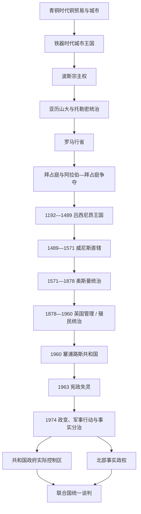

# 塞浦路斯

## 概括

塞浦路斯位于安纳托利亚、黎凡特和埃及之间的东地中海。联合国地理统计把它列入西亚，现代制度和政治则同欧洲高度相连，因此本目录按“西亚—欧洲交叉国家”维护。铜矿、港口和海上航路使岛屿先后进入爱琴海、腓尼基、波斯、希腊化、罗马、拜占庭、十字军、威尼斯、奥斯曼和英国体系。

塞浦路斯的长时段主线不是一条单纯的“外族征服链”。古代各城市王国借纳贡保留自治，托勒密和罗马以统一行政整合全岛，拜占庭时期教会成为连续组织；吕西尼昂王国依靠十字军移民和转口贸易崛起，又因王位内争、热那亚控制、马穆鲁克压力及威尼斯渗透衰落。奥斯曼统治塑造了持续至今的希腊正教与土耳其族穆斯林社群结构，英国殖民制度则把现代民族主义和社群代表制推入同一政治框架。

1960年共和国独立后，两族权力分享在1963年失灵。1974年希腊军政府支持的政变及土耳其两阶段军事行动造成停火线、人口迁移和事实分治。今天塞浦路斯共和国在国际上代表全岛、实际控制南部；北部由仅获土耳其承认的事实政权治理。现代事实与领导人核验截至2026年7月13日。

## 演变图

## 历史主线

1. **资源与多中心城市**：铜矿和港口使早期塞浦路斯面向多个文明，铁器时代长期保持城市王国并立。
2. **帝国整合与教会连续性**：托勒密取消地方王权，罗马和拜占庭建立全岛行政；自主的塞浦路斯教会跨越战争和政权转换。
3. **海上王国与商业竞争**：吕西尼昂王国因十字军移民、法马古斯塔贸易和出口农业兴盛，又被热那亚、马穆鲁克和威尼斯逐步削弱。
4. **奥斯曼社群秩序**：正教会获得社群代表地位，穆斯林人口通过驻军、移民和长期本地化形成，两个现代主要社群的轮廓逐渐稳定。
5. **殖民民族主义**：英国现代化行政同有限社群代表制并行，“并入希腊”、反对并合和分治诉求互相激化。
6. **独立、宪政失灵与分治**：1960年安排未能建立足够的共同政治，1963—1974年的冲突和外部干预把制度危机转为领土分隔。
7. **长期和平进程**：联合国框架主要寻求两区、两族联邦；2004年公投和2017年高层会议均未完成协议，2025—2026年恢复接触但尚无全面解决。

## 时期导航

| 顺序 | 笔记 | 时间 | 简要概括 |
|---:|---|---|---|
| 1 | [古代王国、罗马与拜占庭塞浦路斯](/%E4%BA%BA%E6%96%87%E7%A7%91%E5%AD%A6/%E5%8E%86%E5%8F%B2/%E8%A5%BF%E4%BA%9A/%E5%A1%9E%E6%B5%A6%E8%B7%AF%E6%96%AF/%E5%8F%A4%E4%BB%A3%E7%8E%8B%E5%9B%BD%E3%80%81%E7%BD%97%E9%A9%AC%E4%B8%8E%E6%8B%9C%E5%8D%A0%E5%BA%AD%E5%A1%9E%E6%B5%A6%E8%B7%AF%E6%96%AF.md) | 约前9000年—1191年 | 青铜贸易、多城市王国、托勒密和罗马行政、拜占庭及阿拉伯—拜占庭争夺。 |
| 2 | [十字军、威尼斯、奥斯曼与英国统治](/%E4%BA%BA%E6%96%87%E7%A7%91%E5%AD%A6/%E5%8E%86%E5%8F%B2/%E8%A5%BF%E4%BA%9A/%E5%A1%9E%E6%B5%A6%E8%B7%AF%E6%96%AF/%E5%8D%81%E5%AD%97%E5%86%9B%E3%80%81%E5%A8%81%E5%B0%BC%E6%96%AF%E3%80%81%E5%A5%A5%E6%96%AF%E6%9B%BC%E4%B8%8E%E8%8B%B1%E5%9B%BD%E7%BB%9F%E6%B2%BB.md) | 1191—1960年 | 十字军征服、吕西尼昂王国、威尼斯海防、奥斯曼社群秩序与英国殖民政治。 |
| 3 | [独立、族群冲突与岛屿分治](/%E4%BA%BA%E6%96%87%E7%A7%91%E5%AD%A6/%E5%8E%86%E5%8F%B2/%E8%A5%BF%E4%BA%9A/%E5%A1%9E%E6%B5%A6%E8%B7%AF%E6%96%AF/%E7%8B%AC%E7%AB%8B%E3%80%81%E6%97%8F%E7%BE%A4%E5%86%B2%E7%AA%81%E4%B8%8E%E5%B2%9B%E5%B1%BF%E5%88%86%E6%B2%BB.md) | 1960年至今 | 权力分享、1963年危机、1974年政变与战争、南北分治、欧盟和统一谈判。 |
| 4 | [塞浦路斯君主、殖民长官与国家元首表](/%E4%BA%BA%E6%96%87%E7%A7%91%E5%AD%A6/%E5%8E%86%E5%8F%B2/%E8%A5%BF%E4%BA%9A/%E5%A1%9E%E6%B5%A6%E8%B7%AF%E6%96%AF/%E5%A1%9E%E6%B5%A6%E8%B7%AF%E6%96%AF%E5%90%9B%E4%B8%BB%E3%80%81%E6%AE%96%E6%B0%91%E9%95%BF%E5%AE%98%E4%B8%8E%E5%9B%BD%E5%AE%B6%E5%85%83%E9%A6%96%E8%A1%A8.md) | 1192年至今 | 吕西尼昂完整君主线、英国殖民行政首脑、共和国总统及北部事实管治角色。 |

## 重要转折与时间节点

| 时间 | 转折 | 意义 |
|---|---|---|
| 约前12世纪 | 东地中海危机与爱琴海移民 | 希腊语传统扩展，但多语言、多王国格局延续。 |
| 前312 / 前294年后 | 托勒密取消城市王权并稳定控制 | 全岛由多王国转为统一王朝行政。 |
| 前58年 | 罗马吞并 | 塞浦路斯进入罗马行省和统一市场体系。 |
| 649—965年 | 阿拉伯袭击、共管与拜占庭恢复 | 岛屿成为两大帝国边疆，人口与城市网络重组。 |
| 1191—1192年 | 理查征服、圣殿骑士团失败、吕西尼昂建国 | 拉丁王国和十字军海上基地形成。 |
| 1373—1426年 | 热那亚占港与马穆鲁克迫贡 | 王国财政和主权被逐层削弱。 |
| 1489年 | 卡特琳娜·科尔纳罗退位 | 威尼斯完成不经大战的直接吞并。 |
| 1570—1571年 | 奥斯曼征服 | 拉丁国家终结，正教会恢复并形成穆斯林社群。 |
| 1878—1925年 | 英国管理、吞并与殖民地化 | 现代官僚和社群政治框架形成。 |
| 1955—1960年 | 反殖民战争、族群武装与外交妥协 | 以独立权力分享替代立即并合或分治。 |
| 1963—1964年 | 修宪危机、暴力和联合国进驻 | 共同中央政府实际失灵。 |
| 1974年 | 政变与土耳其两阶段军事行动 | 停火线、人口迁移和事实分治固化。 |
| 1983年 | 北部单方面独立 | 仅土耳其承认，国际隔离制度化。 |
| 2004年 | 安南方案公投与加入欧盟 | 统一方案未获双方共同同意，欧盟法在北部暂停。 |
| 2025—2026年 | 北部领导人更替与非正式接触 | 联邦谈判出现重启空间，但截至核验日仍无全面协议。 |

## 关键辨析

- 古代“阿拉西亚”通常同塞浦路斯相关，但不能无条件等同现代全岛边界。
- 城市王国没有可连续重建的“塞浦路斯统一王统”；只有吕西尼昂王国以后才适合制作完整全岛君主表。
- 1878—1914年英国拥有行政管理权，奥斯曼仍保有名义主权；1914年才被英国吞并，1925年成为直辖殖民地。
- 1960年共和国是总统制，没有总理；总统与土耳其族副总统原本共同掌握行政权。
- 共和国的国际法代表权、共和国政府的实际控制范围、北部事实政权的日常治理能力是三个不同问题。
- 1974年事件必须同时记录希腊军政府支持政变、土耳其两阶段军事行动、人口迁移及长期控制，不能以带立场的单一名称替代过程。
- 英国两个主权基地区不是联合国缓冲区，也不属于岛上南北任何一方。

## 区域关系

- 直接上级：[西亚](/%E4%BA%BA%E6%96%87%E7%A7%91%E5%AD%A6/%E5%8E%86%E5%8F%B2/%E8%A5%BF%E4%BA%9A/README.md)。
- 古典希腊背景见[古希腊](/%E4%BA%BA%E6%96%87%E7%A7%91%E5%AD%A6/%E5%8E%86%E5%8F%B2/%E6%AC%A7%E6%B4%B2/_%E9%80%9A%E5%8F%B2/%E5%8F%A4%E5%B8%8C%E8%85%8A/README.md)。
- 拜占庭背景见[东罗马帝国与拜占庭帝国](/%E4%BA%BA%E6%96%87%E7%A7%91%E5%AD%A6/%E5%8E%86%E5%8F%B2/%E6%AC%A7%E6%B4%B2/_%E9%80%9A%E5%8F%B2/%E5%8F%A4%E7%BD%97%E9%A9%AC/%E4%B8%9C%E7%BD%97%E9%A9%AC%E5%B8%9D%E5%9B%BD%E4%B8%8E%E6%8B%9C%E5%8D%A0%E5%BA%AD%E5%B8%9D%E5%9B%BD.md)。
- 奥斯曼与现代土耳其背景见[土耳其](/%E4%BA%BA%E6%96%87%E7%A7%91%E5%AD%A6/%E5%8E%86%E5%8F%B2/%E8%A5%BF%E4%BA%9A/%E5%9C%9F%E8%80%B3%E5%85%B6/README.md)。
- 历史总览：[历史](/%E4%BA%BA%E6%96%87%E7%A7%91%E5%AD%A6/%E5%8E%86%E5%8F%B2/README.md)。
