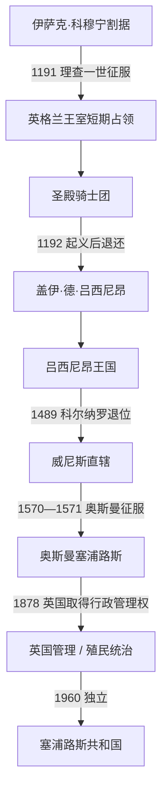

# 十字军、威尼斯、奥斯曼与英国统治

## 时间

1191—1960年

## 概括

1191年理查一世击败割据者伊萨克·科穆宁，塞浦路斯从拜占庭边疆转为十字军海上基地。圣殿骑士团的严厉征敛很快引发1192年尼科西亚起义，骑士团把岛屿退还理查；盖伊·德·吕西尼昂随后取得领主权，其兄艾默里把政权制度化为获承认的王国。王国依靠法马古斯塔转口贸易、糖和葡萄酒出口及拉丁封建贵族兴盛，同时多数希腊正教农民处于从属地位。

14世纪以后，黑死病、王室内争、热那亚控制法马古斯塔和马穆鲁克纳贡逐步削弱王国。1489年卡特琳娜·科尔纳罗被迫退位，威尼斯改为直辖。威尼斯强化尼科西亚和法马古斯塔防线，却未能抵御1570—1571年奥斯曼远征。奥斯曼废除拉丁王国制度，重新确认正教会并引入穆斯林军民人口；税收承包、地方权贵和灾荒又造成周期性危机。

1878年英国取得行政管理权，名义上的奥斯曼主权延续至1914年。殖民政府扩展道路、公共卫生、学校和官僚体系，却通过社群代表制和有限参与把政治竞争固化在“并入希腊”、殖民统治与土耳其族安全诉求之间。1955—1959年的反殖民战争与族群武装冲突迫使各方接受既非并合也非分治的独立方案。

## 演变图

## 分阶段发展

### 理查一世、圣殿骑士团与建国

- 1191年理查的远征舰队因风暴在塞浦路斯附近分散，伊萨克拘押遇难者并拒绝理查家属靠岸，冲突迅速升级。理查夺取利马索尔，击败岛上部队并迫使伊萨克投降。
- 理查无力在东征同时长期治理岛屿，遂以10万拜占庭金币的条件售予圣殿骑士团。骑士团人数少、征税急迫，1192年复活节前后尼科西亚居民起义；骑士团血腥突围后选择退还。
- 盖伊以原耶路撒冷国王的声望吸引从黎凡特流亡的法兰克贵族和商人。艾默里在1197年加冕，把个人领地变为世袭王国。

### 吕西尼昂王国的兴盛

王国采用源自耶路撒冷王国的封建法和“高等法院”，国王以王室领地、港口税和商业特许维持权力。拉丁天主教会居制度优势，希腊正教会的教区和财产受压缩，但地方教会法庭、希腊语惯例及农村共同体仍延续。亚美尼亚人、马龙派、叙利亚人、犹太人和意大利商人共同构成港口社会。

1291年阿卡陷落后，法马古斯塔成为连接欧洲、马穆鲁克埃及和亚洲货物的重要中转港。糖、酒、谷物、棉花及角豆出口为王室和贵族带来收入；王国的海军位置也支持彼得一世远征安塔利亚和亚历山大港。繁荣同时依赖农奴劳动、奴隶市场和对意大利商人的特权，利益冲突不断积累。

### 王国衰落与威尼斯接管

- **结构因素**：王位频繁由幼主继承，摄政贵族容易夺权；出口农业和港口税高度依赖海上贸易，黑死病与航路变化打击人口和财政。
- **外部压力**：彼得一世的远征刺激马穆鲁克敌意，热那亚和威尼斯争夺商业特权。1373—1374年热那亚攻占法马古斯塔，王国失去核心港税来源。
- **直接转折**：1426年马穆鲁克军在希罗基蒂亚击败雅努斯并将其俘虏，塞浦路斯此后纳贡；宫廷越来越依赖威尼斯贷款和婚姻政治。
- **灭亡过程**：詹姆斯二世依靠马穆鲁克援助击败夏洛特并收回法马古斯塔，却娶威尼斯贵族卡特琳娜·科尔纳罗。詹姆斯及幼子先后去世后，威尼斯控制女王的顾问与驻军，1489年迫使她退位，王国不经大战即被吞并。

完整君主、摄政和共治序列见[塞浦路斯君主、殖民长官与国家元首表](/%E4%BA%BA%E6%96%87%E7%A7%91%E5%AD%A6/%E5%8E%86%E5%8F%B2/%E8%A5%BF%E4%BA%9A/%E5%A1%9E%E6%B5%A6%E8%B7%AF%E6%96%AF/%E5%A1%9E%E6%B5%A6%E8%B7%AF%E6%96%AF%E5%90%9B%E4%B8%BB%E3%80%81%E6%AE%96%E6%B0%91%E9%95%BF%E5%AE%98%E4%B8%8E%E5%9B%BD%E5%AE%B6%E5%85%83%E9%A6%96%E8%A1%A8.md)。

### 威尼斯时期

威尼斯派遣总督和顾问委员会，优先保障舰队补给、税收和东地中海航道。16世纪奥斯曼威胁上升后，威尼斯把尼科西亚城墙改建为十一角星形堡垒，并扩建法马古斯塔防御；为集中守军，还放弃或拆除部分北部山地要塞。这种策略提升两座城的抗击能力，却使乡村和其余港口难获有效防护。

1570年拉拉·穆斯塔法帕夏率军登陆。尼科西亚在围攻后于9月陷落，大量居民遭杀害或奴役；法马古斯塔守军由马尔坎托尼奥·布拉加丁指挥，坚持到1571年8月才投降。奥斯曼指控守军违约并处死布拉加丁。1571年勒班陀海战虽摧毁部分奥斯曼舰队，却没有改变塞浦路斯已被征服的事实；1573年威尼斯正式放弃主张。

### 奥斯曼时期

奥斯曼把土地、税收和司法纳入帝国体系，早期设置贝勒贝伊及军事采邑，后来多次改隶群岛行省并广泛采用包税。拉丁教会的特权被取消，塞浦路斯正教会恢复财产和组织地位；总主教逐渐成为代表正教臣民同政府交涉的“民族领袖”。来自安纳托利亚的士兵、官员、工匠和移民同本地改宗者共同形成土耳其族穆斯林社群，但人口形成是长期过程，不能简化为一次殖民迁入。

17—18世纪的地方官、包税人、禁卫军与教会精英既合作又竞争。高税、旱灾、蝗灾和瘟疫造成逃亡与反抗。1839年后坦志麦特改革试图统一税制、设立地方议会和扩大非穆斯林的法律地位，但民族主义与帝国财政困境同步增强。

1821年希腊独立战争爆发后，奥斯曼当局担忧塞浦路斯起义，7月处死总主教基普里亚诺斯、三名主教及多位希腊族显贵。这次预防性镇压重创本地精英，并在后来的希腊族民族记忆中成为重要节点。

### 英国管理与直辖殖民地

1878年《塞浦路斯协定》使英国获得行政管理，以换取在俄国威胁下支持奥斯曼；岛屿仍属奥斯曼，英国却征收税款并向奥斯曼债权体系支付“塞浦路斯贡金”。这种贡金加重财政争议，也限制早期公共投资。英国1914年同奥斯曼开战后单方面吞并，土耳其在1923年《洛桑条约》中承认；1925年塞浦路斯成为直辖殖民地。

殖民政府建立总督制、法院、警察、道路和卫生机构，并允许希腊族与土耳其族在立法委员会中分别选举代表。由于官方委员可联合少数社群否决希腊族多数派提案，这套有限代议制没有形成全岛共同政治，反而让并合诉求与社群安全焦虑围绕议席竞争。

## 英国统治下的重要事件

| 时间 | 事件 | 过程与结果 |
|---|---|---|
| 1878年 | 英国接管行政 | 奥斯曼旗帜降下但名义主权保留；高级专员建立殖民官僚体系。 |
| 1914—1925年 | 吞并与殖民地化 | 1914年英国吞并，1923年获土耳其承认，1925年实行总督直辖。 |
| 1931年 | 十月起义 | 反税与并合示威演变为焚烧政府大楼；殖民政府废除立法委员会、限制政党和象征活动，随后进入“帕尔默统治”。 |
| 1939—1945年 | 第二次世界大战 | 数万名塞浦路斯志愿人员为英军服务；战后社会以参战贡献为理由要求政治改革。 |
| 1950年 | 教会并合公投 | 正教会组织的希腊族社群投票几乎一致支持并入希腊；土耳其族未参加，英国也不承认其法定效力。 |
| 1955—1959年 | EOKA反英武装斗争 | EOKA袭击殖民设施与被视为合作者者，英国实施紧急状态、拘禁和处决；部分冲突转为族群暴力。 |
| 1958年 | TMT扩张 | 土耳其族抵抗组织在土耳其支持下反对并合、主张分治，双方社区的恐惧与强制分隔加深。 |
| 1959—1960年 | 苏黎世—伦敦安排 | 希腊、土耳其、英国及两族领导人接受独立共和国、复杂配额和三国保证；英国保留两个主权基地区。 |

## 兴衰与独立原因

- 英国统治得以维持，依靠海军基地价值、专业官僚、警察和社群分立的有限代表制；公共工程也确实提高了国家渗透能力。
- 殖民秩序衰落并非EOKA单一造成。战后反殖民浪潮、英国财政与军事成本、希腊和土耳其介入、北约内部危机及族群暴力共同压缩继续直辖的空间。
- 直接终结殖民统治的是1959年外交妥协：各方放弃立即并合或正式分治，以独立、权力分享、保证国和英国基地换取停火与政权移交。
- 殖民时期没有解决“谁能代表全岛”和“安全由谁保证”的根本分歧，这些问题被写进1960年宪法，并很快转化为共和国危机。

## 演变关系

- 前一阶段：[古代王国、罗马与拜占庭塞浦路斯](/%E4%BA%BA%E6%96%87%E7%A7%91%E5%AD%A6/%E5%8E%86%E5%8F%B2/%E8%A5%BF%E4%BA%9A/%E5%A1%9E%E6%B5%A6%E8%B7%AF%E6%96%AF/%E5%8F%A4%E4%BB%A3%E7%8E%8B%E5%9B%BD%E3%80%81%E7%BD%97%E9%A9%AC%E4%B8%8E%E6%8B%9C%E5%8D%A0%E5%BA%AD%E5%A1%9E%E6%B5%A6%E8%B7%AF%E6%96%AF.md)。
- 十字军区域背景见[十字军国家与阿尤布、马穆鲁克时期](/%E4%BA%BA%E6%96%87%E7%A7%91%E5%AD%A6/%E5%8E%86%E5%8F%B2/%E8%A5%BF%E4%BA%9A/%E9%BB%8E%E5%87%A1%E7%89%B9/%E5%8D%81%E5%AD%97%E5%86%9B%E5%9B%BD%E5%AE%B6%E4%B8%8E%E9%98%BF%E5%B0%A4%E5%B8%83%E3%80%81%E9%A9%AC%E7%A9%86%E9%B2%81%E5%85%8B%E6%97%B6%E6%9C%9F.md)。
- 奥斯曼主线见[奥斯曼帝国](/%E4%BA%BA%E6%96%87%E7%A7%91%E5%AD%A6/%E5%8E%86%E5%8F%B2/%E8%A5%BF%E4%BA%9A/%E5%9C%9F%E8%80%B3%E5%85%B6/%E5%A5%A5%E6%96%AF%E6%9B%BC%E5%B8%9D%E5%9B%BD/README.md)。
- 后续进入[独立、族群冲突与岛屿分治](/%E4%BA%BA%E6%96%87%E7%A7%91%E5%AD%A6/%E5%8E%86%E5%8F%B2/%E8%A5%BF%E4%BA%9A/%E5%A1%9E%E6%B5%A6%E8%B7%AF%E6%96%AF/%E7%8B%AC%E7%AB%8B%E3%80%81%E6%97%8F%E7%BE%A4%E5%86%B2%E7%AA%81%E4%B8%8E%E5%B2%9B%E5%B1%BF%E5%88%86%E6%B2%BB.md)。
- 上级入口：[塞浦路斯](/%E4%BA%BA%E6%96%87%E7%A7%91%E5%AD%A6/%E5%8E%86%E5%8F%B2/%E8%A5%BF%E4%BA%9A/%E5%A1%9E%E6%B5%A6%E8%B7%AF%E6%96%AF/README.md)。
