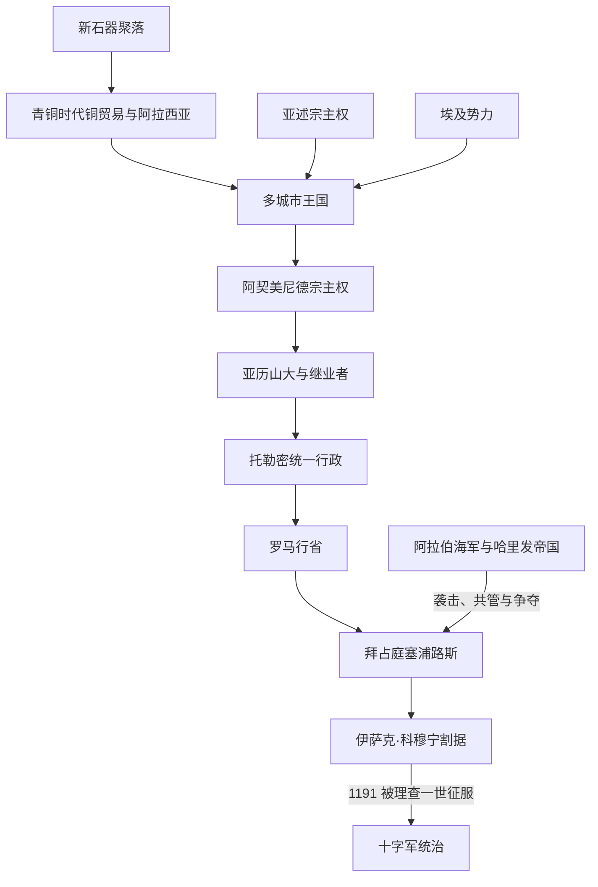

# 古代王国、罗马与拜占庭塞浦路斯

## 时间

约前9000年—1191年

## 概括

塞浦路斯的早期历史由铜资源、海上航路和岛屿内部的多中心格局共同塑造。新石器时代已形成定居聚落；青铜时代的采矿、冶炼和港口贸易把岛屿接入安纳托利亚、黎凡特、埃及和爱琴海网络。前2千纪文献中的“阿拉西亚”通常被认为与塞浦路斯密切相关，但其范围是否等同全岛仍有争议。

约前12世纪以后，来自爱琴海世界的移民和希腊语传统扩展，同时本地语言、腓尼基移民与东方宗教并未消失。铁器时代的塞浦路斯不是统一国家，而是萨拉米斯、帕福斯、基提翁、阿马苏斯、索利、库里翁、拉皮索斯、马里翁、伊达利翁和塔马索斯等城市王国并立。它们在亚述、埃及和阿契美尼德波斯等大国之间纳贡、结盟或反叛，直到托勒密王朝取消地方王权。

罗马吞并后，城市自治、铜业、农业和航运继续发展，基督教在1世纪传入。拜占庭时期塞浦路斯教会取得自主地位；7—10世纪的阿拉伯袭击、人口迁徙和阿拉伯—拜占庭共管使岛屿成为边疆。965年拜占庭恢复稳定统治，但12世纪末地方军政长官伊萨克·科穆宁割据，为1191年的权力转换埋下条件。

## 历史分期

| 阶段 | 时间 | 统治与社会机制 | 关键变化 |
|---|---|---|---|
| 新石器—铜石并用时代 | 约前9000—前2500年 | 村落农业、牧业和近海交换 | 希罗基蒂亚等聚落显示稳定定居，但尚无全岛国家。 |
| 青铜时代与“阿拉西亚” | 约前2500—前1050年 | 铜矿、冶炼中心、港口和宫廷网络 | 铜锭、陶器和书信证明同埃及、乌加里特及爱琴海的往来；前12世纪危机后城市格局重组。 |
| 城市王国时代 | 约前1050—前312年 | 多个世袭王国，各有宫廷、神庙、铸币和军队 | 希腊语、腓尼基语和本地传统并存；先后受亚述、埃及和波斯宗主权约束。 |
| 托勒密统治 | 前312 / 前294—前58年 | 驻岛总督、驻军和统一税制 | 地方王权被取消，岛屿成为托勒密海军、木材和铜资源基地。 |
| 罗马时期 | 前58年—395年 | 行省总督、城市议会、帝国税制 | 一度归还托勒密王室，前31年后稳定归罗马；基督教社群形成。 |
| 拜占庭及争夺时期 | 395—965年 | 帝国行省 / 军区、教会网络；部分时段向两帝国纳贡 | 阿拉伯海军袭击后出现长期不稳定和约定共管。 |
| 拜占庭恢复与地方割据 | 965—1191年 | 军区与帝国官员，1184年后伊萨克·科穆宁割据 | 海防和城堡重建；地方政权同君士坦丁堡脱离，最终被十字军征服。 |

## 城市王国与可证统治者

城市王国的材料来自亚述贡赋铭文、希腊与腓尼基铭文、钱币和后世叙述，保存极不均衡。因此只能列“可证的重要节点”，不能拼接成完整全岛世系。

| 王国 / 中心 | 文化与政治特点 | 重要统治者或事件 |
|---|---|---|
| 萨拉米斯 | 东部强国，希腊语王朝传统突出 | 欧埃尔通约前6世纪铸币；奥涅西洛斯在前499年参加反波斯起义；**埃瓦戈拉斯一世**约前411—前374年扩张并同波斯交战；普尼塔戈拉斯支持亚历山大。 |
| 基提翁 | 腓尼基语和希腊语传统交汇，控制重要港口 | 腓尼基王室在前5—前4世纪留下连续性较好的铭文与钱币；曾扩张到伊达利翁等地。 |
| 帕福斯 | 同阿佛洛狄忒崇拜及西南港口网络密切相关 | 多位王通过钱币和铭文可知；前332年国王尼科克勒斯归附亚历山大。 |
| 阿马苏斯 | 保留较多本地语言和宗教传统 | 古典作者常把它同“埃特奥塞浦路斯人”联系，但族群解释存在争议。 |
| 索利、马里翁等 | 依靠铜矿、农业和西北海路 | 在亲波斯与反波斯阵营间变化，部分王国后来被强邻吞并或由托勒密取消。 |

## 统治结构与机制

- **城市王国**：国王兼具军事、祭祀和外交职能，城邦与乡村腹地通过土地、贡赋和港口连接；外部帝国多要求纳贡和效忠，不总是直接接管日常行政。
- **托勒密时期**：王朝以总督、驻军和财政官员控制全岛，压制彼此竞争的地方王室，使塞浦路斯成为埃及王朝的前沿舰队基地。
- **罗马时期**：塞浦路斯通常由元老院行省总督管理，帕福斯是行政中心；地方城市议会仍处理宗教、市场和公共建筑。
- **拜占庭时期**：帝国行政与塞浦路斯自主教会并存。431年以弗所会议确认其教会不受安条克宗主教管辖，教会因而成为跨越政权震荡的本地组织。
- **阿拉伯—拜占庭共管**：688 / 689年前后双方协议要求岛屿保持一定中立并分配贡赋；这不是一个稳定的“双政府”，边界冲突、驻军、劫掠与人口迁徙仍反复发生。

## 重要事件与具体过程

1. **青铜贸易兴起**：前2千纪铜矿和港口城市扩张，塞浦路斯铜锭进入黎凡特和地中海沉船货物；财富依赖跨海需求，也使岛屿容易受区域贸易崩溃冲击。
2. **前12世纪重组**：东地中海宫廷体系危机、城市破坏与移民交织，希腊语逐渐占优势，但腓尼基语和本地语言在部分城市继续使用数百年。
3. **亚述、埃及与波斯宗主权**：前8世纪亚述碑铭列出纳贡诸王；亚述衰落后岛屿转入埃及势力范围，约前545年被阿契美尼德波斯纳入帝国网络。
4. **前499—前497年反波斯战争**：萨拉米斯的奥涅西洛斯响应爱奥尼亚起义，多数王国一度加入；波斯与腓尼基舰队反攻，起义失败，城市王权继续存在但受宗主权约束。
5. **埃瓦戈拉斯一世的扩张**：前4世纪初萨拉米斯王埃瓦戈拉斯重建海军、扩张全岛影响，并在雅典与波斯之间周旋；长期战争结束后仍保有萨拉米斯，但全岛统一未能巩固。
6. **亚历山大与继业者战争**：前333 / 前332年诸王转向亚历山大并提供舰队；其死后塞浦路斯成为安提柯与托勒密争夺目标。托勒密一世在前312年前后处死或废黜反对者，地方王国制度终结；前294年后托勒密控制趋于稳定。
7. **罗马吞并**：前58年罗马以财政和政治理由并吞塞浦路斯；前47年凯撒把岛屿交给克娄巴特拉七世及托勒密王室，前31年亚克兴战役后又正式归罗马。
8. **基督教传播与危机**：约45年保罗和巴拿巴传教；115—117年犹太侨民起义及镇压严重破坏城市社会，随后罗马进一步限制犹太人进入岛屿。
9. **阿拉伯袭击与共管**：649年穆阿维叶舰队攻岛，653 / 654年再度进攻；此后两大帝国多次改变驻军和贡赋安排。查士丁尼二世时期强制迁移居民，引发生产和人口震荡。
10. **965年拜占庭收复**：尼基弗鲁斯二世时期重新建立帝国稳定控制，修复城堡和教区网络；但中央对地方强人的约束在12世纪减弱。
11. **伊萨克割据与灭亡**：约1184年伊萨克·科穆宁利用帝国危机夺取全岛，自称皇帝并以高压维持统治。1191年理查一世舰队遭风暴后同其冲突，英军攻占利马索尔和要塞；伊萨克投降，拜占庭传统统治直接终结。

## 崛起、衰落与阶段转换

- 城市王国能长期存在，依靠的是铜矿、港口收入、地方祭祀合法性和外部帝国“纳贡而不全面直辖”的低成本统治方式。
- 它们无法形成稳定统一国家，既因山地与港口分散，也因各王室常借外援竞争；继业者战争使这种分裂失去战略价值，托勒密遂以统一军政财政取代王权。
- 罗马与拜占庭统治的韧性来自统一市场、城市制度和教会网络；衰弱则主要来自7世纪海权逆转、边疆战争、人口迁徙及中央财政收缩。
- 1184—1191年的直接灭亡过程不是“十字军自然继承拜占庭”，而是帝国地方割据、理查舰队偶然到达和东征补给需求叠加的结果。

## 演变关系

- 希腊世界背景见[古希腊](/%E4%BA%BA%E6%96%87%E7%A7%91%E5%AD%A6/%E5%8E%86%E5%8F%B2/%E6%AC%A7%E6%B4%B2/_%E9%80%9A%E5%8F%B2/%E5%8F%A4%E5%B8%8C%E8%85%8A/README.md)。
- 腓尼基联系见[腓尼基城邦](/%E4%BA%BA%E6%96%87%E7%A7%91%E5%AD%A6/%E5%8E%86%E5%8F%B2/%E8%A5%BF%E4%BA%9A/%E9%BB%8E%E5%87%A1%E7%89%B9/%E8%85%93%E5%B0%BC%E5%9F%BA%E5%9F%8E%E9%82%A6.md)。
- 罗马—拜占庭背景见[东罗马帝国与拜占庭帝国](/%E4%BA%BA%E6%96%87%E7%A7%91%E5%AD%A6/%E5%8E%86%E5%8F%B2/%E6%AC%A7%E6%B4%B2/_%E9%80%9A%E5%8F%B2/%E5%8F%A4%E7%BD%97%E9%A9%AC/%E4%B8%9C%E7%BD%97%E9%A9%AC%E5%B8%9D%E5%9B%BD%E4%B8%8E%E6%8B%9C%E5%8D%A0%E5%BA%AD%E5%B8%9D%E5%9B%BD.md)。
- 后续进入[十字军、威尼斯、奥斯曼与英国统治](/%E4%BA%BA%E6%96%87%E7%A7%91%E5%AD%A6/%E5%8E%86%E5%8F%B2/%E8%A5%BF%E4%BA%9A/%E5%A1%9E%E6%B5%A6%E8%B7%AF%E6%96%AF/%E5%8D%81%E5%AD%97%E5%86%9B%E3%80%81%E5%A8%81%E5%B0%BC%E6%96%AF%E3%80%81%E5%A5%A5%E6%96%AF%E6%9B%BC%E4%B8%8E%E8%8B%B1%E5%9B%BD%E7%BB%9F%E6%B2%BB.md)。
- 上级入口：[塞浦路斯](/%E4%BA%BA%E6%96%87%E7%A7%91%E5%AD%A6/%E5%8E%86%E5%8F%B2/%E8%A5%BF%E4%BA%9A/%E5%A1%9E%E6%B5%A6%E8%B7%AF%E6%96%AF/README.md)。
