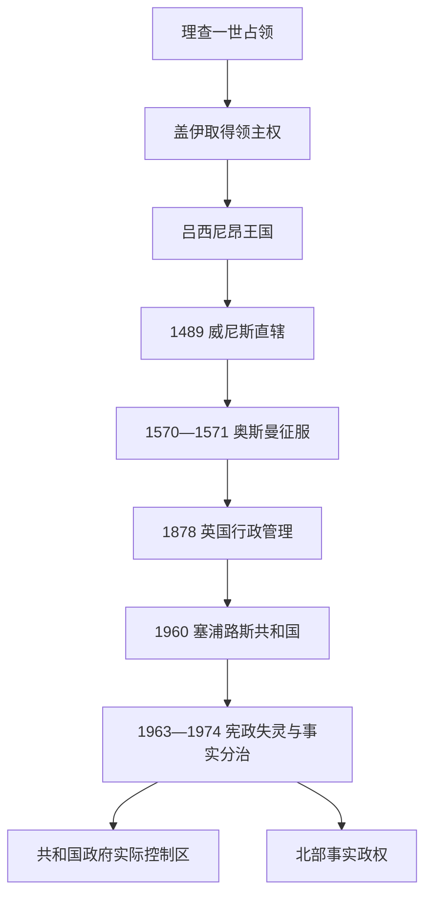

# 塞浦路斯君主、殖民长官与国家元首表

## 时间

1192年至今（现代资料核验截至2026年7月13日）

## 概括

本表把塞浦路斯不同时期的世袭君主、英国殖民行政首脑、共和国总统、宪制上的土耳其族副总统，以及北部事实政权的领导人与政府首脑分别列出。不同表格代表不同法理与政治结构，不能把北部事实政权的职位等同于获普遍承认国家的职位，也不能把英国独立后的驻塞高级专员同殖民时期总督混淆。

古代城市王国的铭文与钱币材料不够连续，不能重建“全岛完整王统”；相关可证统治者见[古代王国、罗马与拜占庭塞浦路斯](/%E4%BA%BA%E6%96%87%E7%A7%91%E5%AD%A6/%E5%8E%86%E5%8F%B2/%E8%A5%BF%E4%BA%9A/%E5%A1%9E%E6%B5%A6%E8%B7%AF%E6%96%AF/%E5%8F%A4%E4%BB%A3%E7%8E%8B%E5%9B%BD%E3%80%81%E7%BD%97%E9%A9%AC%E4%B8%8E%E6%8B%9C%E5%8D%A0%E5%BA%AD%E5%A1%9E%E6%B5%A6%E8%B7%AF%E6%96%AF.md)。

## 吕西尼昂王国君主

盖伊最初取得的是岛屿领主权；其兄艾默里得到神圣罗马皇帝承认并于1197年加冕后，“塞浦路斯国王”称号才制度化。以下按实际统治段排列，摄政、共治与夺权另作说明。

| 顺序 | 君主或实际统治者 | 王室 / 身份 | 在位或掌权时间 | 与前任关系 | 关键事件与备注 |
|---:|---|---|---|---|---|
| 1 | **盖伊·德·吕西尼昂** | 吕西尼昂家族；塞浦路斯领主 | 1192—1194年 | 新建政权 | 从理查一世取得塞浦路斯；未以塞浦路斯国王身份加冕。 |
| 2 | **艾默里（阿马尔里克）** | 吕西尼昂家族 | 1194—1205年 | 盖伊之兄 | 1197年加冕为首位正式塞浦路斯国王；一度兼任耶路撒冷国王。 |
| 3 | 于格一世 | 吕西尼昂家族 | 1205—1218年 | 艾默里之子 | 即位时年幼，前期由蒙贝利亚尔的沃尔特摄政。 |
| 4 | 亨利一世 | 吕西尼昂家族 | 1218—1253年 | 于格一世之子 | 幼年即位；伊贝林家族与腓特烈二世派系争夺摄政，1232年阿格里迪战役后伊贝林派占上风。 |
| 5 | 于格二世 | 吕西尼昂家族 | 1253—1267年 | 亨利一世之子 | 幼主；安条克的普莱桑斯及安条克—吕西尼昂的于格先后摄政；无嗣去世。 |
| 6 | 于格三世 | 安条克—吕西尼昂支系 | 1267—1284年 | 亨利一世之外孙系亲属 | 开启旁支继承；1268年起主张耶路撒冷王位。 |
| 7 | 约翰一世 | 安条克—吕西尼昂支系 | 1284—1285年 | 于格三世长子 | 在位短暂，无嗣。 |
| 8 | 亨利二世 | 安条克—吕西尼昂支系 | 1285—1306年、1310—1324年 | 约翰一世之弟 | 1291年阿卡失守；1306年被弟弟阿马尔里克夺权，1310年复位。 |
| — | 阿马尔里克（推罗亲王） | 王弟；摄政 / 实际统治者 | 1306—1310年 | 亨利二世之弟 | 迫使亨利二世离岛，自称“总督与摄政”而未正式称王；遇刺后亨利复位。 |
| 9 | 于格四世 | 安条克—吕西尼昂支系 | 1324—1358年 | 亨利二世之侄 | 整顿财政与王权，王国贸易繁荣；1358年让位。 |
| 10 | **彼得一世** | 安条克—吕西尼昂支系 | 1358—1369年 | 于格四世之子 | 1361年夺取安塔利亚、1365年劫掠亚历山大港；扩张耗费财政，后被宫廷贵族杀害。 |
| 11 | 彼得二世 | 安条克—吕西尼昂支系 | 1369—1382年 | 彼得一世之子 | 幼年即位；1373—1374年热那亚战争后法马古斯塔落入热那亚控制。 |
| 12 | 詹姆斯一世 | 安条克—吕西尼昂支系 | 1382—1398年 | 彼得二世之叔 | 曾被热那亚拘押；以承认热那亚利益为代价返岛即位。 |
| 13 | 雅努斯 | 安条克—吕西尼昂支系 | 1398—1432年 | 詹姆斯一世之子 | 1426年希罗基蒂亚战败被马穆鲁克俘虏，获释后王国向马穆鲁克纳贡。 |
| 14 | 约翰二世 | 安条克—吕西尼昂支系 | 1432—1458年 | 雅努斯之子 | 宫廷中希腊、拉丁及那不勒斯派系竞争；继承危机加深。 |
| 15 | 夏洛特 | 安条克—吕西尼昂支系 | 1458—1464年 | 约翰二世婚生女 | 1459年起与丈夫路易共治；被异母弟詹姆斯夺位，流亡后仍保留王位主张。 |
| — | 萨伏依的路易 | 王夫、共治国王 | 1459—1464年 | 夏洛特之夫 | 以共治者身份列入，不构成独立继承段。 |
| 16 | 詹姆斯二世 | 安条克—吕西尼昂支系 | 1464—1473年 | 约翰二世非婚生子；夏洛特异母弟 | 借马穆鲁克支持夺位，1464年迫使热那亚交还法马古斯塔；与威尼斯贵族卡特琳娜·科尔纳罗成婚。 |
| 17 | 詹姆斯三世 | 安条克—吕西尼昂支系 | 1473—1474年 | 詹姆斯二世遗腹子 | 婴儿国王，由母亲及亲威尼斯摄政集团掌权；一岁夭折。 |
| 18 | **卡特琳娜·科尔纳罗** | 科尔纳罗家族；王后转为在位女王 | 1474—1489年 | 詹姆斯二世遗孀、詹姆斯三世之母 | 在威尼斯强力监督下统治；1489年被迫退位并把岛屿交给威尼斯共和国。 |

## 英国殖民时期高级专员

1878—1914年英国依据《塞浦路斯协定》行政管理该岛，奥斯曼帝国仍保有名义主权；1914年英国单方面吞并，1925年以前行政首脑仍称高级专员。

| 顺序 | 高级专员 | 任期 | 性质与备注 |
|---:|---|---|---|
| 1 | 约翰·海勋爵 | 1878年7月12—22日 | 代理，负责接管初期。 |
| 2 | 加内特·沃尔斯利爵士 | 1878年7月22日—1879年6月23日 | 首位常任高级专员，建立英国行政。 |
| 3 | 罗伯特·比杜尔夫爵士 | 1879年6月23日—1886年3月9日 | 延续税收与公共工程改革。 |
| 4 | 亨利·布尔沃爵士 | 1886年3月9日—1892年4月5日 | 面对代表制和财政争议。 |
| 5 | 沃尔特·森德尔爵士 | 1892年4月5日—1898年4月23日 | 立法委员会与社群政治继续发展。 |
| 6 | 威廉·海恩斯·史密斯爵士 | 1898年4月23日—1904年10月17日 | 公共卫生、道路和农业行政扩展。 |
| 7 | 查尔斯·金—哈曼爵士 | 1904年10月17日—1911年10月12日 | 并入希腊诉求日益公开化。 |
| 8 | 汉密尔顿·古尔德—亚当斯 | 1911年10月12日—1915年1月8日 | 任内英国于1914年吞并塞浦路斯。 |
| 9 | 约翰·克劳森爵士 | 1915年1月8日—1918年12月31日 | 第一次世界大战时期行政首脑，任内去世。 |
| 10 | 马尔科姆·史蒂文森爵士 | 1918年12月31日—1925年3月10日 | 1920年前为代理；1925年殖民地改制后转任总督。 |

## 英国直辖殖民地总督

| 顺序 | 总督 | 任期 | 关键事件与备注 |
|---:|---|---|---|
| 1 | 马尔科姆·史蒂文森爵士 | 1925年3月10日—1926年11月30日 | 首任总督，完成直辖殖民地制度转换。 |
| 2 | 罗纳德·斯托尔斯爵士 | 1926年11月30日—1932年10月29日 | 1931年十月起义爆发，政府大楼被焚。 |
| 3 | 雷金纳德·斯塔布斯爵士 | 1932年10月29日—1933年11月8日 | 起义后紧缩政治空间。 |
| 4 | 赫伯特·里士满·帕尔默爵士 | 1933年11月8日—1939年7月4日 | 强化总督专断统治，此阶段常被称为“帕尔默统治”。 |
| 5 | 威廉·巴特希尔 | 1939年7月4日—1941年10月3日 | 第二次世界大战初期。 |
| 6 | 查尔斯·伍利 | 1941年10月3日—1946年10月24日 | 塞浦路斯人员参与盟军战争，战后政治诉求复起。 |
| 7 | 温斯特勋爵雷金纳德·弗莱彻 | 1946年10月24日—1949年8月4日 | 尝试宪政咨询，但并合与自治立场难以调和。 |
| 8 | 安德鲁·赖特爵士 | 1949年8月4日—1954年2月 | 1950年教会组织并合公投，英国拒绝承认其约束力。 |
| 9 | 罗伯特·阿米蒂奇爵士 | 1954年2月—1955年9月25日 | EOKA于1955年发动武装行动。 |
| 10 | 约翰·哈丁爵士 | 1955年10月3日—1957年10月22日 | 实施紧急状态和反叛乱措施；谈判与镇压并行。 |
| 11 | **休·富特爵士** | 1957年12月3日—1960年8月16日 | 最后一任总督；执行苏黎世—伦敦独立安排。 |

1955—1960年副总督乔治·辛克莱在总督更替空档承担行政职责，但不是一段独立总督任期。

## 塞浦路斯共和国总统

共和国实行总统制，没有总理职位。官方总统序列按正式当选总统计为八任；1974年政变中的事实掌权者与代行总统另列，不计入官方序号。

| 官方顺序 | 总统 | 任期 | 政治阶段与备注 |
|---:|---|---|---|
| 1 | **马卡里奥斯三世** | 1960—1977年 | 首任总统；1963年权力分享宪制失灵；1974年政变时短暂流亡，12月复职。 |
| 2 | 斯皮罗斯·基普里亚努 | 1977—1988年 | 马卡里奥斯逝世后先代行，继而当选；分治后的制度重建与谈判。 |
| 3 | 乔治·瓦西利乌 | 1988—1993年 | 推动经济与行政现代化，1990年申请加入欧洲共同体。 |
| 4 | 格拉夫科斯·克莱里季斯 | 1993—2003年 | 欧盟入盟谈判和防务现代化；统一谈判持续。 |
| 5 | 塔索斯·帕帕佐普洛斯 | 2003—2008年 | 反对2004年安南方案；共和国加入欧盟。 |
| 6 | 季米特里斯·赫里斯托菲亚斯 | 2008—2013年 | 同北部领导人塔拉特恢复密集统一谈判。 |
| 7 | 尼科斯·阿纳斯塔夏季斯 | 2013—2023年 | 2013年金融危机处置；2017年克朗—蒙大拿会谈未果。 |
| 8 | **尼科斯·赫里斯托祖利季斯** | 2023年至今 | 2023年2月当选并就职；截至2026年7月13日仍在任。 |

### 1974年政变造成的总统权力中断

| 人物 | 掌权时间 | 身份与说明 |
|---|---|---|
| 尼科斯·桑普森 | 1974年7月15—23日 | 希腊军政府支持的政变当局所立事实总统，不属于正常宪制继承。 |
| 格拉夫科斯·克莱里季斯 | 1974年7月23日—12月7日 | 以众议院议长身份代行总统，直至马卡里奥斯回国复职。 |

## 宪制上的土耳其族副总统

| 顺序 | 人物 | 任期 | 说明 |
|---:|---|---|---|
| 1 | 法兹尔·屈曲克 | 1960—1973年 | 1963年后不再实际参与共和国中央行政，但其宪制身份延续至卸任。 |
| 2 | 拉乌夫·登克塔什 | 1973—1974年 | 经土耳其族社群选出；1974年后该席位实际空缺，后来转为北部政治领导人。 |

副总统席位自1974年起一直没有按1960年宪法恢复运作；这不等于该宪法职位在法律文本中被废除。

## 北部事实政权领导人

本表记录事实管治结构，不表示承认其1983年单方面独立。联合国安理会第541号和第550号决议否定该独立宣告的法律效力。

| 顺序 | 领导人 | 任期 | 职位与政治取向 |
|---:|---|---|---|
| 1 | **拉乌夫·登克塔什** | 1975年2月13日—2005年4月24日 | 先任“土耳其族联邦邦”领导人，1983年后任北部事实政权总统；长期强调主权平等与安全保障。 |
| 2 | 穆罕默德·阿里·塔拉特 | 2005年4月24日—2010年4月23日 | 支持以两区两族联邦为基础谈判。 |
| 3 | 德尔维什·埃罗卢 | 2010年4月23日—2015年4月30日 | 继续谈判但更强调两方平等地位。 |
| 4 | 穆斯塔法·阿肯哲 | 2015年4月30日—2020年10月23日 | 联邦派；任内参加2017年克朗—蒙大拿会谈。 |
| 5 | 埃尔辛·塔塔尔 | 2020年10月23日—2025年10月24日 | 主张以两个主权国家为基础解决。 |
| 6 | **图凡·埃尔许尔曼** | 2025年10月24日至今 | 2025年10月19日当选；主张回到联合国参数下的联邦谈判，截至2026年7月13日在任。 |

## 北部事实政权政府首脑

1975—1983年职位属于“塞浦路斯土耳其族联邦邦”，1983年以后属于北部事实政权。复任与代理均按实际任职段列出。

| 任职段 | 政府首脑 | 任期 | 备注 |
|---:|---|---|---|
| 1 | 拉乌夫·登克塔什 | 1975年2月13日—1976年7月3日 | 建制初期兼掌行政。 |
| 2 | 内贾特·科努克 | 1976年7月3日—1978年4月21日 | 首次任职。 |
| 3 | 奥斯曼·厄雷克 | 1978年4月21日—12月12日 | 短期政府。 |
| 4 | 穆斯塔法·恰阿塔伊 | 1978年12月12日—1983年12月13日 | 跨越1983年单方面独立宣告，职位名称随建制改变。 |
| 5 | 内贾特·科努克 | 1983年12月13日—1985年7月19日 | 第二次任职。 |
| 6 | 德尔维什·埃罗卢 | 1985年7月19日—1994年1月1日 | 第一次任职。 |
| 7 | 哈克厄·阿通 | 1994年1月1日—1996年8月16日 | 民主党政府。 |
| 8 | 德尔维什·埃罗卢 | 1996年8月16日—2004年1月13日 | 第二次任职。 |
| 9 | 穆罕默德·阿里·塔拉特 | 2004年1月13日—2005年4月23日 | 后转任领导人。 |
| 10 | 塞尔达尔·登克塔什 | 2005年4月23—26日 | 代理。 |
| 11 | 费尔迪·萨比特·索耶 | 2005年4月26日—2009年5月5日 | 共和土耳其党政府。 |
| 12 | 德尔维什·埃罗卢 | 2009年5月5日—2010年4月23日 | 第三次任职，后转任领导人。 |
| 13 | 许塞因·厄兹居尔京 | 2010年4月23日—5月17日 | 代理。 |
| 14 | 伊尔森·屈曲克 | 2010年5月17日—2013年6月13日 | 民族团结党政府。 |
| 15 | 西贝尔·西贝尔 | 2013年6月13日—9月2日 | 过渡政府；首位女性政府首脑。 |
| 16 | 厄兹坎·约尔甘哲奥卢 | 2013年9月2日—2015年7月16日 | 共和土耳其党政府。 |
| 17 | 厄梅尔·卡尔永朱 | 2015年7月16日—2016年4月16日 | 联合政府。 |
| 18 | 许塞因·厄兹居尔京 | 2016年4月16日—2018年2月2日 | 正式任期。 |
| 19 | 图凡·埃尔许尔曼 | 2018年2月2日—2019年5月22日 | 四党联合政府。 |
| 20 | 埃尔辛·塔塔尔 | 2019年5月22日—2020年10月23日 | 后转任领导人。 |
| 21 | 埃尔桑·萨内尔 | 2020年12月9日—2021年11月5日 | 在塔塔尔转任领导人后的看守与组阁过渡中就任。 |
| 22 | 法伊兹·苏居奥卢 | 2021年11月5日—2022年5月12日 | 连续组建短命内阁。 |
| 23 | **于纳尔·于斯泰尔** | 2022年5月12日至今 | 民族团结党；截至2026年7月13日仍任政府首脑。 |

## 演变关系

- 中世纪、奥斯曼和英国阶段见[十字军、威尼斯、奥斯曼与英国统治](/%E4%BA%BA%E6%96%87%E7%A7%91%E5%AD%A6/%E5%8E%86%E5%8F%B2/%E8%A5%BF%E4%BA%9A/%E5%A1%9E%E6%B5%A6%E8%B7%AF%E6%96%AF/%E5%8D%81%E5%AD%97%E5%86%9B%E3%80%81%E5%A8%81%E5%B0%BC%E6%96%AF%E3%80%81%E5%A5%A5%E6%96%AF%E6%9B%BC%E4%B8%8E%E8%8B%B1%E5%9B%BD%E7%BB%9F%E6%B2%BB.md)。
- 共和国、分治和谈判进程见[独立、族群冲突与岛屿分治](/%E4%BA%BA%E6%96%87%E7%A7%91%E5%AD%A6/%E5%8E%86%E5%8F%B2/%E8%A5%BF%E4%BA%9A/%E5%A1%9E%E6%B5%A6%E8%B7%AF%E6%96%AF/%E7%8B%AC%E7%AB%8B%E3%80%81%E6%97%8F%E7%BE%A4%E5%86%B2%E7%AA%81%E4%B8%8E%E5%B2%9B%E5%B1%BF%E5%88%86%E6%B2%BB.md)。
- 上级入口：[塞浦路斯](/%E4%BA%BA%E6%96%87%E7%A7%91%E5%AD%A6/%E5%8E%86%E5%8F%B2/%E8%A5%BF%E4%BA%9A/%E5%A1%9E%E6%B5%A6%E8%B7%AF%E6%96%AF/README.md)。
