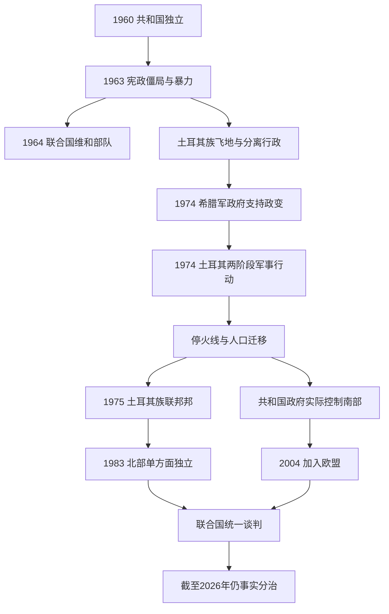

# 独立、族群冲突与岛屿分治

## 时间

1960年至今（核验截至2026年7月13日）

## 概括

1960年塞浦路斯共和国以希腊族总统、土耳其族副总统和固定社群配额组成权力分享共和国。它既不是多数决民主的简单版本，也不是两个领土邦先组成的联邦：宪法先按社群分配中央职位，同时保留统一国家、独立司法和分别处理教育宗教事务的社群机构。英国、希腊和土耳其成为保证国，英国保留阿克罗蒂里与泽凯利亚主权基地区。

制度在1963年修宪争议和族群暴力中失灵。土耳其族官员退出或无法回到中央机构，若干土耳其族聚居区形成飞地，联合国维和部队自1964年起驻岛。1974年希腊军政府支持政变推翻马卡里奥斯；土耳其以《保证条约》为依据发动两阶段军事行动，最后控制岛屿约36%—37%。政变、战争、暴力和人口迁徙造成南北事实分治。

共和国在国际上继续代表全岛并于2004年加入欧盟，但其政府无法在北部行使有效控制，欧盟法律在该区暂停适用。北部1983年单方面宣布建立“北塞浦路斯土耳其共和国”，仅获土耳其承认。联合国主导的多轮统一谈判尚未解决治理、政治平等、领土、财产、安全、保证与军队等问题。

## 1960年权力分享宪制

| 机构 | 原始安排 | 运行难点 |
|---|---|---|
| 总统与副总统 | 希腊族选总统、土耳其族选副总统；两者对外交、防务和安全等事项拥有分别否决权 | 缺少可在僵局后强制调解的政治机制。 |
| 部长会议 | 7名希腊族部长、3名土耳其族部长，分别由总统与副总统任命 | 内阁责任同时面向国家与社群领导。 |
| 众议院 | 席位按70:30分配，两族分别投票 | 法案在税收、选举等事项上需分别多数，容易停滞。 |
| 公务员 | 原则上70:30 | 同实际人口比例和既有专业人员结构差异大，落实缓慢。 |
| 军队 | 原则上60:40 | 两族安全观不一，统一指挥困难。 |
| 市政 | 宪法设想在五个主要城市建立分别市政机构 | 财政、边界和服务分割长期争执。 |
| 社群议院 | 两族分别处理教育、文化、宗教和个人身份等事务 | 有助自治，也强化政治组织按社群分立。 |
| 保证与联盟 | 英国、希腊、土耳其保证独立、领土完整与宪制；希土可驻有限部队 | 条约第四条的干预范围及1974年行动是否超出目的至今有根本争议。 |

共和国是总统制国家，没有总理。完整总统、土耳其族副总统、北部领导人与政府首脑序列见[塞浦路斯君主、殖民长官与国家元首表](/%E4%BA%BA%E6%96%87%E7%A7%91%E5%AD%A6/%E5%8E%86%E5%8F%B2/%E8%A5%BF%E4%BA%9A/%E5%A1%9E%E6%B5%A6%E8%B7%AF%E6%96%AF/%E5%A1%9E%E6%B5%A6%E8%B7%AF%E6%96%AF%E5%90%9B%E4%B8%BB%E3%80%81%E6%AE%96%E6%B0%91%E9%95%BF%E5%AE%98%E4%B8%8E%E5%9B%BD%E5%AE%B6%E5%85%83%E9%A6%96%E8%A1%A8.md)。

## 分阶段过程

### 1960—1963年：制度建立与僵局

苏黎世—伦敦安排结束反殖民战争，却不是岛内两社群自行长期谈判形成的社会契约。马卡里奥斯三世和法兹尔·屈曲克分别担任总统、副总统，双方共同组阁；但税法、军队组织、配额与分别市政很快产生僵局。希腊族多数认为30%配额和否决权过度限制多数治理，土耳其族则把这些条款视为防止被并入希腊或被多数吞没的最低保障。

1963年11月马卡里奥斯提出十三项修宪建议，包括取消或限制否决、统一市政和调整部分社群表决机制。土耳其和土耳其族领导层认为这会拆除建国平衡，拒绝方案。12月尼科西亚一起警察检查引发枪击，随后出现被称为“血腥圣诞”的族群冲突、报复和居民逃离。土耳其族部长、公务员及议员此后不再参加中央机构；究竟是主动退出、被迫离开还是无法安全返回，双方叙事不同，实际结果都是权力分享停止运作。

### 1964—1967年：飞地、维和与母国介入

1964年联合国安理会建立塞浦路斯维和部队，防止冲突复发并维持法律秩序。共和国政府由希腊族官员继续运作，国际承认没有转移；土耳其族社群则在分散飞地中建立自己的行政与防卫组织。经济封锁、道路管制和武装对峙强化了空间分隔。

希腊向岛上秘密增加部队，土耳其多次威胁干预，美国和北约担心两盟国开战。1964年提利里亚 / 科基纳冲突中土耳其空军轰炸塞浦路斯目标。1967年科菲努冲突后，希腊被迫撤回格里瓦斯及部分部队，紧张暂缓，但共同宪制没有恢复。

### 1968—1974年：谈判、EOKA B与政变

两族代表从1968年起谈判地方自治和中央权力。马卡里奥斯逐渐从立即“并入希腊”转向维护独立，这使他同雅典军政府及极端并合派冲突。格里瓦斯1971年建立EOKA B，以袭击和胁迫推动并合；共和国政府与该组织发生武装对抗。1974年格里瓦斯去世后，希腊军政府仍通过国民警卫队军官影响EOKA B网络。

1974年7月15日，国民警卫队发动政变并攻击总统府，马卡里奥斯逃脱，尼科斯·桑普森被立为事实总统。政变目标及其支持者同并合计划相连，破坏了1960年宪制，也使土耳其认定土耳其族安全和条约秩序受到直接威胁。

### 1974年两阶段军事行动

1. **第一阶段**：7月20日土耳其军队在凯里尼亚附近登陆并空降部队，建立连接海岸和尼科西亚北部土耳其族区的走廊。土耳其援引《保证条约》第四条，希腊族和多数国际叙述称其为入侵。7月22日停火时桥头堡有限，但战线混乱。
2. **政变结束与谈判**：7月23日希腊军政府和桑普森政权垮台，格拉夫科斯·克莱里季斯代行总统。英国、希腊、土耳其在日内瓦会谈，围绕停火线、飞地和未来联邦安排分歧严重。
3. **第二阶段**：8月14日土耳其军恢复进攻，向东夺取法马古斯塔、向西扩展至莫尔富一带，控制约36%—37%的岛屿。8月16日形成大体延续至今的停火线。
4. **人口迁移**：大量希腊族居民从北部向南逃离或被迫迁出，土耳其族居民则从南部飞地向北集中；被俘、失踪者、财产和宗教遗产问题延续数十年。1975年的维也纳安排促进剩余人口转移，使地理分隔进一步固化。

条约确实允许保证国在无法共同行动时采取行动以恢复建国秩序；但土耳其第二阶段进攻、长期驻军、人口政策和北部建制是否符合“恢复秩序”的限定，存在持续法律与政治争议。记录这一争议不能抹去政变在先，也不能把后续控制自动视为合法。

### 1975—1983年：分治制度化

1975年北部宣布成立“塞浦路斯土耳其族联邦邦”，名义上把自身描述为未来联邦的一部分；双方开展人口转移，并以克莱里季斯—登克塔什等谈判讨论两区联邦。1977年和1979年高级别协议确认以两族、两区联邦为目标，但中央权力、领土和返回权没有解决。

1983年11月15日北部单方面宣布独立。联合国安理会第541号决议认定宣告在法律上无效，第550号决议要求各国不承认并谴责任何协助分离的行动。土耳其是唯一承认者，并在军事、财政、贸易和基础设施上成为北部最重要支撑。

### 1983—2004年：谈判框架与欧洲化

联合国逐步形成“两区、两族联邦、政治平等、单一国际人格”的参数。1990年共和国申请加入欧洲共同体，使统一问题同欧洲一体化结合；土耳其族领导层担忧共和国以全岛名义单独入盟，希腊族则认为入盟可提供权利与安全框架。

2003年北部当局开放首批通行点，数十年来被隔离的居民开始跨越缓冲区。开放没有改变停火线或财产权，却显著增加日常接触。

2004年联合国“安南方案”拟建立两组成邦的联合塞浦路斯共和国，安排权力分享、领土调整、有限返回、财产补偿、军队和保证过渡。4月24日同时公投中，约64.9%的土耳其族选民赞成，约75.8%的希腊族选民反对，方案未生效。希腊族反对理由包括安全、驻军、定居者、财产执行和联邦运作风险；土耳其族赞成也不代表所有人接受每项条款。

5月1日塞浦路斯共和国以全岛法理范围加入欧盟，欧盟法在政府无法有效控制的北部暂停适用。北部居民可依共和国法律取得欧盟公民身份，但商品、港口和机构的适用问题仍受分治限制。

### 2004—2020年：反复接近与失败

2008年赫里斯托菲亚斯与塔拉特恢复全面谈判，在治理、经济和欧盟事务上形成部分趋同。2015年阿纳斯塔夏季斯与阿肯哲再次推进，讨论轮值总统、领土地图、财产委员会、安全和保证。

2017年瑞士克朗—蒙大拿会议把岛内双方、三保证国和欧盟集中到同一框架，接近处理安全保证与治理交换，但在土耳其军队的撤留时间表、单边干预权、有效参与和最终方案打包方式上破裂。双方此后互相指责对方拒绝最后妥协，不能把失败归结为单一议题或个人。

### 2020—2026年：两国主张与联邦参数竞争

埃尔辛·塔塔尔2020年当选北部领导人后，同土耳其主张以“两个主权国家”及先承认主权平等为谈判前提；共和国和联合国继续坚持既有联邦参数，正式谈判难以启动。瓦罗沙局部开放、近海能源和东地中海海权争议进一步降低互信。

2025年3月日内瓦扩大非正式会议和7月纽约会议没有开启最终地位谈判，但同意或推进新增通行点、排雷、青年技术委员会、环境与气候合作、缓冲区太阳能及文化遗产等信任措施。图凡·埃尔许尔曼于2025年10月19日以超过62%的得票当选北部领导人，10月24日就职，主张回到联合国参数下的联邦谈判。11月双方领导人首次正式会面。

2026年1月联合国特使再次访岛并促成接触，联合国秘书长在2月会见埃尔许尔曼、3月会见共和国总统尼科斯·赫里斯托祖利季斯。到2026年7月13日，双方仍未进入一项可提交公投的全面协议；信任措施有所推进，但新通行点、主权前提和正式谈判方法仍有分歧。

## 当前实际权力结构

| 区域 / 机构 | 截至2026年7月13日的状态 | 主要负责人 |
|---|---|---|
| 塞浦路斯共和国 | 国际承认并在联合国、欧盟代表全岛；实际控制南部 | 总统尼科斯·赫里斯托祖利季斯；无总理。 |
| 北部事实政权 | 自称“北塞浦路斯土耳其共和国”，仅获土耳其承认，高度依赖土耳其 | 领导人图凡·埃尔许尔曼；政府首脑于纳尔·于斯泰尔。 |
| 联合国缓冲区 | 由塞浦路斯维和部队巡逻，包含尼科西亚分割线和若干村落 | 联合国维和及民政体系，不是独立政权。 |
| 英国主权基地区 | 阿克罗蒂里与泽凯利亚由英国保留主权 | 英国军事行政，不属于共和国或北部事实政权。 |
| 保证国 | 英国、希腊、土耳其 | 条约地位仍在，未来安全安排是谈判核心争议。 |

## 重要事件与长期影响

| 时间 | 事件 | 直接结果 | 长期影响 |
|---|---|---|---|
| 1960年 | 共和国独立 | 两族权力分享、三国保证、英国基地保留 | 制度安全性依赖社群合作和外部克制。 |
| 1963—1964年 | 修宪危机与族群暴力 | 土耳其族不再参与中央政府，联合国驻军 | 统一国家机构与分离社群行政长期并存。 |
| 1974年 | 政变与土耳其两阶段军事行动 | 事实停火线、人口大迁移 | 领土、失踪者、财产、驻军成为核心问题。 |
| 1983年 | 北部单方面独立 | 仅土耳其承认 | 国际孤立与对土耳其依赖制度化。 |
| 2003年 | 通行点开放 | 居民可有限跨线 | 日常接触增加，但不等于政治承认或问题解决。 |
| 2004年 | 安南方案公投与加入欧盟 | 方案被一方否决；共和国入盟 | 欧盟法在北部暂停，统一激励与不对称同时增加。 |
| 2017年 | 克朗—蒙大拿会议失败 | 高层方案未能打包 | 双方对联邦可行性和责任归属更不信任。 |
| 2025—2026年 | 新一轮非正式接触 | 推进有限信任措施，北部领导人更替 | 联邦参数出现重启可能，但正式谈判仍受前提分歧阻碍。 |

## 冲突延续原因

- **结构因素**：1960年制度把社群身份固定为政治权利来源，却缺少跨社群政党、僵局仲裁和可共同接受的修宪程序。
- **安全困境**：希腊族担心驻军、干预权和事实分治永久化；土耳其族担心多数统治、历史暴力重演和政治平等被架空。任何一方增加安全保障，常被另一方视为威胁。
- **外部压力**：希腊、土耳其、英国、北约、欧盟和东地中海能源把岛内争议同更大地缘政治相连，外部力量既能促成协议，也能支撑僵局。
- **财产与人口**：1974年前后的原住者、现使用者、继承人、移民和定居者权利相互重叠，领土调整必然牵动住房、生计和赔偿。
- **直接谈判障碍**：联邦谈判要求先接受单一主权框架；两国方案则要求先承认北部主权平等。双方对谈判起点本身没有共同定义。

## 关键辨析

- “塞浦路斯共和国代表全岛”是国际法与国际组织席位层面的事实，不等于其政府实际治理北部。
- “北塞浦路斯土耳其共和国有完整政府机构”是事实控制层面的描述，不等于获得普遍国际承认。
- 1974年不能只从7月20日开始叙述，也不能因7月15日政变而省略第二阶段进攻和长期控制；完整因果链必须同时保留。
- “两区、两族联邦”不是两个既有主权国家松散结盟，而是联合国框架下的单一主权、单一国际人格和两个组成区。
- 通行点开放、跨线贸易和技术委员会属于缓和措施，不自动改变停火线、财产所有权或承认状态。

## 演变关系

- 前一阶段：[十字军、威尼斯、奥斯曼与英国统治](/%E4%BA%BA%E6%96%87%E7%A7%91%E5%AD%A6/%E5%8E%86%E5%8F%B2/%E8%A5%BF%E4%BA%9A/%E5%A1%9E%E6%B5%A6%E8%B7%AF%E6%96%AF/%E5%8D%81%E5%AD%97%E5%86%9B%E3%80%81%E5%A8%81%E5%B0%BC%E6%96%AF%E3%80%81%E5%A5%A5%E6%96%AF%E6%9B%BC%E4%B8%8E%E8%8B%B1%E5%9B%BD%E7%BB%9F%E6%B2%BB.md)。
- 土耳其国家背景见[土耳其](/%E4%BA%BA%E6%96%87%E7%A7%91%E5%AD%A6/%E5%8E%86%E5%8F%B2/%E8%A5%BF%E4%BA%9A/%E5%9C%9F%E8%80%B3%E5%85%B6/README.md)。
- 上级入口：[塞浦路斯](/%E4%BA%BA%E6%96%87%E7%A7%91%E5%AD%A6/%E5%8E%86%E5%8F%B2/%E8%A5%BF%E4%BA%9A/%E5%A1%9E%E6%B5%A6%E8%B7%AF%E6%96%AF/README.md)。
