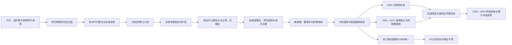

# 阿拉伯半岛历史

阿拉伯半岛位于红海、波斯湾、阿拉伯海和印度洋之间。其历史不能只从伊斯兰或石油时代理解：南部灌溉王国、东部青铜时代港口、汉志绿洲与圣地、阿曼海上网络、内志部落国家和海湾珍珠城市各有不同节奏。现代七国及也门的边界来自地方王朝、奥斯曼和英国条约、统一战争、去殖民与石油国家建设的叠加，不能倒投为古代固定国界。

## 历史主线

- **古代多中心：**也门高地以水利和乳香贸易支撑王国；阿曼、巴林与海湾连接两河和印度洋；西北、汉志及内志绿洲串联商队和牧业。
- **伊斯兰共同体：**穆罕默德在麦加传教、622年迁往麦地那，至630年代初把半岛多数政治集团纳入新共同体。
- **圣地与地方化：**哈里发首都外移后，麦加和麦地那保有宗教中心地位；阿曼伊巴德派、也门宰德派、东部卡尔马特和地方王朝形成多元秩序。
- **近世帝国竞争：**奥斯曼控制汉志及部分也门、东海岸，葡萄牙争夺港口，阿曼王朝扩张印度洋；实际统治常依赖谢里夫、伊玛目和部落首领。
- **现代国家形成：**沙特国家经历两次覆亡后由伊本·沙特统一；英国以海上休战和保护协议重组海湾；亚丁殖民使也门南北走向不同。
- **石油和安全：**1930年代以后油气改变财政、劳工和城市，但王朝、议会、联邦、共和国和内战国家仍有不同制度轨迹。2026年霍尔木兹危机再次暴露能源航路和外部安全的脆弱性。

## 区域专题导航

| 顺序 | 专题 | 时间 | 简要概括 |
|---|---|---|---|
| 1 | [古代南阿拉伯、绿洲与商路](/%E4%BA%BA%E6%96%87%E7%A7%91%E5%AD%A6/%E5%8E%86%E5%8F%B2/%E8%A5%BF%E4%BA%9A/%E9%98%BF%E6%8B%89%E4%BC%AF%E5%8D%8A%E5%B2%9B/%E5%8F%A4%E4%BB%A3%E5%8D%97%E9%98%BF%E6%8B%89%E4%BC%AF%E3%80%81%E7%BB%BF%E6%B4%B2%E4%B8%8E%E5%95%86%E8%B7%AF.md) | 约前3千纪—7世纪初 | 马干、迪尔蒙、萨巴诸王国、乳香贸易、希木叶尔、阿克苏姆和萨珊介入。 |
| 2 | [伊斯兰兴起、哈里发与地方王朝](/%E4%BA%BA%E6%96%87%E7%A7%91%E5%AD%A6/%E5%8E%86%E5%8F%B2/%E8%A5%BF%E4%BA%9A/%E9%98%BF%E6%8B%89%E4%BC%AF%E5%8D%8A%E5%B2%9B/%E4%BC%8A%E6%96%AF%E5%85%B0%E5%85%B4%E8%B5%B7%E3%80%81%E5%93%88%E9%87%8C%E5%8F%91%E4%B8%8E%E5%9C%B0%E6%96%B9%E7%8E%8B%E6%9C%9D.md) | 约570—15世纪 | 麦加—麦地那共同体、里达战争、帝国中心外移及谢里夫、伊玛目和地方王朝。 |
| 3 | [奥斯曼、英国与现代国家形成](/%E4%BA%BA%E6%96%87%E7%A7%91%E5%AD%A6/%E5%8E%86%E5%8F%B2/%E8%A5%BF%E4%BA%9A/%E9%98%BF%E6%8B%89%E4%BC%AF%E5%8D%8A%E5%B2%9B/%E5%A5%A5%E6%96%AF%E6%9B%BC%E3%80%81%E8%8B%B1%E5%9B%BD%E4%B8%8E%E7%8E%B0%E4%BB%A3%E5%9B%BD%E5%AE%B6%E5%BD%A2%E6%88%90.md) | 16—20世纪末 | 奥斯曼、葡萄牙和阿曼海权、三次沙特国家、英国保护体系、石油与独立。 |

## 国家导航

| 国家 | 入口 | 主线 |
|---|---|---|
| 沙特阿拉伯 | [沙特阿拉伯历史](/%E4%BA%BA%E6%96%87%E7%A7%91%E5%AD%A6/%E5%8E%86%E5%8F%B2/%E8%A5%BF%E4%BA%9A/%E9%98%BF%E6%8B%89%E4%BC%AF%E5%8D%8A%E5%B2%9B/%E6%B2%99%E7%89%B9%E9%98%BF%E6%8B%89%E4%BC%AF/README.md) | 汉志圣地、三次沙特国家、1932年统一、王室世系与石油国家。 |
| 也门 | [也门历史](/%E4%BA%BA%E6%96%87%E7%A7%91%E5%AD%A6/%E5%8E%86%E5%8F%B2/%E8%A5%BF%E4%BA%9A/%E9%98%BF%E6%8B%89%E4%BC%AF%E5%8D%8A%E5%B2%9B/%E4%B9%9F%E9%97%A8/README.md) | 南阿拉伯王国、宰德伊玛目、英属亚丁、南北分治、统一与内战。 |
| 阿曼 | [阿曼历史](/%E4%BA%BA%E6%96%87%E7%A7%91%E5%AD%A6/%E5%8E%86%E5%8F%B2/%E8%A5%BF%E4%BA%9A/%E9%98%BF%E6%8B%89%E4%BC%AF%E5%8D%8A%E5%B2%9B/%E9%98%BF%E6%9B%BC/README.md) | 马干、伊巴德派、海上帝国、内陆伊玛目制与现代苏丹国。 |
| 阿联酋 | [阿联酋历史](/%E4%BA%BA%E6%96%87%E7%A7%91%E5%AD%A6/%E5%8E%86%E5%8F%B2/%E8%A5%BF%E4%BA%9A/%E9%98%BF%E6%8B%89%E4%BC%AF%E5%8D%8A%E5%B2%9B/%E9%98%BF%E8%81%94%E9%85%8B/README.md) | 海湾港口、停战诸国、七酋长世系与联邦。 |
| 卡塔尔 | [卡塔尔历史](/%E4%BA%BA%E6%96%87%E7%A7%91%E5%AD%A6/%E5%8E%86%E5%8F%B2/%E8%A5%BF%E4%BA%9A/%E9%98%BF%E6%8B%89%E4%BC%AF%E5%8D%8A%E5%B2%9B/%E5%8D%A1%E5%A1%94%E5%B0%94/README.md) | 珍珠贸易、萨尼家族、奥斯曼—英国关系与天然气国家。 |
| 巴林 | [巴林历史](/%E4%BA%BA%E6%96%87%E7%A7%91%E5%AD%A6/%E5%8E%86%E5%8F%B2/%E8%A5%BF%E4%BA%9A/%E9%98%BF%E6%8B%89%E4%BC%AF%E5%8D%8A%E5%B2%9B/%E5%B7%B4%E6%9E%97/README.md) | 迪尔蒙、海湾贸易、哈利法王朝、石油与社会政治。 |
| 科威特 | [科威特历史](/%E4%BA%BA%E6%96%87%E7%A7%91%E5%AD%A6/%E5%8E%86%E5%8F%B2/%E8%A5%BF%E4%BA%9A/%E9%98%BF%E6%8B%89%E4%BC%AF%E5%8D%8A%E5%B2%9B/%E7%A7%91%E5%A8%81%E7%89%B9/README.md) | 港湾聚落、萨巴赫王朝、英国保护、议会与1990年入侵。 |

## 国家结构比较

| 维度 | 沙特、阿曼 | 科威特、巴林、卡塔尔 | 阿联酋 | 也门 |
|---|---|---|---|---|
| 建国基础 | 较大领土王朝；沙特经统一战争，阿曼由苏丹国—伊玛目传统重组 | 港口统治家族与英国保护协议 | 七个世袭酋长国组成联邦 | 北部伊玛目国与南部殖民地分别共和国化后统一 |
| 统治结构 | 君主和王族掌核心行政；宗教、部落和地区协商方式不同 | 世袭君主制；科威特议会权力相对突出，巴林和卡塔尔路径不同 | 联邦最高委员会由七位酋长组成，各酋长国保留广泛权限 | 共和国制度、部落、政党、军队和地方武装多中心竞争 |
| 能源 | 沙特大规模油气，阿曼储量和财政规模较小 | 油气收入高，人口和资源禀赋有差异 | 阿布扎比能源与联邦财政突出，迪拜更依赖贸易和服务 | 油气有限且战争破坏财政 |
| 外部安全 | 美国、英国及地区伙伴关系重要 | 小国依赖基地、条约和外交平衡 | 联邦军力与美欧、地区安全合作 | 沙特、阿联酋、伊朗相关力量及国际调停深度介入 |
| 社会结构 | 公民福利与外劳并存，地方、教派和宗教制度不同 | 公民—非公民分层明显 | 各酋长国人口和发展模式差异大 | 人口规模大、贫困、流离失所与地区裂痕突出 |

## 重要转折

| 时间 | 转折 | 意义 |
|---|---|---|
| 前3千纪 | 马干、迪尔蒙进入两河文献 | 半岛东部已参与跨海贸易。 |
| 前1千纪 | 萨巴等南阿拉伯国家兴盛 | 灌溉、神庙、农业和乳香路线支撑复杂政权。 |
| 3世纪后期 | 希木叶尔整合也门 | 多王国格局转向更大区域王权。 |
| 523—570年代 | 奈季兰事件、阿克苏姆和萨珊干预 | 宗教冲突与红海帝国竞争终结希木叶尔秩序。 |
| 610—630年 | 穆罕默德传教、希吉拉和麦加归附 | 新宗教政治共同体形成。 |
| 632—661年 | 里达战争与正统哈里发扩张 | 半岛整合后，帝国中心和税收转向外部征服区。 |
| 8—10世纪 | 阿曼伊玛目、也门宰德派、东部卡尔马特 | 地方伊斯兰制度在哈里发名义下分化。 |
| 1517年 | 奥斯曼取得汉志宗主权 | 苏丹承担圣地保护，地方谢里夫继续治理。 |
| 1650年 | 阿曼驱逐葡萄牙出马斯喀特 | 阿曼海权和东非网络扩张。 |
| 约1744年 | 沙特—宗教改革联盟 | 内志出现持续影响现代国家的扩张王朝。 |
| 1818、1891年 | 第一、第二沙特国家先后覆亡 | 显示家族连续性与国家机构断裂并存。 |
| 1820—1892年 | 英国海湾条约体系形成 | 海上休战逐步转为外交保护。 |
| 1902—1932年 | 伊本·沙特统一战争 | 现代沙特阿拉伯建立。 |
| 1932—1938年 | 巴林、沙特商业石油发现 | 海湾财政、劳工和国际战略地位转折。 |
| 1961—1972年 | 海湾独立和阿联酋成立 | 英国保护体系终结，现代国家格局基本完成。 |
| 1962—1970年 | 北也门革命与内战 | 伊玛目王国结束，共和国建立。 |
| 1967年 | 南也门独立 | 英属亚丁和保护地转为革命共和国。 |
| 1981年 | 海湾合作委员会建立 | 六个君主国协调安全和经济。 |
| 1990—1991年 | 也门统一与海湾战争 | 半岛南部国家重组，外军长期进入海湾安全体系。 |
| 2011年以后 | 巴林抗议、也门战争与国家改革 | 不同制度对社会危机作出迥异回应。 |
| 2025—2026年 | 伊朗战争与霍尔木兹航运危机 | 海湾国家、外军基地和全球能源通道直接暴露于战火。 |

## 关键辨析

- “阿拉伯半岛”是地理历史区，不等于从半岛兴起、后移都叙利亚和两河的“阿拉伯帝国”。
- “波斯湾”是国际通行地理名称；部分阿拉伯国家使用“阿拉伯湾”，笔记应按来源和语境辨明。
- 海湾君主国并非同一制度：科威特议会、阿联酋联邦、阿曼伊巴德传统、沙特王国和巴林社会结构各不相同。
- 石油改变财政和国家能力，却不是王朝延续、边界形成或政治冲突的单一原因。
- 本区域 README 不维护长世系；完整王室、总统和政府首脑表由各国家目录维护。

## 相关入口

- 跨区域哈里发：[阿拉伯帝国](/%E4%BA%BA%E6%96%87%E7%A7%91%E5%AD%A6/%E5%8E%86%E5%8F%B2/%E8%A5%BF%E4%BA%9A/_%E9%80%9A%E5%8F%B2/%E9%98%BF%E6%8B%89%E4%BC%AF%E5%B8%9D%E5%9B%BD/README.md)
- 奥斯曼规范入口：[奥斯曼帝国](/%E4%BA%BA%E6%96%87%E7%A7%91%E5%AD%A6/%E5%8E%86%E5%8F%B2/%E8%A5%BF%E4%BA%9A/%E5%9C%9F%E8%80%B3%E5%85%B6/%E5%A5%A5%E6%96%AF%E6%9B%BC%E5%B8%9D%E5%9B%BD/README.md)
- 当代区域体系：[石油、冷战与地区体系](/%E4%BA%BA%E6%96%87%E7%A7%91%E5%AD%A6/%E5%8E%86%E5%8F%B2/%E8%A5%BF%E4%BA%9A/_%E9%80%9A%E5%8F%B2/%E7%9F%B3%E6%B2%B9%E3%80%81%E5%86%B7%E6%88%98%E4%B8%8E%E5%9C%B0%E5%8C%BA%E4%BD%93%E7%B3%BB.md)
- 上级：[西亚](/%E4%BA%BA%E6%96%87%E7%A7%91%E5%AD%A6/%E5%8E%86%E5%8F%B2/%E8%A5%BF%E4%BA%9A/README.md)
