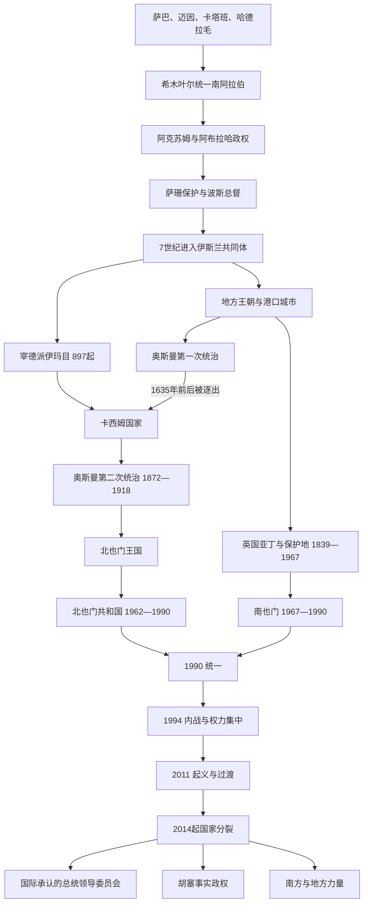

# 也门历史

## 历史主线

也门历史由高地水利农业、红海—印度洋商贸、部族与宗教政治传统，以及外部强权围绕曼德海峡的竞争共同塑造。古代多国体系在希木叶尔时期趋向统一；伊斯兰化后，低地王朝、港口政权与北部宰德派伊玛目长期并存。19世纪奥斯曼北部与英国亚丁—保护地的分治演成20世纪两个也门国家。1990年统一没有同步整合军队、行政和地区利益，1994年内战、2011年危机与2014年胡塞进入萨那依次暴露制度缺口。到2026年7月，主要战线虽较2022年前降级，全国仍由国际承认政府、胡塞事实政权和多支南方、地方力量分掌。

## 阶段导航

| 顺序 | 阶段 | 时间 | 简要概括 |
|---:|---|---|---|
| 1 | [古代南阿拉伯诸王国](/%E4%BA%BA%E6%96%87%E7%A7%91%E5%AD%A6/%E5%8E%86%E5%8F%B2/%E8%A5%BF%E4%BA%9A/%E9%98%BF%E6%8B%89%E4%BC%AF%E5%8D%8A%E5%B2%9B/%E4%B9%9F%E9%97%A8/%E5%8F%A4%E4%BB%A3%E5%8D%97%E9%98%BF%E6%8B%89%E4%BC%AF%E8%AF%B8%E7%8E%8B%E5%9B%BD.md) | 约前1千纪初—7世纪 | 多个水利、商贸王国竞争；希木叶尔统一后经历阿克苏姆与萨珊介入。 |
| 2 | [伊斯兰王朝、伊玛目制与南北分治](/%E4%BA%BA%E6%96%87%E7%A7%91%E5%AD%A6/%E5%8E%86%E5%8F%B2/%E8%A5%BF%E4%BA%9A/%E9%98%BF%E6%8B%89%E4%BC%AF%E5%8D%8A%E5%B2%9B/%E4%B9%9F%E9%97%A8/%E4%BC%8A%E6%96%AF%E5%85%B0%E7%8E%8B%E6%9C%9D%E3%80%81%E4%BC%8A%E7%8E%9B%E7%9B%AE%E5%88%B6%E4%B8%8E%E5%8D%97%E5%8C%97%E5%88%86%E6%B2%BB.md) | 7世纪—1990年 | 地方王朝、宰德伊玛目、奥斯曼与英国统治，以及北、南两个现代国家。 |
| 3 | [统一、政治危机与当代也门](/%E4%BA%BA%E6%96%87%E7%A7%91%E5%AD%A6/%E5%8E%86%E5%8F%B2/%E8%A5%BF%E4%BA%9A/%E9%98%BF%E6%8B%89%E4%BC%AF%E5%8D%8A%E5%B2%9B/%E4%B9%9F%E9%97%A8/%E7%BB%9F%E4%B8%80%E3%80%81%E6%94%BF%E6%B2%BB%E5%8D%B1%E6%9C%BA%E4%B8%8E%E5%BD%93%E4%BB%A3%E4%B9%9F%E9%97%A8.md) | 1990年—2026年7月13日 | 统一、1994年内战、2011年过渡失败、胡塞扩张、国际化战争与并立权力。 |

## 世系与统治结构专表

| 专表 | 覆盖内容 | 使用边界 |
|---|---|---|
| [古代南阿拉伯王系与争议表](/%E4%BA%BA%E6%96%87%E7%A7%91%E5%AD%A6/%E5%8E%86%E5%8F%B2/%E8%A5%BF%E4%BA%9A/%E9%98%BF%E6%8B%89%E4%BC%AF%E5%8D%8A%E5%B2%9B/%E4%B9%9F%E9%97%A8/%E5%8F%A4%E4%BB%A3%E5%8D%97%E9%98%BF%E6%8B%89%E4%BC%AF%E7%8E%8B%E7%B3%BB%E4%B8%8E%E4%BA%89%E8%AE%AE%E8%A1%A8.md) | 萨巴、迈因、卡塔班、哈德拉毛、希木叶尔及阿克苏姆—萨珊介入 | 仅列同期材料可证的关键王系；不把传说拼成连续谱系。 |
| [宰德派伊玛目与穆塔瓦基利亚王国世系表](/%E4%BA%BA%E6%96%87%E7%A7%91%E5%AD%A6/%E5%8E%86%E5%8F%B2/%E8%A5%BF%E4%BA%9A/%E9%98%BF%E6%8B%89%E4%BC%AF%E5%8D%8A%E5%B2%9B/%E4%B9%9F%E9%97%A8/%E5%AE%B0%E5%BE%B7%E6%B4%BE%E4%BC%8A%E7%8E%9B%E7%9B%AE%E4%B8%8E%E7%A9%86%E5%A1%94%E7%93%A6%E5%9F%BA%E5%88%A9%E4%BA%9A%E7%8E%8B%E5%9B%BD%E4%B8%96%E7%B3%BB%E8%A1%A8.md) | 重要宰德派伊玛目、卡西姆国家、1918—1962年全部王国君主 | 区分伊玛目资格、实际控制、并立主张与世袭王权。 |
| [现代也门国家元首与并立权力结构表](/%E4%BA%BA%E6%96%87%E7%A7%91%E5%AD%A6/%E5%8E%86%E5%8F%B2/%E8%A5%BF%E4%BA%9A/%E9%98%BF%E6%8B%89%E4%BC%AF%E5%8D%8A%E5%B2%9B/%E4%B9%9F%E9%97%A8/%E7%8E%B0%E4%BB%A3%E4%B9%9F%E9%97%A8%E5%9B%BD%E5%AE%B6%E5%85%83%E9%A6%96%E4%B8%8E%E5%B9%B6%E7%AB%8B%E6%9D%83%E5%8A%9B%E7%BB%93%E6%9E%84%E8%A1%A8.md) | 北也门总统、南也门正式元首与党领导、统一后元首、PLC及胡塞等 | 现状核验截止2026年7月13日，区分国际承认与事实统治。 |

## 重要转折与时间节点

| 时间 | 转折 | 历史意义 |
|---|---|---|
| 约前7世纪 | 卡里卜伊勒·瓦塔尔扩张 | 萨巴以商路、灌溉和联盟建立早期南阿拉伯霸权。 |
| 约275—300年 | 希木叶尔吞并萨巴、哈德拉毛 | 南阿拉伯多国体系转为统一王权。 |
| 525年 | 阿克苏姆征服 | 祖·努瓦斯时期宗教、外交危机结束本土希木叶尔独立。 |
| 628年前后 | 波斯总督巴赞归附 | 也门通过既有统治网络进入伊斯兰共同体。 |
| 897年 | 宰德派伊玛目制建立 | 北部高地形成延续至20世纪的宗教政治传统。 |
| 1229—1454年 | 拉苏勒王朝 | 也门中世纪官僚、农业、学术与红海贸易达到高峰。 |
| 1597—1635年 | 卡西姆起义逐出奥斯曼 | 宰德伊玛目把高地联盟发展为近世统一国家。 |
| 1839年 | 英国占领亚丁 | 南部形成殖民港与条约保护地双重结构。 |
| 1872—1918年 | 奥斯曼第二次统治 | 北部官僚化与高地反抗并行，最终孕育独立王国。 |
| 1962年 | 北也门革命 | 王国覆亡；八年内战后共和国获得承认。 |
| 1967年 | 英国撤离、南也门独立 | NLF接管殖民地和保护地，后建立马克思主义党国。 |
| 1990年5月22日 | 南北统一 | 也门共和国成立，但军政体系没有同步整合。 |
| 1994年 | 统一内战 | 北方主导联盟取胜，南方排斥与中央集权加重。 |
| 2011—2012年 | 起义与权力移交 | 萨利赫离任；旧军政网络与过渡机构并存。 |
| 2014—2015年 | 胡塞控制萨那、联军介入 | 国家分裂，国内战争与地区竞争合流。 |
| 2022年 | PLC成立与停火 | 主要前线降级，国际承认元首改为集体机构。 |
| 2025年末—2026年初 | 南方阵营重组 | STC扩张后被反攻并失去PLC席位，南方问题仍未解决。 |

## 相关主线

- 区域入口：[阿拉伯半岛历史](/%E4%BA%BA%E6%96%87%E7%A7%91%E5%AD%A6/%E5%8E%86%E5%8F%B2/%E8%A5%BF%E4%BA%9A/%E9%98%BF%E6%8B%89%E4%BC%AF%E5%8D%8A%E5%B2%9B/README.md)
- 古代跨区背景：[古代南阿拉伯、绿洲与商路](/%E4%BA%BA%E6%96%87%E7%A7%91%E5%AD%A6/%E5%8E%86%E5%8F%B2/%E8%A5%BF%E4%BA%9A/%E9%98%BF%E6%8B%89%E4%BC%AF%E5%8D%8A%E5%B2%9B/%E5%8F%A4%E4%BB%A3%E5%8D%97%E9%98%BF%E6%8B%89%E4%BC%AF%E3%80%81%E7%BB%BF%E6%B4%B2%E4%B8%8E%E5%95%86%E8%B7%AF.md)
- 近现代区域背景：[奥斯曼、英国与现代国家形成](/%E4%BA%BA%E6%96%87%E7%A7%91%E5%AD%A6/%E5%8E%86%E5%8F%B2/%E8%A5%BF%E4%BA%9A/%E9%98%BF%E6%8B%89%E4%BC%AF%E5%8D%8A%E5%B2%9B/%E5%A5%A5%E6%96%AF%E6%9B%BC%E3%80%81%E8%8B%B1%E5%9B%BD%E4%B8%8E%E7%8E%B0%E4%BB%A3%E5%9B%BD%E5%AE%B6%E5%BD%A2%E6%88%90.md)
- 红海对岸：[非洲之角](/%E4%BA%BA%E6%96%87%E7%A7%91%E5%AD%A6/%E5%8E%86%E5%8F%B2/%E9%9D%9E%E6%B4%B2/%E4%B8%9C%E9%9D%9E/%E9%98%BF%E5%85%8B%E8%8B%8F%E5%A7%86%E3%80%81%E5%9F%83%E5%A1%9E%E4%BF%84%E6%AF%94%E4%BA%9A%E4%B8%8E%E9%9D%9E%E6%B4%B2%E4%B9%8B%E8%A7%92.md)

## 目录层级

- 直接上级：[阿拉伯半岛](/%E4%BA%BA%E6%96%87%E7%A7%91%E5%AD%A6/%E5%8E%86%E5%8F%B2/%E8%A5%BF%E4%BA%9A/%E9%98%BF%E6%8B%89%E4%BC%AF%E5%8D%8A%E5%B2%9B/README.md)
- 宏观区域：[西亚](/%E4%BA%BA%E6%96%87%E7%A7%91%E5%AD%A6/%E5%8E%86%E5%8F%B2/%E8%A5%BF%E4%BA%9A/README.md)
- 历史总览：[历史](/%E4%BA%BA%E6%96%87%E7%A7%91%E5%AD%A6/%E5%8E%86%E5%8F%B2/README.md)
