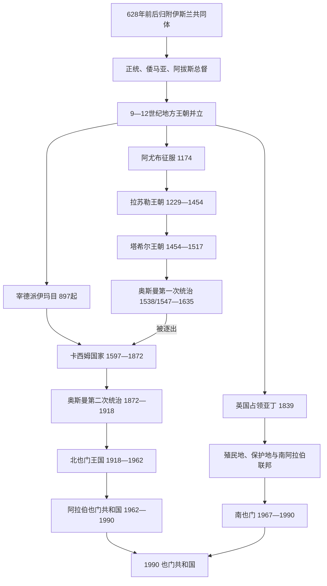

# 伊斯兰王朝、伊玛目制与南北分治

## 时间

7世纪—1990年

## 概括

伊斯兰时代的也门长期呈现“高地—低地—港口—东部”多中心格局。早期哈里发派遣总督，但地方部族、商贸城市和宗教网络很快发展出自主政权；扎比德、塔伊兹和亚丁一带多由逊尼派或伊斯玛仪派王朝经营，897年起北部高地则反复出现宰德派伊玛目。奥斯曼帝国两次试图把也门纳入行省体系，第一次被卡西姆家族伊玛目逐出，第二次以1911年承认高地自治告终。英国自1839年占领亚丁，以殖民港与条约保护地分别治理南部。第一次世界大战后，北部形成伊玛目王国；1960年代北部革命与南部反殖民战争又建立两个共和国。1990年统一来自共同民族主张、经济互补和冷战结束压力，却继承了两套军队、行政与精英网络。

## 伊斯兰化与早期地方化

萨珊末任总督巴赞约在628年接受穆罕默德权威，也门许多部落通过使团、地方传教者和既有总督网络加入伊斯兰共同体。穆罕默德去世后的里达战争重新确认麦地那政权，但也门不是被一次战役彻底替换的空白区域：波斯裔军人、希木叶尔贵族、部落首领、犹太和基督教社群都继续存在。也门部族大量参加叙利亚、伊拉克、埃及和北非征服，人口与精英外迁也改变本地权力平衡。

正统哈里发、倭马亚和阿拔斯时期，也门通常分设萨那、贾纳德、哈德拉毛等行政区。帝国总督依靠税收和驻军，却难稳定控制山区。教派传教、部族竞争、港口财富与阿拔斯中心衰弱共同促成9世纪以后地方王朝并立。不同王朝的年代大量重叠，意味着它们分别控制高地、提哈马、亚丁或哈德拉毛，而不是整齐接替一个全国王位。

## 地方王朝与统治结构

| 政权 | 时间 | 核心区域与统治结构 | 崛起与发展 | 衰落或灭亡 |
|---|---|---|---|---|
| 齐亚德王朝 | 819—1018年 | 以扎比德为都，名义承认阿拔斯；由王室、军人奴仆和提哈马税收支撑 | 穆罕默德·本·齐亚德平定叛乱后建政，开发扎比德并控制红海低地 | 宫廷军人和大臣掌权、王室衰弱，末期被纳贾希势力取代。 |
| 优菲尔王朝 | 847—约997年 | 希木叶尔部族家族，控制萨那和中部高地 | 借阿拔斯衰退与高地网络兴起，与齐亚德并存 | 家族内斗、宗教与部族竞争，受到苏莱希等新势力前身压迫。 |
| 纳贾希王朝 | 1022—1158年 | 扎比德低地；由原齐亚德军人集团建立 | 控制提哈马粮区与红海贸易，与苏莱希长期争战 | 内部继承、奴隶军团竞争和马赫迪派进攻导致灭亡。 |
| 苏莱希王朝 | 1047—1138年 | 伊斯玛仪派，承认开罗法蒂玛哈里发；一度控制萨那、吉卜拉和低地 | 阿里·苏莱希以宗教传教和部族联盟统一大部；**阿尔瓦女王**长期主政，吉卜拉成为政治文化中心 | 阿里遇刺后地方分裂；阿尔瓦无直接继承人，亚丁祖赖德和萨那哈姆丹势力独立。 |
| 祖赖德王朝 | 1083—1174年 | 亚丁港的伊斯玛仪派家族，分支共治 | 依托港税、印度洋商人和苏莱希授权兴起 | 家族分支竞争；阿尤布军队占领亚丁。 |
| 哈姆丹诸苏丹 | 1099—1174年 | 萨那及周边高地的地方家族、部落联盟 | 在苏莱希衰落与宰德伊玛目间维持城市政权 | 阿尤布征服结束独立。 |
| 阿尤布王朝也门支系 | 1174—1229年 | 由图兰沙率埃及—叙利亚军队征服；以军功贵族和行省财政统治 | 控制亚丁、塔伊兹和提哈马，连接红海帝国网络并压制多个地方政权 | 距核心遥远、军政代理人坐大；末任总督被拉苏勒家族取代。 |
| **拉苏勒王朝** | 1229—1454年 | 塔伊兹为政治中心，扎比德为学术农业中心，控制亚丁港；逊尼派苏丹制 | 曼苏尔·欧麦尔独立建国；穆扎法尔·优素福等扩张，建立官僚、地籍、灌溉与港税体系，学术和贸易繁荣 | 长期王位争夺、军费和地方割据削弱中央，塔希尔家族夺权。 |
| 塔希尔王朝 | 1454—1517年 | 拉达、亚丁与南部高地；逊尼派地方家族 | 接收拉苏勒官僚和商贸城市，修建宗教、灌溉设施 | 葡萄牙进入印度洋造成海上压力；马穆鲁克远征军与内部敌对夹击，1517年王朝被推翻。 |
| 马穆鲁克残余与奥斯曼接管 | 1517—1538/1547年 | 埃及马穆鲁克远征军残部、地方统治者并存 | 试图阻挡葡萄牙并控制红海 | 奥斯曼征服埃及后接收其红海战略，逐步占领扎比德、萨那。 |

## 宰德派伊玛目制

897年，哈迪·伊拉勒哈格·叶海亚应萨达地方集团邀请进入也门。他的合法性来自先知后裔、宗教学识和公开起兵资格，但伊玛目必须不断争取部落效忠、城市税收和军事胜利。故伊玛目制是一种可反复复兴的政治传统，不是897—1962年连续控制同一疆域的单一王朝。11—15世纪，伊玛目有时只控制萨达附近，有时进入萨那；同时与苏莱希、阿尤布、拉苏勒和塔希尔等低地王朝并存。

伊玛目通常任命王族或赛义德管理地区，并通过教法裁判、部落仲裁、贡赋与人质维持联盟。高地宰德派人口与沿海、南部沙斐仪派人口的差异具有政治意义，但战争从来不只是宗派冲突：王族内争、部落利益、港口税、外来军队和地区贸易往往更直接。重要伊玛目、卡西姆家族及王国完整君主表见[宰德派伊玛目与穆塔瓦基利亚王国世系表](/%E4%BA%BA%E6%96%87%E7%A7%91%E5%AD%A6/%E5%8E%86%E5%8F%B2/%E8%A5%BF%E4%BA%9A/%E9%98%BF%E6%8B%89%E4%BC%AF%E5%8D%8A%E5%B2%9B/%E4%B9%9F%E9%97%A8/%E5%AE%B0%E5%BE%B7%E6%B4%BE%E4%BC%8A%E7%8E%9B%E7%9B%AE%E4%B8%8E%E7%A9%86%E5%A1%94%E7%93%A6%E5%9F%BA%E5%88%A9%E4%BA%9A%E7%8E%8B%E5%9B%BD%E4%B8%96%E7%B3%BB%E8%A1%A8.md)。

## 奥斯曼两次统治与卡西姆国家

### 第一次奥斯曼统治

奥斯曼吞并埃及后，为保护红海航线免受葡萄牙威胁，于1538年占领扎比德，并在1547年前后进入萨那。行省政府依靠土耳其、埃及和本地军队，控制港口、低地与主要城市；高地征税、驻军补给和总督更替却成本高昂。16世纪末，过重征敛、军纪问题和伊玛目传统促成大规模反抗。曼苏尔·卡西姆1597年起兵，其子穆艾亚德·穆罕默德扩大联盟，逐步围困奥斯曼据点；1635年前后最后驻军撤离。

### 卡西姆国家的高峰与收缩

穆塔瓦基勒·伊斯玛仪统治时，卡西姆国家把权力扩至亚丁和哈德拉毛。摩卡咖啡出口、红海关税、高地农业与王族总督支撑扩张。其强盛并非纯粹宗教统一：政权同时利用奥斯曼行政经验、常备军、商人和家族分封。17世纪末后，伊玛目候选人争位，王族总督世袭化；咖啡在爪哇、西印度群岛等地扩种，摩卡垄断收入下降；拉赫季、哈德拉毛和提哈马势力逐渐脱离。18—19世纪，萨那政权频繁废立并缩回高地核心。

### 第二次奥斯曼统治

奥斯曼1849年先恢复提哈马立足点，1872年利用萨那内乱进占高地，建立也门行省。新政权设置总督、法院、学校、电报和常备军，也引入土地、税收和征兵争议。山区道路困难、财政不足、地方官滥权与部落自主使改革成效有限。哈米德丁家族伊玛目领导反抗；叶海亚1904年继位后把多个高地联盟组织起来。1911年《达安条约》承认伊玛目在宰德派地区的司法与行政自治，奥斯曼保留名义主权和城市驻军。1918年帝国战败撤离，叶海亚接收萨那与军备，建立独立北也门。

## 英国亚丁、保护地与殖民行政

英国东印度公司航路和蒸汽船补给需求使亚丁具有战略价值。1839年英军在与拉赫季苏丹争端后占领港口，将其作为英属印度据点；1869年苏伊士运河开通后，亚丁成为煤站、自由港和红海入口。英国对城市实行直接殖民，对内陆苏丹国、酋长国则通过条约、津贴、顾问和空中武力建立“亚丁保护地”。保护地统治者保留王位和内部行政，不能与亚丁殖民地视为同一制度。

1937年亚丁脱离英属印度成为直辖殖民地；东、西保护地仍由地方君主与英国政治官构成间接统治。英国为降低成本和准备有限自治，1959年推动西部诸邦组成南阿拉伯酋长国联邦，1962年改称南阿拉伯联邦，亚丁1963年加入；未加入的东部邦组成南阿拉伯保护地。联邦未能获得城市劳工、民族主义者和许多地方群体认同。

### 1937—1967年殖民行政首脑

| 行政阶段 | 最高英国行政首脑 | 任期 | 统治结构与重要事项 |
|---|---|---|---|
| 亚丁殖民地 | 伯纳德·赖利 | 1937—1940年 | 首任总督，完成由英属印度向殖民部移交。 |
| 亚丁殖民地 | 约翰·哈索恩·霍尔 | 1940—1944/45年 | 战时港口、防务与补给管理。 |
| 亚丁殖民地 | 雷金纳德·钱皮恩 | 1944/45—1951年 | 战后劳工、住房、移民和区域民族主义压力上升。 |
| 亚丁殖民地 | 汤姆·希金博瑟姆 | 1951—1956年 | 应对工会政治与保护地联邦方案。 |
| 亚丁殖民地 | 威廉·卢斯 | 1956—1960年 | 苏伊士危机后英国威望下降，阿拉伯民族主义增强。 |
| 亚丁殖民地 | 查尔斯·约翰斯顿 | 1960—1963年 | 推动亚丁并入南阿拉伯联邦。 |
| 亚丁与南阿拉伯高级专员 | 肯尼迪·特里瓦斯基斯 | 1963—1965年 | “亚丁紧急状态”爆发，殖民政府与民族解放阵线、解放被占南也门阵线交战。 |
| 亚丁与南阿拉伯高级专员 | 理查德·特恩布尔 | 1965—1967年 | 联邦自治失灵、武装冲突扩大，英国宣布提前撤离。 |
| 亚丁与南阿拉伯高级专员 | 汉弗莱·特里维廉 | 1967年5—11月 | 组织最终撤军并与胜出的民族解放阵线谈判移交。 |

1839—1937年最高职位先后称政治代理、政治驻扎官和首席专员，隶属孟买／英属印度系统；1937年后的总督与1963年后的高级专员才是直接对应直辖殖民地、联邦末期的正式序列。周边保护地的苏丹和酋长仍是各邦名义统治者，不应与英国总督混列为同一王朝。

### 反殖民战争与撤离

1950年代亚丁工会、阿拉伯民族主义和北也门革命共同激化殖民危机。1963年12月针对高级专员的手榴弹袭击后，英国宣布紧急状态。民族解放阵线（NLF）与受埃及支持的解放被占南也门阵线（FLOSY）既攻击英国，也彼此争夺领导权。1967年英军一度失去火山口区控制，保护地军队和联邦政府瓦解；NLF在内战中击败FLOSY。英国于11月29日结束统治，南也门11月30日独立。

## 北也门：王国、革命与共和国

### 穆塔瓦基利亚王国

1918年叶海亚以伊玛目身份接收奥斯曼留下的国家机构，逐步征服高地、提哈马和荷台达。国家以王族总督、军队、部落人质和传统税收集中权力。1934年与沙特因阿西尔、纳季兰等争端开战，北也门战败后签订《塔伊夫条约》；同年与英国划定部分边界。封闭、继承安排和改革缓慢引发“自由也门人”反对。1948年宪政革命刺杀叶海亚，但其子艾哈迈德调动部落夺回萨那；1955年军官政变也迅速失败。艾哈迈德有限引进苏联、埃及军援，却拒绝分享权力。

### 1962—1970年北也门内战

1962年9月艾哈迈德去世，巴德尔即位一周后，阿卜杜拉·萨拉勒等军官炮击王宫并宣布阿拉伯也门共和国。巴德尔逃至北部，王党获沙特、约旦支持，共和派获纳赛尔埃及大规模驻军支持。战争迅速成为阿拉伯冷战代理战，但共和、王党阵营内部都由多支部落和政治集团组成。1967年六日战争后埃及撤军；同年温和共和派推翻萨拉勒。1967—1968年王党围攻萨那失败，证明共和国能够脱离埃及存续。1970年沙特承认共和国，部分非王室王党进入政府，哈米德丁复辟方案终结。

### 共和国巩固

伊里亚尼时期以部落协商和文官机构维持平衡。1974年易卜拉欣·哈姆迪通过“纠正运动”上台，削弱酋长军事特权、扶植地方发展合作社并与南也门谈判；1977年遇刺使改革中断。其继任加什米次年被杀。阿里·阿卜杜拉·萨利赫1978年出任总统，以军队任命、哈希德部落联盟、沙特关系和全国人民大会建立稳固统治。1980年代石油开发、侨汇和外援改善财政，也扩大地区与家族网络。

## 南也门：独立、党国与1986年内战

1967年成立的南也门人民共和国继承的不是单一殖民地，而是亚丁和二十多个前保护地政治单元。首任总统卡坦·沙阿比试图兼顾民族主义与行政整合；1969年NLF激进派“纠正运动”将其推翻，推进土地改革、国有化和妇女法律地位改革。1970年国名改为也门民主人民共和国。1978年多支左翼组织合并为也门社会党，形成党、国家、安全机构和军队相互嵌套的马克思主义体制，并依赖苏联及东欧援助；亚丁港、有限油气和国有部门是经济核心。

党内路线、地区出身和个人网络持续竞争。萨利姆·鲁巴伊·阿里1978年被处决；阿卜杜勒·法塔赫·伊斯梅尔1980年被迫辞职。1986年1月，阿里·纳赛尔·穆罕默德派与伊斯梅尔、阿里·萨利姆·贝德等对手在中央委员会会议上爆发枪战，演成十二日内战。数千人死亡或逃往北方，阿里·纳赛尔败退；贝德任也门社会党总书记，海达尔·阿塔斯任正式国家元首。干部、军队和经济受重创，苏联改革与援助减少进一步削弱政权。

北也门和南也门在1972、1979年两度边境战争后都签署统一原则文件，但意识形态、安全与精英利益阻碍实施。1980年代末边界油田开发需要合作，南也门又因1986年内战和苏联支持衰退陷入困境；萨利赫希望扩大国内合法性和资源基础。双方在未充分整合军队、财政和地方行政前加速谈判，1990年5月22日成立也门共和国。

## 重要事件

| 时间 | 事件 | 具体过程 | 长期影响 |
|---|---|---|---|
| 628年前后 | 巴赞归附 | 萨珊总督与波斯裔军人接受穆罕默德权威 | 也门通过既有治理网络进入伊斯兰共同体。 |
| 819年 | 齐亚德王朝建立 | 阿拔斯授权穆罕默德·本·齐亚德平乱，以扎比德为都 | 地方王朝时代开始，提哈马城市长期成为政治中心。 |
| 897年 | 宰德派伊玛目制建立 | 哈迪进入萨达，结合宗教号召与部落仲裁 | 高地形成可反复复兴的伊玛目政治传统。 |
| 1047—1138年 | 苏莱希统一与阿尔瓦女王统治 | 伊斯玛仪派网络联结萨那、吉卜拉和亚丁 | 也门进入法蒂玛—印度洋宗教商贸体系，女性君主成为罕见政治核心。 |
| 1174年 | 阿尤布征服 | 图兰沙率军占领南部城市并进入高地 | 也门重新接入埃及—红海帝国竞争。 |
| 1229—1454年 | 拉苏勒王朝 | 官僚、农业、学术和港税体系成熟 | 中世纪也门经济文化高峰，塔伊兹和扎比德影响深远。 |
| 1538/1547年 | 奥斯曼第一次进入 | 先占扎比德，后进入萨那 | 将也门纳入反葡萄牙红海战略，也激化高地反抗。 |
| 1597—1635年 | 卡西姆起义 | 曼苏尔·卡西姆及其子联合高地部落逐城进攻 | 奥斯曼撤离，卡西姆国家达到近世统一高峰。 |
| 1839年 | 英国占领亚丁 | 英军击败拉赫季苏丹守军，建立补给港 | 南部形成直接殖民港与间接保护地的双重结构。 |
| 1872年 | 奥斯曼重占萨那 | 利用伊玛目内争建立也门行省 | 现代官僚设施扩展，也催生哈米德丁反抗。 |
| 1911年 | 《达安条约》 | 奥斯曼承认叶海亚在宰德高地的自治 | 为1918年接收国家权力奠定制度基础。 |
| 1918年 | 北也门独立 | 奥斯曼撤离，叶海亚接管萨那 | 穆塔瓦基利亚王国形成。 |
| 1962年 | 北也门革命 | 军官推翻巴德尔，王党转入山区战争 | 引发埃及—沙特介入的八年内战，最终确立共和国。 |
| 1963—1967年 | 亚丁紧急状态 | NLF、FLOSY与英国、联邦军队多方交战 | 英国提前撤离，NLF取得南部国家权力。 |
| 1969—1970年 | 南也门左转 | 激进派纠正运动及国名、制度变更 | 建立阿拉伯世界唯一长期马克思主义国家。 |
| 1972、1979年 | 两次南北战争 | 边境冲突后签署统一原则 | 武力竞争与统一理想并存。 |
| 1986年 | 南也门内战 | 党内枪战扩为军队派系战争 | 干部与经济重创，直接加快与北方统一。 |
| 1990年 | 南北统一 | 两国领导人快速协商合并 | 建立统一国家，同时把未整合的军政矛盾带入下一阶段。 |

## 兴衰与转型原因

| 阶段 | 崛起或稳定条件 | 结构性弱点 | 外部压力 | 直接转折 |
|---|---|---|---|---|
| 中世纪低地王朝 | 港税、灌溉农业、红海—印度洋贸易、城市官僚 | 王位竞争、军人代理人坐大、难控制高地 | 埃及王朝、葡萄牙海权和地区商路变化 | 拉苏勒内争后塔希尔夺权；塔希尔又在马穆鲁克、奥斯曼冲击下灭亡。 |
| 宰德派伊玛目 | 宗教资格、高地地形、部落仲裁与动员 | 无固定继承、并立者众、低地税源不稳 | 奥斯曼与地方逊尼派王朝 | 1597年卡西姆动员使传统国家化；1962年军官革命最终终止君主制。 |
| 奥斯曼统治 | 帝国军队、红海战略、城市行政 | 补给昂贵、征税与地方自治冲突 | 葡萄牙、欧洲战争及帝国财政危机 | 第一次被卡西姆起义逐出；第二次因一战战败撤离。 |
| 英属南部 | 亚丁深水港、苏伊士航路、印度洋帝国资源 | 城市殖民地与保护地联邦断裂，代表性不足 | 阿拉伯民族主义、北也门革命和去殖民化 | 1963年紧急状态与NLF胜出迫使1967年撤离。 |
| 北也门王国 | 叶海亚接收奥斯曼机构、高地联盟和王族总督 | 行政封闭、继承僵化、军官和知识分子不满 | 埃及革命思想、沙特边界压力 | 艾哈迈德死后一周，1962年军官政变。 |
| 南也门党国 | NLF军政胜利、统一党、苏联援助 | 党内派系、经济基础狭窄、前保护地整合困难 | 冷战援助变化与北也门竞争 | 1986年内战、苏联支持衰退推动1990年统一。 |

## 演变关系

- 前一节点：[古代南阿拉伯诸王国](/%E4%BA%BA%E6%96%87%E7%A7%91%E5%AD%A6/%E5%8E%86%E5%8F%B2/%E8%A5%BF%E4%BA%9A/%E9%98%BF%E6%8B%89%E4%BC%AF%E5%8D%8A%E5%B2%9B/%E4%B9%9F%E9%97%A8/%E5%8F%A4%E4%BB%A3%E5%8D%97%E9%98%BF%E6%8B%89%E4%BC%AF%E8%AF%B8%E7%8E%8B%E5%9B%BD.md)
- 伊玛目与王国世系：[宰德派伊玛目与穆塔瓦基利亚王国世系表](/%E4%BA%BA%E6%96%87%E7%A7%91%E5%AD%A6/%E5%8E%86%E5%8F%B2/%E8%A5%BF%E4%BA%9A/%E9%98%BF%E6%8B%89%E4%BC%AF%E5%8D%8A%E5%B2%9B/%E4%B9%9F%E9%97%A8/%E5%AE%B0%E5%BE%B7%E6%B4%BE%E4%BC%8A%E7%8E%9B%E7%9B%AE%E4%B8%8E%E7%A9%86%E5%A1%94%E7%93%A6%E5%9F%BA%E5%88%A9%E4%BA%9A%E7%8E%8B%E5%9B%BD%E4%B8%96%E7%B3%BB%E8%A1%A8.md)
- 南北国家元首：[现代也门国家元首与并立权力结构表](/%E4%BA%BA%E6%96%87%E7%A7%91%E5%AD%A6/%E5%8E%86%E5%8F%B2/%E8%A5%BF%E4%BA%9A/%E9%98%BF%E6%8B%89%E4%BC%AF%E5%8D%8A%E5%B2%9B/%E4%B9%9F%E9%97%A8/%E7%8E%B0%E4%BB%A3%E4%B9%9F%E9%97%A8%E5%9B%BD%E5%AE%B6%E5%85%83%E9%A6%96%E4%B8%8E%E5%B9%B6%E7%AB%8B%E6%9D%83%E5%8A%9B%E7%BB%93%E6%9E%84%E8%A1%A8.md)
- 后一节点：[统一、政治危机与当代也门](/%E4%BA%BA%E6%96%87%E7%A7%91%E5%AD%A6/%E5%8E%86%E5%8F%B2/%E8%A5%BF%E4%BA%9A/%E9%98%BF%E6%8B%89%E4%BC%AF%E5%8D%8A%E5%B2%9B/%E4%B9%9F%E9%97%A8/%E7%BB%9F%E4%B8%80%E3%80%81%E6%94%BF%E6%B2%BB%E5%8D%B1%E6%9C%BA%E4%B8%8E%E5%BD%93%E4%BB%A3%E4%B9%9F%E9%97%A8.md)
- 奥斯曼背景：[奥斯曼帝国](/%E4%BA%BA%E6%96%87%E7%A7%91%E5%AD%A6/%E5%8E%86%E5%8F%B2/%E8%A5%BF%E4%BA%9A/%E5%9C%9F%E8%80%B3%E5%85%B6/%E5%A5%A5%E6%96%AF%E6%9B%BC%E5%B8%9D%E5%9B%BD/README.md)
- 上级：[也门历史](/%E4%BA%BA%E6%96%87%E7%A7%91%E5%AD%A6/%E5%8E%86%E5%8F%B2/%E8%A5%BF%E4%BA%9A/%E9%98%BF%E6%8B%89%E4%BC%AF%E5%8D%8A%E5%B2%9B/%E4%B9%9F%E9%97%A8/README.md)
