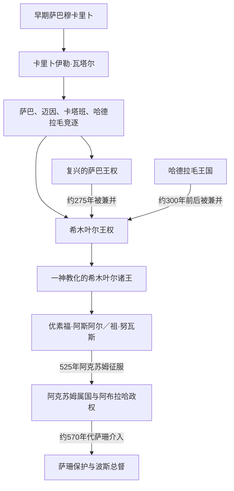

# 古代南阿拉伯王系与争议表

## 使用说明

古代南阿拉伯的王系主要依靠铭文、钱币、古典作家记载和考古层位复原。早期铭文常只写君主名、父名和头衔，不给连续纪年；同名君主、共同执政、部族联盟改组以及“穆卡里卜”（通常译作盟主或祭司王）向“王”的头衔变化，都使不同研究方案之间存在差异。因此本表采用“可由同期材料确认的关键王系与共治组”，不把后世传说拼接成看似完整的连续世系。年代均为约数。

## 萨巴及其晚期复兴王权

| 可证统治者或共治组 | 大致年代 | 头衔与关系 | 可确认事项 | 争议说明 |
|---|---|---|---|---|
| 伊萨阿马尔·瓦塔尔（Yathaʿamar Watar） | 约前8—前7世纪 | 萨巴穆卡里卜，父名雅克鲁卜马利克 | 与亚述资料中的萨巴统治者可能相对应，显示萨巴已进入跨区域外交网络。 | 人名转写及其与亚述文献人物是否完全同一仍有讨论。 |
| **卡里卜伊勒·瓦塔尔（Karibʾil Watar）** | 约前7世纪 | 先称穆卡里卜，后以王号见称；父名达马尔阿里 | 西尔瓦赫长铭文记述其连续战争、摧毁奥桑并重组萨巴霸权，是早期王系最稳固的锚点。 | 绝对年代仍依赖古文字与外部同步资料，不能精确到逐年。 |
| 亚达伊勒·达里赫（Yadaʿʾil Dharih） | 约前7—前6世纪 | 萨巴穆卡里卜 | 与阿瓦姆神庙等大型宗教建筑工程相联系，反映王权、神庙和灌溉共同构成的统治体系。 | 同名者识别和先后次序在不同王表中不完全一致。 |
| 伊勒沙拉赫·亚赫杜布二世、亚齐勒·巴因 | 约3世纪中叶 | 萨巴王与其兄弟共治 | 铭文记录对高地、纳季兰和红海沿岸势力的战争，是萨巴晚期复兴的重要共治组。 | 这一时期萨巴、祖赖丹和希木叶尔头衔交叠，不能仅凭称号推定完全领土控制。 |

## 迈因、卡塔班与哈德拉毛的可证王系

| 政权 | 可证统治者或王系 | 大致年代 | 关系与重要事项 | 争议说明 |
|---|---|---|---|---|
| 迈因 | 亚塔阿马尔、亚达伊勒 | 约前4世纪 | 两位“穆卡里卜”并列见于迈因地区铭文，显示可能存在共治或联合主持宗教、城市事务。 | 两人的亲属关系和实际权力分工不明。 |
| 迈因 | 阿比亚达·亚塔（Abīyadaʿ Yathaʿ） | 约前4—前2世纪之间 | 以“迈因王”见于铭文，并与哈德拉毛王室保持联盟；体现商路国家之间的外交协作。 | 迈因绝对年代方案分歧很大，本表不指定精确在位年。 |
| 卡塔班 | 亚达阿卜·杜卜扬·尤哈尼姆 → 沙赫尔·希拉勒 → 豪菲阿姆·尤哈尼姆 → 沙赫尔·亚吉勒·尤哈尔吉布 | 约前2—前1世纪，具体方案有差异 | 铭文同步关系可支持这一组父子或前后相承；其中亚达阿卜时期对哈德拉毛用兵，沙赫尔·希拉勒还见于钱币。 | 旧王表曾把部分君主提前数世纪；新铭文与钱币不断改动绝对年代。 |
| 哈德拉毛 | 沙赫尔·阿勒汉 → 伊利萨米·杜卜扬 | 约前数世纪 | 铭文显示前者曾与迈因建立联盟，后者确认或延续联盟。 | 两王之间是否直接父子相承并不完全清楚。 |
| 哈德拉毛 | 亚达阿卜·盖兰及其诸子 | 约前2—前1世纪之间 | 同期卡塔班铭文记载战争、俘虏和王子姓名，为跨国王系同步提供依据。 | 事件年代在不同重建方案中相差可达数十年至更久。 |
| 哈德拉毛 | 伊勒阿兹·亚卢特（Ilʿazz Yalut） | 约1世纪中叶 | 《厄立特里亚海周航记》所处时代的哈德拉毛王，反映沙卜瓦—卡尼港海贸体系。 | 古典文本与铭文人名的对应仍需谨慎。 |

## 希木叶尔统一王权

| 顺序 | 统治者或共治组 | 约在位 | 继承关系 | 重要事件与说明 |
|---:|---|---|---|---|
| 1 | 亚西尔·尤哈尼姆与**沙马尔·尤哈里什** | 约3世纪末 | 父子共治 | 沙马尔在约285—300年间使用“萨巴与祖赖丹之王”等头衔，并完成对萨巴、随后对哈德拉毛的兼并，建立南阿拉伯统一王权。 |
| 2 | 达马尔阿里·亚赫布尔二世 | 约4世纪初 | 新王系的奠基者之一 | 稳定统一后的高地王权；相关雕像与铭文提供同期证据。 |
| 3 | 塔兰·尤哈尼姆 | 约325年前—约375年 | 达马尔阿里之子 | 长期统治，推进政治整合与宗教转型；后期与儿子共同执政。 |
| 4 | 马利基卡里卜·尤哈明 | 约375—400年 | 塔兰之子，先共治后主政 | 王室铭文在4世纪末转向“天与地之主”等一神教表达；常被视为官方宗教转型的关键君主。 |
| 5 | **阿布·卡里卜·阿萨德** | 约380—440年，含共治 | 马利基卡里卜之子 | 向希贾兹和内志扩张，通过肯达等附属力量间接控制部族；后世把许多远征传说集中到其身上，具体行程不能全按史实理解。 |
| 6 | 沙拉赫比勒·亚富尔等5世纪王族 | 约5世纪中叶 | 阿布·卡里卜后裔，存在共治 | 修复马里卜水利，维持广域王权；多名王族并列，顺序存在重建差异。 |
| 7 | 马尔萨德伊兰·亚努夫 | 约5世纪末—6世纪初 | 与前王系关系未完全确定 | 在犹太教取向王权下维持跨半岛影响，并面对阿克苏姆、拜占庭扶持基督教势力的压力。 |
| 8 | 马迪卡里卜·亚富尔 | 约519—522年 | 前后关系有争议 | 在阿克苏姆影响下短期主政，曾对中阿拉伯用兵；其死亡造成权力真空。 |
| 9 | **优素福·阿斯阿尔·亚萨尔（祖·努瓦斯）** | 约522—525年 | 以政变夺权 | 杀死阿克苏姆驻军并迫害纳季兰基督徒，引来阿克苏姆国王卡莱布跨海征服；525年希木叶尔独立王权终结。 |

## 阿克苏姆与萨珊介入后的统治序列

| 顺序 | 统治者或权力结构 | 约在位 | 性质 | 关键事项 |
|---:|---|---|---|---|
| 1 | 苏米亚法·阿什瓦（希腊文作埃西米法奥斯） | 约525—531年 | 阿克苏姆扶立的希木叶尔属王 | 在卡莱布征服后主持基督教化政权，依赖阿克苏姆军队。 |
| 2 | **阿布拉哈** | 约531—560年代 | 阿克苏姆军将领起兵自立，后获默许 | 修复马里卜坝、在萨那建教堂并对中阿拉伯远征；其政权具有本地化的基督教军政性质。 |
| 3 | 亚克苏姆、马斯鲁克 | 约560年代 | 阿布拉哈诸子 | 继承不稳，军事与财政基础削弱；反对者向萨珊求援。 |
| 4 | 赛义夫·本·祖·亚赞 | 约570年代，短暂 | 萨珊支持的本地属王 | 波斯将领瓦赫里兹击败阿克苏姆势力后被扶立；其史迹与后世传奇交织。 |
| 5 | 波斯军镇与总督 | 约570年代—628/630年 | 萨珊帝国的间接或直接统治 | 瓦赫里兹后裔、马尔兹班等管理当地；末任总督巴赞在穆罕默德时代归附伊斯兰共同体。 |

## 关键争议

- **示巴女王／比勒吉斯**：萨巴王国确为历史政权，但现有南阿拉伯铭文没有证实一位与所罗门同时、统治萨巴的女王。应把她视为《圣经》《古兰经》解释传统和埃塞俄比亚传统中的重要人物，而不是已建立世系位置的历史君主。
- **绝对年代**：早期王国缺乏连续纪年。亚述同步、古文字分期、放射性碳测年、钱币和跨国铭文可以缩小范围，但仍可能相差数十年乃至数世纪。
- **共治与同名**：铭文并列父子、兄弟不一定意味着同等共治；同一王名也可能属于不同时代的人。表中用“共治组”时只表示同期并列可证。
- **“统一”含义**：希木叶尔长头衔表达宗主权与联盟等级，不代表中央官僚可在所有地区持续直接行政。
- **后世阿拉伯传说**：图巴王、祖·亚赞等人物在伊斯兰时代叙事中被扩展为英雄谱系。可用于研究历史记忆，不宜反向填补铭文空缺。

## 相关笔记

- 主阶段：[古代南阿拉伯诸王国](/%E4%BA%BA%E6%96%87%E7%A7%91%E5%AD%A6/%E5%8E%86%E5%8F%B2/%E8%A5%BF%E4%BA%9A/%E9%98%BF%E6%8B%89%E4%BC%AF%E5%8D%8A%E5%B2%9B/%E4%B9%9F%E9%97%A8/%E5%8F%A4%E4%BB%A3%E5%8D%97%E9%98%BF%E6%8B%89%E4%BC%AF%E8%AF%B8%E7%8E%8B%E5%9B%BD.md)
- 后续阶段：[伊斯兰王朝、伊玛目制与南北分治](/%E4%BA%BA%E6%96%87%E7%A7%91%E5%AD%A6/%E5%8E%86%E5%8F%B2/%E8%A5%BF%E4%BA%9A/%E9%98%BF%E6%8B%89%E4%BC%AF%E5%8D%8A%E5%B2%9B/%E4%B9%9F%E9%97%A8/%E4%BC%8A%E6%96%AF%E5%85%B0%E7%8E%8B%E6%9C%9D%E3%80%81%E4%BC%8A%E7%8E%9B%E7%9B%AE%E5%88%B6%E4%B8%8E%E5%8D%97%E5%8C%97%E5%88%86%E6%B2%BB.md)
- 总览：[也门历史](/%E4%BA%BA%E6%96%87%E7%A7%91%E5%AD%A6/%E5%8E%86%E5%8F%B2/%E8%A5%BF%E4%BA%9A/%E9%98%BF%E6%8B%89%E4%BC%AF%E5%8D%8A%E5%B2%9B/%E4%B9%9F%E9%97%A8/README.md)
