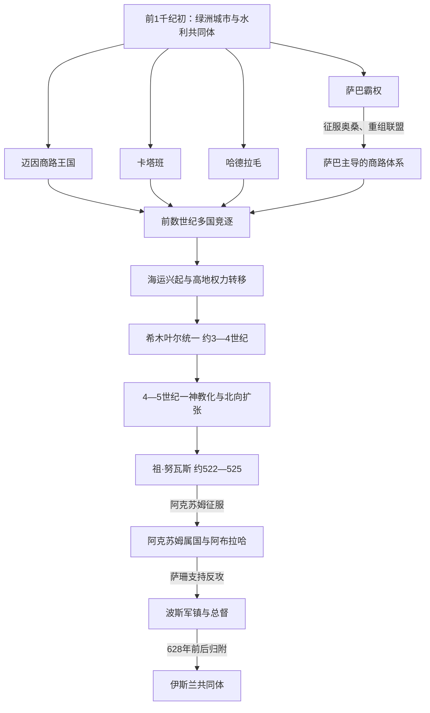

# 古代南阿拉伯诸王国

## 时间

约前1千纪初—7世纪

## 概括

古代也门不是一个从萨巴直线继承到希木叶尔的单一国家，而是由高地、沙漠边缘绿洲、哈德拉毛谷地和海港组成的多中心世界。萨巴、迈因、卡塔班、哈德拉毛、奥桑等政权以灌溉农业、神庙共同体、部族联盟和香料商路为基础，既合作护送商队，也反复争夺税站、绿洲和港口。1世纪前后印度洋海运兴盛，高地的希木叶尔逐渐取代旧商队王国；约300年前后统一南阿拉伯。4—6世纪王权一神教化，并卷入阿克苏姆、拜占庭和萨珊围绕红海与阿拉伯的竞争。628年前后波斯总督归附伊斯兰共同体，古代政治秩序由此转入伊斯兰时代。

## 地理、经济与国家形成

| 区域 | 资源与交通 | 形成的政治特点 |
|---|---|---|
| 马里卜、焦夫与赛哈德沙漠边缘 | 季节洪水、人工分水、绿洲耕地和北上商路 | 王权须协调水利、神庙、城市与部族；萨巴、迈因等在此发展。 |
| 也门中南部高地 | 降雨较多、梯田、谷物和葡萄种植，易守难攻 | 适合高密度聚落与部族联盟；希木叶尔后来由此兴起。 |
| 拜汉与南部内陆 | 从哈德拉毛通往红海的香料路线 | 卡塔班通过提姆纳税站、道路和附属部族争夺中转收益。 |
| 哈德拉毛谷地与佐法尔方向 | 乳香产区、沙卜瓦仓储、卡尼港通海 | 哈德拉毛兼具内陆产地与印度洋门户，后期重心转向海运。 |
| 提哈马、摩卡与曼德海峡 | 红海沿岸港口、非洲对岸航线 | 易受阿克苏姆海权影响，也是外来军队进入高地前的登陆区。 |
| 亚丁湾、索科特拉岛 | 季风海路连接东非、印度和波斯湾 | 海运增长削弱单一陆上香路的垄断，促使沿海与高地力量重组。 |

大型水利并不等于由中央国家独自建造。马里卜坝及其分水工程由王室、神庙、地方共同体和灌区受益者长期维护；修坝铭文既是技术记录，也是君主宣示保护秩序的政治文本。农业剩余为城市、军队与神庙提供基础，香料及转口贸易则补充远距离税收。旧“乳香贸易一项收入决定一切”的解释过于简单：高地农业、地方贡赋和海港贸易同样重要。

## 主要政权及其发展

| 政权 | 大致时期 | 中心 | 崛起机制 | 发展与结局 |
|---|---|---|---|---|
| 萨巴 | 约前1千纪初—3世纪，期间有衰落与复兴 | 马里卜、宗教中心西尔瓦赫 | 控制马里卜灌溉绿洲，以阿勒马卡神庙和部族联盟整合军役、商路 | 卡里卜伊勒·瓦塔尔在前7世纪征服奥桑、重组南阿拉伯霸权；后被迈因、卡塔班等挑战。1—3世纪一度复兴，约275年最终被希木叶尔并入。 |
| 迈因 | 约前8—前1世纪，绝对年代有争议 | 卡尔瑙、雅西勒／巴拉基什 | 依靠焦夫城市联盟、商人社群和北上商站经营远程贸易 | 在德丹等北方据点有商人活动；其政治力量随陆路格局变化而衰退，王国在公元纪元前后消失。 |
| 奥桑 | 前1千纪前期及后来的短暂复兴 | 南部谷地 | 控制向海岸与香料产区的路线 | 前7世纪被萨巴摧毁，领土分给盟友；后来一度复兴，约2世纪被哈德拉毛兼并。 |
| 卡塔班 | 约前8世纪—1或2世纪 | 提姆纳 | 以道路、税站、农业区和阿姆神崇拜联合多个部族 | 前数世纪摆脱萨巴并扩张，部分时期控制西南海岸；内争与区域战争削弱后被哈德拉毛并入。 |
| 哈德拉毛 | 约前1千纪初—约300年 | 沙卜瓦、卡尼港 | 掌握产香区、谷地绿洲及阿拉伯海出口 | 与迈因结盟、与卡塔班和萨巴反复战争；2—3世纪借海运达到高峰并吞并卡塔班，约300年前后被希木叶尔征服。 |
| 希木叶尔 | 约前110年采用纪元，1世纪起显著；约300—525年统一王国 | 扎法尔，后兼有萨那、马里卜 | 以高地农业、部族联盟和红海—印度洋海运取代旧商队王国 | 沙马尔·尤哈里什完成统一；4—5世纪建立跨半岛宗主权并一神教化。祖·努瓦斯时期宗教战争引来阿克苏姆征服，独立王国终结。 |
| 阿克苏姆属国与阿布拉哈政权 | 约525—570年代 | 萨那、扎法尔 | 阿克苏姆跨红海军队、基督教联盟和本地军政集团 | 阿布拉哈脱离阿克苏姆直接控制后本地化，修复水利、远征中阿拉伯；其子统治失稳，被萨珊支持的反对派推翻。 |
| 萨珊保护与波斯总督 | 约570年代—628/630年 | 萨那及军镇 | 波斯远征军与本地反阿克苏姆势力合作 | 先扶立赛义夫·本·祖·亚赞，后转为波斯总督统治；末任总督巴赞归附穆罕默德，也门和平进入新的政治网络。 |

详细的可证王系、共同执政和争议见[古代南阿拉伯王系与争议表](/%E4%BA%BA%E6%96%87%E7%A7%91%E5%AD%A6/%E5%8E%86%E5%8F%B2/%E8%A5%BF%E4%BA%9A/%E9%98%BF%E6%8B%89%E4%BC%AF%E5%8D%8A%E5%B2%9B/%E4%B9%9F%E9%97%A8/%E5%8F%A4%E4%BB%A3%E5%8D%97%E9%98%BF%E6%8B%89%E4%BC%AF%E7%8E%8B%E7%B3%BB%E4%B8%8E%E4%BA%89%E8%AE%AE%E8%A1%A8.md)。

## 分阶段过程

### 萨巴扩张与商路联盟

前1千纪初，焦夫、马里卜和南部谷地的城市通过水利与神庙形成较大政治共同体。萨巴穆卡里卜既是军事盟主，也是神庙与公共工程秩序的主持者。约前7世纪，卡里卜伊勒·瓦塔尔以多次战役击败纳尚、奥桑等政权，把部分土地交给卡塔班、哈德拉毛盟友，并在要道设置附属共同体。这一霸权依靠联盟而非均质省制，盟友壮大后便会转为竞争者。

### 多国竞争与贸易网络

前数世纪，迈因商人向北经营，卡塔班控制拜汉和南部路线，哈德拉毛掌握香料产区与沙卜瓦。各国共享南阿拉伯文字和相近神祇体系，却有各自语言、主神和公民组织。战争目标常是水源、灌区、商路和附属部族。约前26—25年，罗马将领埃利乌斯·加卢斯自埃及组织远征，深入阿拉伯后因疾病、补给和地理困难撤退；它暴露了红海强权对香料路线的兴趣，却没有建立罗马统治。

### 海运兴起与希木叶尔统一

公元纪元前后，季风航海把埃及、东非、阿拉伯南岸和印度更直接地连接起来。商队仍然存在，但国家收入越来越依赖卡尼、摩卡一带和亚丁湾港口。希木叶尔位于农业高地，又接近西南海路，能够兼收内陆税粮和海贸收益。1—3世纪萨巴、希木叶尔和哈德拉毛反复结盟、分裂、共用或争夺“萨巴与祖赖丹之王”头衔；约275年萨巴消失，约300年哈德拉毛被并入，希木叶尔完成南阿拉伯统一。

### 一神教化与跨半岛帝国

4世纪末，王室铭文停止召唤传统多神，改称“天与地之主”“拉赫曼南”等唯一神。一神教化可能同时服务于犹太社群联系、王权超越各地神庙以及对拜占庭—阿克苏姆基督教压力的回应。马利基卡里卜、阿布·卡里卜等王把影响伸向希贾兹、内志和中阿拉伯，委托肯达王族管理部族。所谓“帝国”更接近贡赋、盟誓与军事保护网；中央对远地的控制会随部族倒戈迅速收缩。

### 宗教战争、阿克苏姆征服与萨珊介入

6世纪初，阿克苏姆支持南阿拉伯基督教势力。约522年祖·努瓦斯夺权，杀死阿克苏姆驻军，并在纳季兰迫害拒绝归顺的基督徒。该事件兼具宗教、反外来控制和地方政治因素。阿克苏姆王卡莱布在拜占庭支持下跨海，525年击败祖·努瓦斯，扶立属王。阿布拉哈后来夺取军权并获得阿克苏姆默许，建立较自主的基督教政权。其子继承时统治松动，本地贵族求助萨珊；波斯将领瓦赫里兹约在570年代击败阿克苏姆军队。萨珊先实行属王、后实行总督制，直至总督巴赞归附伊斯兰共同体。

## 重要事件

| 时间 | 事件 | 过程与转折 | 结果与长期影响 |
|---|---|---|---|
| 约前8—前7世纪 | 萨巴进入西亚外交记录 | 萨巴统治者与亚述发生贡礼或外交接触 | 说明南阿拉伯已接入跨区域政治与商贸网络。 |
| 约前7世纪 | 卡里卜伊勒·瓦塔尔战争 | 连续进攻焦夫、奥桑和南部通道，以盟友分领战果 | 萨巴建立早期霸权，也埋下盟友独立的条件。 |
| 前数世纪 | 马里卜水利多次扩建维护 | 王室、神庙和灌区共同体修建坝体、闸门和渠道 | 形成高产农业核心；维护能力后来成为政权合法性指标。 |
| 约前2—前1世纪 | 卡塔班扩张 | 控制拜汉、部分海岸和哈德拉毛方向商路 | 多国体系达到竞争高峰，王系同步也因战争铭文较清楚。 |
| 前26—25年 | 罗马远征失败 | 埃利乌斯·加卢斯军队深入后因补给、疾病和抵抗撤退 | 罗马未能直接垄断香料产地，红海贸易仍由多方经营。 |
| 1—3世纪 | 陆路向海运重心转换 | 季风航海扩大，卡尼、红海港口和高地城市兴起 | 希木叶尔与哈德拉毛受益，旧焦夫商路王国衰落。 |
| 约275—300年 | 希木叶尔吞并萨巴、哈德拉毛 | 沙马尔·尤哈里什等完成军事与联盟整合 | 南阿拉伯首次形成较持久统一王权。 |
| 4世纪末—5世纪 | 王室一神教化 | 传统诸神从王室铭文消失，犹太教取向增强 | 宗教、外交与王权集中相互作用，也加深与基督教强权的竞争。 |
| 约522—525年 | 祖·努瓦斯与纳季兰危机 | 政变、反阿克苏姆行动和对基督徒迫害引发跨红海干预 | 阿克苏姆征服结束本土希木叶尔独立王权。 |
| 约531—560年代 | 阿布拉哈统治 | 军将夺权、本地化、修坝并北征 | 基督教政权短期恢复国家能力，但继承缺乏稳定基础。 |
| 约570年代 | 萨珊远征 | 本地反对派引入波斯军队，击败阿克苏姆后裔政权 | 也门成为萨珊战略边区，波斯军人融入本地社会。 |
| 628年前后 | 巴赞归附 | 波斯总督接受穆罕默德权威 | 也门转入伊斯兰政治体系，而非由一次全面外来征服简单替代。 |

## 兴盛、衰落与灭亡原因

| 对象 | 兴盛条件 | 结构性衰落因素 | 外部压力 | 直接触发 |
|---|---|---|---|---|
| 早期商队王国 | 水利农业、城市神庙、香料高价值和商路税 | 联盟松散、同一通道多国竞争、维护灌溉成本高 | 罗马、纳巴泰及红海航运体系变化 | 海运重心上升与连续地区战争使迈因、卡塔班等被邻国吸收。 |
| 萨巴霸权 | 马里卜绿洲、军役联盟和宗教中心 | 霸权依赖盟友，难长期直接控制边地 | 卡塔班、哈德拉毛和高地新势力挑战 | 3世纪希木叶尔扩张，约275年吞并晚期萨巴。 |
| 哈德拉毛 | 产香区、沙卜瓦仓储、卡尼港和海贸 | 东西距离大、附属区难整合 | 卡塔班、萨巴、希木叶尔轮番战争 | 约300年前后希木叶尔军事兼并。 |
| 希木叶尔 | 高地农业、海贸、统一头衔和部族附属网 | 远地依赖间接统治，宗教政策与继承争夺分化精英 | 阿克苏姆—拜占庭基督教联盟与萨珊竞争 | 祖·努瓦斯迫害与反阿克苏姆战争触发525年征服。 |
| 阿布拉哈后继政权 | 阿克苏姆军力、基督教网络、本地税源 | 外来军团与本地贵族利益不一，诸子继承弱 | 萨珊愿以小规模远征争夺红海 | 反对派求援、波斯远征军击败马斯鲁克，政权灭亡。 |
| 萨珊也门 | 精锐军镇、本地属王与帝国资源 | 距离帝国核心遥远，依赖少数军人家族 | 拜占庭—萨珊大战耗损中央，伊斯兰共同体兴起 | 巴赞改换效忠对象，统治网络整体转入伊斯兰秩序。 |

马里卜坝的衰败是长期维护、河道淤积、政治财政和人口变动共同结果，不能把古代南阿拉伯诸国灭亡都归结为一次“决坝灾难”。古代王国的终结也没有使水利、梯田、城市或部族组织立即消失；这些制度继续塑造伊斯兰时代也门。

## 演变关系

- 王系专表：[古代南阿拉伯王系与争议表](/%E4%BA%BA%E6%96%87%E7%A7%91%E5%AD%A6/%E5%8E%86%E5%8F%B2/%E8%A5%BF%E4%BA%9A/%E9%98%BF%E6%8B%89%E4%BC%AF%E5%8D%8A%E5%B2%9B/%E4%B9%9F%E9%97%A8/%E5%8F%A4%E4%BB%A3%E5%8D%97%E9%98%BF%E6%8B%89%E4%BC%AF%E7%8E%8B%E7%B3%BB%E4%B8%8E%E4%BA%89%E8%AE%AE%E8%A1%A8.md)
- 后续节点：[伊斯兰王朝、伊玛目制与南北分治](/%E4%BA%BA%E6%96%87%E7%A7%91%E5%AD%A6/%E5%8E%86%E5%8F%B2/%E8%A5%BF%E4%BA%9A/%E9%98%BF%E6%8B%89%E4%BC%AF%E5%8D%8A%E5%B2%9B/%E4%B9%9F%E9%97%A8/%E4%BC%8A%E6%96%AF%E5%85%B0%E7%8E%8B%E6%9C%9D%E3%80%81%E4%BC%8A%E7%8E%9B%E7%9B%AE%E5%88%B6%E4%B8%8E%E5%8D%97%E5%8C%97%E5%88%86%E6%B2%BB.md)
- 区域对读：[古代南阿拉伯、绿洲与商路](/%E4%BA%BA%E6%96%87%E7%A7%91%E5%AD%A6/%E5%8E%86%E5%8F%B2/%E8%A5%BF%E4%BA%9A/%E9%98%BF%E6%8B%89%E4%BC%AF%E5%8D%8A%E5%B2%9B/%E5%8F%A4%E4%BB%A3%E5%8D%97%E9%98%BF%E6%8B%89%E4%BC%AF%E3%80%81%E7%BB%BF%E6%B4%B2%E4%B8%8E%E5%95%86%E8%B7%AF.md)
- 红海对岸：[非洲之角](/%E4%BA%BA%E6%96%87%E7%A7%91%E5%AD%A6/%E5%8E%86%E5%8F%B2/%E9%9D%9E%E6%B4%B2/%E4%B8%9C%E9%9D%9E/%E9%98%BF%E5%85%8B%E8%8B%8F%E5%A7%86%E3%80%81%E5%9F%83%E5%A1%9E%E4%BF%84%E6%AF%94%E4%BA%9A%E4%B8%8E%E9%9D%9E%E6%B4%B2%E4%B9%8B%E8%A7%92.md)
- 上级：[也门历史](/%E4%BA%BA%E6%96%87%E7%A7%91%E5%AD%A6/%E5%8E%86%E5%8F%B2/%E8%A5%BF%E4%BA%9A/%E9%98%BF%E6%8B%89%E4%BC%AF%E5%8D%8A%E5%B2%9B/%E4%B9%9F%E9%97%A8/README.md)
