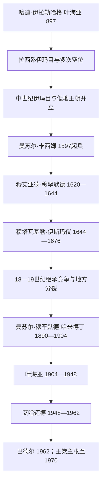

# 宰德派伊玛目与穆塔瓦基利亚王国世系表

## 制度说明

宰德派伊玛目不是固定的父死子继王制度。候选者须出自哈桑或侯赛因后裔，具备宗教学识并公开“号召”支持者；实际权力还取决于萨达—萨那高地部落、城市士绅、军队和税源。因此897—20世纪之间常出现空位、并立伊玛目、只控制一座城或只获部分部落承认的情形。下表先列对政权演变有决定性影响的伊玛目，再完整列出1918—1962年穆塔瓦基利亚王国君主；“重要伊玛目”并非伪装成无争议的全名单。

## 重要宰德派伊玛目

| 伊玛目 | 主张或统治时间 | 世系／继承关系 | 主要控制区与作用 | 备注 |
|---|---|---|---|---|
| **哈迪·伊拉勒哈格·叶海亚·本·侯赛因** | 897—911年 | 拉西家族，先知后裔；受萨达部落邀请 | 在萨达建立也门宰德派伊玛目制，传播哈德维法学并以调解部落、征战扩权。 | 国家并未连续控制整个也门，但其宗教—政治模式延续千年。 |
| 穆尔塔达·穆罕默德 | 911—913年 | 哈迪之子 | 短期继承后退位。 | 退位显示伊玛目资格并不等于自动世袭。 |
| 纳西尔·艾哈迈德 | 913—934/937年 | 哈迪之子、前任之弟 | 重建萨达核心并与低地、卡尔马特派和地方势力交战。 | 卒年与名义伊玛目任期有不同算法。 |
| 曼苏尔·卡西姆·伊亚尼 | 999—1002/1003年 | 哈迪叔系后裔 | 一度重建伊玛目权威，与优菲尔等地方势力竞逐。 | 同期存在其他主张者。 |
| 穆塔瓦基勒·艾哈迈德·本·苏莱曼 | 1138—1171年 | 纳西尔·艾哈迈德后裔 | 在长期空位后复兴伊玛目制，控制萨达、萨那等地并与苏莱希、哈姆丹势力竞争。 | 后期被政敌囚禁，控制范围反复。 |
| **曼苏尔·阿卜杜拉·本·哈姆扎** | 1187—1217年 | 哈桑后裔 | 抵抗阿尤布王朝，整合高地部落和学术网络。 | 与其他宰德派支系的教法争论也影响其统治。 |
| 穆塔瓦基勒·穆塔哈尔·本·穆罕默德 | 15世纪中后期 | 拉西系 | 在塔希尔王朝压力下维持北部高地伊玛目政治，为抗外来低地政权的传统提供连续性。 | 具体起讫及共同主张者在王表中不一。 |
| **曼苏尔·卡西姆·本·穆罕默德** | 1597—1620年 | 卡西姆家族奠基者 | 发起反奥斯曼起义，以高地部落、宗教声望和分区委任建立持久联盟。 | 卡西姆国家由此形成，继承逐渐呈家族化。 |
| **穆艾亚德·穆罕默德** | 1620—1644年 | 前任之子 | 扩大反奥斯曼战争，1635年前后迫使奥斯曼撤离，统一大部分也门。 | 是从起义走向独立国家的关键人物。 |
| **穆塔瓦基勒·伊斯玛仪** | 1644—1676年 | 前任之弟 | 把卡西姆统治扩至低地、亚丁和哈德拉毛，依靠咖啡出口、港口税和家族总督达到疆域高峰。 | 对逊尼派低地的治理与继承安排留下紧张。 |
| 马赫迪·艾哈迈德 | 1676—1681年 | 伊斯玛仪侄辈 | 在继承竞争后取得伊玛目位。 | 强化家族性继承但未消除并立。 |
| 穆艾亚德·穆罕默德二世 | 1681—1686年 | 卡西姆家族 | 维持国家核心。 | 其死后竞争加剧。 |
| 马赫迪·穆罕默德 | 1689—1718年 | 卡西姆家族 | 通过军队和税收强化个人权力。 | 严酷征敛、宗族竞争和地方反抗削弱国家。 |
| 穆塔瓦基勒·卡西姆 | 1716—1727年 | 卡西姆家族，先为竞争者 | 在内战中胜出。 | 拉赫季等边缘地区开始脱离；广域国家转向高地核心。 |
| 马赫迪·阿拔斯 | 1748—1775年 | 卡西姆家族 | 相对稳定萨那政权并维持学术、商业活动。 | 地方自主和港口收入流失已难逆转。 |
| 曼苏尔·阿里一世 | 1775—1809年 | 马赫迪·阿拔斯之子 | 在瓦哈比—沙特扩张与部落压力下维持萨那。 | 19世纪初低地、提哈马与外部竞争加重。 |
| 马赫迪·阿卜杜拉 | 1816—1835年 | 卡西姆家族 | 在穆罕默德·阿里势力、地方军头和经济衰退之间维持统治。 | 此后萨那频繁废立，并立者众，不能用单线世系概括。 |
| 曼苏尔·穆罕默德·本·叶海亚·哈米德丁 | 1890—1904年 | 哈米德丁家族 | 领导反第二次奥斯曼统治的高地起义，重建跨部落联盟。 | 其子叶海亚继承政治网络。 |
| **穆塔瓦基勒·叶海亚·穆罕默德·哈米德丁** | 1904—1948年 | 前任之子 | 1911年《达安条约》取得高地自治；1918年奥斯曼撤离后建立独立国家并推动中央集权。 | 1926年正式采用国王称号；1948年遇刺。 |

## 穆塔瓦基利亚王国全部君主与短期主张者

| 顺序 | 姓名 | 伊玛目号／王号 | 在位或主张时间 | 生卒 | 与前任关系 | 关键事件与备注 |
|---:|---|---|---|---|---|---|
| 1 | **叶海亚·穆罕默德·哈米德丁** | 穆塔瓦基勒·阿拉拉；1926年起称也门国王 | 1918—1948年（伊玛目自1904年） | 1869—1948年 | 独立国家建立者 | 接收奥斯曼撤离后的北也门；以王子、总督和人质制度集中权力；1934年对沙战争后订塔伊夫条约；1948年在宪政革命中遇刺。 |
| 争议 | 阿卜杜拉·本·艾哈迈德·瓦齐尔 | 哈迪·伊拉勒哈格；宪政派所立伊玛目 | 1948年2月17日—3月14日 | 1885—1948年 | 非哈米德丁直系；革命推举 | 宪政革命短暂控制萨那，拟建立受协商机关约束的伊玛目制；艾哈迈德王子调集部落反攻后被处决。作为实际短期统治者列出，但未获普遍承认。 |
| 2 | **艾哈迈德·本·叶海亚·哈米德丁** | 纳西尔·利丁拉；也门国王 | 1948年3月—1962年9月 | 1891—1962年 | 叶海亚之子 | 镇压1948年革命，迁重心至塔伊兹；有限引进军援和现代机构，同时维持个人、王族和部落政治；多次政变与暗杀未遂暴露危机。 |
| 3 | **穆罕默德·巴德尔·艾哈迈德** | 曼苏尔·比拉；也门国王 | 1962年9月19—26日；王党主张延续至1970年 | 1926—1996年 | 艾哈迈德之子 | 即位一周后被军官革命推翻；逃往北部组织王党，获沙特支持，与埃及支持的共和国作战。1970年共和国获承认后，其王位主张失去现实基础。 |

## 制度的兴衰

| 层面 | 延续条件 | 衰落因素 | 直接转折 |
|---|---|---|---|
| 合法性 | 先知后裔身份、宗教学识、公开号召和调停部落的能力 | 多位候选人可同时满足资格，继承缺乏唯一规则 | 每次伊玛目死亡都可能引发并立和部落重新选边。 |
| 军政 | 高地险要地形、部落武装、地方税粮和宗教网络 | 难以长期直接控制逊尼派低地、港口和远东哈德拉毛 | 奥斯曼、低地王朝或地方总督常乘内争进入。 |
| 经济 | 17世纪咖啡出口和红海港税支撑卡西姆扩张 | 咖啡种植外传、港口脱离、征税层层转包 | 18—19世纪国家缩回萨那周边并频繁废立。 |
| 现代国家 | 哈米德丁利用奥斯曼撤离、王族总督和常备军集中权力 | 行政封闭、军官和知识分子不满、王位继承与改革停滞 | 1962年军官政变建立共和国，随后八年内战决定制度终结。 |

## 相关笔记

- 主阶段：[伊斯兰王朝、伊玛目制与南北分治](/%E4%BA%BA%E6%96%87%E7%A7%91%E5%AD%A6/%E5%8E%86%E5%8F%B2/%E8%A5%BF%E4%BA%9A/%E9%98%BF%E6%8B%89%E4%BC%AF%E5%8D%8A%E5%B2%9B/%E4%B9%9F%E9%97%A8/%E4%BC%8A%E6%96%AF%E5%85%B0%E7%8E%8B%E6%9C%9D%E3%80%81%E4%BC%8A%E7%8E%9B%E7%9B%AE%E5%88%B6%E4%B8%8E%E5%8D%97%E5%8C%97%E5%88%86%E6%B2%BB.md)
- 现代元首承接：[现代也门国家元首与并立权力结构表](/%E4%BA%BA%E6%96%87%E7%A7%91%E5%AD%A6/%E5%8E%86%E5%8F%B2/%E8%A5%BF%E4%BA%9A/%E9%98%BF%E6%8B%89%E4%BC%AF%E5%8D%8A%E5%B2%9B/%E4%B9%9F%E9%97%A8/%E7%8E%B0%E4%BB%A3%E4%B9%9F%E9%97%A8%E5%9B%BD%E5%AE%B6%E5%85%83%E9%A6%96%E4%B8%8E%E5%B9%B6%E7%AB%8B%E6%9D%83%E5%8A%9B%E7%BB%93%E6%9E%84%E8%A1%A8.md)
- 总览：[也门历史](/%E4%BA%BA%E6%96%87%E7%A7%91%E5%AD%A6/%E5%8E%86%E5%8F%B2/%E8%A5%BF%E4%BA%9A/%E9%98%BF%E6%8B%89%E4%BC%AF%E5%8D%8A%E5%B2%9B/%E4%B9%9F%E9%97%A8/README.md)
