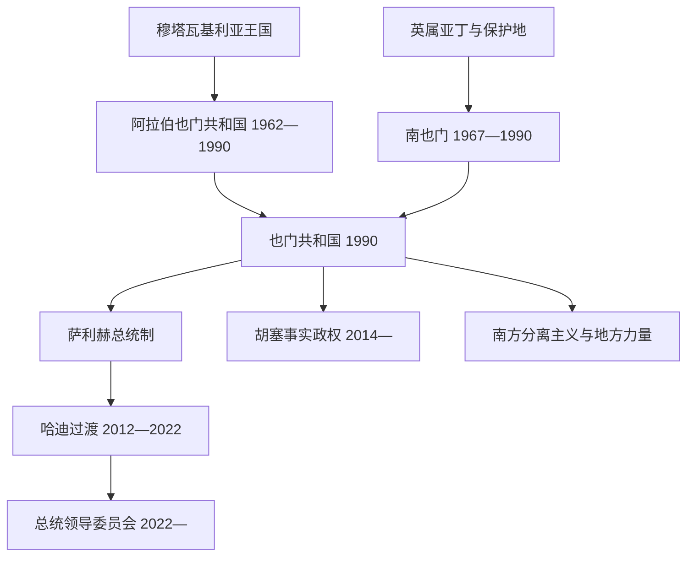

# 现代也门国家元首与并立权力结构表

## 使用说明

本表把正式国家元首、执政党实际最高领导人和内战中的事实权力中心分开。北也门、南也门和统一后的也门使用不同宪制；2014年以后更不能把国际承认、法理职务和实际控制混为一谈。现状核验截止2026年7月13日。

## 北也门：阿拉伯也门共和国国家元首

| 顺序 | 姓名 | 职位 | 任期 | 生卒 | 上台与离任 | 关键事项 |
|---:|---|---|---|---|---|---|
| 1 | 阿卜杜拉·萨拉勒 | 革命指挥委员会主席、总统 | 1962年9月26日—1967年11月5日 | 1917—1994年 | 军官革命上台；访外期间被政变推翻 | 建立共和国；依赖埃及军援对抗沙特支持的王党，国家机构与战争动员同步展开。 |
| 2 | 阿卜杜勒·拉赫曼·伊里亚尼 | 共和国委员会主席 | 1967年11月5日—1974年6月13日 | 1910—1998年 | 文官政变接任；在军政压力下辞职 | 1968年萨那围城后共和国存续；1970年与王党和解，扩大部落精英参与。 |
| 3 | **易卜拉欣·哈姆迪** | 军事指挥委员会主席 | 1974年6月13日—1977年10月11日 | 1943—1977年 | “纠正运动”上台；遇刺 | 试图削弱部落酋长对军政的支配、发展地方合作社并推进南北和解；改革触动既有网络。 |
| 4 | 艾哈迈德·加什米 | 总统委员会主席、总统 | 1977年10月11日—1978年6月24日 | 1941—1978年 | 哈姆迪死后接任；爆炸身亡 | 短期恢复精英平衡，其死亡再次触发继承危机。 |
| 代 | 阿卜杜勒·卡里姆·阿拉希 | 代理总统 | 1978年6月24日—7月18日 | 1934—2006年 | 依宪临时代理；向萨利赫移交 | 主持短期过渡。 |
| 5 | **阿里·阿卜杜拉·萨利赫** | 总统 | 1978年7月18日—1990年5月22日 | 1947—2017年 | 制宪人民议会选出；统一后任新国家元首 | 以军队、部落、执政党和恩庇分配网络巩固政权；1982年建立全国人民大会；推动1990年统一。 |

## 南也门：正式国家元首与党政实际领导

| 时段 | 正式国家元首 | 正式任期 | 同期实际最高党政领导 | 权力结构与转折 |
|---|---|---|---|---|
| 独立初期 | **卡坦·穆罕默德·沙阿比**，总统 | 1967年11月30日—1969年6月22日 | 本人及民族解放阵线温和派 | 民族解放阵线接收英国殖民地与保护地；激进左翼在“纠正运动”中推翻沙阿比并将其软禁。 |
| 集体总统制 | **萨利姆·鲁巴伊·阿里**，总统委员会主席 | 1969年6月23日—1978年6月26日 | 阿卜杜勒·法塔赫·伊斯梅尔在党内影响日增 | 土地、国有化和群众组织改革推进；鲁巴伊在北也门加什米遇刺后的危机中被党内对手处决。 |
| 党国定型 | **阿卜杜勒·法塔赫·伊斯梅尔**，最高人民委员会主席团主席 | 1978年12月27日—1980年4月21日 | 本人，兼也门社会党总书记 | 建立也门社会党和苏联式党国结构；因领导层矛盾辞职并赴苏联。 |
| 阿里·纳赛尔时期 | **阿里·纳赛尔·穆罕默德**，最高人民委员会主席团主席 | 1980年4月21日—1986年1月24日 | 本人，兼总书记、政府首脑 | 尝试较务实的外交和经济政策；1986年1月党内枪战演成内战，其派系败退北方。 |
| 1986年后 | **海达尔·阿布·巴克尔·阿塔斯**，最高人民委员会主席团主席 | 1986年1月24日—1990年5月22日 | **阿里·萨利姆·贝德**，也门社会党总书记 | 贝德掌握党内最高权力，阿塔斯担任正式国家元首；内战损耗、苏联支持衰减和经济压力促使其接受统一。 |

## 统一后的法定国家元首

| 顺序 | 国家元首／集体机构 | 任期 | 继承方式 | 重要事项 |
|---:|---|---|---|---|
| 1 | **阿里·阿卜杜拉·萨利赫** | 1990年5月22日—2012年2月27日 | 1990—1994年任五人总统委员会主席，1994年后任共和国总统 | 统一初期与贝德、阿塔斯分享权力；1994年内战获胜后集中军政与资源；2011年抗议、精英分裂和国际调停迫使其交权。 |
| 2 | **阿卜杜拉布·曼苏尔·哈迪** | 2012年2月27日—2022年4月7日 | 海合会倡议下单一候选人选举；2022年移交集体委员会 | 推动全国对话和联邦方案；2014年胡塞进入萨那后法理与实际控制分离，2015年起政府多在亚丁、利雅得运作。 |
| 3 | **总统领导委员会**，主席拉沙德·穆罕默德·阿里米 | 2022年4月7日至今 | 哈迪转交总统、副总统权限；八人集体领导 | 代表国际承认政府，任务包括停火谈判、统一反胡塞军力和主持过渡。内部成员各有军队、地区与外援，实际整合有限。 |

## 2026年7月总统领导委员会成员

| 成员 | 委员会角色与基础 | 2026年状态 |
|---|---|---|
| **拉沙德·穆罕默德·阿里米** | 主席；前内政部长、前总统顾问 | 国际承认的集体国家元首首席代表。 |
| 苏丹·阿里·阿拉达 | 马里卜政治与部落基础 | 在能源产区、伊斯拉赫党与地方防务之间具有影响。 |
| 塔里克·穆罕默德·阿卜杜拉·萨利赫 | 西海岸“国民抵抗力量”领导人 | 控制红海沿岸部分军力，家族与前总统萨利赫相关。 |
| 阿卜杜勒·拉赫曼·穆哈拉米（阿布·扎拉） | 巨人旅等南方武装基础 | 代表重要反胡塞作战力量。 |
| 阿卜杜拉·阿里米·巴瓦齐尔 | 前哈迪总统办公室系统 | 偏重政治、制度与伊斯拉赫相关网络。 |
| 奥斯曼·侯赛因·穆贾利 | 萨达出身的部落、议会政治人物 | 代表北方反胡塞政治力量。 |
| **马哈茂德·苏拜希** | 前国防部长 | 2026年1月补入，取代被改组的南方成员之一。 |
| **萨利姆·汉巴希** | 哈德拉毛政治基础 | 2026年1月补入，加强东部省份代表性。 |

> 2026年1月改组前，南方过渡委员会主席艾达鲁斯·祖拜迪和哈德拉毛人物法拉杰·巴赫萨尼为委员。祖拜迪在南方危机后被逐出委员会；两席随后由苏拜希、汉巴希接替。

## 胡塞控制区的并立机构

| 机构／人物 | 时间 | 法理与实际角色 | 控制与说明 |
|---|---|---|---|
| 穆罕默德·阿里·胡塞，最高革命委员会主席 | 2015年2月—2016年8月 | 胡塞在萨那宣布的过渡最高机构 | 未获广泛国际承认；接管大量国家机关。 |
| 萨利赫·阿里·萨马德，最高政治委员会主席 | 2016年8月—2018年4月 | 胡塞—萨利赫联盟建立的并立集体元首 | 2017年联盟破裂、萨利赫被杀；萨马德2018年死于联军空袭。 |
| **马赫迪·马沙特**，最高政治委员会主席 | 2018年4月至今 | 胡塞控制区名义集体元首主席 | 主持萨那行政、任命政府并代表事实政权；未获国际承认为也门国家元首。 |
| **阿卜杜勒·马利克·胡塞**，安萨尔真主运动领袖 | 2004年至今 | 运动最高宗教、政治和军事领导 | 实际高于正式委员会与政府，决定战争、地区联盟和重大政治路线。 |
| 穆罕默德·艾哈迈德·米夫塔赫，代理政府首脑 | 2025年8月30日至今 | 胡塞控制区代理总理 | 前总理艾哈迈德·拉哈维及多名部长在2025年8月以色列空袭中死亡后代理。 |

## 2026年7月并立权力中心

| 权力中心 | 名义地位 | 实际控制或社会基础 | 外部关系 | 截止2026年7月的判断 |
|---|---|---|---|---|
| 总统领导委员会及辛达尼政府 | 国际承认政府 | 名义管理非胡塞的南部、东部和西海岸；政府重返亚丁，但军队仍由多个成员网络分掌 | 主要依靠沙特支持，部分力量过去受阿联酋支持 | 2026年1月收复南方过渡委员会在2025年12月取得的地区，但缺乏统一军令、稳定财政与全国行政能力。总理为沙伊阿·穆赫辛·辛达尼。 |
| 胡塞／安萨尔真主 | 事实政权 | 萨那及人口最密集的西北高地、红海沿岸大部；有完整安全、税收与动员体系 | 伊朗长期提供政治、技术和军事支持；同时保有本土宰德派与北方国家网络根基 | 主战线自2022年停火后大体冻结，但红海袭击、外部空袭和地区战争使冲突国际化。 |
| 南方过渡委员会残余网络 | 分离主义政治—军事网络；不再拥有PLC席位 | 在亚丁、拉赫季、达利阿、舍卜沃和哈德拉毛部分社会与武装中仍有支持，但不再稳定统治整个南方 | 长期受阿联酋支持；阿联酋2026年1月撤出剩余正式驻军 | 2025年12月扩张并提出两年过渡后，2026年1月遭沙特支持的反攻；1月9日部分代表宣布解散，祖拜迪及支持者否认，故应写“组织状态有争议、网络分裂且仍能动员”，不能写成稳定南方政府。 |
| 哈德拉毛及其他地方力量 | 省级、部落和地方武装 | 哈德拉毛部落联盟、地方行政、马里卜部落、西海岸部队等各有税源和武装 | 在沙特、阿联酋及国内政党间寻求支持 | 地方自治诉求不等同于支持胡塞或南方独立；也是PLC难以中央集权的原因。 |
| “基地”阿拉伯半岛分支等圣战组织 | 非国家武装 | 利用偏远地区、治理真空和走私网络活动 | 遭也门各方及外国反恐行动打击 | 领土统治较高峰期缩小，但仍构成安全威胁，不能视为正式并立政府。 |

## 现状边界

- **法理国家元首**：国际承认层面是总统领导委员会这一集体机构，阿里米为主席；不是单一“也门总统”完全统治全国。
- **最大事实统治者**：胡塞控制区内，马沙特主持正式机构，阿卜杜勒·马利克·胡塞掌握最高实际权力。
- **南方问题**：南方过渡委员会在2026年1月后失去PLC席位和2025年末新占领土，但其支持者、武装关系和独立诉求没有消失。
- **外部力量**：沙特是PLC最重要支持者；阿联酋撤出正式驻军不等于既有伙伴网络立即消失；伊朗支持胡塞；美国、英国和以色列因红海航运与地区战争实施过打击；联合国继续斡旋。
- **截至日期**：2026年7月13日前，2022年形成的主要胡塞—PLC地面战线仍大体冻结，南方反胡塞阵营却在2025年末至2026年初发生重大重组，红海与地区冲突仍可能触发升级。

## 相关笔记

- 前期世系：[宰德派伊玛目与穆塔瓦基利亚王国世系表](/%E4%BA%BA%E6%96%87%E7%A7%91%E5%AD%A6/%E5%8E%86%E5%8F%B2/%E8%A5%BF%E4%BA%9A/%E9%98%BF%E6%8B%89%E4%BC%AF%E5%8D%8A%E5%B2%9B/%E4%B9%9F%E9%97%A8/%E5%AE%B0%E5%BE%B7%E6%B4%BE%E4%BC%8A%E7%8E%9B%E7%9B%AE%E4%B8%8E%E7%A9%86%E5%A1%94%E7%93%A6%E5%9F%BA%E5%88%A9%E4%BA%9A%E7%8E%8B%E5%9B%BD%E4%B8%96%E7%B3%BB%E8%A1%A8.md)
- 当代过程：[统一、政治危机与当代也门](/%E4%BA%BA%E6%96%87%E7%A7%91%E5%AD%A6/%E5%8E%86%E5%8F%B2/%E8%A5%BF%E4%BA%9A/%E9%98%BF%E6%8B%89%E4%BC%AF%E5%8D%8A%E5%B2%9B/%E4%B9%9F%E9%97%A8/%E7%BB%9F%E4%B8%80%E3%80%81%E6%94%BF%E6%B2%BB%E5%8D%B1%E6%9C%BA%E4%B8%8E%E5%BD%93%E4%BB%A3%E4%B9%9F%E9%97%A8.md)
- 南北分治阶段：[伊斯兰王朝、伊玛目制与南北分治](/%E4%BA%BA%E6%96%87%E7%A7%91%E5%AD%A6/%E5%8E%86%E5%8F%B2/%E8%A5%BF%E4%BA%9A/%E9%98%BF%E6%8B%89%E4%BC%AF%E5%8D%8A%E5%B2%9B/%E4%B9%9F%E9%97%A8/%E4%BC%8A%E6%96%AF%E5%85%B0%E7%8E%8B%E6%9C%9D%E3%80%81%E4%BC%8A%E7%8E%9B%E7%9B%AE%E5%88%B6%E4%B8%8E%E5%8D%97%E5%8C%97%E5%88%86%E6%B2%BB.md)
- 总览：[也门历史](/%E4%BA%BA%E6%96%87%E7%A7%91%E5%AD%A6/%E5%8E%86%E5%8F%B2/%E8%A5%BF%E4%BA%9A/%E9%98%BF%E6%8B%89%E4%BC%AF%E5%8D%8A%E5%B2%9B/%E4%B9%9F%E9%97%A8/README.md)
