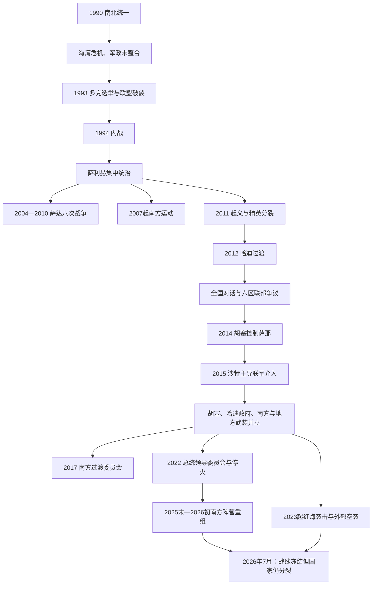

# 统一、政治危机与当代也门

## 时间

1990年—2026年7月13日

## 概括

1990年南北也门合并建立共和国，但统一协议把两套军队、党国机构、财政体系和地区精英并置在一个脆弱的权力分享框架中。1994年北方主导的军政联盟取胜后，统一从协商合并转为高度不对称的中央统治；南方土地、军职和资源分配争议不断积累。北部胡塞运动在2004—2010年六次萨达战争中军事化，2011年起义又使总统、军队、部落和政党联盟裂解。过渡政府未能就联邦边界、军队整合和资源分配达成可执行方案，胡塞与前总统萨利赫结成战术联盟，于2014年控制萨那。

2015年沙特主导联军介入后，冲突成为内战、地区竞争和地方权力重组的叠合体。2022年停火大幅降低主要地面战线强度，但没有统一国家或达成政治协议。到2026年7月，国际承认的总统领导委员会、控制人口密集西北部的胡塞事实政权、南方分离主义残余网络及各地武装并存；红海航运和地区战争又把也门重新置于国际冲突中心。

## 1990—1994年：统一、权力分享与内战

### 统一安排

1990年5月22日，阿拉伯也门共和国与也门民主人民共和国合并。阿里·阿卜杜拉·萨利赫任五人总统委员会主席，南方领导人阿里·萨利姆·贝德任副主席，海达尔·阿布·巴克尔·阿塔斯任总理。新宪法承认多党、选举和相对开放的新闻环境；统一也使原南方社会党、北方全国人民大会以及伊斯拉赫党在同一政治场竞争。

制度合并却慢于政治宣言。原南北军队保留各自指挥、驻地和重武器，安全机关彼此监视；南方国有经济和北方混合经济没有完成财政整合；南方干部担心人口较少使其在选举政治中永久居于少数。统一后的土地、油田、港口和官职分配没有形成可信仲裁机制。

### 危机累积

1990—1991年海湾危机中，也门反对以战争授权驱逐伊拉克的立场导致海湾援助减少，大批在沙特工作的也门人被迫回国，侨汇骤降、失业和财政压力上升。统一初期政治暗杀频发，尤其打击也门社会党干部，进一步破坏互信。1993年议会选举后，全国人民大会、伊斯拉赫和社会党组成三方联盟，但社会党席位和谈判地位下降；贝德退居亚丁，要求落实军队整合、安全调查和地方分权。

1994年2月各方在安曼签署政治和解文件，前线部队却已多次交火。4月阿姆兰附近坦克冲突升级，5月全面战争爆发。北方军队与伊斯拉赫、南方流亡军人等盟友向南推进；原南方部队和社会党控制区宣布“也门民主共和国”，试图恢复南方国家。该政权仅获有限外部同情、未获普遍承认。7月7日亚丁被攻占，贝德等流亡，战争结束。

### 战争为何以北方联盟胜出

北方人口与军力更大，萨利赫能联合部落、伊斯拉赫武装和1986年逃亡北方的南也门军人；南方军队在1986年已受重创，领导层又缺乏稳定外援。直接触发是1994年军队对峙失控，但深层原因是统一没有解决主权、军令和资源分配。战后取消集体总统制，萨利赫成为单一总统；南方军人、官员被大批提前退役，土地与企业处置争议为后来的南方运动提供社会基础。

## 1994—2011年：集中统治与多重反叛

萨利赫政权通过全国人民大会、总统卫队、共和国卫队、中央安全部队、部落酋长和商业家族分配职位、军费和资源。选举与议会继续存在，但关键安全和财政权力集中于总统家族及亲信。石油出口、外援和侨汇支撑这一网络；人口增长、水资源枯竭、青年失业、腐败和地区服务差距则不断侵蚀其财政基础。2000年与沙特签订边界条约解决长期边界争端，却未改变内部治理危机。

### 胡塞运动与萨达六次战争

1990年代，萨达的宰德派复兴组织“信仰青年”回应宗教教育竞争、北部边缘化和对美国—以色列政策的不满。侯赛因·巴德尔丁·胡塞逐渐形成反政府运动。2004年政府试图逮捕他，第一次萨达战争爆发；侯赛因战死后，其兄弟阿卜杜勒·马利克成为核心领导。2004—2010年政府与胡塞经历六轮战争，停火、重建和再开战循环。军队轰炸、地方报复、部落选边以及2009年沙特边境介入使运动由地方宗教政治团体转变为有战斗经验、独立指挥和强烈受害叙事的武装力量。

### 南方运动与圣战组织

2007年，遭退役的南方军人发起待遇抗议，逐渐汇入要求平等、自治乃至独立的“南方运动”。政府压制和对1994年战后资源分配的不满使其扩大，但运动始终包含多派领导和不同目标。与此同时，“基地”阿拉伯半岛分支2009年由也门、沙特成员合并形成，利用偏远地区、部落庇护和国家治理缺口活动。萨利赫在反恐合作、国内反对派和海湾援助之间周旋，却越来越难维持旧平衡。

## 2011—2014年：起义、权力移交与过渡失败

### 2011年危机

2011年1月起，学生、青年、政党和地区运动在萨那、塔伊兹、亚丁等地抗议长期统治、腐败、失业和修宪计划。3月18日“尊严星期五”枪击造成大量示威者死亡，阿里·穆赫辛·艾哈迈尔等高级军官和重要部落领袖转向反对阵营，首都形成相互对峙的军队。6月总统府清真寺爆炸重伤萨利赫，他赴沙特治疗后回国。11月23日，在海合会和联合国斡旋下，萨利赫签署移交协议，以豁免安排换取把权力交给副总统哈迪。

2012年2月，哈迪在单一候选人选举后就任，原定两年完成军队重组、全国对话和新宪法。萨利赫辞去总统但继续领导全国人民大会，家族和盟友仍控制部分军队；旧政权并未从国家网络中消失。

### 全国对话与联邦争议

2013年3月至2014年1月的全国对话会议汇集政党、胡塞、妇女、青年和部分南方代表，形成权利、国家结构和军队改革原则。但重要南方分离派拒绝参加或退出；会议没有可执行的武装解除、财政分配和过渡问责机制。此后提出六个联邦区，胡塞认为其把萨达置于缺乏港口和资源的内陆区，南方力量也反对把原南也门分成两个区。

政府削减燃油补贴、生活成本上升，给胡塞动员提供机会。胡塞在2011年后扩大萨达控制，并与敌对部落、伊斯拉赫及阿里·穆赫辛部队交战。前总统萨利赫虽曾发动六次战争，却与胡塞建立战术联盟，利用仍忠于自己的军政人员打击共同对手。2014年7月胡塞攻占阿姆兰，9月21日进入萨那；各方签署“和平与民族伙伴协议”，但胡塞继续掌控军政机关。2015年1月胡塞扣押总统府和哈迪，哈迪辞职后逃往亚丁、撤回辞呈；胡塞—萨利赫部队向南推进，过渡体制彻底崩溃。

## 2015—2022年：国际化内战与权力碎片化

### 联军介入与前线形成

2015年3月26日，沙特领导多国联军以恢复哈迪政府为目标发动空袭，随后支持也门地面部队。阿联酋重点扶植南方和西海岸武装。胡塞—萨利赫联盟控制萨那、北部高地和红海大部；反胡塞力量在夏季夺回亚丁，政府名义首都逐渐转往亚丁。塔伊兹长期分割围困，马里卜成为政府重要能源和军事中心，荷台达港则关系全国粮食与燃料进口。

战争不是简单的“沙特—伊朗代理战”。胡塞有本地组织、税收和部落基础，伊朗支持在战争中逐步增加；政府阵营内部同时存在伊斯拉赫、萨利赫家族西海岸部队、南方分离派、萨拉菲武装和地方部落。空袭、炮击、地雷、港口限制、货币分裂、公共工资中断和基础设施崩溃共同造成大规模人道危机。2015年“基地”一度占领穆卡拉，2016年被阿联酋支持部队逐出，但圣战组织并未消失。

### 联盟破裂与南方力量兴起

2017年5月，艾达鲁斯·祖拜迪等成立南方过渡委员会（STC），要求恢复南方国家，并依靠安全带、精锐部队等武装。2017年12月萨利赫试图转向沙特谈判，与胡塞在萨那交战后被杀；胡塞由此清除联盟伙伴并进一步集中北部统治。2018年联军向荷台达推进，联合国斡旋的《斯德哥尔摩协议》阻止全面攻城，却只实现有限撤军和监督。

2019年8月STC从哈迪政府手中夺取亚丁，显示反胡塞阵营也存在内战风险。11月《利雅得协议》要求组建联合政府、整合军队和让政府返回亚丁；实施反复延迟。2020年成立包含STC的权力分享内阁，但各武装仍保留独立指挥。2020—2021年胡塞向马里卜进攻，未能夺取城市；双方伤亡与经济压力加重。

### 2022年停火与总统领导委员会

2022年4月，哈迪把总统和副总统权限移交八人总统领导委员会，阿里米任主席，试图把主要反胡塞派系纳入共同框架。同月联合国斡旋停火，开放部分荷台达燃料进口、萨那航班并暂停跨境大规模攻击。正式停火在10月到期，但主要地面战线此后大体保持低强度。它减少伤亡，却没有解决公共工资、道路开放、石油收入、全国货币和政治终局。

## 2022—2026年：冻结战线、经济战与地区升级

### 未完成的和平进程

沙特与胡塞在阿曼等方斡旋下直接接触，讨论停火、工资和撤军；加沙战争及红海危机中断了全面路线图。胡塞在2022年袭击政府石油出口港，迫使原油出口大幅停顿，国际承认政府失去关键外汇；萨那与亚丁分别实行金融规则、汇率和银行监管，经济分裂成为战争延续方式。双方拘押政治对手、限制媒体和援助组织；胡塞控制区还发生联合国与非政府组织人员被扣押，进一步压缩救援空间。

### 红海袭击与外部空袭

2023年末起，胡塞以支持加沙为名袭击或扣押红海、曼德海峡航运，并向以色列方向发射导弹和无人机。目标认定与实际遇袭船舶并不总一致，商业航线大规模绕行好望角。美国、英国自2024年起打击也门境内雷达、导弹和无人机设施，以色列也攻击荷台达、萨那等地。2025年5月经阿曼斡旋形成的美胡有限停火主要约束双方直接攻击，并不等于也门和平或胡塞停止所有地区行动；7月商船袭击再现。2025年8月以色列空袭杀死胡塞政府总理艾哈迈德·拉哈维及多名部长，穆罕默德·艾哈迈德·米夫塔赫代理政府首脑。

### 2025年末—2026年初南方重组

2025年12月，STC部队扩张至哈德拉毛和马赫拉等非胡塞地区，2026年1月2日宣布两年过渡并计划独立公投。此举威胁PLC内部平衡和沙特在东部边界、能源通道的利益。沙特支持的政府与地方部队在1月反攻，迅速收复STC新占地区并进入亚丁。1月7日祖拜迪被逐出PLC；1月9日赴利雅得的部分STC代表宣布组织解散，但祖拜迪及支持者否认，南方仍出现支持STC和自决的抗议。阿联酋撤出剩余正式驻军，既有伙伴网络却不会立即消失。

PLC补入马哈茂德·苏拜希、萨利姆·汉巴希，并在2026年2月组成由沙伊阿·穆赫辛·辛达尼领导的新政府。政府重返亚丁，名义恢复对非胡塞南部、东部的主导；军队、财政和地方诉求仍未真正统一。因此截至2026年7月，STC不应再写成稳定控制整个南方的并立政府，而应写成“正式地位被取消、组织解散有争议、仍有社会与武装残余的分离主义网络”。

### 截止2026年7月13日

胡塞继续控制萨那及人口最密集的西北地区，阿卜杜勒·马利克·胡塞掌握最高实际权力，马赫迪·马沙特主持最高政治委员会。PLC是国际承认的集体国家元首，阿里米任主席，辛达尼任政府总理；其实际控制依靠多支地方军队和沙特支持。主要胡塞—PLC战线仍大体冻结，但地区冲突持续溢出：2026年围绕伊朗战争、萨那—德黑兰航班和沙特空域的争议使胡塞重新向沙特方向发射或宣称发射导弹、无人机。停火状态因而不能等同于和平协议。

现任领导、完整国家元首序列、2026年PLC成员和并立权力中心详见[现代也门国家元首与并立权力结构表](/%E4%BA%BA%E6%96%87%E7%A7%91%E5%AD%A6/%E5%8E%86%E5%8F%B2/%E8%A5%BF%E4%BA%9A/%E9%98%BF%E6%8B%89%E4%BC%AF%E5%8D%8A%E5%B2%9B/%E4%B9%9F%E9%97%A8/%E7%8E%B0%E4%BB%A3%E4%B9%9F%E9%97%A8%E5%9B%BD%E5%AE%B6%E5%85%83%E9%A6%96%E4%B8%8E%E5%B9%B6%E7%AB%8B%E6%9D%83%E5%8A%9B%E7%BB%93%E6%9E%84%E8%A1%A8.md)。

## 重要事件

| 时间 | 事件 | 背景与过程 | 结果与长期影响 |
|---|---|---|---|
| 1990年5月22日 | 南北统一 | 两国快速合并，建立集体总统制和多党制 | 形成也门共和国，也把未整合军队与精英竞争带入新国家。 |
| 1990—1991年 | 海湾危机冲击 | 援助、侨汇和海湾就业骤减 | 财政与社会压力削弱统一初期合法性。 |
| 1993年 | 首次议会选举 | 三大党重新分配权力，贝德退居亚丁 | 协商机制陷入僵局，军队冲突增加。 |
| 1994年5—7月 | 统一内战 | 和解文件失败、军队全面交战、南方短暂宣布独立 | 北方主导联盟取胜，权力集中，南方被排斥感长期化。 |
| 2004—2010年 | 萨达六次战争 | 政府与胡塞反复停火开战 | 胡塞完成军事化并建立北部治理、动员网络。 |
| 2007年起 | 南方运动 | 退役军人待遇抗议扩为地区政治运动 | 南方自治和独立重新成为全国核心议题。 |
| 2009年 | “基地”阿拉伯半岛分支成立 | 沙特与也门圣战网络合并 | 反恐介入加深，治理真空出现新的利用者。 |
| 2011年3月18日 | “尊严星期五”枪击 | 示威者遇袭后军官、部落领袖倒向反对派 | 旧政权精英联盟公开分裂。 |
| 2011年11月—2012年2月 | 权力移交 | 海合会协议、萨利赫辞任、哈迪当选 | 长期总统统治结束，但旧军政网络未被拆除。 |
| 2013—2014年 | 全国对话 | 广泛代表讨论国家重构 | 形成原则性成果，却未解决武装、联邦边界和执行权。 |
| 2014年9月21日 | 胡塞进入萨那 | 物价抗议、军队分裂、萨利赫暗助 | 过渡政府失去实际主权，国家权力分裂。 |
| 2015年3月26日 | 沙特主导联军介入 | 胡塞—萨利赫部队南下、哈迪求援 | 内战国际化，空袭、封锁和地方代理力量扩大。 |
| 2017年 | STC成立、萨利赫被杀 | 南方不满组织化；胡塞联盟破裂 | 南方出现准政府网络，胡塞独占萨那阵营。 |
| 2018年12月 | 《斯德哥尔摩协议》 | 荷台达攻势威胁主要进口港 | 阻止全面攻城，但未形成全国停火。 |
| 2019年8—11月 | STC夺取亚丁与《利雅得协议》 | 反胡塞阵营内部交战 | 权力分享被制度化，军队整合仍失败。 |
| 2022年4月 | PLC成立与联合国停火 | 哈迪权威衰弱、各方战争疲劳 | 大规模前线降级，法理国家元首改为八人集体。 |
| 2022年末起 | 石油与金融经济战 | 胡塞袭击出口港、双方监管分裂 | 政府财政恶化，公共服务和汇率危机延续。 |
| 2023年末起 | 红海袭击 | 胡塞把加沙战争与地区战略相连 | 全球航运改道，美英以对也门实施打击，和平进程受阻。 |
| 2025年12月—2026年1月 | 南方危机 | STC扩张、宣布过渡；沙特支持PLC反攻 | STC失去PLC席位和新占领土，但分离主义网络未消失。 |
| 2026年2月 | 辛达尼政府成立 | PLC改组反胡塞阵营 | 政府返回亚丁，整军、财政和地方代表性仍是未决难题。 |

## 当代并立权力结构

| 中心 | 正式或事实地位 | 控制基础 | 核心矛盾 |
|---|---|---|---|
| 总统领导委员会／辛达尼政府 | 国际承认政府；集体国家元首 | 亚丁及非胡塞南部、东部、西海岸的名义统辖，多支地方军力 | 成员军事网络未统一、石油收入中断、依赖沙特。 |
| 胡塞／安萨尔真主 | 未获普遍国际承认的事实政权 | 萨那、西北高地、荷台达大部及多数人口；税收、安全和军事体系较集中 | 受制裁与空袭、经济孤立、和平条件及地区军事行动相互牵制。 |
| 南方分离主义残余网络 | 2026年1月后正式地位有争议 | 部分南方社会支持、抗议网络和旧武装关系 | 独立诉求与PLC统一主张冲突，内部也有地区、领导和外援分歧。 |
| 哈德拉毛、马里卜、西海岸等地方力量 | 省级行政、部落、党派或军队 | 各自地缘、资源和武装 | 既反对胡塞，也未必接受萨那或亚丁的强中央。 |
| 外部力量 | 支持者、斡旋者或打击方 | 沙特、阿联酋、伊朗、阿曼、美国、英国、以色列及联合国各有不同角色 | 国内议程与地区安全、航运、伊朗竞争交织。 |

## 兴衰与战争持续原因

### 统一体制为何失败

- **结构因素**：两国人口、军力和经济规模不对称；军队、安全机关、产权与地方行政未在过渡期整合。
- **政治机制**：集体总统制缺乏解决否决和军队冲突的强制程序；1993年选举改变席位后，原双边平衡失效。
- **经济冲击**：海湾危机造成侨汇、援助和就业骤降，加剧分配竞争。
- **安全触发**：政治暗杀、部队对峙和1994年4月坦克冲突把谈判危机转为全面战争。
- **战后后果**：胜者接管土地、军职和企业，未建立可信的南方申诉与权力分享制度。

### 萨利赫体制为何长期维持又迅速裂解

- 军队、部落、政党和商业网络以职位和资源互相绑定，允许总统在对手之间平衡。
- 石油、援助、侨汇和反恐合作提供可分配收入；选举和议会提供有限吸纳渠道。
- 人口、失业、水危机、腐败和地区战争不断扩大财政负担；继承家族化损害盟友预期。
- 2011年大规模抗议不是唯一原因；“尊严星期五”后军官与部落精英倒戈才使统治联盟断裂。

### 2014年后战争为何难以结束

| 层面 | 持续机制 |
|---|---|
| 国内权力 | 胡塞、PLC成员、南方和地方武装都拥有独立军队、税源与战时机构，和平可能威胁既得权力。 |
| 国家结构 | 联邦边界、南方自决、萨达出海、资源和首都地位没有共识。 |
| 经济 | 石油、港口、银行、货币和工资被用作谈判筹码；即使停火，经济战仍可继续。 |
| 外部压力 | 沙特、阿联酋、伊朗及红海打击方的安全目标不同，既能促成降级，也能扩大冲突。 |
| 直接触发 | 地方扩张、跨境导弹、航运袭击或领导人遇袭可迅速打破冻结状态。 |
| 人道与社会 | 大规模贫困、流离失所、基础设施损毁和拘押造成长期创伤，但援助受限制又削弱社会恢复。 |

2022年后的低强度状态能持续，是因为各方短期内难以取得决定性军事胜利，沙特希望降低跨境成本，胡塞也从现有控制区获得税收和政治地位；它仍缺少全国政治安排、武装整合和经济统一，因而属于“降级的未决战争”，不是战后秩序。

## 演变关系

- 前一节点：[伊斯兰王朝、伊玛目制与南北分治](/%E4%BA%BA%E6%96%87%E7%A7%91%E5%AD%A6/%E5%8E%86%E5%8F%B2/%E8%A5%BF%E4%BA%9A/%E9%98%BF%E6%8B%89%E4%BC%AF%E5%8D%8A%E5%B2%9B/%E4%B9%9F%E9%97%A8/%E4%BC%8A%E6%96%AF%E5%85%B0%E7%8E%8B%E6%9C%9D%E3%80%81%E4%BC%8A%E7%8E%9B%E7%9B%AE%E5%88%B6%E4%B8%8E%E5%8D%97%E5%8C%97%E5%88%86%E6%B2%BB.md)
- 完整国家元首及现状专表：[现代也门国家元首与并立权力结构表](/%E4%BA%BA%E6%96%87%E7%A7%91%E5%AD%A6/%E5%8E%86%E5%8F%B2/%E8%A5%BF%E4%BA%9A/%E9%98%BF%E6%8B%89%E4%BC%AF%E5%8D%8A%E5%B2%9B/%E4%B9%9F%E9%97%A8/%E7%8E%B0%E4%BB%A3%E4%B9%9F%E9%97%A8%E5%9B%BD%E5%AE%B6%E5%85%83%E9%A6%96%E4%B8%8E%E5%B9%B6%E7%AB%8B%E6%9D%83%E5%8A%9B%E7%BB%93%E6%9E%84%E8%A1%A8.md)
- 地区背景：[奥斯曼、英国与现代国家形成](/%E4%BA%BA%E6%96%87%E7%A7%91%E5%AD%A6/%E5%8E%86%E5%8F%B2/%E8%A5%BF%E4%BA%9A/%E9%98%BF%E6%8B%89%E4%BC%AF%E5%8D%8A%E5%B2%9B/%E5%A5%A5%E6%96%AF%E6%9B%BC%E3%80%81%E8%8B%B1%E5%9B%BD%E4%B8%8E%E7%8E%B0%E4%BB%A3%E5%9B%BD%E5%AE%B6%E5%BD%A2%E6%88%90.md)
- 上级：[也门历史](/%E4%BA%BA%E6%96%87%E7%A7%91%E5%AD%A6/%E5%8E%86%E5%8F%B2/%E8%A5%BF%E4%BA%9A/%E9%98%BF%E6%8B%89%E4%BC%AF%E5%8D%8A%E5%B2%9B/%E4%B9%9F%E9%97%A8/README.md)
