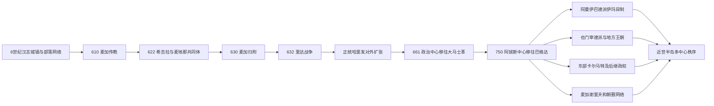

# 伊斯兰兴起、哈里发与地方王朝

## 时间

约570年—15世纪

## 概括

伊斯兰于7世纪在汉志兴起，穆罕默德把宗教宣讲、麦地那盟约、部落外交和军事动员结合为新的共同体。632年以后，正统哈里发以半岛为基础向拜占庭和萨珊领土扩张，政治中心随后移至大马士革和巴格达。半岛不再是帝国行政中心，却凭麦加、麦地那、朝觐路线、伊巴德派阿曼、宰德派也门、卡尔马特东阿拉伯和海上贸易保持独特地位。名义哈里发宗主权、地方王朝、部落协商与圣城谢里夫长期并存。

## 伊斯兰兴起的背景

6世纪的阿拉伯半岛同时存在城镇、绿洲农业、游牧和半游牧部落、南北商路与海贸。麦加是古莱什控制的圣地和市场，但其在国际奢侈品贸易中的具体规模存在学术争议；不宜把伊斯兰兴起简单归因于“麦加垄断全球贸易”。更可靠的背景包括地方朝圣、部落仲裁、也门—叙利亚联系、犹太教和基督教社群，以及拜占庭—萨珊竞争。

部落认同提供保护和复仇责任，却不排斥跨部落盟约。贫富差异、债务和孤儿寡妇保护等社会问题进入早期宣讲，但伊斯兰也不是单一阶级运动。宗教、伦理、末世信仰和共同体政治相互结合。

## 穆罕默德与麦地那共同体

### 从麦加传教到希吉拉

约610年穆罕默德开始宣讲独一神、末日审判和社会责任，反对者既担忧传统神祇和社会秩序，也涉及家族政治。部分追随者曾迁往阿克苏姆。619年前后保护者去世后，穆罕默德同叶斯里卜代表建立关系；622年与追随者迁往叶斯里卜，即希吉拉，后来成为伊斯兰纪元起点。

所谓“麦地那宪章”保存了穆斯林迁士、辅士及部分犹太部族的共同防卫与仲裁安排，文本形成层次仍有研究争议。它显示新共同体并非一开始就是同质国家，而是以先知仲裁、宗教身份和既有部族责任叠合。

### 战争、谈判与半岛整合

624年白德尔战役提高共同体威望；625年伍侯德失利，627年壕沟之战阻止麦加联盟。与麦地那犹太部族的关系在政治与战争中恶化，驱逐和惩罚成为早期共同体历史的一部分，不能用后世宗派概念简单解释。

628年侯代比亚协议暂缓冲突，让穆罕默德扩大外交和朝觐合法性；630年穆斯林进入麦加并清除克尔白偶像。此后来自半岛各地的使团结盟、纳贡或改宗，但中央控制程度不同。632年穆罕默德去世时，半岛大部已与麦地那建立政治关系，并非每个地区都拥有同样行政整合。

## 正统哈里发与帝国中心外移

阿布·伯克尔即位后，许多部落拒绝继续纳贡、追随新的先知或脱离联盟。632—633年的里达战争重新集中军力；其性质兼有政治分离、税赋争议和宗教竞争，不宜只译作个人“叛教”。欧麦尔时期军队向叙利亚、伊拉克、埃及和伊朗推进，军镇、俸禄名册和保留地方税制支持扩张。

| 阶段 | 半岛地位 | 权力结构 |
|---|---|---|
| 穆罕默德时期 | 麦地那为政治中心，麦加为朝觐和宗教中心 | 先知仲裁、盟约、部落首领和军事共同体结合。 |
| 正统哈里发 | 麦地那仍为首都，半岛军队和税赋支援对外征服 | 哈里发、协商精英、总督和军镇指挥官并行。 |
| 倭马亚时期 | 首都移至大马士革；汉志成为反对派和宗教学术中心 | 行省总督、圣城贵族与叙利亚军队互动。 |
| 阿拔斯时期 | 首都移至巴格达；朝觐和圣地象征更突出 | 哈里发派总督，地方王朝和麦加谢里夫逐步获得实际权力。 |

656—661年第一次内战使麦地那失去不可挑战的政治中心地位。680年侯赛因在卡尔巴拉遇难，683年麦加在围攻中受损；692年阿卜杜拉·本·祖拜尔败亡后，倭马亚重新统一。750年阿拔斯取代倭马亚，权力进一步东移。完整哈里发过程与世系见[阿拉伯帝国](/%E4%BA%BA%E6%96%87%E7%A7%91%E5%AD%A6/%E5%8E%86%E5%8F%B2/%E8%A5%BF%E4%BA%9A/_%E9%80%9A%E5%8F%B2/%E9%98%BF%E6%8B%89%E4%BC%AF%E5%B8%9D%E5%9B%BD/README.md)。

## 政治中心外移后的地方秩序

### 汉志圣城与麦加谢里夫

麦加、麦地那依靠朝觐、宗教教学、捐赠和商旅维持地位。哈里发和后来的苏丹通过派总督、提供粮款、修路、护送朝觐队伍和在礼拜中宣名表达主权。实际安全还依赖地方部族和圣城贵族。

10世纪以后，先知后裔中的哈桑系家族逐渐形成麦加谢里夫世袭统治。谢里夫会在法蒂玛、阿拔斯、阿尤布、马穆鲁克等强权之间调整名义效忠，以换取补贴和自治。圣城并非脱离政治：朝觐中断、粮价、争位和商路冲突都直接影响合法性。

### 阿曼伊巴德派和伊玛目制

伊巴德派在7世纪末形成，以对共同体推举合格伊玛目的强调区别于王朝世袭。8世纪阿曼建立早期伊玛目制，伊玛目需得到学者和部落支持；实际权力随部落联盟、海港和外部干预变化。阿曼沿海商人连接印度、东非和海湾，内陆伊玛目与沿海统治家族的关系后来成为长期政治结构。详细过程和统治者见[阿曼历史](/%E4%BA%BA%E6%96%87%E7%A7%91%E5%AD%A6/%E5%8E%86%E5%8F%B2/%E8%A5%BF%E4%BA%9A/%E9%98%BF%E6%8B%89%E4%BC%AF%E5%8D%8A%E5%B2%9B/%E9%98%BF%E6%9B%BC/README.md)。

### 也门的宰德派与地方王朝

897年，宰德派伊玛目哈迪·叶海亚在萨达建立宗教政治中心。伊玛目资格重视先知后裔、学识和公开举兵，不实行固定长子继承，因此常有并立竞争。高地宰德派之外，也门低地和港口先后受齐亚德、纳贾希、苏莱希、阿尤布和拉苏里等王朝统治。

苏莱希王朝11世纪同法蒂玛伊斯玛仪派联系，阿尔瓦女王时期政治和宗教网络突出；拉苏里王朝13—15世纪以塔伊兹和宰比德为中心，凭红海贸易、农业税和学术赞助形成强国。也门政治并非“宰德派一统”，高地伊玛目、低地王朝和部落长期并立，详见[也门历史](/%E4%BA%BA%E6%96%87%E7%A7%91%E5%AD%A6/%E5%8E%86%E5%8F%B2/%E8%A5%BF%E4%BA%9A/%E9%98%BF%E6%8B%89%E4%BC%AF%E5%8D%8A%E5%B2%9B/%E4%B9%9F%E9%97%A8/README.md)。

### 东阿拉伯的卡尔马特和后继政权

9世纪末，伊斯玛仪派卡尔马特运动在巴林历史区和哈萨建立军事共同体，以绿洲农业、贡赋和袭击商路维持。930年卡尔马特军攻入麦加，屠杀朝觐者并取走黑石，造成巨大震动；黑石约二十余年后归还。卡尔马特并不等同后来主流伊斯玛仪派或现代巴林国家。

11世纪乌尤尼王朝在塞尔柱支持下击败卡尔马特，此后乌斯富里、贾尔万、贾布里等家族在东部海湾竞争。珍珠、椰枣、马匹和印度洋贸易使港口与绿洲保持价值，伊朗、伊拉克和阿曼势力也持续介入。

## 朝觐、贸易与知识网络

| 网络 | 具体运作 | 影响 |
|---|---|---|
| 叙利亚朝觐路 | 从大马士革经外约旦和汉志北下 | 倭马亚、马穆鲁克等政权以护送和供水展示统治。 |
| 埃及朝觐路 | 从开罗经西奈、亚喀巴或红海 | 粮食、捐赠和马穆鲁克保护支撑圣城。 |
| 伊拉克朝觐路 | 从库法穿越内志北部，阿拔斯时期设驿站和水利 | 祖拜达路遗迹显示帝国财政和工程能力。 |
| 也门朝觐路 | 高地、低地和红海港口通向麦加 | 把南阿拉伯王朝、商人和学者连接汉志。 |
| 海上朝觐 | 红海、波斯湾和印度洋船运 | 将东非、印度、东南亚穆斯林逐步纳入圣地网络。 |
| 学术与捐赠 | 清真寺、经学院、房产捐赠和旅居学者 | 麦加、麦地那成为跨法学派、跨语言知识交流中心。 |

## 重要事件

| 时间 | 事件 | 过程与影响 |
|---|---|---|
| 约610年 | 穆罕默德开始传教 | 一神信仰和末世伦理形成新宗教运动。 |
| 622年 | 希吉拉 | 麦地那共同体建立，宗教与政治盟约结合。 |
| 624年 | 白德尔战役 | 早期共同体取得威望和物质资源。 |
| 625、627年 | 伍侯德和壕沟之战 | 麦加冲突经历失利、防守和联盟瓦解。 |
| 628年 | 侯代比亚协议 | 以谈判获得朝觐和外交空间，为后续扩张创造条件。 |
| 630年 | 麦加归附 | 克尔白成为伊斯兰朝觐中心，古莱什多数纳入共同体。 |
| 632—633年 | 里达战争 | 哈里发重建对半岛部落的政治和财政联系。 |
| 636—642年 | 对拜占庭、萨珊重大胜利 | 征服收入和军镇使国家重心逐步离开半岛。 |
| 656—661年 | 第一次内战 | 哈里发合法性分裂，首都由麦地那移向叙利亚。 |
| 683、692年 | 麦加两度围攻及祖拜尔政权覆亡 | 圣城成为反倭马亚中心，最终被大马士革重新控制。 |
| 8世纪中叶 | 阿曼伊巴德派伊玛目制建立 | 推举制宗教政治成为半岛长期地方传统。 |
| 750年 | 阿拔斯革命 | 帝国中心移往两河，半岛地方化趋势增强。 |
| 897年 | 宰德派伊玛目进入也门 | 高地形成延续数世纪的宗教—政治制度。 |
| 899年前后 | 卡尔马特在东阿拉伯建立政权 | 挑战阿拔斯税收和朝觐秩序。 |
| 930年 | 卡尔马特攻陷麦加 | 朝觐者遭杀害、黑石被夺，暴露哈里发对半岛控制有限。 |
| 10世纪后 | 麦加谢里夫统治制度化 | 圣城在名义宗主权与地方世袭自治间运行。 |
| 1047—1138年 | 苏莱希王朝 | 也门跨高低地整合，并参与法蒂玛宗教网络。 |
| 1229—1454年 | 拉苏里王朝 | 红海贸易、农业和学术支持也门中世纪强国。 |

## 兴起、地方化与持续影响

### 早期共同体得以扩张

- 穆罕默德以跨部落宗教共同体提供新的忠诚和仲裁框架。
- 盟约、婚姻、朝觐和谈判与军事并用，而非只靠征服。
- 里达战争重新集中半岛军力，拜占庭—萨珊长期战争削弱边防。
- 军镇和战利品分配让远征者不必立即占有农地，可继续作战。

### 半岛失去行政中心的原因

- 叙利亚、伊拉克和埃及拥有更密集城市、税粮和旧帝国官僚。
- 倭马亚依赖叙利亚军队，阿拔斯依赖呼罗珊和两河网络。
- 半岛幅员大、税基有限，中央难以长期直接控制每个山地和绿洲。
- 部落、宗教学者、谢里夫和地方王朝能够利用外部强权竞争保持自治。

### 圣地影响为何持续

麦加和麦地那不再是首都，却掌握所有穆斯林共同承认的朝觐和先知记忆。任何声称普遍伊斯兰合法性的哈里发或苏丹都需要保护朝觐、资助圣城或在当地礼拜中获承认。宗教中心和政治中心由此可以分离，却保持相互依赖。

## 关键辨析

- 伊斯兰兴起不能只用麦加远距离贸易、社会贫富或外部帝国衰弱单因解释。
- “里达战争”既有信仰问题，也有纳贡、联盟和继承权争议。
- 帝国中心外移不等于半岛“退出历史”；圣城、地方教派、海贸和部落外交继续塑造区域。
- 伊巴德、宰德、伊斯玛仪等传统不能简单视为逊尼“异端”，应按各自教义、制度和历史语境理解。
- 本页是多政权区域专题，不重复也门、阿曼和东海岸所有长世系；完整统治者应在国家规范页维护。

## 演变关系

- 前一节点：[古代南阿拉伯、绿洲与商路](/%E4%BA%BA%E6%96%87%E7%A7%91%E5%AD%A6/%E5%8E%86%E5%8F%B2/%E8%A5%BF%E4%BA%9A/%E9%98%BF%E6%8B%89%E4%BC%AF%E5%8D%8A%E5%B2%9B/%E5%8F%A4%E4%BB%A3%E5%8D%97%E9%98%BF%E6%8B%89%E4%BC%AF%E3%80%81%E7%BB%BF%E6%B4%B2%E4%B8%8E%E5%95%86%E8%B7%AF.md)
- 后一节点：[奥斯曼、英国与现代国家形成](/%E4%BA%BA%E6%96%87%E7%A7%91%E5%AD%A6/%E5%8E%86%E5%8F%B2/%E8%A5%BF%E4%BA%9A/%E9%98%BF%E6%8B%89%E4%BC%AF%E5%8D%8A%E5%B2%9B/%E5%A5%A5%E6%96%AF%E6%9B%BC%E3%80%81%E8%8B%B1%E5%9B%BD%E4%B8%8E%E7%8E%B0%E4%BB%A3%E5%9B%BD%E5%AE%B6%E5%BD%A2%E6%88%90.md)
- 帝国规范入口：[阿拉伯帝国](/%E4%BA%BA%E6%96%87%E7%A7%91%E5%AD%A6/%E5%8E%86%E5%8F%B2/%E8%A5%BF%E4%BA%9A/_%E9%80%9A%E5%8F%B2/%E9%98%BF%E6%8B%89%E4%BC%AF%E5%B8%9D%E5%9B%BD/README.md)
- 地方入口：[沙特阿拉伯历史](/%E4%BA%BA%E6%96%87%E7%A7%91%E5%AD%A6/%E5%8E%86%E5%8F%B2/%E8%A5%BF%E4%BA%9A/%E9%98%BF%E6%8B%89%E4%BC%AF%E5%8D%8A%E5%B2%9B/%E6%B2%99%E7%89%B9%E9%98%BF%E6%8B%89%E4%BC%AF/README.md)、[也门历史](/%E4%BA%BA%E6%96%87%E7%A7%91%E5%AD%A6/%E5%8E%86%E5%8F%B2/%E8%A5%BF%E4%BA%9A/%E9%98%BF%E6%8B%89%E4%BC%AF%E5%8D%8A%E5%B2%9B/%E4%B9%9F%E9%97%A8/README.md)、[阿曼历史](/%E4%BA%BA%E6%96%87%E7%A7%91%E5%AD%A6/%E5%8E%86%E5%8F%B2/%E8%A5%BF%E4%BA%9A/%E9%98%BF%E6%8B%89%E4%BC%AF%E5%8D%8A%E5%B2%9B/%E9%98%BF%E6%9B%BC/README.md)
- 上级：[阿拉伯半岛历史](/%E4%BA%BA%E6%96%87%E7%A7%91%E5%AD%A6/%E5%8E%86%E5%8F%B2/%E8%A5%BF%E4%BA%9A/%E9%98%BF%E6%8B%89%E4%BC%AF%E5%8D%8A%E5%B2%9B/README.md)
