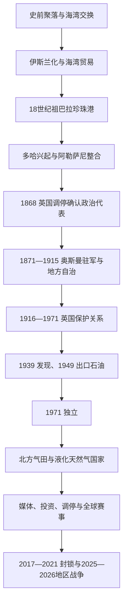

# 卡塔尔历史

## 概括

卡塔尔半岛淡水和耕地有限，却位于巴林珍珠场、哈萨绿洲和印度洋—波斯湾航线之间。古代聚落随渔业、海运和季节性采珠而兴衰；18世纪祖巴拉成为贸易港，19世纪多哈与阿勒萨尼家族取代祖巴拉—巴林权力网络。阿勒萨尼先借1868年英国调停取得独立代表地位，再在奥斯曼驻军和英国海上秩序之间维持自治。1916年以后卡塔尔成为英国保护下的酋长国，珍珠业崩溃一度造成危机，1949年石油出口才重建财政基础。1971年独立后，北方气田、液化天然气、主权投资和小国调停外交使其成为全球能源与传媒节点。

## 历史主线

## 历史主线概括

卡塔尔国家并非由古代统一政权直线延续而来。其形成的关键是三次转换：其一，珍珠港口和部落联盟把分散海岸聚落连接成政治共同体；其二，英国、奥斯曼和邻近酋长国的竞争使阿勒萨尼获得可对外缔约的代表地位；其三，石油尤其液化天然气把依赖商人和季节劳动的社会改造成财政、人口与安全高度国际化的世袭君主国。现代卡塔尔的影响力来自能源收入、美国安全联系、跨国媒体和调停网络，但也受外籍人口占绝大多数、碳氢资源依赖以及海湾冲突外溢制约。

## 阶段导航

| 顺序 | 阶段 | 时间 | 简要概括 |
|---:|---|---|---|
| 1 | [早期聚落、部落与珍珠贸易](/%E4%BA%BA%E6%96%87%E7%A7%91%E5%AD%A6/%E5%8E%86%E5%8F%B2/%E8%A5%BF%E4%BA%9A/%E9%98%BF%E6%8B%89%E4%BC%AF%E5%8D%8A%E5%B2%9B/%E5%8D%A1%E5%A1%94%E5%B0%94/%E6%97%A9%E6%9C%9F%E8%81%9A%E8%90%BD%E3%80%81%E9%83%A8%E8%90%BD%E4%B8%8E%E7%8F%8D%E7%8F%A0%E8%B4%B8%E6%98%93.md) | 古代—1868年 | 从海湾交换、祖巴拉珍珠港到多哈与阿勒萨尼政治中心形成。 |
| 2 | [阿勒萨尼、奥斯曼与英国保护](/%E4%BA%BA%E6%96%87%E7%A7%91%E5%AD%A6/%E5%8E%86%E5%8F%B2/%E8%A5%BF%E4%BA%9A/%E9%98%BF%E6%8B%89%E4%BC%AF%E5%8D%8A%E5%B2%9B/%E5%8D%A1%E5%A1%94%E5%B0%94/%E9%98%BF%E5%8B%92%E8%90%A8%E5%B0%BC%E3%80%81%E5%A5%A5%E6%96%AF%E6%9B%BC%E4%B8%8E%E8%8B%B1%E5%9B%BD%E4%BF%9D%E6%8A%A4.md) | 1868—1971年 | 在帝国竞争、珍珠危机和石油开发中形成受保护酋长国并走向独立。 |
| 3 | [独立、天然气与现代卡塔尔](/%E4%BA%BA%E6%96%87%E7%A7%91%E5%AD%A6/%E5%8E%86%E5%8F%B2/%E8%A5%BF%E4%BA%9A/%E9%98%BF%E6%8B%89%E4%BC%AF%E5%8D%8A%E5%B2%9B/%E5%8D%A1%E5%A1%94%E5%B0%94/%E7%8B%AC%E7%AB%8B%E3%80%81%E5%A4%A9%E7%84%B6%E6%B0%94%E4%B8%8E%E7%8E%B0%E4%BB%A3%E5%8D%A1%E5%A1%94%E5%B0%94.md) | 1971年至今 | 资源国家、液化天然气强国、媒体与调停外交，以及地区安全压力。 |
| 专表 | [埃米尔与首相表](/%E4%BA%BA%E6%96%87%E7%A7%91%E5%AD%A6/%E5%8E%86%E5%8F%B2/%E8%A5%BF%E4%BA%9A/%E9%98%BF%E6%8B%89%E4%BC%AF%E5%8D%8A%E5%B2%9B/%E5%8D%A1%E5%A1%94%E5%B0%94/%E5%9F%83%E7%B1%B3%E5%B0%94%E4%B8%8E%E9%A6%96%E7%9B%B8%E8%A1%A8.md) | 约1851年至今 | 阿勒萨尼八位统治者、独立后首相与实际权力结构。 |

## 重要转折与时间节点

| 时间 | 转折 | 历史意义 |
|---|---|---|
| 18世纪中后期 | 祖巴拉兴盛、阿勒哈利法转入巴林 | 珍珠与转口贸易形成跨海政治网络，也留下巴林对卡塔尔的主张。 |
| 1867—1868年 | 巴林—阿布扎比袭击与英国调停 | 穆罕默德·本·萨尼首次被单独视为卡塔尔政治代表。 |
| 1871、1893年 | 奥斯曼进驻与沃季拜战役 | 名义宗主权未转化为稳定直接统治，地方自治得到强化。 |
| 1916年 | 英卡条约 | 卡塔尔对外关系进入英国保护体系，阿勒萨尼世袭地位进一步制度化。 |
| 1920—1930年代 | 天然珍珠经济崩溃 | 人造养殖珍珠和大萧条击穿旧经济，人口外流、债务和贫困加剧。 |
| 1939、1949年 | 杜汉发现石油、首次出口 | 战后资源收入建立现代行政、福利和基础设施财政。 |
| 1971年9月3日 | 宣布独立 | 九酋长联邦谈判失败后，卡塔尔成为独立国家。 |
| 1995—1997年 | 哈马德执政、液化天然气出口与半岛电视台 | 国家由石油酋长国转向全球天然气、媒体和外交平台。 |
| 2017—2021年 | 海湾封锁及《欧拉宣言》 | 供应链、联盟与主权外交经受压力，封锁最终以和解结束。 |
| 2024年 | 修宪恢复协商会议全体任命制 | 2021年首次选举的有限开放被重新纳入王室任命框架。 |
| 2025—2026年 | 伊朗多次攻击乌代德基地及卡塔尔设施 | 卡塔尔的美国安全依赖、能源暴露与调停角色同时受到检验。 |

## 相关主线

- 区域背景：[阿拉伯半岛历史](/%E4%BA%BA%E6%96%87%E7%A7%91%E5%AD%A6/%E5%8E%86%E5%8F%B2/%E8%A5%BF%E4%BA%9A/%E9%98%BF%E6%8B%89%E4%BC%AF%E5%8D%8A%E5%B2%9B/README.md)。
- 帝国与保护体系：[奥斯曼、英国与现代国家形成](/%E4%BA%BA%E6%96%87%E7%A7%91%E5%AD%A6/%E5%8E%86%E5%8F%B2/%E8%A5%BF%E4%BA%9A/%E9%98%BF%E6%8B%89%E4%BC%AF%E5%8D%8A%E5%B2%9B/%E5%A5%A5%E6%96%AF%E6%9B%BC%E3%80%81%E8%8B%B1%E5%9B%BD%E4%B8%8E%E7%8E%B0%E4%BB%A3%E5%9B%BD%E5%AE%B6%E5%BD%A2%E6%88%90.md)。
- 统治者入口：[埃米尔与首相表](/%E4%BA%BA%E6%96%87%E7%A7%91%E5%AD%A6/%E5%8E%86%E5%8F%B2/%E8%A5%BF%E4%BA%9A/%E9%98%BF%E6%8B%89%E4%BC%AF%E5%8D%8A%E5%B2%9B/%E5%8D%A1%E5%A1%94%E5%B0%94/%E5%9F%83%E7%B1%B3%E5%B0%94%E4%B8%8E%E9%A6%96%E7%9B%B8%E8%A1%A8.md)。

## 目录层级

- 直接上级：[阿拉伯半岛](/%E4%BA%BA%E6%96%87%E7%A7%91%E5%AD%A6/%E5%8E%86%E5%8F%B2/%E8%A5%BF%E4%BA%9A/%E9%98%BF%E6%8B%89%E4%BC%AF%E5%8D%8A%E5%B2%9B/README.md)
- 宏观区域：[西亚](/%E4%BA%BA%E6%96%87%E7%A7%91%E5%AD%A6/%E5%8E%86%E5%8F%B2/%E8%A5%BF%E4%BA%9A/README.md)
- 历史总览：[历史](/%E4%BA%BA%E6%96%87%E7%A7%91%E5%AD%A6/%E5%8E%86%E5%8F%B2/README.md)