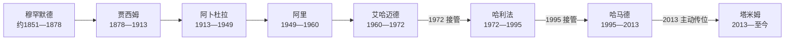

# 卡塔尔埃米尔与首相表

## 时间

约1851年至今（现任信息核验截至2026年7月13日）

## 概括

卡塔尔的阿勒萨尼统治起于19世纪中叶的部落领导，而“埃米尔”作为独立国家元首称号始于1971年。下表依卡塔尔官方统治者序列列出八位统治者，不把退位、被废或独立前后身份变化拆成虚假的两次在位。1970年设首相后，首相负责协调内阁，但政府不由议会多数产生，战略权力仍集中于埃米尔。

## 阿勒萨尼统治者完整表

| 顺序 | 统治者 | 当时主要称号 | 在位或领导时间 | 生卒 | 与前任关系 | 继承方式与重要事件 |
|---:|---|---|---|---|---|---|
| 1 | 穆罕默德·本·萨尼·阿勒萨尼 | 哈基姆／谢赫 | 约1851—1878年 | 约1788—1878年 | — | 从富韦里特移居比达—多哈，整合部落；1868年被英国作为卡塔尔代表单独缔约。 |
| 2 | **贾西姆·本·穆罕默德·阿勒萨尼** | 哈基姆／谢赫 | 1878—1913年 | 约1825—1913年 | 穆罕默德之子 | 实际早已协助父亲执政；接受奥斯曼行政头衔又抵制直接控制，1893年沃季拜战役奠定国家创建者声望。 |
| 3 | 阿卜杜拉·本·贾西姆·阿勒萨尼 | 哈基姆／谢赫 | 1913—1949年 | 1880—1957年 | 贾西姆之子 | 1916年签英国保护条约，1935年石油特许、1939年发现石油；原王储哈马德1948年先亡，1949年让位于阿里。 |
| 4 | 阿里·本·阿卜杜拉·阿勒萨尼 | 哈基姆／谢赫 | 1949—1960年 | 1894—1974年 | 阿卜杜拉之子 | 首批石油出口后扩建公共设施；1960年退位于其子艾哈迈德。 |
| 5 | 艾哈迈德·本·阿里·阿勒萨尼 | 哈基姆；1971年起为埃米尔 | 1960—1972年 | 1922—1977年 | 阿里之子 | 1971年领导独立；1972年在国外期间被堂亲兼首相哈利法接管权力。 |
| 6 | 哈利法·本·哈马德·阿勒萨尼 | 埃米尔 | 1972—1995年 | 1932—2016年 | 艾哈迈德的堂亲 | 1972年宫廷权力更替后加强行政和资源国有化；1995年在国外期间被其子哈马德接管。 |
| 7 | **哈马德·本·哈利法·阿勒萨尼** | 埃米尔 | 1995—2013年 | 1952年生 | 哈利法之子 | 推动液化天然气、半岛电视台、主权投资和全球外交；2013年主动退位于塔米姆。 |
| 8 | **塔米姆·本·哈马德·阿勒萨尼** | 埃米尔 | 2013年至今 | 1980年生 | 哈马德之子 | 应对2017—2021年封锁、举办2022年世界杯、主持地区调停；2024年修宪恢复协商会议全体任命，2025—2026年面对地区战争外溢。 |

## 首相完整表

| 顺序 | 首相 | 任期 | 与埃米尔／王室关系 | 主要阶段与备注 |
|---:|---|---|---|---|
| 1 | 哈利法·本·哈马德·阿勒萨尼 | 1970—1995年 | 王室成员；1972年起兼埃米尔 | 独立前组建首届内阁；接管埃米尔职位后长期兼任首相。 |
| 2 | 哈马德·本·哈利法·阿勒萨尼 | 1995—1996年 | 哈利法之子；兼埃米尔 | 1995年接管权力后的过渡期兼任首相。 |
| 3 | 阿卜杜拉·本·哈利法·阿勒萨尼 | 1996—2007年 | 哈马德之弟 | 液化天然气扩张、美国安全合作与行政现代化时期。 |
| 4 | 哈马德·本·贾西姆·本·贾比尔·阿勒萨尼 | 2007—2013年 | 王室成员；兼外交大臣 | 主权投资与高能见度外交时期，随2013年王位交接卸任。 |
| 5 | 阿卜杜拉·本·纳赛尔·本·哈利法·阿勒萨尼 | 2013—2020年 | 王室成员；兼内政大臣 | 塔米姆初期、2017年封锁和国内安全韧性建设。 |
| 6 | 哈立德·本·哈利法·本·阿卜杜勒阿齐兹·阿勒萨尼 | 2020—2023年 | 王室成员；兼内政大臣 | 疫情、2021年协商会议选举与2022年世界杯。 |
| 7 | **穆罕默德·本·阿卜杜勒拉赫曼·本·贾西姆·阿勒萨尼** | 2023年至今 | 王室成员；兼外交大臣 | 主持内阁和调停外交；截至2026年7月13日仍任职，并处理2025—2026年伊朗攻击及停火斡旋。 |

## 继承规则

- 永久宪法规定国家为阿勒萨尼家族世袭埃米尔制，继承限定在哈马德·本·哈利法的男性后裔中，由现任埃米尔指定王储；无子时可在家族男性后裔中指定。
- 王储年满18岁并宣誓后承担宪法职位；埃米尔暂时不能履职时，由王储或指定副埃米尔代行。
- 19—20世纪继承并非单纯长子继承。退位、王储先亡、堂支接管和父子废立都曾发生；2013年主动退位才形成较制度化、公开的生前交接。

## 法定结构与实际权力

| 层面 | 制度安排 | 实际意义 |
|---|---|---|
| 国家元首 | 埃米尔代表国家、统帅军队并掌握行政权。 | 外交、安全、能源和高级任命由埃米尔最终决定。 |
| 行政 | 埃米尔任命首相和部长；首相主持、协调部长会议。 | 首相是最高行政协调者，但不是独立于王室的议会政府首脑。 |
| 立法 | 协商会议讨论法律、预算并监督部长；2024年后45席由埃米尔任命。 | 能提出和审议政策，但不能以不信任投票更换埃米尔或形成执政党轮替。 |
| 王室与专业机构 | 王室成员掌握若干关键职位，专业官僚、能源公司和主权基金执行政策。 | 个人统治通过正式部门和技术机构制度化，而非只有宫廷命令。 |

## 世系演变

图中箭头表示政治继承，不一律表示父子关系；艾哈迈德到哈利法为堂支接管。

## 相关笔记

- 前近代形成：[阿勒萨尼、奥斯曼与英国保护](/%E4%BA%BA%E6%96%87%E7%A7%91%E5%AD%A6/%E5%8E%86%E5%8F%B2/%E8%A5%BF%E4%BA%9A/%E9%98%BF%E6%8B%89%E4%BC%AF%E5%8D%8A%E5%B2%9B/%E5%8D%A1%E5%A1%94%E5%B0%94/%E9%98%BF%E5%8B%92%E8%90%A8%E5%B0%BC%E3%80%81%E5%A5%A5%E6%96%AF%E6%9B%BC%E4%B8%8E%E8%8B%B1%E5%9B%BD%E4%BF%9D%E6%8A%A4.md)。
- 独立国家：[独立、天然气与现代卡塔尔](/%E4%BA%BA%E6%96%87%E7%A7%91%E5%AD%A6/%E5%8E%86%E5%8F%B2/%E8%A5%BF%E4%BA%9A/%E9%98%BF%E6%8B%89%E4%BC%AF%E5%8D%8A%E5%B2%9B/%E5%8D%A1%E5%A1%94%E5%B0%94/%E7%8B%AC%E7%AB%8B%E3%80%81%E5%A4%A9%E7%84%B6%E6%B0%94%E4%B8%8E%E7%8E%B0%E4%BB%A3%E5%8D%A1%E5%A1%94%E5%B0%94.md)。
- 总览：[卡塔尔历史](/%E4%BA%BA%E6%96%87%E7%A7%91%E5%AD%A6/%E5%8E%86%E5%8F%B2/%E8%A5%BF%E4%BA%9A/%E9%98%BF%E6%8B%89%E4%BC%AF%E5%8D%8A%E5%B2%9B/%E5%8D%A1%E5%A1%94%E5%B0%94/README.md)。