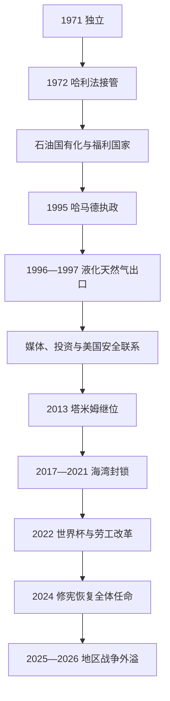

# 独立、天然气与现代卡塔尔

## 时间

1971年至今（核验截至2026年7月13日）

## 概括

独立后的卡塔尔由阿勒萨尼埃米尔掌握国家最高权力。1970年代石油国有化建立福利与行政财政，1990年代北方气田液化天然气项目则使其跻身全球能源中心。哈马德和塔米姆时期，国家把资源收入投入主权基金、航空、教育、体育与跨国媒体，并以美国安全关系和多方调停扩大影响。2017—2021年海湾封锁、2024年恢复协商会议全体任命制，以及2025—2026年伊朗对乌代德基地和能源设施的攻击，显示小国影响力与安全脆弱性并存。

## 国家建立与分阶段发展

### 石油国家制度化（1971—1995年）

- 1971年9月3日独立后，艾哈迈德·本·阿里成为埃米尔；卡塔尔加入阿拉伯国家联盟和联合国，未加入同年成立的阿联酋。
- 1972年2月，堂亲兼首相哈利法·本·哈马德在艾哈迈德旅居国外时接管权力。新政权压缩部分王室津贴，把更多能源收入转入行政、住房、教育和医疗。
- 卡塔尔石油公司在1970年代逐步取得特许企业权益，至1977年前后完成主要石油产业国有化。资源租金使公民免于多数直接税，并由国家提供就业和福利。
- 1971年发现的北方气田与伊朗南帕尔斯气田属于同一跨境储层。由于开发成本高、国内需求小和液化运输技术要求高，早期开发缓慢；1980年代成立卡塔尔天然气企业，1996—1997年首批液化天然气运往日本。
- 卡塔尔1981年参与建立海湾合作委员会。1990—1991年海湾战争后，它加强同美国的防务合作并扩建乌代德基地，以外部威慑补偿人口和军力有限。

### 哈马德时代的全球化（1995—2013年）

- 1995年，王储哈马德·本·哈利法在父亲出国时接管权力；1996年一次反政变失败，统治随后稳定。权力更替把天然气项目、外交和媒体扩张提到国家战略中心。
- 1996年半岛电视台开播，以跨国阿拉伯新闻和辩论节目突破国家边界，也引起邻国政府不满。媒体影响、教育城和国际会议使卡塔尔获得超出人口规模的能见度。
- 长期购气合同、外国能源资本、低成本海上气源和国家担保融资共同推动液化天然气扩张。收入进入2005年成立的卡塔尔投资局，转化为海外资产、航空枢纽和国内基础设施。
- 2001年卡塔尔同巴林解决长期岛礁和海域边界争议。2003年伊拉克战争前后，美国把重要空战指挥设施移至乌代德，双边安全依赖加深。
- 2003年公民投票通过永久宪法，2004年颁布、2005年生效；宪法确认世袭埃米尔、部长会议、法院和协商会议，但埃米尔保留任命政府、统帅军队和影响立法的核心权力。
- 2010年卡塔尔获2022年世界杯主办权。2013年哈马德主动让位于塔米姆，是本国首次在在位统治者生前有计划地交接。

### 塔米姆时代、封锁与地区战争（2013年至今）

- 塔米姆延续天然气、主权投资和调停外交，同时强调粮食、物流和国防韧性。卡塔尔参与阿富汗、黎巴嫩、巴勒斯坦等议题斡旋，也因与伊朗保持工作关系、支持部分伊斯兰政治力量而同邻国冲突。
- 2017年6月，沙特、阿联酋、巴林和埃及断交并封锁陆海空通道，提出关闭半岛电视台、限制对伊关系等要求。卡塔尔借土耳其安全支持、伊朗与阿曼航路、国内奶业和新港口维持供应，没有接受使其外交受他国监督的条件。
- 2021年《欧拉宣言》恢复交通与外交关系。封锁结束并非争端全部消失，却证明能源合同、外汇资产和替代物流能支撑小国抵抗区域胁迫。
- 2021年举行首次协商会议选举，三分之二席位由选举产生。选民资格规则引发公民身份与部落平等争议；2024年公投通过修宪，恢复全体成员由埃米尔任命，官方以国家团结和平等公民权解释调整。
- 2017年后卡塔尔与国际劳工组织合作，取消多数劳动者转换雇主所需的不反对证明并实施非歧视最低工资。2022年世界杯推动地铁、体育场和城市建设，也暴露招募费、工资拖欠、酷热与执法落差；法律改革不等于所有工作条件问题已解决。
- 2025年6月，伊朗以导弹攻击乌代德基地；2026年2月28日起，伊朗在同美国、以色列战争中再次以多轮导弹和无人机攻击卡塔尔，部分击中乌代德基地，3月又波及拉斯拉凡能源设施。卡塔尔一面加强防空和能源韧性，一面继续主持停火谈判。
- 截至2026年7月13日，6月17日停火谅解备忘录之后仍出现新一轮地区交火，卡塔尔的调停尚未转化为稳定和平。现代页中的“至今”以此日为截止，不把暂时停火写成战争终结。

## 统治结构

| 机构或群体 | 法定或实际作用 |
|---|---|
| 埃米尔 | 国家元首、武装部队统帅并掌握行政权；任命首相、部长和协商会议成员，对战略决策拥有最终权威。 |
| 首相与部长会议 | 首相主持内阁、协调各部；政府成员由埃米尔任命，负责政策执行而非由议会多数产生。 |
| 协商会议 | 行使立法、预算和有限监督职能；2021年曾有30席民选，2024年修宪后恢复45席全体任命。 |
| 法院与专业官僚 | 按宪法和法律行使司法、监管与公共服务；国家安全和王室事务仍高度集中。 |
| 公民与外籍居民 | 公民获得福利、公共就业与政治协商渠道；外籍人口构成劳动力多数，但政治权利和居留保障不同。 |
| 能源与主权投资机构 | 卡塔尔能源公司控制关键油气链，卡塔尔投资局管理海外资产；两者把资源收入转化为财政和战略影响。 |

完整埃米尔世系、首相名单与继承规则见[埃米尔与首相表](/%E4%BA%BA%E6%96%87%E7%A7%91%E5%AD%A6/%E5%8E%86%E5%8F%B2/%E8%A5%BF%E4%BA%9A/%E9%98%BF%E6%8B%89%E4%BC%AF%E5%8D%8A%E5%B2%9B/%E5%8D%A1%E5%A1%94%E5%B0%94/%E5%9F%83%E7%B1%B3%E5%B0%94%E4%B8%8E%E9%A6%96%E7%9B%B8%E8%A1%A8.md)。

## 崛起、韧性与结构风险

- **能源崛起条件**：超大型北方气田、液化和运输技术成熟、与亚洲客户签订长期合同、国家信用和外国企业经验共同作用；不能只归因于“发现天然气”。
- **国际影响机制**：能源收入提供资金，美国基地提供外部安全，半岛电视台提供议题影响，调停则利用卡塔尔能同时同西方、伊朗及非国家行为体对话的特殊位置。
- **2017年封锁未达目标的原因**：海外资产和液化天然气收入维持财政，替代航线和土耳其支持缓解孤立，封锁方诉求过宽且缺乏可接受的退出安排。
- **结构限制**：经济仍依赖油气周期；北方气田跨越伊朗海域；公民少而外籍劳动力庞大；政治参与由王室控制；外部基地既提供保护，也可能把本国变成战争目标。
- **直接安全压力**：2025—2026年导弹与无人机攻击把能源设施、航空枢纽和美军基地置于同一风险网络。防空、外交平衡和能源设施分散因此成为国家延续能力的一部分。

## 重要事件

| 时间 | 事件 | 结果与长期影响 |
|---|---|---|
| 1971年 | 独立、加入阿盟与联合国 | 建立独立外交和资源主权。 |
| 1972年 | 哈利法接管政权 | 行政与资源收入更集中于现代国家建设。 |
| 1977年前后 | 主要油气权益国有化完成 | 王室—国家掌握资源财政。 |
| 1995—1997年 | 哈马德执政、半岛电视台和首批液化天然气出口 | 开启全球化国家战略。 |
| 2003—2005年 | 宪法公投、颁布并生效 | 制度化政府架构，但保留埃米尔主导。 |
| 2013年 | 塔米姆继位 | 完成计划性交接。 |
| 2017—2021年 | 海湾封锁与和解 | 强化物流、食品和联盟多元化。 |
| 2021、2024年 | 首次议会选举与恢复任命制 | 显示有限参与和王室整合之间的摆动。 |
| 2022年 | 举办世界杯 | 提升全球形象，也加速劳工治理审视。 |
| 2025—2026年 | 伊朗攻击乌代德与能源设施 | 美国安全联系和调停政策面临直接军事外溢。 |

## 演变关系

- 前一节点：[阿勒萨尼、奥斯曼与英国保护](/%E4%BA%BA%E6%96%87%E7%A7%91%E5%AD%A6/%E5%8E%86%E5%8F%B2/%E8%A5%BF%E4%BA%9A/%E9%98%BF%E6%8B%89%E4%BC%AF%E5%8D%8A%E5%B2%9B/%E5%8D%A1%E5%A1%94%E5%B0%94/%E9%98%BF%E5%8B%92%E8%90%A8%E5%B0%BC%E3%80%81%E5%A5%A5%E6%96%AF%E6%9B%BC%E4%B8%8E%E8%8B%B1%E5%9B%BD%E4%BF%9D%E6%8A%A4.md)。
- 区域对照：[联邦建立与现代阿联酋](/%E4%BA%BA%E6%96%87%E7%A7%91%E5%AD%A6/%E5%8E%86%E5%8F%B2/%E8%A5%BF%E4%BA%9A/%E9%98%BF%E6%8B%89%E4%BC%AF%E5%8D%8A%E5%B2%9B/%E9%98%BF%E8%81%94%E9%85%8B/%E8%81%94%E9%82%A6%E5%BB%BA%E7%AB%8B%E4%B8%8E%E7%8E%B0%E4%BB%A3%E9%98%BF%E8%81%94%E9%85%8B.md)。
- 上级：[卡塔尔历史](/%E4%BA%BA%E6%96%87%E7%A7%91%E5%AD%A6/%E5%8E%86%E5%8F%B2/%E8%A5%BF%E4%BA%9A/%E9%98%BF%E6%8B%89%E4%BC%AF%E5%8D%8A%E5%B2%9B/%E5%8D%A1%E5%A1%94%E5%B0%94/README.md)。