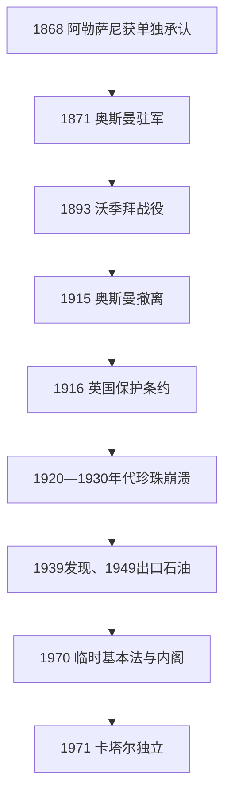

# 阿勒萨尼、奥斯曼与英国保护

## 时间

1868—1971年

## 概括

1868年以后，阿勒萨尼在英国海上秩序、奥斯曼在哈萨的陆上扩张和邻近酋长国主张之间建立世袭统治。奥斯曼1871年驻军，却因财政、地理和地方抵抗只能维持名义行政；1893年沃季拜战役暴露其控制上限。1916年英国保护条约把卡塔尔纳入海湾条约体系。20世纪前半珍珠经济崩溃令酋长国陷入生存危机，杜汉石油在战争后出口，才使王室能建立常设行政。英国1968年宣布撤出后，九酋长联邦谈判因权力分配、边界和财政问题失败，卡塔尔于1971年独立。

## 建立背景与崛起机制

- 1868年安排终止巴林—卡塔尔战争，并把穆罕默德·本·萨尼视为卡塔尔履约者。阿勒萨尼的权力仍是联盟式的：必须调和多哈、沃克拉、北部聚落和游牧部落，而非直接官僚统治。
- 奥斯曼1871年从哈萨派兵进入比达，授予贾西姆·本·穆罕默德地方行政头衔。贾西姆借奥斯曼旗号抵御巴林、阿布扎比和英国压力，同时拒绝奥斯曼征税、驻军扩张和任命官员。
- 阿勒萨尼能够崛起，是因为它兼具地方部落根基、珍珠贸易资源和在列强间转换依靠的能力。英国需要海上停战的责任主体，奥斯曼需要边疆代理人，两者都在无意中增强了家族合法性。

## 分阶段发展

### 奥斯曼名义统治与沃季拜战役（1871—1915年）

- 奥斯曼在比达设小规模驻军，卡塔尔名义隶属巴士拉省或哈萨行政体系；日常司法、贡赋和部落关系仍由贾西姆及地方首领掌握。
- 1880年代围绕乌代德、祖巴拉和对外关系的争议加深。奥斯曼试图把卡塔尔纳入正规税政，贾西姆则以退居沃季拜、拒绝行政命令回应。
- 1893年奥斯曼总督穆罕默德·哈菲兹帕夏拘押贾西姆亲属和部下，并派纵队向沃季拜施压。卡塔尔部队伏击、围困奥斯曼分队，迫使其释放俘虏并妥协。
- 沃季拜不是奥斯曼宗主权当天终结，而是证明帝国无法低成本直接统治。驻军继续留在多哈，贾西姆的地方威望和事实自治却显著增强。
- 1913年英奥协定拟由奥斯曼放弃对卡塔尔的主张；协定未及完整实施即遇第一次世界大战。奥斯曼驻军于1915年撤出，留下的武器与堡垒转由阿勒萨尼控制。

### 英国保护与珍珠危机（1916—1949年）

- 1916年，阿卜杜拉·本·贾西姆同英国签约，承诺不让渡领土、不自行缔结外交关系并维护海上和平；英国承担海上保护。卡塔尔仍由酋长内部治理，不是英国直接殖民地。
- 英国最初不愿承诺陆上防御。1935年修订保护安排并获得石油特许后，英国保护扩及外来陆上侵略，王室对边界与继承的安全感提高。
- 1920年代末，日本养殖珍珠进入市场；大萧条压低奢侈品需求。珍珠价格与信用链同时崩溃，商人破产、潜水员失业、人口迁出，进口粮食能力下降。
- 阿卜杜拉1935年授予英伊石油公司关联企业特许。1939年杜汉发现石油，但第二次世界大战造成设备、运输和资金中断，油田直到1949年才首次商业出口。
- 旧珍珠制度的衰亡削弱商人集团，石油特许金和租金改由统治者集中分配；财政重心由港口市场转向王室—公司关系，为资源国家结构奠基。

### 石油行政、撤英与独立（1949—1971年）

- 阿里·本·阿卜杜拉1949年即位之际恰逢首批石油出口。道路、电力、学校、医院和政府部门逐步建立，但财政开支、家族津贴和外国顾问也引发分配争议。
- 艾哈迈德·本·阿里1960年继位，其堂亲哈利法·本·哈马德掌握政府日常事务。石油收入增长使部落酋长政治转为由王室任命部门、警察与技术官僚治理。
- 1970年颁布临时基本法并成立首届内阁，哈利法任首相。这是独立前把个人宫廷管理转为正式政府的关键步骤。
- 英国1968年宣布在1971年底前撤出苏伊士以东。卡塔尔同巴林及七个特鲁西尔酋长国谈判九酋长联邦，但在首都、代表席位、边界和财政分担上无法达成持久方案。
- 卡塔尔选择单独终止1916年条约，于1971年9月3日宣布独立，随后加入阿拉伯国家联盟和联合国。艾哈迈德成为首任独立国家埃米尔。

## 统治结构

| 时期 | 名义权力 | 实际运作 |
|---|---|---|
| 1871—1915年奥斯曼时期 | 苏丹宗主权、驻军和地方行政头衔 | 阿勒萨尼处理部落、税收与对外周旋；奥斯曼难以越出驻地。 |
| 1916—1935年英国保护早期 | 英国控制对外关系并保护海上 | 埃米尔治理内部；英国政治代理人以条约和补贴施加影响。 |
| 1935—1971年保护后期 | 英国兼顾陆上安全、石油公司获特许 | 石油收入扩大埃米尔财政，外国顾问和王室成员建立政府部门。 |
| 1970—1971年过渡 | 埃米尔、首相和内阁依临时基本法运行 | 哈利法主持行政，英国协助外交与防务交接。 |

## 统治者与继承

完整连续世系、继承关系和独立后首相见[埃米尔与首相表](/%E4%BA%BA%E6%96%87%E7%A7%91%E5%AD%A6/%E5%8E%86%E5%8F%B2/%E8%A5%BF%E4%BA%9A/%E9%98%BF%E6%8B%89%E4%BC%AF%E5%8D%8A%E5%B2%9B/%E5%8D%A1%E5%A1%94%E5%B0%94/%E5%9F%83%E7%B1%B3%E5%B0%94%E4%B8%8E%E9%A6%96%E7%9B%B8%E8%A1%A8.md)。本时期五位统治者为穆罕默德、贾西姆、阿卜杜拉、阿里和艾哈迈德；其中退位、继承人先亡及1972年废立均在专表说明。

## 兴衰与转型原因

- **阿勒萨尼巩固**：列强需要地方代理人、贾西姆赢得部落声望、王室控制对外条约与新兴石油租金，三者共同把联盟首领转成世袭统治者。
- **奥斯曼直接控制失败**：卡塔尔远离帝国补给中心，驻军规模有限；地方首领能够切断补给并动员部落，英国又反对奥斯曼向海湾沿岸深入。
- **珍珠制度崩溃**：养殖珍珠是结构性技术冲击，大萧条和贸易收缩是外部压力，债务链断裂则是直接传导机制。
- **英国保护终结**：英国财政与战略收缩是外因；石油收入、行政能力和独立外交诉求使卡塔尔具备单独建国条件；九酋长联邦的制度分歧成为直接触发因素。

## 演变关系

- 前一节点：[早期聚落、部落与珍珠贸易](/%E4%BA%BA%E6%96%87%E7%A7%91%E5%AD%A6/%E5%8E%86%E5%8F%B2/%E8%A5%BF%E4%BA%9A/%E9%98%BF%E6%8B%89%E4%BC%AF%E5%8D%8A%E5%B2%9B/%E5%8D%A1%E5%A1%94%E5%B0%94/%E6%97%A9%E6%9C%9F%E8%81%9A%E8%90%BD%E3%80%81%E9%83%A8%E8%90%BD%E4%B8%8E%E7%8F%8D%E7%8F%A0%E8%B4%B8%E6%98%93.md)。
- 后一节点：[独立、天然气与现代卡塔尔](/%E4%BA%BA%E6%96%87%E7%A7%91%E5%AD%A6/%E5%8E%86%E5%8F%B2/%E8%A5%BF%E4%BA%9A/%E9%98%BF%E6%8B%89%E4%BC%AF%E5%8D%8A%E5%B2%9B/%E5%8D%A1%E5%A1%94%E5%B0%94/%E7%8B%AC%E7%AB%8B%E3%80%81%E5%A4%A9%E7%84%B6%E6%B0%94%E4%B8%8E%E7%8E%B0%E4%BB%A3%E5%8D%A1%E5%A1%94%E5%B0%94.md)。
- 奥斯曼背景：[奥斯曼帝国](/%E4%BA%BA%E6%96%87%E7%A7%91%E5%AD%A6/%E5%8E%86%E5%8F%B2/%E8%A5%BF%E4%BA%9A/%E5%9C%9F%E8%80%B3%E5%85%B6/%E5%A5%A5%E6%96%AF%E6%9B%BC%E5%B8%9D%E5%9B%BD/README.md)。
- 上级：[卡塔尔历史](/%E4%BA%BA%E6%96%87%E7%A7%91%E5%AD%A6/%E5%8E%86%E5%8F%B2/%E8%A5%BF%E4%BA%9A/%E9%98%BF%E6%8B%89%E4%BC%AF%E5%8D%8A%E5%B2%9B/%E5%8D%A1%E5%A1%94%E5%B0%94/README.md)。