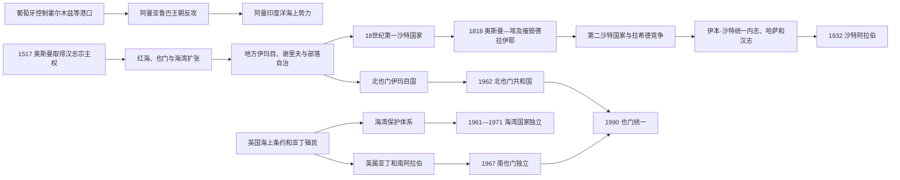

# 奥斯曼、英国与现代国家形成

## 时间

16世纪—20世纪末

## 概括

近代阿拉伯半岛从未被单一帝国严密覆盖。奥斯曼在汉志、也门和东部海岸建立行省、驻军和宗主权，葡萄牙、阿曼海上王朝及英国争夺印度洋和海湾，地方谢里夫、伊玛目、部落联盟和港口统治家族则保有实际权力。现代国家由沙特统一战争、也门南北分化、阿曼苏丹国改革、英国保护体系解体、石油财政和边界谈判共同形成，不能视作古代部落疆域自然延续。

## 奥斯曼、葡萄牙与地方力量

### 奥斯曼进入半岛

1517年奥斯曼击败马穆鲁克后，麦加谢里夫承认苏丹宗主权。苏丹以“两圣地仆人”声望、埃及粮款、叙利亚和埃及朝觐队伍、吉达驻军及地方谢里夫合作维护汉志。直接行政能力集中于港口和圣城，内陆部落仍靠补贴、护路协议和地方仲裁。

奥斯曼1530年代进入也门和红海，目标包括对抗葡萄牙、控制曼德海峡及税收。高地宰德派伊玛目利用地形和部落网络反抗，17世纪初把奥斯曼逐出也门大部。1849年奥斯曼再次占领萨那等地，建立也门行省，但地方控制一直不均。

在东部，奥斯曼曾控制拉赫萨及卡提夫，16世纪同葡萄牙—霍尔木兹体系竞争，17世纪退缩；1871年又以巴格达总督区力量进入哈萨，名义上把卡塔尔纳入。当地统治家族和部落仍拥有征税、珍珠贸易与武装。

### 葡萄牙据点和阿曼海权

葡萄牙1507年进攻阿曼港口，1515年控制霍尔木兹，试图以舰队和通行证控制海湾—印度洋贸易。其权力以港口和海上炮舰为主，内陆绿洲及亚洲商人网络并未被完全取代。1622年萨法维与英国东印度公司夺取霍尔木兹，葡萄牙体系受重创。

阿曼亚鲁巴伊玛目在17世纪统一部分内陆与海岸，1650年驱逐葡萄牙出马斯喀特，随后进攻东非港口。18—19世纪布赛义德王朝经营马斯喀特、桑给巴尔、俾路支和印度网络；1856年赛义德·本·苏丹死后，阿曼和桑给巴尔分治削弱海上帝国，英国仲裁又扩大影响。

## 沙特国家的三次形成

### 宗教—家族联盟和第一国家

约1744年，德拉伊耶统治者穆罕默德·本·沙特同宗教改革者穆罕默德·本·阿卜杜勒·瓦哈卜结盟。沙特家族提供军事和政治领导，宗教家族提供改革合法性；反对者常称其为“瓦哈比”，追随者更强调一神论和复兴。联盟以部落归附、征税和军事远征扩展，1803—1804年控制麦加、麦地那，引起奥斯曼苏丹和埃及穆罕默德·阿里警惕。

1811—1818年奥斯曼—埃及军队逐步攻入内志，1818年摧毁德拉伊耶，第一沙特国家直接灭亡。其败因包括敌军火炮和补给、广阔新领土难以巩固、地方反抗及奥斯曼维护圣地合法性的决心。

### 第二国家和内战

图尔基·本·阿卜杜拉1824年以利雅得为中心恢复沙特统治。第二沙特国家规模较小，依靠内志绿洲、部落联盟和宗教合法性。费萨尔·本·图尔基一度巩固权力，但其死后诸子争位，哈伊勒拉希德家族乘机扩张。1891年穆莱达战役后，沙特统治者流亡科威特，第二国家覆亡。

### 伊本·沙特统一

阿卜杜勒阿齐兹·伊本·沙特1902年夺回利雅得，依靠家族联盟、伊赫万定居战士、英国补贴和对手分裂逐步扩张。1913年从奥斯曼手中夺取哈萨；1921年消灭拉希德政权；1924—1925年击败汉志哈希姆王国，占领麦加、麦地那和吉达。伊赫万反对边界、技术与对英关系，1929年萨比拉战役后被镇压。1932年内志与汉志王国统一为沙特阿拉伯。

统一既有宗教动员，也依赖武器、外交和对朝觐港口的财政控制。现代王国边界通过与英国保护地、也门、伊拉克和科威特谈判或战争逐步确定。

## 英国海湾体系

### 从贸易保护到外交专属

英国最初以保护印度航线、商船和东印度公司利益为目标。它把卡瓦西姆等海上力量称为“海盗”，1819年发动军事远征，1820年同多个海湾酋长签署总和平条约。此后1835年季节性休战、1853年永久海上停战限制海上战争，“停战海岸”名称由此形成。

1892年英国同停战酋长签订排他协议，限制其向其他国家让地或建立外交。科威特1899年协议、巴林19世纪一系列条约、卡塔尔1916年协定及其他保护关系，形式各异但共同由英国掌握外部安全和外交。酋长仍管理内部司法、贸易和部落事务，故“保护国”不能等同英国直接殖民省份。

| 地区 | 关键关系 | 国家形成影响 |
|---|---|---|
| 科威特 | 萨巴赫家族港口自治，1899年秘密协议限制外交 | 奥斯曼、伊拉克和沙特边界争议后，1961年独立。 |
| 巴林 | 哈利法家族1783年掌权，19世纪条约逐步纳入英国保护 | 石油1932年投产，1971年独立。 |
| 卡塔尔 | 萨尼家族同巴林、奥斯曼和英国周旋，1916年保护协定 | 1971年独立，天然气后来重塑财政。 |
| 停战诸酋长 | 1820、1853、1892年条约逐步限制海战和外交 | 英国撤出后七酋长于1971年组成阿联酋，哈伊马角1972年加入。 |
| 阿曼 | 独立苏丹国而非停战酋长之一，同英国签订多项友好、财政和安全安排 | 沿海苏丹与内陆伊玛目矛盾延续，1970年政权更替后国家集中。 |
| 亚丁与南阿拉伯 | 1839年英国占领亚丁，后同周边苏丹和酋长缔约 | 亚丁殖民地与保护地合组未获稳定认同，1967年南也门独立。 |

### 珍珠贸易与石油转折

19世纪至20世纪初，海湾珍珠业依靠船主、商人、潜水员和债务预支，吸引印度、波斯和阿拉伯市场。日本养殖珍珠、大萧条和贸易萎缩在1930年代造成崩溃，许多港口陷入贫困。

巴林1932年发现并生产石油，沙特1938年达曼油井成功，科威特、卡塔尔和阿布扎比随后开发。租让让外国公司和英国、美国战略影响扩大，也为统治家族建立官僚、医疗、教育和军队提供收入。石油没有自动创造边界，却大幅提高划界、继承和安全的利害。

## 也门南北分化

奥斯曼1918年撤出北也门后，宰德派伊玛目叶海亚建立穆塔瓦基利王国，试图集中部落和高地权力。1962年军官革命建立阿拉伯也门共和国，王党与共和派在埃及、沙特介入下内战至1970年前后。

南部亚丁是英国直辖殖民港，周边为多个保护国。1950—1960年代英国试图以南阿拉伯联邦维持秩序，但民族解放阵线和被占南也门解放阵线发动武装斗争。英国1967年撤离，南也门独立，1970年改为马克思主义的也门民主人民共和国。南北政体、外援、军队和经济结构差异很大，虽在1990年统一，矛盾并未消失。

## 独立与联邦形成

英国1968年宣布将在1971年前撤出“苏伊士以东”。海湾九酋长联合方案因巴林、卡塔尔选择单独独立和边界、权力分配分歧而未成。1971年阿布扎比、迪拜等六酋长建立阿拉伯联合酋长国，1972年哈伊马角加入。各酋长保留广泛地方权力，联邦总统、副总统和最高委员会维持统治家族协商。

科威特1961年先行独立并保留较强议会传统；巴林、卡塔尔1971年独立。阿曼没有同一“独立日”，其苏丹国主权早已存在，但英国影响和国内伊玛目制、佐法尔战争限制集中治理；1970年卡布斯取代其父后，以油收和英国军事支持完成国家重组。

## 重要事件

| 时间 | 事件 | 过程与影响 |
|---|---|---|
| 1507、1515年 | 葡萄牙进攻阿曼并控制霍尔木兹 | 海湾出现炮舰据点体系，亚洲贸易未被完全取代。 |
| 1517年 | 奥斯曼取得汉志宗主权 | 苏丹承担圣地和朝觐路线保护，谢里夫保留地方权力。 |
| 1538年以后 | 奥斯曼进入也门 | 红海战略与税收推动扩张，高地伊玛目反抗持续。 |
| 1622年 | 萨法维—英国夺取霍尔木兹 | 葡萄牙海湾霸权瓦解。 |
| 1650年 | 阿曼驱逐葡萄牙出马斯喀特 | 亚鲁巴海权兴起并扩展到东非。 |
| 约1744年 | 沙特—宗教改革联盟 | 第一沙特国家开始扩张。 |
| 1803—1804年 | 第一沙特国家控制圣城 | 直接挑战奥斯曼普遍伊斯兰合法性。 |
| 1818年 | 德拉伊耶陷落 | 奥斯曼—埃及军队摧毁第一沙特国家。 |
| 1820、1853年 | 英国海湾条约 | 从总和平到永久海上停战，海湾对外秩序受英国控制。 |
| 1824年 | 第二沙特国家建立 | 沙特家族以利雅得恢复内志统治。 |
| 1839年 | 英国占领亚丁 | 南也门进入殖民港与保护地体系。 |
| 1856年以后 | 阿曼—桑给巴尔分治 | 海上帝国财政和领土一分为二。 |
| 1871年 | 奥斯曼再占哈萨 | 东部行政扩张，与英国及地方家族竞争。 |
| 1891年 | 第二沙特国家覆亡 | 拉希德家族获胜，沙特家族流亡科威特。 |
| 1892、1899年 | 停战酋长排他协议、科威特协议 | 英国从海上仲裁转向外交保护。 |
| 1902年 | 伊本·沙特夺回利雅得 | 第三沙特国家统一进程开始。 |
| 1913年 | 沙特夺取哈萨 | 奥斯曼退出半岛东部重要地区。 |
| 1916年 | 阿拉伯起义、卡塔尔英国保护 | 一战加速奥斯曼半岛秩序瓦解。 |
| 1918年 | 奥斯曼撤出也门和汉志 | 哈希姆汉志王国、北也门伊玛目国和沙特势力并立。 |
| 1924—1925年 | 沙特征服汉志 | 麦加、麦地那并入伊本·沙特国家。 |
| 1929年 | 萨比拉战役 | 伊赫万叛乱被镇压，王权和固定边界政策加强。 |
| 1932年 | 沙特阿拉伯成立、巴林产油 | 最大半岛王国与石油时代同时出现。 |
| 1938年 | 沙特发现商业石油 | 财政和美沙关系逐步转型。 |
| 1961年 | 科威特独立 | 英国海湾保护体系开始解体。 |
| 1962年 | 北也门革命 | 伊玛目君主制终结，地区代理内战爆发。 |
| 1967年 | 南也门独立 | 英国退出亚丁，革命共和国建立。 |
| 1970年 | 卡布斯在阿曼掌权 | 苏丹国集中建设并最终平定佐法尔叛乱。 |
| 1971—1972年 | 巴林、卡塔尔独立，阿联酋成立 | 英国“苏伊士以东”撤军，现代海湾国家体系成形。 |
| 1981年 | 海湾合作委员会成立 | 六个君主国建立安全和经济协调机制。 |
| 1990年 | 也门统一、伊拉克入侵科威特 | 国家统一与海湾安全危机在同年发生，外军部署长期化。 |

## 国家形成的多因素分析

### 奥斯曼控制为何有限

- 半岛距离核心省份遥远，沙漠和山地提高驻军补给成本。
- 圣地、港口比连续内陆领土更有战略价值，帝国常选择间接统治。
- 谢里夫、伊玛目和部落首领掌握地方税收、护路与武装。
- 红海、也门和哈萨在外敌威胁上升时更受重视，威胁下降时中央投入收缩。

### 英国体系为何扩张

- 印度航路、蒸汽船补给和海湾贸易提供持续战略动机。
- 海军优势让英国能强制休战，却不需承担全面内陆行政成本。
- 酋长借英国保护对抗邻国和竞争家族，双方形成不对称合作。
- 石油出现后，外部外交限制和边界划定的价值进一步提高。

### 现代王朝国家为何延续

- 统治家族把部落调解、商人联盟和宗教合法性转化为官僚国家。
- 英国撤退多通过条约移交而非彻底摧毁地方统治结构。
- 石油收入支持福利、军队和基础设施，降低直接税收压力。
- 外部安全联盟保护小国，但也造成战略依赖。
- 也门因南北殖民经历、人口规模、资源有限和多中心武装走出不同路径。

## 关键辨析

- 奥斯曼对汉志的“宗主权”不等于现代式均匀行政；朝觐保护、圣城谢里夫和内陆自治同时存在。
- 英国所谓“反海盗”叙事反映帝国航运利益，卡瓦西姆等力量也应理解为海湾政治和商贸参与者。
- 沙特国家三次形成有家族连续性，但第一、第二国家的领土和机构并非直接完整传给1932年王国。
- 海湾国家边界具有殖民条约因素，也是在地方家族、部落、贸易和后续谈判中制度化。
- 本页不重复各国完整王室世系；沙特、阿曼、巴林、卡塔尔、科威特、阿联酋和也门统治者由国家专页维护。

## 演变关系

- 前一节点：[伊斯兰兴起、哈里发与地方王朝](/%E4%BA%BA%E6%96%87%E7%A7%91%E5%AD%A6/%E5%8E%86%E5%8F%B2/%E8%A5%BF%E4%BA%9A/%E9%98%BF%E6%8B%89%E4%BC%AF%E5%8D%8A%E5%B2%9B/%E4%BC%8A%E6%96%AF%E5%85%B0%E5%85%B4%E8%B5%B7%E3%80%81%E5%93%88%E9%87%8C%E5%8F%91%E4%B8%8E%E5%9C%B0%E6%96%B9%E7%8E%8B%E6%9C%9D.md)
- 帝国背景：[奥斯曼帝国](/%E4%BA%BA%E6%96%87%E7%A7%91%E5%AD%A6/%E5%8E%86%E5%8F%B2/%E8%A5%BF%E4%BA%9A/%E5%9C%9F%E8%80%B3%E5%85%B6/%E5%A5%A5%E6%96%AF%E6%9B%BC%E5%B8%9D%E5%9B%BD/README.md)
- 后续国家入口：[阿拉伯半岛历史](/%E4%BA%BA%E6%96%87%E7%A7%91%E5%AD%A6/%E5%8E%86%E5%8F%B2/%E8%A5%BF%E4%BA%9A/%E9%98%BF%E6%8B%89%E4%BC%AF%E5%8D%8A%E5%B2%9B/README.md)
- 地区体系：[石油、冷战与地区体系](/%E4%BA%BA%E6%96%87%E7%A7%91%E5%AD%A6/%E5%8E%86%E5%8F%B2/%E8%A5%BF%E4%BA%9A/_%E9%80%9A%E5%8F%B2/%E7%9F%B3%E6%B2%B9%E3%80%81%E5%86%B7%E6%88%98%E4%B8%8E%E5%9C%B0%E5%8C%BA%E4%BD%93%E7%B3%BB.md)
