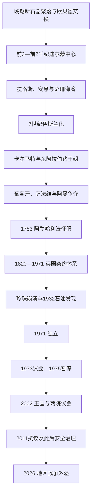

# 巴林历史

## 概括

巴林群岛拥有淡水泉、天然港湾和邻近珍珠床，是波斯湾少数能够长期承载密集定居与转口贸易的岛屿。约前2300—2000年，迪尔蒙的政治和商业中心从东阿拉伯大陆转到巴林，连接两河、马干与印度河。此后群岛先后处于巴比伦、阿契美尼德、希腊化、安息—萨珊及伊斯兰东阿拉伯网络中。16—18世纪葡萄牙—霍尔木兹、萨法维、阿曼和波斯地方势力争夺珍珠收入；1783年阿勒哈利法夺取群岛并延续统治。英国条约与1920年代行政改革把分散王族领地改造成受保护国家。1932年石油商业发现缓解珍珠业崩溃，1971年独立后形成由国王主导、民选众议院与任命协商院并存的王国。

## 历史主线

## 历史主线概括

巴林历史的连续性主要来自岛屿贸易位置，而不是某一政权不间断传承。迪尔蒙靠中转铜材和海湾航运兴盛，贸易路线与帝国重心改变后衰退；近代珍珠经济又形成商人、船主、潜水员和王族领地交织的社会。阿勒哈利法在祖巴拉—巴林跨海网络中征服群岛，却因家族分支竞争、邻国压力和英国干预而逐步失去大陆主张。石油、炼油和金融使国家比邻国更早工业化，也因本土储量有限而必须多元化。现代政治的核心张力，是国王和安全机构的集中权力同宪政、议会代表、宗派平等及劳工传统之间的长期拉扯。

## 阶段导航

| 顺序 | 阶段 | 时间 | 简要概括 |
|---:|---|---|---|
| 1 | [迪尔蒙、贸易网络与伊斯兰化](/%E4%BA%BA%E6%96%87%E7%A7%91%E5%AD%A6/%E5%8E%86%E5%8F%B2/%E8%A5%BF%E4%BA%9A/%E9%98%BF%E6%8B%89%E4%BC%AF%E5%8D%8A%E5%B2%9B/%E5%B7%B4%E6%9E%97/%E8%BF%AA%E5%B0%94%E8%92%99%E3%80%81%E8%B4%B8%E6%98%93%E7%BD%91%E7%BB%9C%E4%B8%8E%E4%BC%8A%E6%96%AF%E5%85%B0%E5%8C%96.md) | 约前5000年—16世纪初 | 从史前交换、迪尔蒙和提洛斯到伊斯兰东阿拉伯诸政权。 |
| 2 | [海湾王朝、珍珠贸易与英国保护](/%E4%BA%BA%E6%96%87%E7%A7%91%E5%AD%A6/%E5%8E%86%E5%8F%B2/%E8%A5%BF%E4%BA%9A/%E9%98%BF%E6%8B%89%E4%BC%AF%E5%8D%8A%E5%B2%9B/%E5%B7%B4%E6%9E%97/%E6%B5%B7%E6%B9%BE%E7%8E%8B%E6%9C%9D%E3%80%81%E7%8F%8D%E7%8F%A0%E8%B4%B8%E6%98%93%E4%B8%8E%E8%8B%B1%E5%9B%BD%E4%BF%9D%E6%8A%A4.md) | 1521—1971年 | 海上帝国竞争、阿勒哈利法征服、英国改革、珍珠危机与石油转型。 |
| 3 | [独立、社会改革与现代巴林](/%E4%BA%BA%E6%96%87%E7%A7%91%E5%AD%A6/%E5%8E%86%E5%8F%B2/%E8%A5%BF%E4%BA%9A/%E9%98%BF%E6%8B%89%E4%BC%AF%E5%8D%8A%E5%B2%9B/%E5%B7%B4%E6%9E%97/%E7%8B%AC%E7%AB%8B%E3%80%81%E7%A4%BE%E4%BC%9A%E6%94%B9%E9%9D%A9%E4%B8%8E%E7%8E%B0%E4%BB%A3%E5%B7%B4%E6%9E%97.md) | 1971年至今 | 独立、议会中断、王国改革、2011年危机与现代安全国家。 |
| 专表 | [阿勒哈利法统治者与首相表](/%E4%BA%BA%E6%96%87%E7%A7%91%E5%AD%A6/%E5%8E%86%E5%8F%B2/%E8%A5%BF%E4%BA%9A/%E9%98%BF%E6%8B%89%E4%BC%AF%E5%8D%8A%E5%B2%9B/%E5%B7%B4%E6%9E%97/%E9%98%BF%E5%8B%92%E5%93%88%E5%88%A9%E6%B3%95%E7%BB%9F%E6%B2%BB%E8%80%85%E4%B8%8E%E9%A6%96%E7%9B%B8%E8%A1%A8.md) | 1783年至今 | 共同统治、复位和废立均逐项说明，另列独立前后两位首相。 |

## 重要转折与时间节点

| 时间 | 转折 | 历史意义 |
|---|---|---|
| 约前2300—2000年 | 迪尔蒙中心移至巴林 | 群岛成为两河—马干—印度河长途贸易的港口与行政中心。 |
| 前15—前14世纪 | 加喜特巴比伦派驻官员 | 海湾贸易首次留下较明确的帝国直接行政证据。 |
| 7世纪 | 东阿拉伯归入穆斯林共同体 | 巴林进入哈里发政治网络，“巴林”仍常指更广阔东阿拉伯。 |
| 899—1077年 | 卡尔马特势力兴衰 | 哈萨为中心的国家一度挑战阿拔斯秩序并控制群岛。 |
| 1521、1602年 | 葡萄牙占领、萨法维取代 | 珍珠税收成为海上帝国竞争目标。 |
| 1783年 | 阿勒哈利法征服巴林 | 延续至今的统治家族建立岛上政权。 |
| 1861—1892年 | 英国条约逐步排除他国势力 | 对外主权受限，英国保护关系制度化。 |
| 1923年 | 英国推动行政改革和统治交接 | 王族领地与私税逐步转为法院、海关和市政等集中机构。 |
| 1932年 | 商业发现石油 | 巴林成为最早产油的阿拉伯海湾国家，资源收入替代衰败珍珠业。 |
| 1970—1971年 | 联合国调查、伊朗放弃主张、独立 | 国际确认居民独立意愿，结束英国保护。 |
| 2001—2002年 | 行动宪章与王国宪法 | 恢复议会，但任命院与王室权力引发改革范围争议。 |
| 2011年 | 珍珠环岛抗议和镇压 | 宗派不平等、代表制度和区域安全竞争集中爆发。 |
| 2026年 | 伊朗导弹和无人机攻击 | 美军第五舰队驻地与关键能源设施使巴林直接承受地区战争外溢。 |

## 相关主线

- 区域背景：[阿拉伯半岛历史](/%E4%BA%BA%E6%96%87%E7%A7%91%E5%AD%A6/%E5%8E%86%E5%8F%B2/%E8%A5%BF%E4%BA%9A/%E9%98%BF%E6%8B%89%E4%BC%AF%E5%8D%8A%E5%B2%9B/README.md)。
- 海湾条约体系：[奥斯曼、英国与现代国家形成](/%E4%BA%BA%E6%96%87%E7%A7%91%E5%AD%A6/%E5%8E%86%E5%8F%B2/%E8%A5%BF%E4%BA%9A/%E9%98%BF%E6%8B%89%E4%BC%AF%E5%8D%8A%E5%B2%9B/%E5%A5%A5%E6%96%AF%E6%9B%BC%E3%80%81%E8%8B%B1%E5%9B%BD%E4%B8%8E%E7%8E%B0%E4%BB%A3%E5%9B%BD%E5%AE%B6%E5%BD%A2%E6%88%90.md)。
- 连续统治者：[阿勒哈利法统治者与首相表](/%E4%BA%BA%E6%96%87%E7%A7%91%E5%AD%A6/%E5%8E%86%E5%8F%B2/%E8%A5%BF%E4%BA%9A/%E9%98%BF%E6%8B%89%E4%BC%AF%E5%8D%8A%E5%B2%9B/%E5%B7%B4%E6%9E%97/%E9%98%BF%E5%8B%92%E5%93%88%E5%88%A9%E6%B3%95%E7%BB%9F%E6%B2%BB%E8%80%85%E4%B8%8E%E9%A6%96%E7%9B%B8%E8%A1%A8.md)。

## 目录层级

- 直接上级：[阿拉伯半岛](/%E4%BA%BA%E6%96%87%E7%A7%91%E5%AD%A6/%E5%8E%86%E5%8F%B2/%E8%A5%BF%E4%BA%9A/%E9%98%BF%E6%8B%89%E4%BC%AF%E5%8D%8A%E5%B2%9B/README.md)
- 宏观区域：[西亚](/%E4%BA%BA%E6%96%87%E7%A7%91%E5%AD%A6/%E5%8E%86%E5%8F%B2/%E8%A5%BF%E4%BA%9A/README.md)
- 历史总览：[历史](/%E4%BA%BA%E6%96%87%E7%A7%91%E5%AD%A6/%E5%8E%86%E5%8F%B2/README.md)