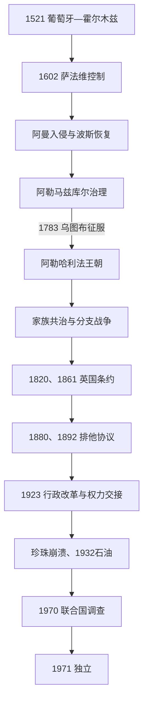

# 海湾王朝、珍珠贸易与英国保护

## 时间

1521—1971年

## 概括

巴林近代史围绕珍珠税收与海湾制海权展开。葡萄牙—霍尔木兹体系1521年占领群岛，萨法维1602年取代它，18世纪又经历阿曼入侵、纳迪尔沙反攻和阿勒马兹库尔地方统治。1783年祖巴拉的乌图布联盟反攻并由阿勒哈利法建立新王朝。王族共同统治和分支战争使政权长期不稳，英国以维护海上和平为由从1820年起不断扩大干预，1869年直接促成新统治者上台，1880和1892年协议进一步排除其他列强。1920年代英国主导的行政改革、天然珍珠崩溃及1932年石油发现，最终把家族领地型酋长国改造成集中化保护国。

## 分阶段发展

### 葡萄牙、萨法维与阿曼争夺（1521—1783年）

- 1521年葡萄牙—霍尔木兹军队击败贾布里统治者穆克林并夺取巴林，以堡垒和海军控制珍珠税；1559年奥斯曼从哈萨远征失败，显示岛屿控制取决于制海权。
- 1602年前后，当地反抗和萨法维扩张终结葡萄牙统治。萨法维多借设拉子总督或阿拉伯地方家族间接治理，什叶宗教学者网络与伊朗联系在此期加强。
- 18世纪初萨法维崩溃造成权力真空，阿曼雅鲁布王朝数次占领。纳迪尔沙恢复波斯控制后又依靠布什尔的阿勒马兹库尔家族管理，实际统治仍受海上补给和地方抵抗限制。
- 1782年阿勒马兹库尔攻击祖巴拉失败，乌图布联盟次年反攻巴林。艾哈迈德·法提赫击败守军，以祖巴拉和巴林的跨海珍珠网络建立阿勒哈利法统治。

### 家族共治、区域战争与英国干预（1783—1869年）

- 艾哈迈德死后，阿卜杜拉与萨勒曼两支共同统治；各支控制不同城镇、岛屿收入和追随者。共同统治既分散风险，也造成继承、税收和大陆据点的长期竞争。
- 19世纪初瓦哈比—沙特力量、马斯喀特阿曼和埃及军队轮流施压。阿勒哈利法有时纳贡、有时借英国或阿曼抗衡，尚未拥有排他的现代主权。
- 英国1820年同巴林签一般海上条约，重点是压制海上袭击。1861年永久和平友好条约承诺英国保护巴林免受海上攻击，统治者则放弃海战、奴隶贸易等行为。
- 穆罕默德·本·哈利法在1834—1842、1843—1868年多次掌权。其同阿卜杜拉支系、卡塔尔部落和英国关系反复，表明王位并非稳定长子制。
- 1867年巴林与阿布扎比舰队毁坏多哈、沃克拉，卡塔尔反击。英国认定巴林破坏海上停战，迫使穆罕默德退位；阿里1869年战死后，穆罕默德短暂复位，另一支穆罕默德·本·阿卜杜拉也短暂掌权。
- 英国舰队最终拘捕竞争者并在1869年支持伊萨·本·阿里上台。此后巴林的对外战争能力和卡塔尔主张被压缩，王位稳定与英国干预直接绑定。

### 保护国、行政改革与经济转型（1869—1971年）

- 1880年协议禁止统治者未经英国同意同其他国家缔约或设外交机构；1892年又禁止让渡领土。巴林由条约伙伴转为事实上的英国保护国，对内仍由阿勒哈利法治理。
- 珍珠社会由统治者、王族庄园、商人和船主、领航员、潜水员及农业村社组成。商人预支航季资金，潜水员常负债；王族通过税、土地和强制服务获益，什叶村民与城市商人的权利处境不一。
- 1919年学校、1920年代市政和海关等机构出现。英国政治代理人推动法院、警察、土地登记、税务及采珠债务改革，试图减少各王族成员私设司法与征敛。
- 1923年英国迫使年迈的伊萨把实际权力交给其子哈马德。巴林官方世系仍把伊萨列至1932年去世，学术叙述则常以1923年为事实退位；两种口径需并列说明。
- 英国顾问查尔斯·贝尔格雷夫1926—1957年长期主持行政建设。集中化提高政府能力，也把英国权力、安全机关和王室统治结合，引起商人、工人及受改革不均影响社群反弹。
- 日本养殖珍珠与大萧条使天然珍珠价格在1920年代末崩溃。1932年杰贝勒杜汉发现石油，1934年出口、1936年炼油厂运作；石油工资和国家税收缓解旧经济瓦解，却强化外资和王室财政。
- 1938年油田工人和民族主义者提出劳动与代表诉求；1954年跨宗派的高级执行委员会要求民选议会、统一法院和工会，1956年苏伊士危机后领导人被捕流放。1965年巴林石油公司裁员再引发罢工和学生抗议。
- 伊朗长期主张巴林。英国决定撤出后，联合国秘书长代表在1970年调查各界意见，确认压倒性倾向独立，安全理事会予以认可，伊朗接受结果。
- 九酋长联邦因席位、边界与权力分配失败。巴林于1971年8月15日结束英国条约、宣布独立；12月16日是伊萨即位纪念形成的国庆日，不应与独立日混同。

## 统治结构与世系

| 时期 | 名义结构 | 实际权力 |
|---|---|---|
| 1783—1869年 | 阿勒哈利法各支共同或轮流统治 | 分支各据领地、船队和税源，邻国与英国可左右废立。 |
| 1869—1923年 | 伊萨为哈基姆，英国以条约限制外交 | 王族庄园和私属司法仍强，英国政治代理人逐步介入。 |
| 1923—1971年 | 哈基姆、行政部门与英国顾问并存 | 哈马德及其后继者主持集中政府，英国控制防务外交与重大改革。 |

完整列出共同统治者、穆罕默德三次掌权、1923／1932口径及独立后君主，见[阿勒哈利法统治者与首相表](/%E4%BA%BA%E6%96%87%E7%A7%91%E5%AD%A6/%E5%8E%86%E5%8F%B2/%E8%A5%BF%E4%BA%9A/%E9%98%BF%E6%8B%89%E4%BC%AF%E5%8D%8A%E5%B2%9B/%E5%B7%B4%E6%9E%97/%E9%98%BF%E5%8B%92%E5%93%88%E5%88%A9%E6%B3%95%E7%BB%9F%E6%B2%BB%E8%80%85%E4%B8%8E%E9%A6%96%E7%9B%B8%E8%A1%A8.md)。

## 兴衰与转型原因

- **葡萄牙与萨法维控制更替**：珍珠收入吸引征服，制海权与霍尔木兹体系支撑葡萄牙；当地反抗和萨法维在伊朗沿岸扩张则成为1602年转换的条件。
- **阿勒哈利法成功**：祖巴拉商业财富、乌图布海军联盟和阿勒马兹库尔远征失败共同造成1783年转折；征服后仍需通过共治维持家族联盟。
- **大陆主张衰落**：内部战争和对卡塔尔用兵消耗王朝，英国海上停战规则排除武力扩张，1868—1869年废立是直接终点。
- **珍珠体系灭亡**：养殖珍珠是技术替代，大萧条是外部需求冲击，债务链和进口依赖把冲击传至劳工；石油及时出现才避免国家财政长期崩溃。
- **保护国终结**：英国战略撤退、石油支持的行政能力与居民独立意愿是结构因素；联合国调查化解伊朗主张，联邦谈判失败促成单独独立。

## 演变关系

- 前一节点：[迪尔蒙、贸易网络与伊斯兰化](/%E4%BA%BA%E6%96%87%E7%A7%91%E5%AD%A6/%E5%8E%86%E5%8F%B2/%E8%A5%BF%E4%BA%9A/%E9%98%BF%E6%8B%89%E4%BC%AF%E5%8D%8A%E5%B2%9B/%E5%B7%B4%E6%9E%97/%E8%BF%AA%E5%B0%94%E8%92%99%E3%80%81%E8%B4%B8%E6%98%93%E7%BD%91%E7%BB%9C%E4%B8%8E%E4%BC%8A%E6%96%AF%E5%85%B0%E5%8C%96.md)。
- 后一节点：[独立、社会改革与现代巴林](/%E4%BA%BA%E6%96%87%E7%A7%91%E5%AD%A6/%E5%8E%86%E5%8F%B2/%E8%A5%BF%E4%BA%9A/%E9%98%BF%E6%8B%89%E4%BC%AF%E5%8D%8A%E5%B2%9B/%E5%B7%B4%E6%9E%97/%E7%8B%AC%E7%AB%8B%E3%80%81%E7%A4%BE%E4%BC%9A%E6%94%B9%E9%9D%A9%E4%B8%8E%E7%8E%B0%E4%BB%A3%E5%B7%B4%E6%9E%97.md)。
- 卡塔尔侧面：[早期聚落、部落与珍珠贸易](/%E4%BA%BA%E6%96%87%E7%A7%91%E5%AD%A6/%E5%8E%86%E5%8F%B2/%E8%A5%BF%E4%BA%9A/%E9%98%BF%E6%8B%89%E4%BC%AF%E5%8D%8A%E5%B2%9B/%E5%8D%A1%E5%A1%94%E5%B0%94/%E6%97%A9%E6%9C%9F%E8%81%9A%E8%90%BD%E3%80%81%E9%83%A8%E8%90%BD%E4%B8%8E%E7%8F%8D%E7%8F%A0%E8%B4%B8%E6%98%93.md)。
- 上级：[巴林历史](/%E4%BA%BA%E6%96%87%E7%A7%91%E5%AD%A6/%E5%8E%86%E5%8F%B2/%E8%A5%BF%E4%BA%9A/%E9%98%BF%E6%8B%89%E4%BC%AF%E5%8D%8A%E5%B2%9B/%E5%B7%B4%E6%9E%97/README.md)。