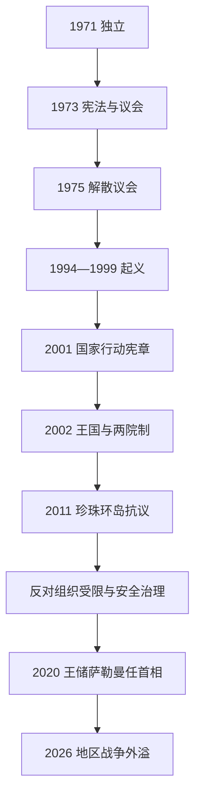

# 独立、社会改革与现代巴林

## 时间

1971年至今（核验截至2026年7月13日）

## 概括

巴林独立后以较早形成的官僚、石油和劳工体系建国，但本土油气有限，必须依靠炼油、铝业、金融、沙特联系和海湾援助维持经济。政治上，1973年民选国民议会仅运作两年即被解散；1999年哈马德继位后释放政治犯、推动《国家行动宪章》，却在2002年以国王主导的两院制取代1973年安排。2011年大规模抗议及海合会军队进驻后，安全机构和王室权力进一步集中，主要反对组织被解散。2020年王储萨勒曼兼任首相，成为日常经济行政核心；2026年伊朗攻击把第五舰队驻地、炼油和石化设施变成地区战争前线。

## 分阶段发展

### 独立、议会实验与安全法时期（1971—1999年）

- 1971年8月15日独立，伊萨·本·萨勒曼任埃米尔，哈利法·本·萨勒曼自1970年起任首相。国家加入阿盟和联合国，并以英国移交机构为基础建设外交、防务和财政。
- 1973年宪法设一院国民议会，成员包括民选议员和当然成员部长。左翼、民族主义与宗教议员围绕国家安全法、劳工和外军问题挑战政府。
- 1975年埃米尔解散议会，推迟选举并以《国家安全法》扩大未经审判拘留。政府以稳定和安全威胁为理由，反对派则视之为违背1973年宪政契约。
- 1981年当局挫败被指与伊朗有关的政变阴谋；伊朗革命和两伊战争加深统治集团对跨境什叶政治动员的安全化理解。
- 1986年法赫德国王大桥连接沙特，贸易、通勤和安全关系加深。石油产量有限使巴林发展进口沙特原油炼制、铝业、离岸金融和服务业。
- 1994—1999年请愿与起义要求恢复议会、释放政治犯和改善就业。罢工、街头冲突、逮捕和流亡持续，成为哈马德继位后改革的直接压力。

### 行动宪章、王国与有限开放（1999—2011年）

- 哈马德1999年继位，释放多数政治犯、允许流亡者回国并废除国家安全法院，快速降低对抗。
- 2001年《国家行动宪章》公投获压倒性支持，文本承诺立宪君主和两院议会。许多反对派支持它，是基于民选院保有1973年立法地位的理解。
- 2002年新宪法把国家改为王国，设40席民选众议院与40席国王任命协商院，两院共享立法权。王室称其落实宪章，反对派则认为任命院削弱民选多数并质疑修宪程序。
- 主要反对团体一度抵制2002年选举，后参加2006、2010年选举。选区划分、归化、安全部门就业和住房分配等问题持续被赋予宗派含义。
- 国王掌握政府任命、军队和重要司法职位；首相哈利法长期代表王室保守与行政网络，王储萨勒曼则推动劳动力市场、教育和经济多元化改革。

### 2011年危机及其后（2011年至今）

- 2011年2月，受阿拉伯之春影响，抗议者在珍珠环岛集会，诉求从释放政治犯和实质立宪改革到部分群体要求共和。参与者以什叶公民为主，也有跨宗派活动者。
- 安全部队清场造成死伤；3月沙特主导的半岛盾部队进入巴林，政府宣布国家安全状态并拆除珍珠纪念碑。统治集团把危机视为伊朗可利用的国家安全威胁，反对派强调国内权利和代表不平等。
- 国王任命的巴林独立调查委员会确认执法中过度使用武力、酷刑及系统性虐待等问题，并提出问责、复职和对话建议。政府实施部分警务和监督改革，但责任追究与政治和解效果受到争议。
- 2016年主要什叶反对组织维法克被解散，2017年世俗左翼组织瓦阿德被解散；政治权利限制和候选资格规则使2018、2022年选举缺少主要反对派竞争。
- 2020年巴林同以色列建交，加入《亚伯拉罕协议》。同年长期首相哈利法去世，王储萨勒曼出任首相，把王位继承、经济改革和行政协调集中于同一人。
- 2018年海湾盟国援助计划、增值税和财政平衡改革反映公共债务压力。巴林继续依赖巴布科炼油、阿尔巴铝业、金融、物流和沙特市场，本土资源不足使经济比大型产油国更易受外部融资影响。
- 2026年2月28日起，伊朗导弹和无人机多轮攻击巴林；3月炼油厂、锡特拉、麦纳麦住宅及穆哈拉格燃料设施遭击，造成平民死伤，4月海湾石化公司设施又受无人机攻击。驻巴林的美国第五舰队与美军行动争议，使本国安全依赖同时成为受袭诱因。
- 截至2026年7月13日，地区停火与再交火状态仍不稳定。巴林继续由哈马德国王、王储兼首相萨勒曼领导，战时防空、信息管制和海合会—美国安全合作权重上升。

## 君主、政府与实际权力

完整王朝世系和首相表见[阿勒哈利法统治者与首相表](/%E4%BA%BA%E6%96%87%E7%A7%91%E5%AD%A6/%E5%8E%86%E5%8F%B2/%E8%A5%BF%E4%BA%9A/%E9%98%BF%E6%8B%89%E4%BC%AF%E5%8D%8A%E5%B2%9B/%E5%B7%B4%E6%9E%97/%E9%98%BF%E5%8B%92%E5%93%88%E5%88%A9%E6%B3%95%E7%BB%9F%E6%B2%BB%E8%80%85%E4%B8%8E%E9%A6%96%E7%9B%B8%E8%A1%A8.md)。

| 机构或角色 | 法定作用 | 实际权力关系 |
|---|---|---|
| 国王 | 国家元首，任命首相、部长和协商院，统帅国防军。 | 对安全、外交、高级司法和立法程序保持决定性影响。 |
| 王储兼首相 | 主持内阁、协调经济和行政，并为法定继承人。 | 萨勒曼自2020年兼任，既是政府首脑也是未来王位中心。 |
| 众议院 | 40席经选举产生，可审议法律、预算和质询部长。 | 选区、参选资格、两院关系及无法单独组成政府限制其改变政策的能力。 |
| 协商院 | 40席由国王任命，与众议院共同立法。 | 可平衡或阻止民选院议程，吸纳商界、专业人士及社群代表。 |
| 国防军、内政与司法 | 负责国防、警务和司法。 | 王室成员在安全部门居核心地位；政治案件和反恐法适用引发权利争议。 |
| 商界与劳工 | 商人家族、国企和外籍劳动力支撑经济。 | 国家在王室、商界、公民就业与外籍劳工成本之间调节分配。 |

## 社会与经济机制

- 巴林公民内部存在逊尼、什叶和其他社群；什叶公民被广泛认为占较大比例，但官方不公布可验证的细分人口普查，比例不宜写成精确数字。
- 宗派身份同村庄—城市差异、阶级、政治组织和国家就业交织。把所有冲突简化为宗教仇恨会忽略跨宗派劳工运动、商人改革和国家制度选择。
- 较早耗减的油田促使巴林成为炼油、铝冶炼、银行和旅游中心；它从沙特取得原油和财政支持，并借大桥融入沙特东部市场。
- 外籍居民超过总人口一半，承担建筑、服务和专业岗位。劳工保护、工资、居留和公民就业政策因此直接影响社会稳定。

## 改革受挫与政权延续原因

- **有限开放的动力**：1990年代动乱、王位交接和重建国际形象促成1999—2001年和解；并非君主权力自然线性下放。
- **2002年制度争议**：政府以两院制和稳定保障少数群体，反对派认为任命院与国王修宪权架空民选多数，造成合作基础逐步流失。
- **2011年抗议扩大**：长期议会限制、就业与选区不满是结构因素，阿拉伯之春是外部触发，清场死伤和谈判失败推动诉求激化。
- **君主制延续**：王室掌握军警、财政和任命，沙特及海合会提供安全与资金，美国第五舰队构成外部威慑；反对派分裂和地区教派竞争又压缩妥协空间。
- **长期风险**：公共债务、青年就业、资源有限、政治代表不足和地区军事暴露相互强化，单靠油价或安全镇压都无法消除。

## 重要事件

| 时间 | 事件 | 结果与长期影响 |
|---|---|---|
| 1971年 | 独立 | 建立阿勒哈利法主导的主权国家。 |
| 1973—1975年 | 宪法、议会及解散 | 形成后来反对派要求恢复的宪政基准。 |
| 1994—1999年 | 请愿运动与起义 | 推动继位后的短期和解开放。 |
| 2001—2002年 | 行动宪章、新宪法和王国 | 恢复选举，同时建立任命院共享立法权。 |
| 2011年 | 珍珠环岛抗议与半岛盾进驻 | 安全国家强化，政治和宗派裂痕加深。 |
| 2016—2017年 | 维法克、瓦阿德被解散 | 有组织反对派退出合法竞选空间。 |
| 2020年 | 对以建交、萨勒曼任首相 | 外交重组，王储掌握政府日常行政。 |
| 2026年 | 伊朗攻击军用、能源与居民设施 | 地区战争进入本土，防空和联盟依赖上升。 |

## 演变关系

- 前一节点：[海湾王朝、珍珠贸易与英国保护](/%E4%BA%BA%E6%96%87%E7%A7%91%E5%AD%A6/%E5%8E%86%E5%8F%B2/%E8%A5%BF%E4%BA%9A/%E9%98%BF%E6%8B%89%E4%BC%AF%E5%8D%8A%E5%B2%9B/%E5%B7%B4%E6%9E%97/%E6%B5%B7%E6%B9%BE%E7%8E%8B%E6%9C%9D%E3%80%81%E7%8F%8D%E7%8F%A0%E8%B4%B8%E6%98%93%E4%B8%8E%E8%8B%B1%E5%9B%BD%E4%BF%9D%E6%8A%A4.md)。
- 地区对照：[议会政治、海湾战争与现代科威特](/%E4%BA%BA%E6%96%87%E7%A7%91%E5%AD%A6/%E5%8E%86%E5%8F%B2/%E8%A5%BF%E4%BA%9A/%E9%98%BF%E6%8B%89%E4%BC%AF%E5%8D%8A%E5%B2%9B/%E7%A7%91%E5%A8%81%E7%89%B9/%E8%AE%AE%E4%BC%9A%E6%94%BF%E6%B2%BB%E3%80%81%E6%B5%B7%E6%B9%BE%E6%88%98%E4%BA%89%E4%B8%8E%E7%8E%B0%E4%BB%A3%E7%A7%91%E5%A8%81%E7%89%B9.md)。
- 上级：[巴林历史](/%E4%BA%BA%E6%96%87%E7%A7%91%E5%AD%A6/%E5%8E%86%E5%8F%B2/%E8%A5%BF%E4%BA%9A/%E9%98%BF%E6%8B%89%E4%BC%AF%E5%8D%8A%E5%B2%9B/%E5%B7%B4%E6%9E%97/README.md)。