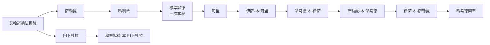

# 巴林阿勒哈利法统治者与首相表

## 时间

1783年至今（现任信息核验截至2026年7月13日）

## 概括

阿勒哈利法统治始于1783年乌图布从祖巴拉征服巴林。早期不是稳定的单线长子继承，而是阿卜杜拉、萨勒曼两支共同分配领地，并出现内战、复位和英国废立。下表按公认统治者逐人列出：共同统治者不合并，穆罕默德·本·哈利法三次执政在同一行列明。1923年伊萨被迫交出实际权力、1932年哈马德正式即位的口径争议另作说明。

## 阿勒哈利法统治者完整表

| 顺序 | 统治者 | 称号 | 在位或掌权时间 | 生卒 | 与前任关系 | 继承、复位与重要事件 |
|---:|---|---|---|---|---|---|
| 1 | **艾哈迈德·本·穆罕默德·阿勒哈利法（艾哈迈德·法提赫）** | 哈基姆 | 1783—1796年 | 约1725—1796年 | — | 率乌图布从祖巴拉征服巴林；统治重心仍跨祖巴拉与群岛。 |
| 2 | 阿卜杜拉·本·艾哈迈德·阿勒哈利法 | 共同哈基姆；后期主要统治者 | 1796—1843年 | 1769—1849年 | 艾哈迈德之子 | 先同兄弟萨勒曼、再同侄辈共治；与阿曼、沙特和家族对手反复战争，1843年败于侄孙穆罕默德。 |
| 3 | 萨勒曼·本·艾哈迈德·阿勒哈利法 | 共同哈基姆 | 1796—1825年 | 不详—1825年 | 阿卜杜拉之兄弟 | 同阿卜杜拉共治，萨勒曼支系后来经伊萨成为唯一在位王支。 |
| 4 | 哈利法·本·萨勒曼·阿勒哈利法 | 共同哈基姆 | 1825—1834年 | 不详—1834年 | 萨勒曼之子 | 继父同叔父阿卜杜拉共治；其子穆罕默德继而争夺主要统治权。 |
| 5 | 穆罕默德·本·哈利法·阿勒哈利法 | 哈基姆 | 1834—1842年、1843—1868年、1869年9—12月 | 约1813—1890年 | 哈利法之子 | 首次即位后被阿卜杜拉逐出，1843年复位；1868年因卡塔尔战争受英国压力退位，1869年家族战争中短暂第三次掌权后被英国拘逐。 |
| 6 | 阿里·本·哈利法·阿勒哈利法 | 哈基姆 | 1868—1869年 | 约1813—1869年 | 穆罕默德之兄弟 | 英国迫使穆罕默德退位后上台，在同阿卜杜拉支系战争中阵亡。 |
| 7 | 穆罕默德·本·阿卜杜拉·阿勒哈利法 | 哈基姆 | 1869年12月 | 不详 | 阿卜杜拉之子 | 家族战争中极短掌权，随后被英国废黜。 |
| 8 | 伊萨·本·阿里·阿勒哈利法 | 哈基姆 | 1869—1932年；1923年后仅名义在位 | 1848—1932年 | 阿里之子 | 英国支持上台，签署排他协议；1923年被迫把实际权力交给儿子哈马德。官方世系仍列至1932年去世。 |
| 9 | 哈马德·本·伊萨·阿勒哈利法 | 副统治者；1932年起哈基姆 | 事实主持1923—1932年；正式在位1932—1942年 | 1872—1942年 | 伊萨之子 | 执行行政改革；1932年石油发现，国家财政和劳动结构开始转型。 |
| 10 | 萨勒曼·本·哈马德·阿勒哈利法 | 哈基姆 | 1942—1961年 | 1894—1961年 | 哈马德之子 | 战后炼油、教育和城市化扩张；1950年代民族主义与劳工运动高涨。 |
| 11 | 伊萨·本·萨勒曼·阿勒哈利法 | 哈基姆；1971年起埃米尔 | 1961—1999年 | 1933—1999年 | 萨勒曼之子 | 1971年独立，1973年颁布宪法、1975年解散议会；经历工业化与1990年代政治危机。 |
| 12 | **哈马德·本·伊萨·阿勒哈利法** | 1999—2002年埃米尔；2002年起国王 | 1999年至今 | 1950年生 | 伊萨之子 | 推动2001年行动宪章，2002年建立王国和两院议会；经历2011年危机、反对派受限及2026年战争外溢。 |

## 1923／1932年口径说明

- 1923年英国在反对王族私税、强迫劳动和司法不平等的改革压力下，迫使伊萨把实际治理交给王储哈马德。
- 学术年表常把哈马德的事实统治起点列为1923年；巴林官方传统则认为伊萨仍是合法统治者，哈马德到1932年父亲去世才正式即位。
- 本表同时保留“事实主持”和“正式在位”，不把1923—1932年误记为无人统治，也不抹去口径争议。

## 首相完整表

| 顺序 | 首相 | 任期 | 与君主关系 | 关键阶段与备注 |
|---:|---|---|---|---|
| 1 | 哈利法·本·萨勒曼·阿勒哈利法 | 1970—2020年 | 伊萨埃米尔之弟、哈马德国王之叔 | 独立前组建首届内阁，长期掌握行政和王室保守网络；任内经历议会解散、1990年代动乱、2002年王国和2011年危机，2020年在任内去世。 |
| 2 | **萨勒曼·本·哈马德·阿勒哈利法** | 2020年至今 | 哈马德国王之子、1999年起王储 | 主持内阁并推动经济、财政和行政改革；截至2026年7月13日仍任王储兼首相，战时协调国家应对。 |

## 继承与国家结构

- 2002年宪法规定王位在阿勒哈利法家族中由哈马德国王的男性后裔世袭，原则上父传长子，国王可依王室继承规则另作安排。
- 国王任命首相和部长、协商院全体成员及高级官员，统帅国防军并参与立法；首相负责内阁日常领导，但政府不由众议院多数产生。
- 萨勒曼同时为王储和首相，使法定继承与政府行政集中于一人。安全部门、王室法院和经济机构构成国王—王储之外的重要实际权力网络。

## 世系演变

图中家族血缘并不等于无争议政治继承；1834—1869年的废立和复位须结合上表阅读。

## 相关笔记

- 王朝形成与保护国：[海湾王朝、珍珠贸易与英国保护](/%E4%BA%BA%E6%96%87%E7%A7%91%E5%AD%A6/%E5%8E%86%E5%8F%B2/%E8%A5%BF%E4%BA%9A/%E9%98%BF%E6%8B%89%E4%BC%AF%E5%8D%8A%E5%B2%9B/%E5%B7%B4%E6%9E%97/%E6%B5%B7%E6%B9%BE%E7%8E%8B%E6%9C%9D%E3%80%81%E7%8F%8D%E7%8F%A0%E8%B4%B8%E6%98%93%E4%B8%8E%E8%8B%B1%E5%9B%BD%E4%BF%9D%E6%8A%A4.md)。
- 独立王国：[独立、社会改革与现代巴林](/%E4%BA%BA%E6%96%87%E7%A7%91%E5%AD%A6/%E5%8E%86%E5%8F%B2/%E8%A5%BF%E4%BA%9A/%E9%98%BF%E6%8B%89%E4%BC%AF%E5%8D%8A%E5%B2%9B/%E5%B7%B4%E6%9E%97/%E7%8B%AC%E7%AB%8B%E3%80%81%E7%A4%BE%E4%BC%9A%E6%94%B9%E9%9D%A9%E4%B8%8E%E7%8E%B0%E4%BB%A3%E5%B7%B4%E6%9E%97.md)。
- 总览：[巴林历史](/%E4%BA%BA%E6%96%87%E7%A7%91%E5%AD%A6/%E5%8E%86%E5%8F%B2/%E8%A5%BF%E4%BA%9A/%E9%98%BF%E6%8B%89%E4%BC%AF%E5%8D%8A%E5%B2%9B/%E5%B7%B4%E6%9E%97/README.md)。