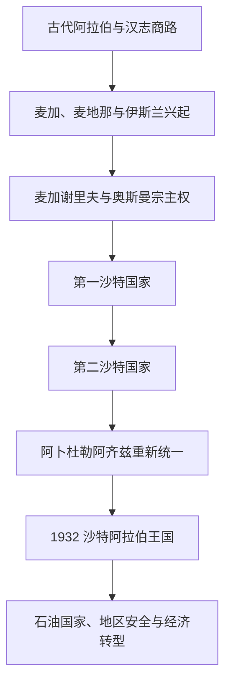

# 沙特阿拉伯历史

## 概括

沙特阿拉伯的历史包含三条相互交织的主线：汉志的麦加、麦地那与朝觐网络；内志的绿洲、部落联盟和沙特国家；东部哈萨的海湾贸易与石油资源。现代王国并非早期阿拉伯帝国的直接延续，而是沙特家族在18-20世纪经过三次建国与地区统一形成的国家。

## 历史主线

## 历史主线概括

汉志在7世纪成为伊斯兰圣地，后来长期由麦加谢里夫在哈里发或帝国宗主权下治理。18世纪中叶，沙特家族与穆罕默德·本·阿卜杜勒·瓦哈卜的宗教改革运动结盟，在内志建立第一沙特国家。第一、第二沙特国家先后瓦解后，阿卜杜勒阿齐兹于1902年重占利雅得，逐步控制内志、哈萨和汉志，1932年建立现代王国。石油出口随后重塑财政、社会、外交与城市结构。

## 阶段导航

| 顺序 | 阶段 | 时间 | 入口 | 简要概括 |
|---:|---|---|---|---|
| 1 | 古代阿拉伯与伊斯兰圣地 | 古代-18世纪初 | [古代阿拉伯与伊斯兰圣地](/%E4%BA%BA%E6%96%87%E7%A7%91%E5%AD%A6/%E5%8E%86%E5%8F%B2/%E8%A5%BF%E4%BA%9A/%E9%98%BF%E6%8B%89%E4%BC%AF%E5%8D%8A%E5%B2%9B/%E6%B2%99%E7%89%B9%E9%98%BF%E6%8B%89%E4%BC%AF/%E5%8F%A4%E4%BB%A3%E9%98%BF%E6%8B%89%E4%BC%AF%E4%B8%8E%E4%BC%8A%E6%96%AF%E5%85%B0%E5%9C%A3%E5%9C%B0.md) | 汉志商路、麦加和麦地那、伊斯兰兴起以及谢里夫统治。 |
| 2 | 沙特国家、瓦哈比运动与统一 | 约1744-1932年 | [沙特国家、瓦哈比运动与统一](/%E4%BA%BA%E6%96%87%E7%A7%91%E5%AD%A6/%E5%8E%86%E5%8F%B2/%E8%A5%BF%E4%BA%9A/%E9%98%BF%E6%8B%89%E4%BC%AF%E5%8D%8A%E5%B2%9B/%E6%B2%99%E7%89%B9%E9%98%BF%E6%8B%89%E4%BC%AF/%E6%B2%99%E7%89%B9%E5%9B%BD%E5%AE%B6%E3%80%81%E7%93%A6%E5%93%88%E6%AF%94%E8%BF%90%E5%8A%A8%E4%B8%8E%E7%BB%9F%E4%B8%80.md) | 第一、第二沙特国家和阿卜杜勒阿齐兹统一半岛中部与西部。 |
| 3 | 石油时代与现代沙特阿拉伯 | 1932年至今 | [石油时代与现代沙特阿拉伯](/%E4%BA%BA%E6%96%87%E7%A7%91%E5%AD%A6/%E5%8E%86%E5%8F%B2/%E8%A5%BF%E4%BA%9A/%E9%98%BF%E6%8B%89%E4%BC%AF%E5%8D%8A%E5%B2%9B/%E6%B2%99%E7%89%B9%E9%98%BF%E6%8B%89%E4%BC%AF/%E7%9F%B3%E6%B2%B9%E6%97%B6%E4%BB%A3%E4%B8%8E%E7%8E%B0%E4%BB%A3%E6%B2%99%E7%89%B9%E9%98%BF%E6%8B%89%E4%BC%AF.md) | 王国制度、石油经济、地区安全和经济社会转型。 |

## 重要转折与时间节点

| 时间 | 事件 | 意义 |
|---|---|---|
| 610年起 | 穆罕默德在麦加传教 | 汉志成为伊斯兰兴起中心。 |
| 622年 | 希吉拉 | 麦地那成为早期穆斯林共同体中心。 |
| 约1744年 | 德拉伊耶政治宗教联盟形成 | 第一沙特国家开始扩张。 |
| 1818年 | 第一沙特国家被奥斯曼—埃及军队摧毁 | 沙特国家第一次中断。 |
| 1824年 | 第二沙特国家建立 | 利雅得取代德拉伊耶成为政治中心。 |
| 1902年 | 阿卜杜勒阿齐兹重占利雅得 | 现代统一进程开始。 |
| 1924-1925年 | 沙特军队控制汉志 | 麦加、麦地那和吉达并入其统治。 |
| 1932年 | 沙特阿拉伯王国成立 | 现代国家和国名确立。 |
| 1938年 | 达曼地区发现具有商业价值的石油 | 石油财政时代开启。 |
| 1973年 | 石油禁运与油价上涨 | 沙特的全球能源和外交影响增强。 |
| 1979年 | 麦加禁寺事件 | 国家安全与宗教政策进入新阶段。 |
| 2016年 | “2030愿景”公布 | 经济多元化和社会改革成为国家议程。 |

## 相关主线

- 区域背景：[阿拉伯半岛历史](/%E4%BA%BA%E6%96%87%E7%A7%91%E5%AD%A6/%E5%8E%86%E5%8F%B2/%E8%A5%BF%E4%BA%9A/%E9%98%BF%E6%8B%89%E4%BC%AF%E5%8D%8A%E5%B2%9B/README.md)。
- 伊斯兰帝国背景：[阿拉伯帝国](/%E4%BA%BA%E6%96%87%E7%A7%91%E5%AD%A6/%E5%8E%86%E5%8F%B2/%E8%A5%BF%E4%BA%9A/_%E9%80%9A%E5%8F%B2/%E9%98%BF%E6%8B%89%E4%BC%AF%E5%B8%9D%E5%9B%BD/README.md)。
- 奥斯曼背景：[奥斯曼帝国](/%E4%BA%BA%E6%96%87%E7%A7%91%E5%AD%A6/%E5%8E%86%E5%8F%B2/%E8%A5%BF%E4%BA%9A/%E5%9C%9F%E8%80%B3%E5%85%B6/%E5%A5%A5%E6%96%AF%E6%9B%BC%E5%B8%9D%E5%9B%BD/README.md)。

## 目录层级

- 直接上级：[阿拉伯半岛](/%E4%BA%BA%E6%96%87%E7%A7%91%E5%AD%A6/%E5%8E%86%E5%8F%B2/%E8%A5%BF%E4%BA%9A/%E9%98%BF%E6%8B%89%E4%BC%AF%E5%8D%8A%E5%B2%9B/README.md)
- 宏观区域：[西亚](/%E4%BA%BA%E6%96%87%E7%A7%91%E5%AD%A6/%E5%8E%86%E5%8F%B2/%E8%A5%BF%E4%BA%9A/README.md)
- 历史总览：[历史](/%E4%BA%BA%E6%96%87%E7%A7%91%E5%AD%A6/%E5%8E%86%E5%8F%B2/README.md)
