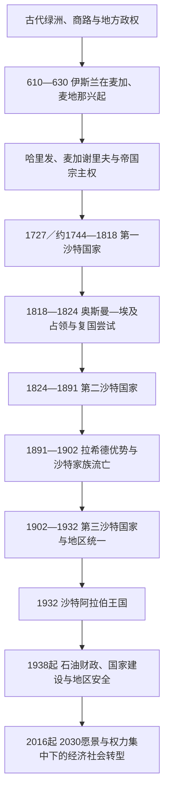

# 沙特阿拉伯历史

## 概括

沙特阿拉伯的历史由三个空间长期交织而成：汉志的麦加、麦地那与朝觐网络，内志的绿洲、部落联盟与沙特国家，以及哈萨和红海沿岸的贸易与资源通道。现代王国不是早期哈里发帝国的直接延续，而是沙特家族以德拉伊耶和利雅得为中心，经历第一、第二沙特国家及20世纪统一战争后形成的复合国家。1938年商业石油发现又重塑了财政、社会、外交和国家能力。

## 历史主线

- 汉志因麦加和麦地那成为伊斯兰圣地，但在多数时期并非帝国政治中心；地方谢里夫、城市精英和外部宗主共同维持朝觐秩序。
- 内志长期呈绿洲城镇与部落联盟并立格局。穆罕默德·本·沙特1727年掌权是今日沙特官方采用的第一国家建国起点，约1744年同穆罕默德·本·阿卜杜勒·瓦哈卜结盟则是传统史学强调的政教联盟节点。
- 第一国家因扩张至汉志而与奥斯曼帝国正面冲突，1818年被埃及总督穆罕默德·阿里派出的易卜拉欣帕夏军队摧毁；第二国家复兴于利雅得，却在王族内战和拉希德家族崛起中于1891年终结。
- 阿卜杜勒阿齐兹1902年重占利雅得，继而取得哈萨、哈伊勒、汉志、阿西尔和吉赞，压服伊赫万叛乱并吸收汉志行政制度，1932年统一国名。
- 石油把以朝觐、关税和地方贡赋为主的财政转为资源型国家财政。王室、宗教学者、部落与城市社会的旧平衡，逐渐叠加官僚机构、能源公司、安全体系和公共投资体系。
- 2015年后，经济多元化、社会开放和国家项目加速，同时决策权更集中于王储兼首相及其主持的战略机构。

## 阶段导航

| 顺序 | 阶段 | 时间 | 简要概括 |
|---:|---|---|---|
| 1 | [古代阿拉伯与伊斯兰圣地](/%E4%BA%BA%E6%96%87%E7%A7%91%E5%AD%A6/%E5%8E%86%E5%8F%B2/%E8%A5%BF%E4%BA%9A/%E9%98%BF%E6%8B%89%E4%BC%AF%E5%8D%8A%E5%B2%9B/%E6%B2%99%E7%89%B9%E9%98%BF%E6%8B%89%E4%BC%AF/%E5%8F%A4%E4%BB%A3%E9%98%BF%E6%8B%89%E4%BC%AF%E4%B8%8E%E4%BC%8A%E6%96%AF%E5%85%B0%E5%9C%A3%E5%9C%B0.md) | 古代—18世纪初 | 区域多中心格局、伊斯兰兴起、圣地治理与奥斯曼宗主权。 |
| 2 | [沙特国家、瓦哈比运动与统一](/%E4%BA%BA%E6%96%87%E7%A7%91%E5%AD%A6/%E5%8E%86%E5%8F%B2/%E8%A5%BF%E4%BA%9A/%E9%98%BF%E6%8B%89%E4%BC%AF%E5%8D%8A%E5%B2%9B/%E6%B2%99%E7%89%B9%E9%98%BF%E6%8B%89%E4%BC%AF/%E6%B2%99%E7%89%B9%E5%9B%BD%E5%AE%B6%E3%80%81%E7%93%A6%E5%93%88%E6%AF%94%E8%BF%90%E5%8A%A8%E4%B8%8E%E7%BB%9F%E4%B8%80.md) | 1727／约1744—1932年 | 三次建国、两次覆亡、复国战争和现代疆域形成。 |
| 3 | [石油时代与现代沙特阿拉伯](/%E4%BA%BA%E6%96%87%E7%A7%91%E5%AD%A6/%E5%8E%86%E5%8F%B2/%E8%A5%BF%E4%BA%9A/%E9%98%BF%E6%8B%89%E4%BC%AF%E5%8D%8A%E5%B2%9B/%E6%B2%99%E7%89%B9%E9%98%BF%E6%8B%89%E4%BC%AF/%E7%9F%B3%E6%B2%B9%E6%97%B6%E4%BB%A3%E4%B8%8E%E7%8E%B0%E4%BB%A3%E6%B2%99%E7%89%B9%E9%98%BF%E6%8B%89%E4%BC%AF.md) | 1932年至今 | 国王继承、石油国家、地区安全及2030愿景。 |

## 重要转折与时间节点

| 时间 | 事件 | 历史意义 |
|---|---|---|
| 622年 | 希吉拉与麦地那共同体形成 | 宗教共同体开始兼具政治和军事组织。 |
| 630年 | 麦加纳入穆斯林共同体 | 克尔白和朝觐被纳入伊斯兰制度。 |
| 1727年 | 穆罕默德·本·沙特掌管德拉伊耶 | 沙特官方采用的第一国家建国起点。 |
| 约1744年 | 德拉伊耶政教联盟形成 | 宗教改革、政治保护和军事动员相互结合。 |
| 1818年 | 德拉伊耶陷落 | 第一沙特国家被奥斯曼—埃及军队摧毁。 |
| 1824年 | 图尔基·本·阿卜杜拉占领利雅得 | 第二沙特国家建立，政治中心转向利雅得。 |
| 1891年 | 穆莱达战役与流亡 | 第二国家终结，拉希德家族控制内志。 |
| 1902年 | 阿卜杜勒阿齐兹重占利雅得 | 第三沙特国家和统一进程开始。 |
| 1924—1925年 | 汉志被征服 | 麦加、麦地那和吉达纳入沙特统治。 |
| 1932年 | 王国成立 | 不同区域、头衔和行政体系统一于一个国名。 |
| 1938—1939年 | 达曼7号井产油并首次出口 | 石油财政时代开启。 |
| 1973年 | 参与石油禁运 | 能源、阿以冲突与全球外交紧密结合。 |
| 1979年 | 麦加禁寺事件 | 国内安全与宗教社会政策出现长期转折。 |
| 1990—1991年 | 海湾危机与战争 | 外部安全依赖及国内宗教政治争议同时加深。 |
| 2016年 | 2030愿景公布 | 多元化、公共投资和社会改革成为国家主轴。 |
| 2022年 | 王储穆罕默德·本·萨勒曼出任首相 | 国王与政府首脑职位首次长期分置。 |

## 专题表

- 完整统治序列、复位和争议统治者见[沙特统治者与国王世系表](/%E4%BA%BA%E6%96%87%E7%A7%91%E5%AD%A6/%E5%8E%86%E5%8F%B2/%E8%A5%BF%E4%BA%9A/%E9%98%BF%E6%8B%89%E4%BC%AF%E5%8D%8A%E5%B2%9B/%E6%B2%99%E7%89%B9%E9%98%BF%E6%8B%89%E4%BC%AF/%E6%B2%99%E7%89%B9%E7%BB%9F%E6%B2%BB%E8%80%85%E4%B8%8E%E5%9B%BD%E7%8E%8B%E4%B8%96%E7%B3%BB%E8%A1%A8.md)。

## 相关主线

- 区域背景：[阿拉伯半岛历史](/%E4%BA%BA%E6%96%87%E7%A7%91%E5%AD%A6/%E5%8E%86%E5%8F%B2/%E8%A5%BF%E4%BA%9A/%E9%98%BF%E6%8B%89%E4%BC%AF%E5%8D%8A%E5%B2%9B/README.md)
- 伊斯兰帝国背景：[阿拉伯帝国](/%E4%BA%BA%E6%96%87%E7%A7%91%E5%AD%A6/%E5%8E%86%E5%8F%B2/%E8%A5%BF%E4%BA%9A/_%E9%80%9A%E5%8F%B2/%E9%98%BF%E6%8B%89%E4%BC%AF%E5%B8%9D%E5%9B%BD/README.md)
- 奥斯曼背景：[奥斯曼帝国](/%E4%BA%BA%E6%96%87%E7%A7%91%E5%AD%A6/%E5%8E%86%E5%8F%B2/%E8%A5%BF%E4%BA%9A/%E5%9C%9F%E8%80%B3%E5%85%B6/%E5%A5%A5%E6%96%AF%E6%9B%BC%E5%B8%9D%E5%9B%BD/README.md)
- 上级：[西亚](/%E4%BA%BA%E6%96%87%E7%A7%91%E5%AD%A6/%E5%8E%86%E5%8F%B2/%E8%A5%BF%E4%BA%9A/README.md)；[历史](/%E4%BA%BA%E6%96%87%E7%A7%91%E5%AD%A6/%E5%8E%86%E5%8F%B2/README.md)
