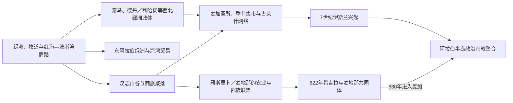

# 古代阿拉伯与伊斯兰圣地

## 时间

古代—18世纪初

## 概括

现代沙特阿拉伯疆域包括汉志、内志、哈萨、阿西尔、吉赞和北部沙漠边缘。古代不存在覆盖这些地区的单一“沙特前身国家”：西北绿洲连接南阿拉伯、黎凡特和地中海贸易，汉志城市依靠圣地、市场和区域商路，哈萨依靠绿洲农业和海湾交通，内志则由绿洲城镇、游牧群体和短期联盟构成。7世纪伊斯兰在麦加和麦地那兴起后，汉志获得跨区域宗教中心地位，但帝国政治中心先后转往大马士革、巴格达、开罗和伊斯坦布尔。

## 聚落网络与圣地形成图

图示交通、聚落与政治共同体的互动，不表示所有古代绿洲王国都线性演变为后来的沙特国家。古代族名、碑铭语言与后世部族谱系之间常有断裂，需避免直接认祖。

## 区域格局

| 区域 | 经济与社会基础 | 典型政治形态 | 长期特点 |
|---|---|---|---|
| 汉志 | 朝觐、市场、红海港口和区域商路 | 城市贵族、部落保护、总督与麦加谢里夫 | 宗教地位高，粮食与朝觐安全依赖跨区域网络。 |
| 内志 | 绿洲农业、畜牧、地方市场 | 城镇埃米尔、部落联盟和家族竞争 | 外部帝国常只有间接影响，统一政权较难持久。 |
| 哈萨与盖提夫 | 大型绿洲、珍珠和海湾航运 | 地方王朝、部落政权及奥斯曼行省 | 财税价值较高，受伊拉克、巴林和海上力量牵动。 |
| 西北阿拉伯 | 绿洲农业和南北商路 | 德丹、利哈扬、纳巴泰等绿洲王国 | 欧拉、泰马和黑格拉留下多语铭文与纪念建筑。 |
| 阿西尔与吉赞 | 山地农业、红海贸易和部落网络 | 地方首领、也门政权或名义宗主 | 与也门和红海世界联系常强于内志。 |

## 历史过程

### 古代绿洲、商路与区域王国

欧拉一带在公元前一千纪先后出现德丹和利哈扬政治中心；泰马曾与新巴比伦王拿波尼度斯的阿拉伯经营有关。公元前后，纳巴泰人控制黑格拉等西北商路节点，公元106年纳巴泰王国被罗马吞并后，黑格拉位于阿拉伯行省南缘。内志和东部留下大量古北阿拉伯文字及部落活动痕迹，但这些材料不能被简单拼成一条连续王朝史。

东部哈萨先后受更靠近伊拉克和海湾的政权影响。9—10世纪卡尔马特派以哈萨为中心建立强权，930年袭击麦加并夺走黑石，约二十年后归还；其后乌尤尼、乌斯福里、贾布里等地方家族更替。16世纪葡萄牙海上扩张和奥斯曼向海湾推进改变沿岸竞争，17世纪后巴尼哈立德在哈萨建立较强区域权力。

### 麦加、麦地那与伊斯兰兴起

6世纪末的麦加由古莱氏各支系分享圣地、市场和对外联系，叶斯里卜则有奥斯与海兹拉吉等阿拉伯群体及多个犹太社群。610年前后穆罕默德开始在麦加传教；622年迁往叶斯里卜，此后该城称麦地那。共同体通过盟约、结盟、战争和谈判扩大：624年白德尔之战、625年吴侯德之战、627年壕沟之战塑造了麦地那政权，628年侯代比亚条约扩大政治空间，630年麦加基本在较少抵抗下归附。632年穆罕默德去世后，里达战争重新整合半岛，随后的征服把帝国中心带离汉志。

### 哈里发时代的圣地治理

正统哈里发时期麦地那仍是政治中心，656年后内战和首都外移结束了这一状态。倭马亚时期，阿卜杜拉·本·祖拜尔以麦加为中心反对大马士革，麦加在683年和692年两度遭围攻；此后圣地主要由总督、地方精英和朝觐官员治理。阿拔斯王朝依靠伊拉克、叙利亚和埃及方向的朝觐道路、护送军和捐赠维持圣地，实际控制却随中央力量消长而变化。

约10世纪起，出身哈希姆家族的麦加谢里夫成为持续性的地方统治者。他们可以在阿拔斯、法蒂玛、阿尤布、马穆鲁克或奥斯曼宗主权之间调整，但其实际权力依赖本地家族、部落护路、港口收入和外来粮饷。麦地那也由哈希姆后裔地方家族治理，并受到不同帝国与教派网络竞争影响。

### 奥斯曼宗主权与地方自治

1517年奥斯曼取得埃及后，麦加谢里夫承认苏丹宗主权。奥斯曼以向圣地输送粮饷、修缮设施、组织叙利亚和埃及朝觐队伍及派驻有限军力维持合法性；谢里夫则处理地方政治、贝都因关系和朝觐秩序。宗主权不等于半岛全面直辖：汉志核心城镇与沿线要塞控制较强，内志大部和南部山地仍由地方力量支配。

哈萨在16世纪一度成为奥斯曼直辖的拉赫萨行省，17世纪后被巴尼哈立德夺取。内志各绿洲之间的竞争、长途商贸和部落保护关系不断重组，德拉伊耶的穆克林家族逐渐扩大地方基础，为18世纪沙特国家形成提供了政治空间。

## 统治与社会机制

- **圣地与帝国互赖**：外部帝国借保护两圣地取得伊斯兰合法性；圣地则依赖帝国补贴、粮食、道路和治安资源。
- **地方权力并未消失**：谢里夫、城镇家族、部落首领和宗教学者控制许多日常事务，外来总督必须同他们协商。
- **朝觐兼具宗教与财政功能**：住宿、运输、市场、捐赠和关税支持城市经济，但战乱、疫病或商路变化会立刻造成冲击。
- **区域发展不同步**：汉志的跨区域宗教网络、哈萨的海湾经济和内志的绿洲—部落政治不能被视作同一条线性国家史。
- **史料存在边界**：早期麦加贸易规模、个别部落谱系和古代地名对应仍有争议，应区分后世传统、铭文材料与可确证事件。

## 重要事件

| 时间 | 事件 | 过程与影响 |
|---|---|---|
| 公元前一千纪 | 德丹、利哈扬等绿洲政权发展 | 西北阿拉伯成为南北商路和文字文化节点。 |
| 公元前后 | 纳巴泰控制黑格拉 | 欧拉地区纳入以佩特拉为中心的贸易与政治网络。 |
| 106年 | 罗马吞并纳巴泰王国 | 黑格拉成为阿拉伯行省南缘据点，后来重要性下降。 |
| 610年前后 | 穆罕默德在麦加传教 | 对古莱氏宗教和社会秩序形成挑战。 |
| 622年 | 希吉拉 | 麦地那共同体建立，伊斯兰开始成为政治共同体。 |
| 624—627年 | 白德尔、吴侯德和壕沟之战 | 麦地那政权经受考验并逐步改变力量对比。 |
| 628年 | 侯代比亚条约 | 停战和联盟扩展为进入麦加创造条件。 |
| 630年 | 麦加归附 | 克尔白崇拜空间被纳入伊斯兰制度。 |
| 632—633年 | 里达战争 | 第一任哈里发重新控制半岛主要政治中心。 |
| 683、692年 | 麦加两次遭围攻 | 第二次内战结束后，汉志不再是帝国政治核心。 |
| 930年 | 卡尔马特派袭击麦加 | 朝觐中断并暴露圣地对外部安全网络的依赖。 |
| 10世纪以后 | 麦加谢里夫统治稳定化 | 哈希姆地方王朝在多重宗主权下延续。 |
| 1258—1517年 | 马穆鲁克主导汉志宗主权 | 埃及粮饷和朝觐路线成为圣地治理基础。 |
| 1517年 | 麦加谢里夫承认奥斯曼宗主权 | 奥斯曼取得两圣地保护者的重要合法性资源。 |
| 1670年代 | 巴尼哈立德控制哈萨 | 东部进入地方部落政权时期。 |
| 1727年 | 穆罕默德·本·沙特掌管德拉伊耶 | 内志出现可持续扩张的沙特政治中心。 |

## 演变关系

- 后续：[沙特国家、瓦哈比运动与统一](/%E4%BA%BA%E6%96%87%E7%A7%91%E5%AD%A6/%E5%8E%86%E5%8F%B2/%E8%A5%BF%E4%BA%9A/%E9%98%BF%E6%8B%89%E4%BC%AF%E5%8D%8A%E5%B2%9B/%E6%B2%99%E7%89%B9%E9%98%BF%E6%8B%89%E4%BC%AF/%E6%B2%99%E7%89%B9%E5%9B%BD%E5%AE%B6%E3%80%81%E7%93%A6%E5%93%88%E6%AF%94%E8%BF%90%E5%8A%A8%E4%B8%8E%E7%BB%9F%E4%B8%80.md)
- 跨区域背景：[伊斯兰兴起、哈里发与地方王朝](/%E4%BA%BA%E6%96%87%E7%A7%91%E5%AD%A6/%E5%8E%86%E5%8F%B2/%E8%A5%BF%E4%BA%9A/%E9%98%BF%E6%8B%89%E4%BC%AF%E5%8D%8A%E5%B2%9B/%E4%BC%8A%E6%96%AF%E5%85%B0%E5%85%B4%E8%B5%B7%E3%80%81%E5%93%88%E9%87%8C%E5%8F%91%E4%B8%8E%E5%9C%B0%E6%96%B9%E7%8E%8B%E6%9C%9D.md)；[阿拉伯帝国](/%E4%BA%BA%E6%96%87%E7%A7%91%E5%AD%A6/%E5%8E%86%E5%8F%B2/%E8%A5%BF%E4%BA%9A/_%E9%80%9A%E5%8F%B2/%E9%98%BF%E6%8B%89%E4%BC%AF%E5%B8%9D%E5%9B%BD/README.md)
- 上级：[沙特阿拉伯历史](/%E4%BA%BA%E6%96%87%E7%A7%91%E5%AD%A6/%E5%8E%86%E5%8F%B2/%E8%A5%BF%E4%BA%9A/%E9%98%BF%E6%8B%89%E4%BC%AF%E5%8D%8A%E5%B2%9B/%E6%B2%99%E7%89%B9%E9%98%BF%E6%8B%89%E4%BC%AF/README.md)
