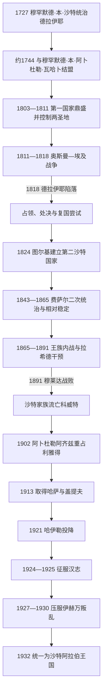

# 沙特国家、瓦哈比运动与统一

## 时间

1727／约1744—1932年

## 概括

沙特国家的形成不是一次完成的直线扩张，而是三次建国、两次覆亡和一次跨区域统一。1727年穆罕默德·本·沙特开始统治德拉伊耶，是今日沙特官方认定的第一国家建国起点；约1744年，他与宗教学者穆罕默德·本·阿卜杜勒·瓦哈卜结盟，才形成传统史学所说的沙特—瓦哈比政教联盟。第一国家扩张至哈萨和汉志后被奥斯曼—埃及军队摧毁；第二国家在利雅得恢复，却因王族内战、财政和地方联盟破裂而败于拉希德家族。阿卜杜勒阿齐兹1902年重占利雅得后，以军事联盟、外交承认、宗教动员和对既有行政体系的吸收完成第三次建国，1932年统一为王国。

“瓦哈比”主要是外部与学术文献中的称呼；运动自身常称“认主独一者”或强调萨拉菲取向。使用这一术语时，应区分18世纪宗教改革、国家制度化宗教传统和后世多样政治运动，不能把它们视作完全相同的现象。

## 政权演进

## 第一沙特国家

### 建立背景与崛起机制

18世纪初的内志缺少覆盖全区的中央权力，绿洲城镇之间经常竞争，贸易和农业又受治安与部落保护关系影响。穆罕默德·本·沙特在德拉伊耶整合本地家族、财政和军事资源；穆罕默德·本·阿卜杜勒·瓦哈卜则批评圣墓崇拜、求助圣徒等被其视为违背认主独一的实践。双方约1744年的联盟形成分工：沙特家族提供政治和军事保护，宗教学者提供教义、司法与动员合法性，二者家族联姻和后代合作使联盟制度化。

国家依靠绿洲税收、天课性质的征收、战利品、地方归附和部落军队扩张。归附既可能经谈判，也伴随围城、军事征服和对宗教实践的强制改造。1773年利雅得被纳入后，德拉伊耶控制内志核心；1790年代取得哈萨，获得农业、港口和东部财源；1803—1805年前后控制麦加和麦地那，进入鼎盛。

### 重要事件与鼎盛

- 1727年穆罕默德·本·沙特成为德拉伊耶统治者，强化城镇政治中心。
- 约1744年政教联盟建立，宗教改革与军事扩张开始相互支撑。
- 1773年利雅得归附，内志最大竞争中心之一被消除。
- 1790年代哈萨和盖提夫被征服，国家取得海湾方向的财政与战略出口。
- 1801—1802年沙特军队袭击卡尔巴拉，造成严重破坏并激化同奥斯曼及什叶派社群的冲突。
- 1803年麦加被占领，同年阿卜杜勒阿齐兹在德拉伊耶遇刺；其子沙特继位。
- 1804年前后麦地那被控制，奥斯曼苏丹保护圣地的权威受到直接挑战。
- 1811年埃及总督穆罕默德·阿里奉奥斯曼命令出兵，战场由汉志逐步推进内志。
- 1812—1813年埃及军队重占麦地那和麦加，沙特国家失去朝觐中心与西部补给。
- 1816年易卜拉欣帕夏接掌远征，利用炮兵、步兵、收买和沿线驻防推进。
- 1818年德拉伊耶长期围城后投降并被毁，末代伊玛目阿卜杜拉被押往伊斯坦布尔处决。

### 衰落与灭亡原因

| 层次 | 因素 | 作用 |
|---|---|---|
| 结构因素 | 疆域扩张快于常备军、运输和地方行政建设 | 远距离领地依赖地方归附，遇到持续反攻时容易松动。 |
| 合法性冲突 | 占领两圣地、限制部分既有宗教实践 | 把地方冲突升级为奥斯曼苏丹必须回应的帝国与宗教权威危机。 |
| 外部压力 | 埃及拥有红海运输、炮兵、训练步兵和较稳定补给 | 沙特以临时动员为主的军队难以应对逐城推进和长期围城。 |
| 直接触发 | 1816—1818年易卜拉欣帕夏深入内志并围攻德拉伊耶 | 首都陷落、统治者被俘和核心城镇被破坏使国家政权中断。 |

## 第二沙特国家

### 恢复与稳定阶段

第一国家覆亡后，埃及军队仍无法长期直接控制整个内志。米沙里·本·沙特1820年前后曾短暂恢复德拉伊耶，旋即被捕。图尔基·本·阿卜杜拉经过多次尝试，于1824年逐出利雅得的埃及支持者，以利雅得而非被毁的德拉伊耶为首都。第二国家继续由伊玛目、地方总督、宗教学者、城镇与部落联盟构成，但领土通常小于第一国家。

图尔基1834年被远亲米沙里·本·阿卜杜勒·拉赫曼刺杀，其子费萨尔迅速诛杀篡位者。1838年埃及再次入侵并把费萨尔押往开罗，扶植第一国家支系的哈立德·本·沙特。1840年欧洲列强迫使穆罕默德·阿里撤出叙利亚和阿拉伯腹地后，哈立德失去军力基础，被阿卜杜拉·本·苏奈扬取代。费萨尔1843年返回，在拉希德家族协助下重占利雅得。

费萨尔第二次统治至1865年，是第二国家最稳定阶段。他通过哈萨税收、地方任命、部落结盟和对奥斯曼名义宗主的务实承认维持统治，也介入巴林、卡塔尔和阿曼方向事务；但国家仍是个人化联盟，继承制度和常备官僚不足。

### 内战与终结

- 1865年费萨尔去世，长子阿卜杜拉继位，弟弟沙特以南部和东部支持者挑战。
- 1871—1875年利雅得多次易手；奥斯曼趁内乱重新占领哈萨，国家失去关键税源。
- 沙特1875年去世后，阿卜杜勒·拉赫曼与阿卜杜拉先后掌权，沙特诸子仍持续挑战。
- 哈伊勒的穆罕默德·本·阿卜杜拉·拉希德先以调停者和盟友身份介入，继而控制卡西姆与利雅得政治。
- 1887年沙特诸子夺取利雅得并囚禁阿卜杜拉，拉希德军队以“援救”为名进入，实际上设置总督。
- 1889年阿卜杜勒·拉赫曼再次掌权，但国家已难恢复原有地方联盟和军事优势。
- 1891年穆莱达战役中沙特一方败于拉希德军队，阿卜杜勒·拉赫曼最终流亡，家族后定居科威特。

| 层次 | 因素 | 作用 |
|---|---|---|
| 结构因素 | 权力依赖统治者个人、王子分区和地方效忠 | 费萨尔死后缺少被各支系共同接受的继承秩序。 |
| 财政因素 | 内战破坏征税并导致哈萨被奥斯曼重新占领 | 首都无法稳定供养军队和收买联盟。 |
| 外部与地区压力 | 拉希德家族控制哈伊勒商路并吸收卡西姆支持 | 对手拥有更整合的区域网络，可借调停不断扩大权力。 |
| 直接触发 | 穆莱达战败及利雅得失守 | 最后一位伊玛目失去内志立足点，第二国家终结。 |

## 第三沙特国家与统一

### 重返利雅得和内志竞争

阿卜杜勒阿齐兹在科威特流亡期间熟悉海湾外交和内志部落网络。1902年1月，他率小队突袭利雅得马斯马克堡，击败拉希德任命的总督阿吉兰，恢复家族政治中心。这次行动本身只取得一座城市，但象征合法性吸引旧盟友；其父阿卜杜勒·拉赫曼随后把家族领导权交给他。

1904—1906年，阿卜杜勒阿齐兹围绕卡西姆同拉希德家族和奥斯曼支援部队交战。布凯里耶战役未形成决定性结果，希纳纳和1906年拉达特穆罕纳战役则削弱拉希德力量。1913年沙特军队突袭哈萨，奥斯曼驻军撤走，国家获得海港、农税和后来石油资源所在的东部地区。

### 世界大战、伊赫万与地区征服

1915年《达林条约》使英国承认阿卜杜勒阿齐兹的地位并提供补贴、武器；同时他在英国保护体系中承担不与其他受英保护统治者冲突等义务。第一次世界大战期间他没有完全服从英国计划，而是在哈希姆家族、拉希德家族、奥斯曼和英国之间保持回旋。

从1910年代起，国家推动游牧群体在“希杰拉”定居点定居，形成被称作伊赫万的宗教军事力量。它增强了持续动员能力，却不是单纯由中央命令操控的正规军。1919年图拉巴战役重创汉志军队；1921年哈伊勒投降，拉希德政权终结，阿卜杜勒阿齐兹采用“内志苏丹”称号。

1924年谢里夫侯赛因与阿卜杜勒阿齐兹在朝觐、边境和地区领导权上的矛盾升级。沙特—伊赫万军队攻占塔伊夫，麦加随后被接收；1925年麦地那和吉达相继投降，哈希姆汉志王国终结。阿卜杜勒阿齐兹1926年称汉志国王，同时保留内志苏丹身份，1927年《吉达条约》使英国承认其领地完全独立。

### 伊赫万叛乱、行政整合与建国

统一战争结束后，伊赫万领导人要求继续袭击英国保护下的伊拉克、科威特和外约旦，反对电报、汽车等新技术及汉志较为多元的治理方式。阿卜杜勒阿齐兹必须遵守国际边界、保护朝觐并建立可征税的稳定国家，双方目标冲突。1927—1930年叛乱爆发，1929年萨比拉战役中中央军依靠机枪、车辆和英国边境压力击败主力，残余领导人随后投降。

阿卜杜勒阿齐兹没有把内志制度机械移植到所有地区。他在汉志保留并改造部委、协商会议、法院、海关和地方行政，以王子任省级长官，将朝觐收入、海关和各地税收逐步集中。阿西尔在1920—1922年经战争纳入，吉赞由伊德里西统治者先受保护、1930年转为直接管理。1932年9月23日，汉志与内志王国及其属地统一定名为沙特阿拉伯王国。

## 统一成功的机制与代价

- **历史合法性**：第一、第二国家的记忆和沙特—宗教学者联盟帮助阿卜杜勒阿齐兹重新聚集内志支持。
- **军事适应**：他同时使用小队突袭、部落动员、伊赫万定居军、机枪车辆和分区驻防，而非依赖单一兵种。
- **外交回旋**：英国承认和补贴重要，但统一不是英国直接制造；阿卜杜勒阿齐兹也限制英国要求，并利用奥斯曼及地区对手衰弱。
- **吸收差异**：汉志行政、哈萨财税和内志政治传统被组合进同一王权，避免统一后立即拆毁地方治理。
- **强制与暴力**：塔伊夫等地征服造成严重伤亡，宗教与政治整合压缩地方自主和宗教多样性；这些也是建国过程的一部分。
- **边界国家化**：压服伊赫万意味着王权从开放式部落征服转向承认固定国界、外交条约和中央垄断武力。

## 统治者世系

第一、第二、第三沙特国家的完整统治顺序、复位、篡位者、竞争统治者及阿卜杜勒阿齐兹历次称号，见[沙特统治者与国王世系表](/%E4%BA%BA%E6%96%87%E7%A7%91%E5%AD%A6/%E5%8E%86%E5%8F%B2/%E8%A5%BF%E4%BA%9A/%E9%98%BF%E6%8B%89%E4%BC%AF%E5%8D%8A%E5%B2%9B/%E6%B2%99%E7%89%B9%E9%98%BF%E6%8B%89%E4%BC%AF/%E6%B2%99%E7%89%B9%E7%BB%9F%E6%B2%BB%E8%80%85%E4%B8%8E%E5%9B%BD%E7%8E%8B%E4%B8%96%E7%B3%BB%E8%A1%A8.md)。

## 演变关系

- 前一阶段：[古代阿拉伯与伊斯兰圣地](/%E4%BA%BA%E6%96%87%E7%A7%91%E5%AD%A6/%E5%8E%86%E5%8F%B2/%E8%A5%BF%E4%BA%9A/%E9%98%BF%E6%8B%89%E4%BC%AF%E5%8D%8A%E5%B2%9B/%E6%B2%99%E7%89%B9%E9%98%BF%E6%8B%89%E4%BC%AF/%E5%8F%A4%E4%BB%A3%E9%98%BF%E6%8B%89%E4%BC%AF%E4%B8%8E%E4%BC%8A%E6%96%AF%E5%85%B0%E5%9C%A3%E5%9C%B0.md)
- 后一阶段：[石油时代与现代沙特阿拉伯](/%E4%BA%BA%E6%96%87%E7%A7%91%E5%AD%A6/%E5%8E%86%E5%8F%B2/%E8%A5%BF%E4%BA%9A/%E9%98%BF%E6%8B%89%E4%BC%AF%E5%8D%8A%E5%B2%9B/%E6%B2%99%E7%89%B9%E9%98%BF%E6%8B%89%E4%BC%AF/%E7%9F%B3%E6%B2%B9%E6%97%B6%E4%BB%A3%E4%B8%8E%E7%8E%B0%E4%BB%A3%E6%B2%99%E7%89%B9%E9%98%BF%E6%8B%89%E4%BC%AF.md)
- 奥斯曼—埃及背景：[奥斯曼帝国](/%E4%BA%BA%E6%96%87%E7%A7%91%E5%AD%A6/%E5%8E%86%E5%8F%B2/%E8%A5%BF%E4%BA%9A/%E5%9C%9F%E8%80%B3%E5%85%B6/%E5%A5%A5%E6%96%AF%E6%9B%BC%E5%B8%9D%E5%9B%BD/README.md)；[穆罕默德·阿里王朝](/%E4%BA%BA%E6%96%87%E7%A7%91%E5%AD%A6/%E5%8E%86%E5%8F%B2/%E5%8C%97%E9%9D%9E/%E5%9F%83%E5%8F%8A/%E7%A9%86%E7%BD%95%E9%BB%98%E5%BE%B7%C2%B7%E9%98%BF%E9%87%8C%E7%8E%8B%E6%9C%9D.md)
- 上级：[沙特阿拉伯历史](/%E4%BA%BA%E6%96%87%E7%A7%91%E5%AD%A6/%E5%8E%86%E5%8F%B2/%E8%A5%BF%E4%BA%9A/%E9%98%BF%E6%8B%89%E4%BC%AF%E5%8D%8A%E5%B2%9B/%E6%B2%99%E7%89%B9%E9%98%BF%E6%8B%89%E4%BC%AF/README.md)
