# 沙特统治者与国王世系表

## 范围与口径

本表覆盖第一、第二、第三沙特国家及1932年后的沙特阿拉伯王国。第一、第二国家统治者通常称“伊玛目”，这一称号兼有政治统治和宗教领导含义；20世纪阿卜杜勒阿齐兹依次使用埃米尔、苏丹和国王称号。

第二沙特国家内战时期存在多次复位、首都反复易手和名义权力与实际控制分离。本表先列官方和通行史学承认的统治者，再把短期篡位者、奥斯曼—埃及扶植者及沙特诸子控制利雅得的争议阶段列明，不用“后期诸王子”合并。

## 三次沙特国家与王位承接图

```mermaid
flowchart LR
    F1["第一沙特国家：穆罕默德·本·沙特"] --> E1["扩张至内志、汉志与东部"]
    E1 -->|1818年奥斯曼—埃及军摧毁德拉伊耶| EG["易卜拉欣帕夏军队"]
    EG --> F2["第二沙特国家：图尔基重建利雅得政权"]
    F2 --> FA["费萨尔两度在位"]
    FA --> CW["诸子内战与拉希德势力上升"]
    CW -->|1891年哈伊勒拉希德击败| R["第二国家终结"]
    R --> F3["1902年阿卜杜勒阿齐兹夺回利雅得"]
    F3 --> K32["1932年统一为沙特阿拉伯王国"]
    K32 --> S["沙特国王"]
    S --> F["费萨尔"]
    F --> K["哈立德"]
    K --> FH["法赫德"]
    FH --> A["阿卜杜拉"]
    A --> SA["萨勒曼"]
```

图只显示三次国家和王国主线；完整表另列所有正式统治者、争议阶段、阿卜杜勒阿齐兹称号变化、国王任期、首相序列与当前实际权力结构。

## 第一沙特国家统治者

| 顺序 | 统治者 | 称号与在位 | 与前任关系 | 关键事件与结局 |
|---:|---|---|---|---|
| 1 | **穆罕默德·本·沙特·本·穆罕默德·本·穆克林** | 德拉伊耶埃米尔、第一国家伊玛目；1727—1765年 | 建国者 | 1727年掌管德拉伊耶；约1744年同穆罕默德·本·阿卜杜勒·瓦哈卜结盟；奠定扩张和政教合作制度。 |
| 2 | **阿卜杜勒阿齐兹·本·穆罕默德·本·沙特** | 伊玛目；1765—1803年 | 前任之子 | 取得利雅得、内志大部和哈萨；1803年在德拉伊耶遇刺。 |
| 3 | **沙特·本·阿卜杜勒阿齐兹**（沙特大帝） | 伊玛目；1803—1814年 | 前任之子 | 控制麦加、麦地那并使国家达到最大范围；在奥斯曼—埃及反攻初期去世。 |
| 4 | **阿卜杜拉·本·沙特** | 伊玛目；1814—1818年 | 前任之子 | 抵抗易卜拉欣帕夏；1818年德拉伊耶投降后被押往伊斯坦布尔处决，第一国家终结。 |

### 1818—1824年的复国尝试

| 人物 | 时间与地位 | 继承关系 | 说明 |
|---|---|---|---|
| 米沙里·本·沙特 | 1819／1820年前后短暂恢复德拉伊耶；通常不列为第二国家伊玛目 | 第一国家末代统治者阿卜杜拉之兄弟 | 利用埃及军撤离后的权力真空复国，数月后被捕并处死。 |
| 图尔基·本·阿卜杜拉 | 1821—1823年多次活动，1824年建立稳定政权 | 第一国家创建者穆罕默德·本·沙特之孙 | 早期尝试曾受挫；1824年控制利雅得被视为第二国家正式起点。 |

## 第二沙特国家统治者与争议阶段

| 顺序 | 统治者或实际控制者 | 在位／控制时间 | 身份与继承关系 | 关键事件与争议说明 |
|---:|---|---|---|---|
| 1 | **图尔基·本·阿卜杜拉** | 1824—1834年 | 创建者；穆罕默德·本·沙特之孙 | 逐出奥斯曼—埃及支持力量，以利雅得为首都；1834年遭远亲米沙里指使刺杀。 |
| 争议 | 米沙里·本·阿卜杜勒·拉赫曼 | 1834年，约数周 | 旁支远亲、篡位者 | 刺杀图尔基后占据利雅得，旋被费萨尔围困和处死；不列入官方伊玛目序列。 |
| 2 | **费萨尔·本·图尔基**（第一次） | 1834—1838年 | 图尔基之子 | 平定篡位；1838年被埃及远征军俘获并押往开罗。 |
| 竞争 | 哈立德·本·沙特 | 1838—1841年 | 第一国家沙特大帝之子，奥斯曼—埃及扶植者 | 依靠埃及驻军统治利雅得；1840年埃及撤军后失去基础，通常不列入第二国家官方四伊玛目世系。 |
| 竞争 | 阿卜杜拉·本·苏奈扬 | 1841—1843年 | 沙特家族苏奈扬旁支 | 推翻哈立德并控制利雅得；费萨尔返回后被击败并死于拘押期间。 |
| 2 | **费萨尔·本·图尔基**（第二次） | 1843—1865年 | 复位 | 重建内志和哈萨统治，是第二国家最稳定阶段；指定长子阿卜杜拉为继承人，但分封诸子留下内战条件。 |
| 3 | **阿卜杜拉·本·费萨尔**（第一次） | 1865—1871年 | 费萨尔长子 | 继承获宗教学者支持；遭弟弟沙特挑战，内战导致地方联盟分裂。 |
| 4 | **沙特·本·费萨尔**（第一次） | 1871年 | 前任之弟 | 依靠南部部落和东部支持占据利雅得；同年失去首都。 |
| 3 | **阿卜杜拉·本·费萨尔**（第二次） | 1871—1873年 | 复位 | 借外部和地方支持回到利雅得；奥斯曼趁内乱控制哈萨。 |
| 4 | **沙特·本·费萨尔**（第二次） | 1873—1875年 | 再次夺位 | 再据利雅得，1875年去世；官方资料常把两次统治合并为1871—1875年。 |
| 5 | **阿卜杜勒·拉赫曼·本·费萨尔**（第一次） | 1875—1876年 | 费萨尔幼子，沙特与阿卜杜拉之弟 | 沙特死后掌权，因家族妥协把位置让还阿卜杜拉。 |
| 3 | **阿卜杜拉·本·费萨尔**（第三次） | 1876—1887年实际执政；名义至1889年去世 | 再次复位 | 权力不断受拉希德家族和侄辈挑战；1887年被沙特诸子囚禁，后由拉希德势力控制。 |
| 争议 | 穆罕默德·本·沙特·本·费萨尔等“沙特诸子” | 1887年短期控制利雅得 | 已故伊玛目沙特诸子 | 俘虏叔父阿卜杜拉；没有形成被普遍承认的独立伊玛目序列，拉希德军进入后部分人被杀或失势。 |
| 实控 | 穆罕默德·本·阿卜杜拉·拉希德及其总督 | 1887—1889年前后 | 哈伊勒拉希德统治者，非沙特家族 | 以干预内战为名进入利雅得并设置总督；显示第二国家此时已失去独立实控。 |
| 5 | **阿卜杜勒·拉赫曼·本·费萨尔**（第二次） | 1889—1891年 | 复位；阿卜杜拉死后成为家族首领 | 重新争夺利雅得和卡西姆；1891年穆莱达战败后流亡，是第二国家末代伊玛目。 |

> 第二国家后期的“在位”常只表示对利雅得或沙特家族的名义领导，不能等同于对内志全境的持续控制。

## 第三沙特国家：阿卜杜勒阿齐兹的称号演变

| 顺序 | 统治者 | 政体与称号 | 时间 | 政治变化 |
|---:|---|---|---|---|
| 1 | **阿卜杜勒阿齐兹·本·阿卜杜勒·拉赫曼·阿勒沙特**（伊本·沙特） | 利雅得／内志埃米尔 | 1902—1913年 | 重占利雅得，逐步击败拉希德家族并控制卡西姆。 |
| 1 | 同上 | 内志与哈萨埃米尔 | 1913—1921年 | 取得哈萨、盖提夫和海湾出口；同英国订立《达林条约》。 |
| 1 | 同上 | 内志苏丹及属地统治者 | 1921—1926年 | 哈伊勒投降、拉希德政权终结；开始征服汉志。 |
| 1 | 同上 | 汉志国王兼内志苏丹 | 1926—1927年 | 同时治理制度差异明显的汉志和内志。 |
| 1 | 同上 | 汉志与内志国王及属地统治者 | 1927—1932年 | 英国承认完全独立；压服伊赫万叛乱并推进行政整合。 |
| 1 | 同上 | 沙特阿拉伯国王 | 1932—1953年 | 统一国名，成为现代王国首任国王。 |

## 沙特阿拉伯王国国王世系

截至2026年7月13日，七位国王均为建国者阿卜杜勒阿齐兹之子；王位传递主要发生在兄弟之间，而不是简单父子长子继承。

| 顺序 | 国王 | 在位时间 | 与前任关系 | 王室与称号 | 关键事件与结局 |
|---:|---|---|---|---|---|
| 1 | **阿卜杜勒阿齐兹** | 1932—1953年 | 建国者 | 沙特家族；王国首任国王 | 完成行政整合、签订石油特许权、建立财政和部委雏形；1953年去世。 |
| 2 | 沙特·本·阿卜杜勒阿齐兹 | 1953—1964年 | 前任之子 | 沙特家族；国王 | 扩建国家机构和基础设施，但财政危机及同王储费萨尔的权力斗争加剧；1964年经王族和宗教学者推动被废黜。 |
| 3 | **费萨尔·本·阿卜杜勒阿齐兹** | 1964—1975年 | 前任异母弟 | 沙特家族；国王、首相 | 财政整顿、教育和行政改革、参与1973年石油禁运；1975年被侄子刺杀。 |
| 4 | 哈立德·本·阿卜杜勒阿齐兹 | 1975—1982年 | 前任异母弟 | 沙特家族；国王、首相 | 石油繁荣和大规模建设；处理1979年麦加禁寺事件及地区革命冲击；任内去世。 |
| 5 | 法赫德·本·阿卜杜勒阿齐兹 | 1982—2005年 | 前任异母弟 | 沙特家族；1986年起采用“两圣地监护人”称号 | 海湾战争、1992年《基本法》和制度建设；1995年中风后王储阿卜杜拉承担多数日常国务。 |
| 6 | 阿卜杜拉·本·阿卜杜勒阿齐兹 | 2005—2015年 | 前任异母弟 | 沙特家族；国王、首相 | 此前自1995年起为实际摄政；推动教育、有限政治参与和经济改革，2006年设效忠委员会；任内去世。 |
| 7 | 萨勒曼·本·阿卜杜勒阿齐兹 | 2015年至今 | 前任异母弟 | 沙特家族；国王、两圣地监护人 | 重组最高委员会、启动2030愿景；2017年立穆罕默德·本·萨勒曼为王储，2022年任命其为首相。 |

## 王国首相序列

首相职位1953年设立。1964—2022年长期由国王兼任；2022年起，国王萨勒曼仍为国家元首和最终法定权威，王储穆罕默德·本·萨勒曼以首相身份成为正式政府首脑。

| 顺序 | 首相 | 任期 | 同期国王 | 权力结构说明 |
|---:|---|---|---|---|
| 1 | 沙特·本·阿卜杜勒阿齐兹 | 1953年10月9日—1954年8月16日 | 沙特 | 首任首相；随后把政府领导交给王储费萨尔。 |
| 2 | 费萨尔·本·阿卜杜勒阿齐兹 | 1954年8月16日—1960年12月21日 | 沙特 | 以王储兼首相整顿财政和行政，因同国王冲突辞职。 |
| 3 | 沙特·本·阿卜杜勒阿齐兹 | 1960年12月21日—1962年10月31日 | 沙特 | 国王重新兼任首相，财政和权力危机仍未解决。 |
| 4 | 费萨尔·本·阿卜杜勒阿齐兹 | 1962年10月31日—1975年3月25日 | 沙特；1964年后本人 | 再任首相并在1964年即位，王位与政府首脑合一。 |
| 5 | 哈立德·本·阿卜杜勒阿齐兹 | 1975年3月25日—1982年6月13日 | 本人 | 国王兼首相，王储法赫德承担大量行政协调。 |
| 6 | 法赫德·本·阿卜杜勒阿齐兹 | 1982年6月13日—2005年8月1日 | 本人 | 国王兼首相；1995年后王储阿卜杜拉主持多数日常国务。 |
| 7 | 阿卜杜拉·本·阿卜杜勒阿齐兹 | 2005年8月1日—2015年1月23日 | 本人 | 国王兼首相。 |
| 8 | 萨勒曼·本·阿卜杜勒阿齐兹 | 2015年1月23日—2022年9月27日 | 本人 | 国王兼首相；王储穆罕默德·本·萨勒曼逐步主持经济、安全和国防事务。 |
| 9 | **穆罕默德·本·萨勒曼** | 2022年9月27日至今 | 萨勒曼 | 王储兼首相，首位出任首相的建国者之孙；国王出席内阁会议时仍可主持会议并保留最终批准权。 |

## 当前王位与实际权力结构

| 层级 | 人物或机构 | 截至2026年7月13日的地位 |
|---|---|---|
| 国家元首 | 国王萨勒曼 | 2015年即位；发布王令、任免高级官员，内阁决定最终须获国王认可，是各国家权力的最高法定参照。 |
| 王位继承 | 王储穆罕默德·本·萨勒曼 | 2017年成为王储，是王位第一继承人。 |
| 政府首脑 | 首相穆罕默德·本·萨勒曼 | 2022年出任首相，主持日常行政和跨部门执行。 |
| 战略与资源配置 | 王储主持的经济与发展事务委员会、政治与安全事务委员会及公共投资基金 | 将经济转型、财政投资、安全和大型项目汇集到王储领导的机构，构成实际决策执行核心。 |
| 咨询与宗教合法性 | 王室成员、效忠委员会、高级宗教学者和协商会议 | 仍承担继承、宗教解释、法规审议与社会协调功能，但最终决定权不属于民选议会。 |

## 相关笔记

- 建国过程：[沙特国家、瓦哈比运动与统一](/%E4%BA%BA%E6%96%87%E7%A7%91%E5%AD%A6/%E5%8E%86%E5%8F%B2/%E8%A5%BF%E4%BA%9A/%E9%98%BF%E6%8B%89%E4%BC%AF%E5%8D%8A%E5%B2%9B/%E6%B2%99%E7%89%B9%E9%98%BF%E6%8B%89%E4%BC%AF/%E6%B2%99%E7%89%B9%E5%9B%BD%E5%AE%B6%E3%80%81%E7%93%A6%E5%93%88%E6%AF%94%E8%BF%90%E5%8A%A8%E4%B8%8E%E7%BB%9F%E4%B8%80.md)
- 王国阶段：[石油时代与现代沙特阿拉伯](/%E4%BA%BA%E6%96%87%E7%A7%91%E5%AD%A6/%E5%8E%86%E5%8F%B2/%E8%A5%BF%E4%BA%9A/%E9%98%BF%E6%8B%89%E4%BC%AF%E5%8D%8A%E5%B2%9B/%E6%B2%99%E7%89%B9%E9%98%BF%E6%8B%89%E4%BC%AF/%E7%9F%B3%E6%B2%B9%E6%97%B6%E4%BB%A3%E4%B8%8E%E7%8E%B0%E4%BB%A3%E6%B2%99%E7%89%B9%E9%98%BF%E6%8B%89%E4%BC%AF.md)
- 总览：[沙特阿拉伯历史](/%E4%BA%BA%E6%96%87%E7%A7%91%E5%AD%A6/%E5%8E%86%E5%8F%B2/%E8%A5%BF%E4%BA%9A/%E9%98%BF%E6%8B%89%E4%BC%AF%E5%8D%8A%E5%B2%9B/%E6%B2%99%E7%89%B9%E9%98%BF%E6%8B%89%E4%BC%AF/README.md)
