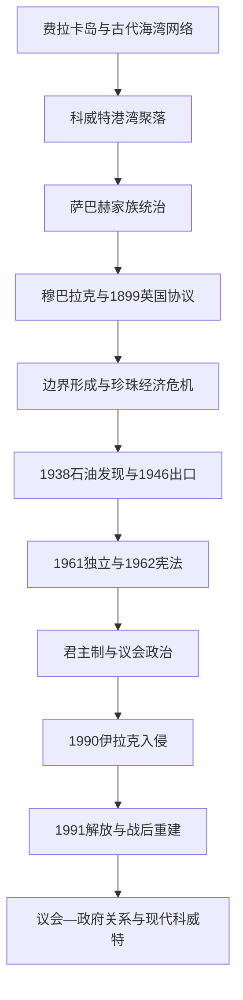

# 科威特历史

## 概括

科威特位于波斯湾西北端，靠近两河流域出海口和阿拉伯内陆商路。费拉卡岛保存古代海湾贸易遗迹，现代科威特城则在17-18世纪发展为港湾聚落。乌图布群体迁入后，萨巴赫家族被推举承担政治与外交事务。1899年英国协议、1938年石油发现、1961年独立和1962年宪法塑造现代国家；1990年伊拉克入侵及次年解放则成为决定性转折。

## 历史主线

## 历史主线概括

科威特的地位来自港口、商队和海湾航运，而非广阔农业腹地。萨巴赫家族与商人精英长期形成协商关系，英国保护则限制对外事务但保留内部自治。石油收入建立福利国家，宪法和民选国民议会又使科威特拥有海湾君主国中较活跃的议会传统，但王室任命政府、议会质询和反复解散之间持续存在张力。

## 阶段导航

| 顺序 | 阶段 | 时间 | 入口 | 简要概括 |
|---:|---|---|---|---|
| 1 | 港湾聚落、巴尼哈立德与萨巴赫家族 | 古代-1896年 | [港湾聚落、巴尼哈立德与萨巴赫家族](/%E4%BA%BA%E6%96%87%E7%A7%91%E5%AD%A6/%E5%8E%86%E5%8F%B2/%E8%A5%BF%E4%BA%9A/%E9%98%BF%E6%8B%89%E4%BC%AF%E5%8D%8A%E5%B2%9B/%E7%A7%91%E5%A8%81%E7%89%B9/%E6%B8%AF%E6%B9%BE%E8%81%9A%E8%90%BD%E3%80%81%E5%B7%B4%E5%B0%BC%E5%93%88%E7%AB%8B%E5%BE%B7%E4%B8%8E%E8%90%A8%E5%B7%B4%E8%B5%AB%E5%AE%B6%E6%97%8F.md) | 费拉卡、乌图布迁入、港口社会和早期萨巴赫统治。 |
| 2 | 英国保护、石油发现与独立 | 1896-1961年 | [英国保护、石油发现与独立](/%E4%BA%BA%E6%96%87%E7%A7%91%E5%AD%A6/%E5%8E%86%E5%8F%B2/%E8%A5%BF%E4%BA%9A/%E9%98%BF%E6%8B%89%E4%BC%AF%E5%8D%8A%E5%B2%9B/%E7%A7%91%E5%A8%81%E7%89%B9/%E8%8B%B1%E5%9B%BD%E4%BF%9D%E6%8A%A4%E3%80%81%E7%9F%B3%E6%B2%B9%E5%8F%91%E7%8E%B0%E4%B8%8E%E7%8B%AC%E7%AB%8B.md) | 穆巴拉克、英国协议、边界形成、珍珠衰退和石油出口。 |
| 3 | 议会政治、海湾战争与现代科威特 | 1961年至今 | [议会政治、海湾战争与现代科威特](/%E4%BA%BA%E6%96%87%E7%A7%91%E5%AD%A6/%E5%8E%86%E5%8F%B2/%E8%A5%BF%E4%BA%9A/%E9%98%BF%E6%8B%89%E4%BC%AF%E5%8D%8A%E5%B2%9B/%E7%A7%91%E5%A8%81%E7%89%B9/%E8%AE%AE%E4%BC%9A%E6%94%BF%E6%B2%BB%E3%80%81%E6%B5%B7%E6%B9%BE%E6%88%98%E4%BA%89%E4%B8%8E%E7%8E%B0%E4%BB%A3%E7%A7%91%E5%A8%81%E7%89%B9.md) | 独立宪政、1990年入侵、解放、重建和政治反复。 |

## 重要转折与时间节点

| 时间 | 事件 | 意义 |
|---|---|---|
| 17-18世纪 | 科威特城聚落形成 | 港口、造船、珍珠和商队贸易逐步发展。 |
| 18世纪中叶 | 萨巴赫家族取得领导地位 | 王朝与商人协商式政治开始形成。 |
| 1896年 | 穆巴拉克掌权 | 对外安全和英国关系进入新阶段。 |
| 1899年 | 与英国签订秘密协议 | 统治者承诺未经英国同意不处理对外领土和外交事项。 |
| 1920年 | 杰赫拉战役 | 科威特抵御来自内陆的伊赫万力量。 |
| 1922年 | 欧凯尔会议划定边界 | 科威特与内志、伊拉克间现代边界格局形成。 |
| 1938年 | 发现石油 | 珍珠经济之后出现新财政基础。 |
| 1946年 | 首批原油出口 | 石油福利国家建设启动。 |
| 1961年 | 科威特独立 | 英国保护关系结束。 |
| 1962年 | 宪法颁布 | 埃米尔、政府与民选国民议会的制度关系确立。 |
| 1990-1991年 | 伊拉克入侵与多国部队解放科威特 | 国家主权、安全体系和社会记忆被重塑。 |
| 2005年 | 女性获得完整政治权利 | 选举和公职参与范围扩大。 |

## 相关主线

- 区域背景：[阿拉伯半岛历史](/%E4%BA%BA%E6%96%87%E7%A7%91%E5%AD%A6/%E5%8E%86%E5%8F%B2/%E8%A5%BF%E4%BA%9A/%E9%98%BF%E6%8B%89%E4%BC%AF%E5%8D%8A%E5%B2%9B/README.md)。
- 伊拉克古代背景可参见[两河流域文明](/%E4%BA%BA%E6%96%87%E7%A7%91%E5%AD%A6/%E5%8E%86%E5%8F%B2/%E8%A5%BF%E4%BA%9A/%E4%B8%A4%E6%B2%B3%E6%B5%81%E5%9F%9F/README.md)。

## 目录层级

- 直接上级：[阿拉伯半岛](/%E4%BA%BA%E6%96%87%E7%A7%91%E5%AD%A6/%E5%8E%86%E5%8F%B2/%E8%A5%BF%E4%BA%9A/%E9%98%BF%E6%8B%89%E4%BC%AF%E5%8D%8A%E5%B2%9B/README.md)
- 宏观区域：[西亚](/%E4%BA%BA%E6%96%87%E7%A7%91%E5%AD%A6/%E5%8E%86%E5%8F%B2/%E8%A5%BF%E4%BA%9A/README.md)
- 历史总览：[历史](/%E4%BA%BA%E6%96%87%E7%A7%91%E5%AD%A6/%E5%8E%86%E5%8F%B2/README.md)
