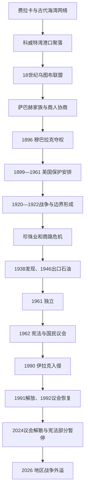

# 科威特历史

## 概括

科威特位于波斯湾西北端、两河出海口与阿拉伯内陆商路交汇处。费拉卡岛从迪尔蒙、希腊化“伊卡洛斯”到伊斯兰时期反复成为航路节点；现代科威特城则由17—18世纪港湾聚落、乌图布联盟和商人航运网络发展而来。萨巴赫家族负责防务与外交，商人承担税收和贸易融资，双方协商构成早期政治基础。1896年穆巴拉克以政变掌权，1899年同英国订立排他协议；1920年代边界和沙特封锁压缩旧商路，珍珠崩溃又重创经济。1938年布尔甘发现石油、1946年出口后，国家建立福利、主权投资和官僚体系。1961年独立与1962年宪法形成活跃议会传统，1990年伊拉克入侵则重塑安全依赖。2024年议会被解散、部分宪法条文暂停，宪政进入新的中止期。

## 历史主线

## 历史主线概括

科威特的前石油优势来自避风港、造船、远洋贸易和连接巴士拉的商队，并非农业腹地。统治者需要商人提供关税和贷款，商人需要萨巴赫维持治安与部落外交，因而形成比单纯征服王朝更强的协商传统。穆巴拉克为保住政变所得王位引入英国，外部保护避免被奥斯曼和邻国吞并，也使边界由帝国谈判而非游牧实际活动划定。石油把财政从商人税收转向王室—国家租金，宪法又把旧协商关系制度化为民选议会。议会问责提升公开竞争，却同王室任命政府和资源分配反复冲突；2024年的制度暂停表明这一平衡尚未稳定。

## 阶段导航

| 顺序 | 阶段 | 时间 | 简要概括 |
|---:|---|---|---|
| 1 | [港湾聚落、巴尼哈立德与萨巴赫家族](/%E4%BA%BA%E6%96%87%E7%A7%91%E5%AD%A6/%E5%8E%86%E5%8F%B2/%E8%A5%BF%E4%BA%9A/%E9%98%BF%E6%8B%89%E4%BC%AF%E5%8D%8A%E5%B2%9B/%E7%A7%91%E5%A8%81%E7%89%B9/%E6%B8%AF%E6%B9%BE%E8%81%9A%E8%90%BD%E3%80%81%E5%B7%B4%E5%B0%BC%E5%93%88%E7%AB%8B%E5%BE%B7%E4%B8%8E%E8%90%A8%E5%B7%B4%E8%B5%AB%E5%AE%B6%E6%97%8F.md) | 古代—1896年 | 费拉卡古代网络、乌图布迁入、港口社会和前六位萨巴赫统治者。 |
| 2 | [英国保护、石油发现与独立](/%E4%BA%BA%E6%96%87%E7%A7%91%E5%AD%A6/%E5%8E%86%E5%8F%B2/%E8%A5%BF%E4%BA%9A/%E9%98%BF%E6%8B%89%E4%BC%AF%E5%8D%8A%E5%B2%9B/%E7%A7%91%E5%A8%81%E7%89%B9/%E8%8B%B1%E5%9B%BD%E4%BF%9D%E6%8A%A4%E3%80%81%E7%9F%B3%E6%B2%B9%E5%8F%91%E7%8E%B0%E4%B8%8E%E7%8B%AC%E7%AB%8B.md) | 1896—1961年 | 政变、英国排他协议、边界战争、珍珠危机、油田和独立。 |
| 3 | [议会政治、海湾战争与现代科威特](/%E4%BA%BA%E6%96%87%E7%A7%91%E5%AD%A6/%E5%8E%86%E5%8F%B2/%E8%A5%BF%E4%BA%9A/%E9%98%BF%E6%8B%89%E4%BC%AF%E5%8D%8A%E5%B2%9B/%E7%A7%91%E5%A8%81%E7%89%B9/%E8%AE%AE%E4%BC%9A%E6%94%BF%E6%B2%BB%E3%80%81%E6%B5%B7%E6%B9%BE%E6%88%98%E4%BA%89%E4%B8%8E%E7%8E%B0%E4%BB%A3%E7%A7%91%E5%A8%81%E7%89%B9.md) | 1961年至今 | 独立宪政、伊拉克占领与复国、议会反复及2024年中止。 |
| 专表 | [萨巴赫统治者与首相表](/%E4%BA%BA%E6%96%87%E7%A7%91%E5%AD%A6/%E5%8E%86%E5%8F%B2/%E8%A5%BF%E4%BA%9A/%E9%98%BF%E6%8B%89%E4%BC%AF%E5%8D%8A%E5%B2%9B/%E7%A7%91%E5%A8%81%E7%89%B9/%E8%90%A8%E5%B7%B4%E8%B5%AB%E7%BB%9F%E6%B2%BB%E8%80%85%E4%B8%8E%E9%A6%96%E7%9B%B8%E8%A1%A8.md) | 1718／约1752年至今 | 官方17位统治者序列、建立年代争议和11位政府首脑。 |

## 重要转折与时间节点

| 时间 | 转折 | 历史意义 |
|---|---|---|
| 前3—前2千纪 | 费拉卡参与迪尔蒙网络 | 两河、东阿拉伯和海湾航运在科威特地区汇合。 |
| 18世纪前半至中叶 | 乌图布定居、萨巴赫获推举 | 现代港城和统治家族形成；具体起始为1718或约1752存在口径差异。 |
| 1775—1779年 | 波斯占领巴士拉 | 部分航运和英国贸易转移科威特，港口地位上升。 |
| 1896、1899年 | 穆巴拉克夺权、英科协议 | 王朝安全同英国保护绑定，对外自主受限。 |
| 1920—1922年 | 杰赫拉战役与欧凯尔划界 | 伊赫万威胁被遏制，现代边界和中立区形成。 |
| 1938、1946年 | 布尔甘发现石油、首次出口 | 旧贸易危机后出现福利国家财政。 |
| 1961—1963年 | 独立、宪法、首届议会 | 确立埃米尔、内阁与民选国民议会的权力结构。 |
| 1990—1991年 | 伊拉克入侵、占领与多国解放 | 国家主权、人口政治和美国安全关系被重塑。 |
| 2005年 | 女性获得完整政治权利 | 选举与公职资格扩大。 |
| 2024年5月 | 解散议会、暂停部分宪法条文 | 埃米尔和内阁暂代议会权力，期限不超过四年。 |
| 2026年 | 伊朗攻击机场、港口、炼油等设施 | 外部安全依赖和关键基础设施风险再次成为国家核心议题。 |

## 相关主线

- 区域背景：[阿拉伯半岛历史](/%E4%BA%BA%E6%96%87%E7%A7%91%E5%AD%A6/%E5%8E%86%E5%8F%B2/%E8%A5%BF%E4%BA%9A/%E9%98%BF%E6%8B%89%E4%BC%AF%E5%8D%8A%E5%B2%9B/README.md)。
- 两河与伊拉克背景：[两河流域文明](/%E4%BA%BA%E6%96%87%E7%A7%91%E5%AD%A6/%E5%8E%86%E5%8F%B2/%E8%A5%BF%E4%BA%9A/%E4%B8%A4%E6%B2%B3%E6%B5%81%E5%9F%9F/README.md)。
- 统治者入口：[萨巴赫统治者与首相表](/%E4%BA%BA%E6%96%87%E7%A7%91%E5%AD%A6/%E5%8E%86%E5%8F%B2/%E8%A5%BF%E4%BA%9A/%E9%98%BF%E6%8B%89%E4%BC%AF%E5%8D%8A%E5%B2%9B/%E7%A7%91%E5%A8%81%E7%89%B9/%E8%90%A8%E5%B7%B4%E8%B5%AB%E7%BB%9F%E6%B2%BB%E8%80%85%E4%B8%8E%E9%A6%96%E7%9B%B8%E8%A1%A8.md)。

## 目录层级

- 直接上级：[阿拉伯半岛](/%E4%BA%BA%E6%96%87%E7%A7%91%E5%AD%A6/%E5%8E%86%E5%8F%B2/%E8%A5%BF%E4%BA%9A/%E9%98%BF%E6%8B%89%E4%BC%AF%E5%8D%8A%E5%B2%9B/README.md)
- 宏观区域：[西亚](/%E4%BA%BA%E6%96%87%E7%A7%91%E5%AD%A6/%E5%8E%86%E5%8F%B2/%E8%A5%BF%E4%BA%9A/README.md)
- 历史总览：[历史](/%E4%BA%BA%E6%96%87%E7%A7%91%E5%AD%A6/%E5%8E%86%E5%8F%B2/README.md)