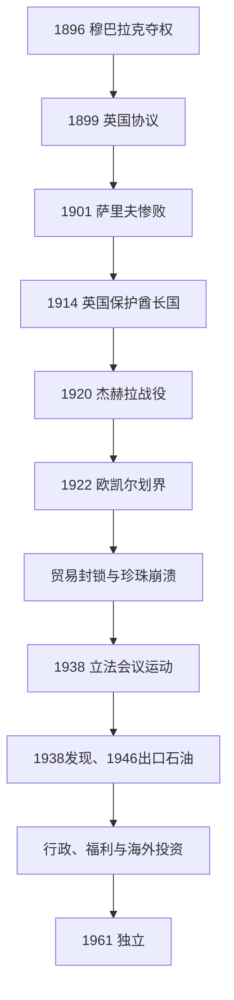

# 英国保护、石油发现与独立

## 时间

1896—1961年

## 概括

穆巴拉克1896年以杀兄夺权，面对奥斯曼追责、拉希德王朝和家族对手，遂在1899年同英国签署秘密协议。英国并未立即把科威特并入殖民行政，却控制其对外关系和领土处分。穆巴拉克试图借保护扩张内陆影响，1901年萨里夫惨败显示能力上限。第一次世界大战后，英国把科威特视为独立酋长国，但1920年伊赫万进攻、1922年欧凯尔划界和沙特贸易封锁压缩腹地。珍珠与转口贸易在1930年代崩溃，1938年石油发现因战争延后至1946年出口。阿卜杜拉·萨利姆以石油收入建设行政并同商人协商宪政，1961年结束英国安排。

## 分阶段发展

### 穆巴拉克、英国协议与地区战争（1896—1915年）

- 穆巴拉克杀死统治者穆罕默德和贾拉赫后，奥斯曼拒绝立即承认，遇害者家属也可借拉希德等势力反攻。他一面接受奥斯曼头衔，一面秘密寻求英国保护。
- 1899年协议规定未经英国同意不得接纳外国代理、让渡领土或同第三国缔约；英国给津贴和政治支持。科威特内部税收、司法和继承仍由萨巴赫掌握，故是保护安排而非直接殖民。
- 穆巴拉克支持伊本·沙特反攻内志，也联合部落对抗拉希德。1901年萨里夫战役中联军惨败，证明科威特无法凭港口财富建立内陆霸权。
- 1902年伊本·沙特夺回利雅得，早期同科威特互相依赖；其后沙特国家壮大，反而成为科威特边界和贸易的最大陆上压力。
- 1913年英奥协定拟划“红圈”内科威特核心与较宽自治区，承认奥斯曼名义宗主；协议因第一次世界大战未获批准。英国1914年把科威特宣布为受其保护的独立酋长国。

### 边界形成、商贸危机与议会运动（1915—1938年）

- 贾比尔二世、萨利姆相继统治。萨利姆时期同伊赫万冲突加剧，1920年科威特军先在哈姆德受挫，随后于杰赫拉红堡抵御进攻，在英国空海支援和谈判下停战。
- 1921年萨利姆去世后，商人要求协商继承并短暂组成咨询会议，最终选择艾哈迈德·贾比尔。此事显示统治家族仍需城市精英认可。
- 1922年英国高级专员珀西·考克斯在欧凯尔会议代表科威特划界，科威特未能平等参与。大片部落活动区划给内志，并设科沙中立区；1923年英国又确定同伊拉克的边界。
- 伊本·沙特对科威特实施长期贸易限制，巴士拉港与现代轮船竞争削弱转口，世界大战后的区域边界也切断传统商队流动。
- 养殖珍珠、大萧条和债务链断裂令潜水、造船与商人信用在1920年代末至1930年代崩溃，政府关税收入下降，城市陷入失业和贫困。
- 1938年商人和知识分子组成民选立法会议，要求监督财政、石油特许和行政。统治者先接受后解散议会，1939年冲突中出现逮捕和死伤，石油时代前的权力分享未能制度化。

### 石油国家与独立（1934—1961年）

- 1934年英美资本合组的科威特石油公司取得特许，1938年发现巨型布尔甘油田。第二次世界大战使设备和市场中断，商业出口延至1946年。
- 石油收入由统治者控制，却也通过学校、医院、道路、住房和政府职位重新分配。1950年阿卜杜拉·萨利姆继位后扩大部门制行政，并引入阿拉伯专业官僚。
- 科威特1953年在伦敦设投资委员会，把部分油收投入海外资产，形成后来主权财富基金传统；这使代际储蓄成为资源国家制度，而非只消费当期收入。
- 商人因关税财政重要性下降而失去旧经济杠杆，但通过市政、教育委员会和要求成文宪法寻求政治地位。王室也需要精英合作来管理快速城市化。
- 1961年6月19日，阿卜杜拉·萨利姆同英国换文终止1899年协议。伊拉克总理卡塞姆随即声称科威特属于伊拉克，英国“优势行动”部署军队，后由阿盟部队接替。
- 外部危机反而加速国家制度化：科威特1961年加入阿盟，1962年制定宪法；伊拉克1963年承认独立后，科威特加入联合国。

## 统治结构与世系

| 时期 | 法定或名义关系 | 实际运作 |
|---|---|---|
| 1896—1914年 | 奥斯曼名义主张、1899年英国排他协议 | 穆巴拉克治理内部，英国阻止外来吞并并控制外交。 |
| 1914—1946年 | 英国承认受保护独立酋长国 | 埃米尔与商人委员会治理，英国决定边界和区域安全。 |
| 1946—1961年 | 英国保护下的石油酋长国 | 石油财政扩大王室官僚，宪政协商逐渐取代商人税收制衡。 |

穆巴拉克至阿卜杜拉·萨利姆的连续世系及继承关系，见[萨巴赫统治者与首相表](/%E4%BA%BA%E6%96%87%E7%A7%91%E5%AD%A6/%E5%8E%86%E5%8F%B2/%E8%A5%BF%E4%BA%9A/%E9%98%BF%E6%8B%89%E4%BC%AF%E5%8D%8A%E5%B2%9B/%E7%A7%91%E5%A8%81%E7%89%B9/%E8%90%A8%E5%B7%B4%E8%B5%AB%E7%BB%9F%E6%B2%BB%E8%80%85%E4%B8%8E%E9%A6%96%E7%9B%B8%E8%A1%A8.md)。

## 兴衰与转型原因

- **英国保护形成**：政变合法性危机与奥斯曼压力是穆巴拉克求援的直接动力，英国阻止德奥势力接近印度航路是外部战略条件。
- **内陆扩张失败**：科威特兵力和部落联盟不稳定，拉希德及后来沙特拥有更大动员腹地；萨里夫惨败和欧凯尔划界先后终结扩张幻想。
- **旧经济衰落**：固定国界、沙特封锁和巴士拉竞争削弱转口，养殖珍珠和大萧条摧毁采珠，结构与触发因素叠加。
- **石油转型成功**：布尔甘储量巨大、英美公司资本技术、战后需求和小规模公民人口使人均财政迅速上升；海外投资降低单一年度油价风险。
- **保护终结**：英国同意形式主权、科威特已有财政与部门行政、王室和商人都要求国际地位；卡塞姆主张则成为加速建军和宪政的安全触发。

## 演变关系

- 前一节点：[港湾聚落、巴尼哈立德与萨巴赫家族](/%E4%BA%BA%E6%96%87%E7%A7%91%E5%AD%A6/%E5%8E%86%E5%8F%B2/%E8%A5%BF%E4%BA%9A/%E9%98%BF%E6%8B%89%E4%BC%AF%E5%8D%8A%E5%B2%9B/%E7%A7%91%E5%A8%81%E7%89%B9/%E6%B8%AF%E6%B9%BE%E8%81%9A%E8%90%BD%E3%80%81%E5%B7%B4%E5%B0%BC%E5%93%88%E7%AB%8B%E5%BE%B7%E4%B8%8E%E8%90%A8%E5%B7%B4%E8%B5%AB%E5%AE%B6%E6%97%8F.md)。
- 后一节点：[议会政治、海湾战争与现代科威特](/%E4%BA%BA%E6%96%87%E7%A7%91%E5%AD%A6/%E5%8E%86%E5%8F%B2/%E8%A5%BF%E4%BA%9A/%E9%98%BF%E6%8B%89%E4%BC%AF%E5%8D%8A%E5%B2%9B/%E7%A7%91%E5%A8%81%E7%89%B9/%E8%AE%AE%E4%BC%9A%E6%94%BF%E6%B2%BB%E3%80%81%E6%B5%B7%E6%B9%BE%E6%88%98%E4%BA%89%E4%B8%8E%E7%8E%B0%E4%BB%A3%E7%A7%91%E5%A8%81%E7%89%B9.md)。
- 英国体系：[奥斯曼、英国与现代国家形成](/%E4%BA%BA%E6%96%87%E7%A7%91%E5%AD%A6/%E5%8E%86%E5%8F%B2/%E8%A5%BF%E4%BA%9A/%E9%98%BF%E6%8B%89%E4%BC%AF%E5%8D%8A%E5%B2%9B/%E5%A5%A5%E6%96%AF%E6%9B%BC%E3%80%81%E8%8B%B1%E5%9B%BD%E4%B8%8E%E7%8E%B0%E4%BB%A3%E5%9B%BD%E5%AE%B6%E5%BD%A2%E6%88%90.md)。
- 上级：[科威特历史](/%E4%BA%BA%E6%96%87%E7%A7%91%E5%AD%A6/%E5%8E%86%E5%8F%B2/%E8%A5%BF%E4%BA%9A/%E9%98%BF%E6%8B%89%E4%BC%AF%E5%8D%8A%E5%B2%9B/%E7%A7%91%E5%A8%81%E7%89%B9/README.md)。