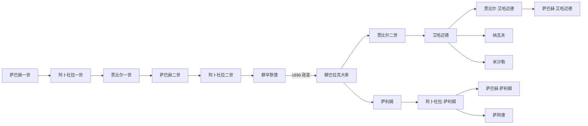

# 科威特萨巴赫统治者与首相表

## 时间

1718／约1752年至今（现任信息核验截至2026年7月13日）

## 建立年代说明

科威特官方年表把乌图布联盟形成定于1716年、萨巴赫一世获推举定于1718年，并据此称米沙勒为第17位统治者。许多学术与外交年表则把萨巴赫一世统治起点约定为1752年，因为早期口述谱系和成文记录不足。本表沿用官方17位序列，同时在首行保留“1718／约1752”的争议，不把不确定年代写成无争议精确事实。

## 萨巴赫统治者完整表

| 顺序 | 统治者 | 当时主要称号 | 在位时间 | 生卒 | 与前任关系 | 继承与重要事件 |
|---:|---|---|---|---|---|---|
| 1 | **萨巴赫一世·本·贾比尔** | 谢赫／哈基姆 | 官方1718—1762年；常见约1752—1762年 | 约1700—1762年 | — | 由港城居民或乌图布精英推举，承担调解、防务和外交；建立年代存在史料争议。 |
| 2 | 阿卜杜拉一世·本·萨巴赫 | 谢赫／哈基姆 | 1762—1813年 | 1740—1813年 | 萨巴赫一世之子 | 巴士拉危机期间港口扩张，经历里卡海战及沙特—奥斯曼区域竞争。 |
| 3 | 贾比尔一世·本·阿卜杜拉（贾比尔·艾什） | 谢赫／哈基姆 | 1813—1859年 | 1775—1859年 | 阿卜杜拉一世之子 | 以赈济和商人合作闻名，在奥斯曼、英国和内陆部落之间维持自治。 |
| 4 | 萨巴赫二世·本·贾比尔 | 谢赫／哈基姆 | 1859—1866年 | 约1784—1866年 | 贾比尔一世之子 | 远洋、珍珠和商队经济延续。 |
| 5 | 阿卜杜拉二世·本·萨巴赫 | 谢赫／哈基姆 | 1866—1892年 | 1814—1892年 | 萨巴赫二世之子 | 接受奥斯曼地方头衔和旗帜而保留自治；曾铸带“科威特”名的货币。 |
| 6 | 穆罕默德·本·萨巴赫 | 谢赫／哈基姆 | 1892—1896年 | 1838—1896年 | 阿卜杜拉二世之弟 | 同弟贾拉赫共同处理政务，1896年二人被弟穆巴拉克杀害。 |
| 7 | **穆巴拉克·本·萨巴赫（穆巴拉克大帝）** | 谢赫／哈基姆 | 1896—1915年 | 1837—1915年 | 穆罕默德之弟 | 以政变掌权；1899年英国协议、1901年萨里夫战役，奠定现代王朝国际地位。 |
| 8 | 贾比尔二世·本·穆巴拉克 | 谢赫／哈基姆 | 1915—1917年 | 1860—1917年 | 穆巴拉克之子 | 第一次世界大战期间短暂统治。 |
| 9 | 萨利姆·本·穆巴拉克 | 谢赫／哈基姆 | 1917—1921年 | 1864—1921年 | 贾比尔二世之弟 | 伊赫万战争、1920年杰赫拉战役。 |
| 10 | 艾哈迈德·本·贾比尔 | 谢赫／哈基姆 | 1921—1950年 | 1885—1950年 | 贾比尔二世之子 | 欧凯尔边界、1938年议会运动、布尔甘发现和1946年石油出口。 |
| 11 | **阿卜杜拉·萨利姆·萨巴赫** | 谢赫；1961年起埃米尔 | 1950—1965年 | 1895—1965年 | 萨利姆之子、艾哈迈德堂弟 | 结束英国保护，颁布1962年宪法，建立独立议会国家。 |
| 12 | 萨巴赫·萨利姆·萨巴赫 | 埃米尔 | 1965—1977年 | 1913—1977年 | 阿卜杜拉·萨利姆之弟 | 议会政治发展；1976年暂停议会。 |
| 13 | **贾比尔·艾哈迈德·萨巴赫** | 埃米尔 | 1977—2006年 | 1926—2006年 | 艾哈迈德之子 | 两伊战争、1986年议会暂停、1990年流亡及1991年复国。 |
| 14 | 萨阿德·阿卜杜拉·萨利姆·萨巴赫 | 埃米尔 | 2006年1月15—24日 | 1930—2008年 | 阿卜杜拉·萨利姆之子、贾比尔堂亲 | 因重病无法宣誓；议会启动继承法程序后退位，在位九日。 |
| 15 | 萨巴赫·艾哈迈德·贾比尔·萨巴赫 | 埃米尔 | 2006—2020年 | 1929—2020年 | 贾比尔之弟 | 调停外交、女性参政落实、反复议会危机。 |
| 16 | 纳瓦夫·艾哈迈德·贾比尔·萨巴赫 | 埃米尔 | 2020—2023年 | 1937—2023年 | 萨巴赫·艾哈迈德之弟 | 疫情、政治赦免尝试与持续僵局。 |
| 17 | **米沙勒·艾哈迈德·贾比尔·萨巴赫** | 埃米尔 | 2023年12月16日至今 | 1940年生 | 纳瓦夫之弟 | 2024年解散议会并暂停部分宪法；2026年应对地区战争攻击。 |

## 首相／部长会议主席完整表

| 顺序 | 政府首脑 | 任期 | 同期身份与关系 | 关键说明 |
|---:|---|---|---|---|
| 1 | 阿卜杜拉·萨利姆·萨巴赫 | 1962—1963年 | 埃米尔兼首任部长会议主席 | 宪政过渡期组建政府。 |
| 2 | 萨巴赫·萨利姆·萨巴赫 | 1963—1965年 | 王储；后任埃米尔 | 主持首届议会时期政府。 |
| 3 | 贾比尔·艾哈迈德·萨巴赫 | 1965—1978年 | 王储；1977年起埃米尔 | 1976年议会暂停；继位后短暂继续兼任至任命萨阿德。 |
| 4 | 萨阿德·阿卜杜拉·萨利姆·萨巴赫 | 1978—2003年 | 王储 | 两伊战争、占领流亡政府与战后重建的行政首脑。 |
| 5 | 萨巴赫·艾哈迈德·贾比尔·萨巴赫 | 2003—2006年 | 王室贾比尔支；后任埃米尔 | 首次把首相与王储职位分开，后处理2006年继承危机。 |
| 6 | 纳赛尔·穆罕默德·艾哈迈德·萨巴赫 | 2006—2011年 | 王室成员 | 多届内阁、质询与反腐抗议后辞职。 |
| 7 | 贾比尔·穆巴拉克·哈马德·萨巴赫 | 2011—2019年 | 王室成员 | 选制争议、反对派抵制与多次改组。 |
| 8 | 萨巴赫·哈立德·哈马德·萨巴赫 | 2019—2022年 | 王室成员；2024年起王储 | 疫情和持续议会僵局。 |
| 9 | 艾哈迈德·纳瓦夫·艾哈迈德·萨巴赫 | 2022—2024年1月 | 纳瓦夫埃米尔之子 | 多次选举与法院判决交错，米沙勒继位后辞职。 |
| 10 | 穆罕默德·萨巴赫·萨利姆·萨巴赫 | 2024年1—4月 | 萨利姆支王室成员 | 短期政府，2024年4月选举后辞职。 |
| 11 | **艾哈迈德·阿卜杜拉·艾哈迈德·萨巴赫** | 2024年4月至今 | 王室成员 | 截至2026年7月13日仍任首相；在议会暂停和地区战争下主持内阁。 |

## 继承与实际权力

- 宪法规定王位在穆巴拉克大帝男性后裔中世袭。埃米尔提名王储，国民议会以多数批准；若不批准，埃米尔另提三人供议会选择。
- 20世纪形成贾比尔支与萨利姆支交替的政治惯例，但这不是绝对法律规则；2006年后连续多位来自贾比尔支，说明惯例可被健康、年龄和家族共识改变。
- 2024年6月，米沙勒任命萨巴赫·哈立德为王储。正常情况下议会参与确认，但当时议会已解散，由部长会议宣誓和制度安排完成。
- 2024年暂停期间，埃米尔与内阁代行国民议会权限；首相仍是行政协调者，最高战略和继承决定由埃米尔掌握。

## 世系演变

箭头兼示家族血缘与政治继承；并列兄弟支系不表示同时统治，具体顺序以上表为准。

## 相关笔记

- 早期王朝：[港湾聚落、巴尼哈立德与萨巴赫家族](/%E4%BA%BA%E6%96%87%E7%A7%91%E5%AD%A6/%E5%8E%86%E5%8F%B2/%E8%A5%BF%E4%BA%9A/%E9%98%BF%E6%8B%89%E4%BC%AF%E5%8D%8A%E5%B2%9B/%E7%A7%91%E5%A8%81%E7%89%B9/%E6%B8%AF%E6%B9%BE%E8%81%9A%E8%90%BD%E3%80%81%E5%B7%B4%E5%B0%BC%E5%93%88%E7%AB%8B%E5%BE%B7%E4%B8%8E%E8%90%A8%E5%B7%B4%E8%B5%AB%E5%AE%B6%E6%97%8F.md)。
- 保护国与石油：[英国保护、石油发现与独立](/%E4%BA%BA%E6%96%87%E7%A7%91%E5%AD%A6/%E5%8E%86%E5%8F%B2/%E8%A5%BF%E4%BA%9A/%E9%98%BF%E6%8B%89%E4%BC%AF%E5%8D%8A%E5%B2%9B/%E7%A7%91%E5%A8%81%E7%89%B9/%E8%8B%B1%E5%9B%BD%E4%BF%9D%E6%8A%A4%E3%80%81%E7%9F%B3%E6%B2%B9%E5%8F%91%E7%8E%B0%E4%B8%8E%E7%8B%AC%E7%AB%8B.md)。
- 独立国家：[议会政治、海湾战争与现代科威特](/%E4%BA%BA%E6%96%87%E7%A7%91%E5%AD%A6/%E5%8E%86%E5%8F%B2/%E8%A5%BF%E4%BA%9A/%E9%98%BF%E6%8B%89%E4%BC%AF%E5%8D%8A%E5%B2%9B/%E7%A7%91%E5%A8%81%E7%89%B9/%E8%AE%AE%E4%BC%9A%E6%94%BF%E6%B2%BB%E3%80%81%E6%B5%B7%E6%B9%BE%E6%88%98%E4%BA%89%E4%B8%8E%E7%8E%B0%E4%BB%A3%E7%A7%91%E5%A8%81%E7%89%B9.md)。
- 总览：[科威特历史](/%E4%BA%BA%E6%96%87%E7%A7%91%E5%AD%A6/%E5%8E%86%E5%8F%B2/%E8%A5%BF%E4%BA%9A/%E9%98%BF%E6%8B%89%E4%BC%AF%E5%8D%8A%E5%B2%9B/%E7%A7%91%E5%A8%81%E7%89%B9/README.md)。